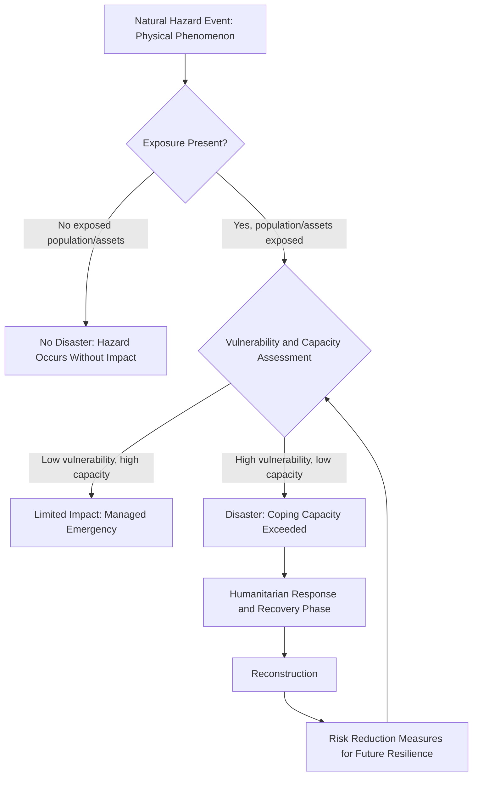

## Natural Hazards and Disaster Types

### Definition and Scope

A natural hazard is a naturally occurring physical phenomenon with the potential to cause harm to human life, property, livelihoods, or the environment. A disaster is the realized outcome of a hazard interacting with vulnerable and exposed human systems, exceeding a community's capacity to cope using its own resources. This distinction is foundational to modern disaster risk science: a hazard alone does not constitute a disaster; disaster risk emerges from the combination of hazard, exposure, and vulnerability.

This field integrates geophysics, meteorology, hydrology, ecology, engineering, and social science, and underpins the disciplines of disaster risk reduction (DRR) and emergency/disaster management.

### The Risk Equation

Disaster risk is conventionally conceptualized (per the UN Office for Disaster Risk Reduction and widely used in DRR frameworks) as a function of three interacting components:

$$Risk = \frac{Hazard \times Exposure \times Vulnerability}{Capacity}$$

- **Hazard**: the probability and intensity of a potentially damaging physical event occurring.
- **Exposure**: the presence of people, livelihoods, assets, and infrastructure in hazard-prone areas.
- **Vulnerability**: the characteristics and circumstances of a community or system that make it susceptible to the damaging effects of a hazard (e.g., poverty, building quality, access to early warning).
- **Capacity**: the resources, institutions, and coping mechanisms available to reduce risk or respond effectively (appears in the denominator, since greater capacity reduces overall risk).

[Inference: this formula is a widely used conceptual/pedagogical framework in disaster risk reduction literature rather than a precisely quantifiable mathematical equation; in practice, hazard, exposure, vulnerability, and capacity are each assessed through multiple qualitative and quantitative indicators rather than single numerical values that can be multiplied or divided directly.]

### Classification of Natural Hazards

**By Origin (Primary Taxonomy)**

| Category | Hazard Types | Primary Driving Process |
| --- | --- | --- |
| Geophysical/Geological | Earthquakes, volcanic eruptions, tsunamis, landslides, sinkholes | Tectonic, magmatic, and gravitational processes |
| Hydrometeorological | Tropical cyclones, floods, droughts, severe storms, heatwaves, cold waves | Atmospheric and hydrological processes |
| Climatological | Wildfires, extended drought, desertification-related hazards | Longer-term climate/moisture regime processes (overlapping with hydrometeorological) |
| Biological | Epidemics, pandemics, insect infestations (e.g., locust swarms) | Pathogen or organism population dynamics |
| Extraterrestrial | Near-Earth object impacts, geomagnetic storms (space weather) | Astronomical and heliophysical processes |

Many classification schemes (including the widely referenced EM-DAT international disaster database taxonomy) group hazards into these or similar categories, though exact category boundaries and sub-classifications vary somewhat between different institutional frameworks (e.g., UNDRR, EM-DAT, and national agencies do not use fully identical taxonomies). [Unverified: readers should consult the specific classification system referenced by their jurisdiction or dataset, as sub-category definitions are not perfectly standardized across all institutions globally.]

**By Onset Speed**

- Rapid-onset hazards: earthquakes, tsunamis, flash floods, volcanic eruptions — occurring with little to no warning time, demanding immediate emergency response capacity.
- Slow-onset hazards: drought, desertification, sea level rise — developing over months to years, allowing (in principle) more time for anticipatory action but often more difficult to politically and institutionally prioritize due to their gradual nature.

### Diagram: Hazard-to-Disaster Progression

### Major Hazard Types: Mechanisms and Key Parameters

**Earthquakes**

- Generated by sudden release of accumulated stress along tectonic plate boundaries or intraplate faults, propagating as seismic waves (P-waves, S-waves, surface waves).
- Measured using magnitude scales, most commonly the Moment Magnitude Scale (Mw) in modern seismology, which supersedes the older Richter scale for large events due to better representation of total energy release.
- Secondary hazards commonly triggered: soil liquefaction (loss of soil strength in saturated sediments under seismic shaking), landslides, and tsunamis (when displacement occurs along the seafloor).
- Peak Ground Acceleration (PGA) and Modified Mercalli Intensity (MMI) scales are used to characterize localized shaking intensity and observed damage effects, distinct from the magnitude measure of total energy release at the source.

**Tsunamis**

- Most commonly generated by large submarine earthquakes causing vertical seafloor displacement, though also generated by submarine/coastal landslides and volcanic eruptions.
- Wave characteristics differ fundamentally from wind-driven waves: tsunami wavelengths can extend many kilometers with correspondingly long periods, meaning open-ocean wave height may be barely perceptible while wave energy is enormous, becoming dramatically amplified as depth decreases approaching shore (wave shoaling).
- Approximate tsunami wave speed in open ocean can be estimated using the shallow-water wave speed formula:

$$v = \sqrt{gh}$$

where $v$ is wave speed, $g$ is gravitational acceleration (approximately $9.81 \text{ m/s}^2$), and $h$ is water depth. This explains why tsunamis travel extremely fast in deep ocean (hundreds of km/h) and slow dramatically while growing in height as they approach shallow coastal water.

**Volcanic Eruptions**

- Classified by eruption style (effusive vs. explosive) driven largely by magma viscosity and dissolved gas content.
- Volcanic Explosivity Index (VEI) provides a logarithmic scale (analogous in concept to earthquake magnitude scales) categorizing eruption size by erupted volume and other parameters.
- Associated hazards: pyroclastic flows, lahars (volcanic mudflows), ashfall (affecting aviation, agriculture, and respiratory health), and volcanic gas emissions.

**Tropical Cyclones (Hurricanes/Typhoons)**

- Form over warm tropical/subtropical ocean waters (commonly cited threshold of approximately 26–27°C sea surface temperature, though this is an approximate rather than precise universal threshold) given sufficient atmospheric instability, low wind shear, and Coriolis force (hence rarely forming very close to the equator).
- Classified by regional naming/scale conventions: the Saffir-Simpson Hurricane Wind Scale (Atlantic/Eastern Pacific) categorizes storms 1–5 based on sustained wind speed.
- Associated hazards beyond wind: storm surge (often the deadliest and most damaging component in many historical cyclone disasters), extreme rainfall/flooding, and tornadoes spawned within the storm system.

**Floods**

- Riverine (fluvial) flooding: exceedance of channel capacity from upstream precipitation/snowmelt.
- Flash flooding: rapid-onset flooding from intense localized rainfall, often in steep terrain or urbanized areas with high impervious surface coverage.
- Coastal flooding: driven by storm surge, high tides, and increasingly by sea level rise-elevated baseline water levels.
- Urban/pluvial flooding: overwhelmed stormwater drainage infrastructure during intense rainfall, increasingly significant given urbanization trends.

**Droughts**

- Distinguished into meteorological drought (precipitation deficit), hydrological drought (reduced surface/groundwater levels), agricultural drought (soil moisture deficit affecting crops), and socioeconomic drought (water scarcity affecting human systems).
- Commonly assessed via indices such as the Standardized Precipitation Index (SPI) or Palmer Drought Severity Index (PDSI), which quantify deviation from historical precipitation/moisture norms.

**Landslides and Mass Movements**

- Triggered by combinations of slope instability factors: steep terrain, saturated soil (often rainfall-triggered), seismic shaking, and human modification of slopes (deforestation, construction).
- Classified by movement type: falls, slides, flows (e.g., debris flows/mudslides), and lateral spreads.

**Wildfires**

- Require the "fire triangle" of fuel (vegetation), oxygen, and ignition source (natural, e.g., lightning, or human-caused).
- Fire behavior and spread rate strongly influenced by fuel moisture content, wind speed, and topographic slope (fire spreads faster uphill).
- Increasingly influenced by climate-driven changes in fuel aridity and fire season length in many fire-prone regions, an area of active climate science research regarding attribution to specific events versus broader trend analysis. [Inference: attributing any single wildfire event specifically to climate change involves statistical attribution methodology and remains an area where individual-event claims should be distinguished from broader trend-level scientific findings.]

### Diagram: Comparative Hazard Onset Speed and Typical Warning Time

<svg xmlns="http://www.w3.org/2000/svg" viewBox="0 0 700 340">
<text x="350" y="24" font-size="16" text-anchor="middle" font-weight="bold">Relative Onset Speed of Selected Natural Hazards (svg_diagram)</text>
<line x1="80" y1="300" x2="650" y2="300" stroke="#333" stroke-width="2" />
<text x="360" y="325" font-size="12" text-anchor="middle">Typical Warning/Onset Time (illustrative, not to precise scale)</text>

<text x="90" y="315" font-size="10">Seconds/Minutes</text>

<text x="300" y="315" font-size="10">Hours/Days</text>

<text x="550" y="315" font-size="10">Weeks/Months/Years</text>

<circle cx="110" cy="270" r="6" fill="#c0392b" />
<text x="60" y="255" font-size="11">Earthquake</text>
<circle cx="140" cy="240" r="6" fill="#c0392b" />
<text x="145" y="240" font-size="11">Flash Flood</text>
<circle cx="200" cy="210" r="6" fill="#d35400" />
<text x="205" y="210" font-size="11">Tsunami (coastal)</text>
<circle cx="320" cy="180" r="6" fill="#e67e22" />
<text x="325" y="180" font-size="11">Volcanic Eruption (precursory phase)</text>
<circle cx="380" cy="150" r="6" fill="#f39c12" />
<text x="385" y="150" font-size="11">Tropical Cyclone</text>
<circle cx="480" cy="120" r="6" fill="#27ae60" />
<text x="485" y="120" font-size="11">Riverine Flood (seasonal)</text>
<circle cx="580" cy="90" r="6" fill="#2980b9" />
<text x="490" y="90" font-size="11">Drought / Desertification</text>
</svg>

### Compound and Cascading Hazards

**Key Points**

- Compound hazards involve the simultaneous or successive occurrence of multiple hazard types that combine to produce impacts greater than any single hazard alone (e.g., a heatwave co-occurring with drought, amplifying wildfire risk and agricultural stress).
- Cascading disasters occur when a primary hazard triggers a chain of secondary hazards or system failures (e.g., an earthquake triggering a tsunami, which then damages critical infrastructure such as nuclear facilities, producing a technological/industrial secondary disaster).
- Cascading and compound hazard scenarios are increasingly emphasized in contemporary disaster risk science as more representative of real-world disaster complexity than single-hazard analysis, though comprehensive multi-hazard risk modeling remains methodologically challenging and an active area of research development. [Inference: quantitative multi-hazard interaction modeling is less mature than single-hazard modeling in current disaster risk science literature, so cascading risk assessments often rely more heavily on scenario-based and expert-elicitation approaches than fully probabilistic quantitative models.]

### Natech (Natural-Technological) Hazards

Natech events occur when a natural hazard triggers a technological or industrial disaster, such as the well-documented case of the 2011 Tōhoku earthquake and tsunami triggering the Fukushima Daiichi nuclear accident. This category has grown in prominence within disaster risk science due to increasing industrial infrastructure density in hazard-prone areas.

### Disaster Databases and Classification Standards

- EM-DAT (Emergency Events Database), maintained by the Centre for Research on the Epidemiology of Disasters (CRED): a widely referenced international disaster database using defined inclusion criteria (e.g., minimum thresholds for deaths, affected persons, or declared emergency/international assistance appeal) to classify events as disasters for database inclusion.
- The Sendai Framework for Disaster Risk Reduction 2015–2030 (adopted at the UN World Conference on Disaster Risk Reduction) established internationally agreed targets and indicators for tracking disaster risk reduction progress, including standardized definitions for disaster mortality, affected populations, and economic loss reporting used by many national statistical systems.

### Example: Applying the Risk Framework Conceptually

**Example**

Consider two coastal towns of similar population exposed to the same Category 3 tropical cyclone hazard (identical wind speed and storm surge height forecast).

Town A: Reinforced building codes, functioning early warning system, established evacuation routes, and strong municipal emergency response capacity.

Town B: Informal housing construction, no functioning early warning infrastructure, and limited municipal emergency resources.

Despite identical hazard intensity and comparable exposure (population and asset value in the storm's path), Town B's substantially higher vulnerability and lower capacity would be expected to result in disproportionately greater casualties and damage under the risk framework — illustrating that disaster outcomes are driven as much by vulnerability and capacity factors as by the raw physical intensity of the hazard itself. [Inference: this is an illustrative conceptual example; actual comparative disaster outcomes depend on numerous additional site-specific factors including precise storm track, local topography, and response timing, not solely the generalized vulnerability/capacity contrast described.]

### Disaster Risk Management Cycle (Contextual Framework)

### Conclusion

**Conclusion**

Natural hazards are physical phenomena classifiable by origin (geophysical, hydrometeorological, climatological, biological, extraterrestrial) and onset speed, but they become disasters only through interaction with human exposure and vulnerability, moderated by coping capacity. Effective disaster risk management therefore requires understanding not only the physical mechanisms and measurable parameters of each hazard type but also the socioeconomic and institutional factors that determine whether a hazard event translates into a manageable emergency or a catastrophic disaster, with compound and cascading multi-hazard scenarios representing an increasingly important frontier in the field.

**Related Topics**

- Earthquake early warning systems and seismic hazard mapping
- Tropical cyclone forecasting and storm surge modeling
- Flood risk mapping and floodplain management
- Wildfire fuel management and fire behavior prediction
- Drought monitoring indices and early warning systems
- Vulnerability and capacity assessment methodologies
- Sendai Framework indicators and disaster loss reporting
- Natech risk assessment for critical infrastructure
- Multi-hazard and cascading disaster risk modeling
- Community-based disaster risk reduction and early warning systems