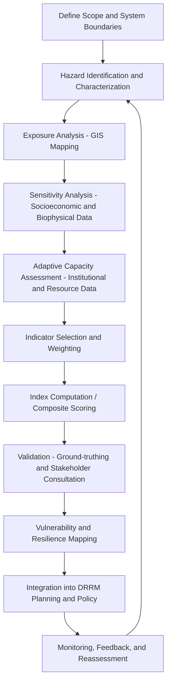

## Vulnerability and Resilience Assessment

### Definition and Conceptual Framework

Vulnerability and Resilience Assessment (VRA) is the systematic process of identifying, quantifying, and analyzing the susceptibility of a system (community, ecosystem, infrastructure, or economic sector) to the adverse effects of hazards, and evaluating its capacity to absorb, adapt to, and recover from those effects.

The two core concepts are formally related through the widely-used IPCC (Intergovernmental Panel on Climate Change) risk framework:

$$Risk = Hazard \times Exposure \times Vulnerability$$

Where **Vulnerability** itself is commonly decomposed as:

$$Vulnerability = f(Exposure, Sensitivity, Adaptive\ Capacity)$$

**Resilience** is the inverse-correlated but distinct property: the capacity of a system to anticipate, absorb, accommodate, or recover from a hazardous event in a timely and efficient manner, including preserving, restoring, or improving essential basic structures and functions.

[Inference] While vulnerability and resilience are often treated as opposite ends of a single spectrum in introductory teaching, the technical literature treats them as related but non-identical constructs — a system can reduce vulnerability without necessarily increasing resilience (e.g., a levee reduces exposure-based vulnerability but may reduce adaptive resilience by encouraging development in the floodplain, a phenomenon known as the "levee effect" or "safe development paradox").

### Core Components of Vulnerability

#### Exposure

The presence of people, livelihoods, species, ecosystems, environmental services, infrastructure, or economic/social/cultural assets in places and settings that could be adversely affected by a hazard.

#### Sensitivity

The degree to which a system is affected, either adversely or beneficially, by hazard-related stimuli. This includes biophysical sensitivity (e.g., a crop's tolerance to drought) and social sensitivity (e.g., a population's dependence on a single livelihood source).

#### Adaptive Capacity

The ability of a system to adjust, moderate potential damage, take advantage of opportunities, or cope with consequences. Adaptive capacity is a function of:

- Access to economic and natural resources
- Technology and infrastructure
- Institutional and governance structures
- Information, knowledge, and skills
- Social capital and equity

### Dimensions of Vulnerability Assessment

VRA is inherently multi-dimensional and multi-disciplinary. A comprehensive assessment integrates the following:

| Dimension | Focus | Example Indicators |
| --- | --- | --- |
| Physical/Environmental | Exposure of natural and built environment | Land elevation, soil erosion rate, proximity to fault lines, floodplain extent |
| Social | Demographic and equity-related susceptibility | Poverty rate, elderly/disabled population %, literacy rate, single-parent households |
| Economic | Sectoral and livelihood dependency | % GDP from climate-sensitive sectors, unemployment, insurance penetration |
| Institutional | Governance capacity | Existence of DRRM plans, early warning systems, enforcement of building codes |
| Ecological | Ecosystem degradation | Mangrove/forest cover loss, biodiversity indices, watershed health |

### Standard Assessment Methodologies

#### 1. Indicator-Based (Index) Approach

Aggregates multiple weighted indicators into a single composite vulnerability index. The most cited example is the **Social Vulnerability Index (SoVI)**, developed by Cutter et al. (2003), which uses principal component analysis (PCA) on socioeconomic and demographic census variables.

**General formula for a composite index:**

$$VI = \sum_{i=1}^{n} w_i \cdot x_i$$

Where $VI$ is the vulnerability index, $w_i$ is the weight assigned to indicator $i$, and $x_i$ is the normalized value of indicator $i$.

Normalization is typically done via min-max scaling:

$$x_i' = \frac{x_i - x_{min}}{x_{max} - x_{min}}$$

#### 2. Participatory Vulnerability and Capacity Assessment (VCA)

A community-led, qualitative methodology (popularized by the IFRC — International Federation of Red Cross and Red Crescent Societies) using tools such as:

- **Hazard mapping** — community-drawn maps of hazard-prone areas
- **Seasonal calendars** — timing of hazards vs. livelihood activities
- **Transect walks** — physical walkthroughs to observe conditions
- **Focus group discussions (FGDs)** and **historical timelines** of past disasters

#### 3. Biophysical/Process-Based Modeling

Uses physical models to simulate hazard behavior and quantify exposure, often via GIS (Geographic Information Systems). Examples include:

- **HAZUS-MH** (FEMA's Hazards US Multi-Hazard tool) for earthquake, flood, and hurricane loss estimation
- **InVEST** (Integrated Valuation of Ecosystem Services and Tradeoffs) for coastal vulnerability modeling
- **HEC-RAS** for flood inundation modeling feeding into exposure layers

#### 4. Resilience Assessment Frameworks

- **Climate Disaster Resilience Index (CDRI)** — evaluates resilience across five dimensions: physical, social, economic, institutional, and natural
- **Baseline Resilience Indicators for Communities (BRIC)** — a US-focused successor to SoVI, explicitly measuring resilience rather than vulnerability
- **Disaster Resilience of Place (DROP) Model** — a conceptual model linking vulnerability and resilience through antecedent conditions and event-driven feedback loops

### Standard Workflow / Process

### Practical Example: Coastal Barangay Flood Vulnerability

**Scenario:** A coastal barangay (village) in the Philippines is assessed for typhoon-induced storm surge vulnerability.

**Step 1 — Exposure:** GIS overlay of storm surge advisory zones (using PAGASA's SSA — Storm Surge Advisory — levels 1-4) against the barangay's built-up area shows 65% of residential structures fall within SSA Level 3 (surge height 2–3 m).

**Step 2 — Sensitivity:** Census data shows 22% of the population is under 5 or over 65 years old (physiologically more sensitive), and 40% of housing is made of light/mixed materials (structurally more sensitive to surge impact).

**Step 3 — Adaptive Capacity:** Assessment finds the barangay has a functioning early warning system and evacuation center, but the evacuation center itself lies within SSA Level 2, and there is no formalized evacuation drill schedule.

**Step 4 — Index computation (simplified 3-indicator example):**

$$VI = (0.5 \times Exposure_{norm}) + (0.3 \times Sensitivity_{norm}) + (0.2 \times (1 - AdaptiveCapacity_{norm}))$$

If $Exposure_{norm} = 0.8$, $Sensitivity_{norm} = 0.6$, and $AdaptiveCapacity_{norm} = 0.4$:

$$VI = (0.5 \times 0.8) + (0.3 \times 0.6) + (0.2 \times 0.6) = 0.4 + 0.18 + 0.12 = 0.70$$

A score of 0.70 (on a 0–1 scale) would typically be classified as "High Vulnerability," flagging the barangay as a priority for both structural mitigation (e.g., relocating the evacuation center) and non-structural interventions (e.g., regular drills).

[Inference] The specific weights (0.5/0.3/0.2) in this example are illustrative and locally-calibrated; actual weighting schemes in professional assessments are typically derived through expert elicitation (e.g., Delphi method) or statistical methods (e.g., PCA, Analytic Hierarchy Process) rather than assumed uniformly.

### Vulnerability-Resilience Relationship Diagram

<svg xmlns="http://www.w3.org/2000/svg" viewBox="0 0 800 420" font-family="Arial, sans-serif">
<text x="400" y="30" font-size="18" font-weight="bold" text-anchor="middle" fill="#1a1a1a">Vulnerability-Resilience Feedback Loop (svg_diagram)</text>
<circle cx="200" cy="150" r="90" fill="#fde2e2" stroke="#c0392b" stroke-width="2" />
<text x="200" y="140" font-size="16" font-weight="bold" text-anchor="middle" fill="#c0392b">Vulnerability</text>
<text x="200" y="165" font-size="12" text-anchor="middle" fill="#333">Exposure + Sensitivity</text>
<text x="200" y="182" font-size="12" text-anchor="middle" fill="#333">- Adaptive Capacity</text>
<circle cx="600" cy="150" r="90" fill="#e2f0fd" stroke="#2874a6" stroke-width="2" />
<text x="600" y="140" font-size="16" font-weight="bold" text-anchor="middle" fill="#2874a6">Resilience</text>
<text x="600" y="165" font-size="12" text-anchor="middle" fill="#333">Absorb + Adapt</text>
<text x="600" y="182" font-size="12" text-anchor="middle" fill="#333">+ Recover / Transform</text>
<line x1="290" y1="150" x2="510" y2="150" stroke="#555" stroke-width="2" marker-end="url(#arrow1)" />
<line x1="510" y1="190" x2="290" y2="190" stroke="#555" stroke-width="2" marker-end="url(#arrow2)" />
<text x="400" y="140" font-size="11" text-anchor="middle" fill="#555">reduces potential for</text>
<text x="400" y="205" font-size="11" text-anchor="middle" fill="#555">buffers against</text>
<rect x="120" y="280" width="560" height="110" rx="10" fill="#f2f2f2" stroke="#999" stroke-width="1.5" />
<text x="400" y="305" font-size="14" font-weight="bold" text-anchor="middle" fill="#1a1a1a">Disaster Event / Shock</text>
<text x="140" y="330" font-size="12" fill="#333">High Vulnerability + Low Resilience</text>
<text x="140" y="350" font-size="12" fill="#333">→ Severe, prolonged impact; slow recovery; possible collapse</text>
<text x="140" y="375" font-size="12" fill="#333">Low Vulnerability + High Resilience → Minimal disruption; rapid bounce-back</text>
<line x1="200" y1="240" x2="200" y2="280" stroke="#c0392b" stroke-width="2" stroke-dasharray="4,3" />
<line x1="600" y1="240" x2="600" y2="280" stroke="#2874a6" stroke-width="2" stroke-dasharray="4,3" />
</svg>

### Key Data Sources and Tools (Philippine and International Context)

- **PAGASA** (Philippine Atmospheric, Geophysical and Astronomical Services Administration) — hazard hydromet data, storm surge advisories
- **PHIVOLCS** (Philippine Institute of Volcanology and Seismology) — seismic and volcanic hazard maps (HazardHunterPH platform)
- **NOAH (Nationwide Operational Assessment of Hazards)** — DOST-funded platform providing flood, landslide, and storm surge hazard maps
- **CLIMPS / Climate Change Commission** — national climate risk and vulnerability data
- **UNDRR Sendai Framework Monitor** — global reporting mechanism aligning national VRA outputs to the Sendai Framework for Disaster Risk Reduction 2015–2030
- **World Bank ThinkHazard!** — a screening tool providing hazard-level information by location for project planning

### Standards and Policy Frameworks

- **Sendai Framework for Disaster Risk Reduction (2015–2030)** — the global policy framework guiding DRRM, emphasizing "Understanding disaster risk" as Priority 1, which institutionalizes VRA as a foundational step
- **Republic Act No. 10121** (Philippine Disaster Risk Reduction and Management Act of 2010) — mandates Local Disaster Risk Reduction and Management Plans (LDRRMPs), which require vulnerability assessments at the barangay/municipal level
- **RA 9729** (Climate Change Act of 2009) and the **National Climate Change Action Plan (NCCAP)** — require Climate and Disaster Risk Assessments (CDRA) for local development planning
- **ISO 31000** — general risk management standard often adapted for institutional-level vulnerability assessment protocols

### Common Pitfalls and Limitations

- **Data granularity mismatch**: national/provincial-level data often masks intra-barangay or household-level vulnerability variation
- **Static snapshots**: many indices represent a single point in time and fail to capture dynamic vulnerability (e.g., post-disaster secondary vulnerability from debt or displacement)
- **Double-counting or indicator redundancy**: highly correlated indicators (e.g., poverty rate and unemployment rate) can distort composite index weighting if not addressed via PCA or correlation screening
- **Equity blind spots**: aggregate indices can obscure vulnerability of marginalized subgroups (persons with disabilities, informal settlers, indigenous communities) unless disaggregated data is explicitly incorporated
- [Unverified] The precise transferability of indices like SoVI or CDRI across different national contexts without local recalibration is a subject of ongoing academic debate; direct application without adjustment for local socio-cultural variables may reduce validity.

### Related Topics

- Hazard Mapping and GIS-Based Risk Modeling
- Climate Change Adaptation (CCA) vs. Disaster Risk Reduction (DRR) Integration
- Early Warning Systems (EWS) Design and Communication Protocols
- Community-Based Disaster Risk Management (CBDRM)
- Building Back Better (BBB) Principles in Post-Disaster Recovery
- Ecosystem-Based Disaster Risk Reduction (Eco-DRR)
- Loss and Damage Assessment Methodologies
- Land Use Planning and Zoning for Hazard-Prone Areas