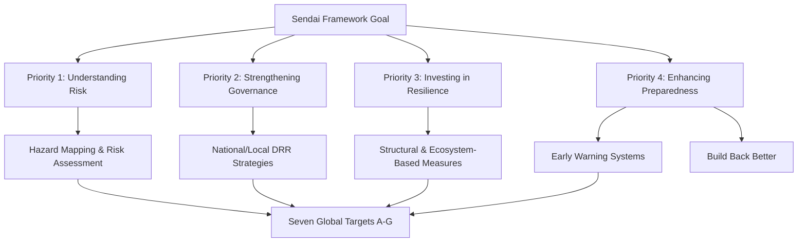

## Disaster Risk Reduction Frameworks

### Definition and Scope

Disaster Risk Reduction (DRR) is the systematic approach to identifying, assessing, and reducing the risks of disaster through analysis and management of causal factors, including reduced exposure to hazards, lessened vulnerability, improved land and environmental management, and better preparedness for adverse events. A DRR framework is the structured policy architecture — goals, priorities, targets, and indicators — that guides governments, institutions, and communities in implementing these reductions in a coordinated way.

DRR frameworks sit at the intersection of environmental science, urban planning, public policy, and emergency management, since most disaster risk is environmentally mediated (climate hazards, ecosystem degradation, geophysical processes) even when the ultimate losses are social or economic.

### Core Conceptual Model: The Risk Equation

Most modern frameworks formalize disaster risk using a multiplicative relationship:

$$Risk = Hazard \times Exposure \times Vulnerability$$

- **Hazard** — the potential occurrence of a natural or human-induced physical event (earthquake, cyclone, flood, drought) with a given magnitude and probability.
- **Exposure** — the people, assets, and systems situated in hazard-prone areas.
- **Vulnerability** — the propensity of exposed elements to suffer adverse effects, shaped by physical, social, economic, and environmental factors.

Some frameworks add **Capacity** as a denominator, since coping and adaptive capacity reduce net risk:

$$Risk = \frac{Hazard \times Exposure \times Vulnerability}{Capacity}$$

This equation underlies why DRR interventions target four distinct levers: reducing hazard exposure (relocation, engineering), reducing vulnerability (building codes, poverty reduction), reducing hazard itself where feasible (afforestation against landslides), and increasing capacity (early warning, insurance, institutional readiness).

### Evolution of Global DRR Frameworks

**1994 — Yokohama Strategy**

First major global framework, emerging from the International Decade for Natural Disaster Reduction (1990s). Established the principle that disaster prevention, mitigation, and preparedness are better than disaster response alone.

**2005–2015 — Hyogo Framework for Action (HFA)**

Adopted at the World Conference on Disaster Reduction in Kobe, Japan. Its stated goal was to substantially reduce disaster losses by 2015 through five priorities for action: (1) governance and institutional frameworks, (2) risk identification and early warning, (3) knowledge and education, (4) reducing underlying risk factors, and (5) strengthening preparedness for effective response.

**2015–2030 — Sendai Framework for Disaster Risk Reduction (SFDRR)**

The current dominant global framework, adopted at the Third UN World Conference on Disaster Risk Reduction in Sendai, Japan. It succeeded HFA and shifted emphasis from managing disasters to managing *risk*, explicitly incorporating "build back better" and multi-hazard approaches.

### Sendai Framework: Structural Breakdown

**Goal:** Substantially reduce disaster risk and losses in lives, livelihoods, health, and economic, physical, social, cultural, and environmental assets of persons, businesses, communities, and countries.

**Four Priorities for Action:**

1. **Understanding disaster risk** — based on hazard characteristics, vulnerability, capacity, exposure, environmental characteristics, and time.
2. **Strengthening disaster risk governance** to manage disaster risk — coherent legal/institutional frameworks across sectors.
3. **Investing in disaster risk reduction for resilience** — structural and non-structural measures, ecosystem-based approaches.
4. **Enhancing disaster preparedness** for effective response, and to "build back better" in recovery, rehabilitation, and reconstruction.

**Seven Global Targets** (paraphrased, quantitative reduction targets set against a 2005–2015 baseline):

| Target | Focus |
| --- | --- |
| A | Reduce global disaster mortality |
| B | Reduce number of affected people globally |
| C | Reduce direct economic loss relative to GDP |
| D | Reduce damage to critical infrastructure and disruption of basic services |
| E | Increase countries with national/local DRR strategies |
| F | Enhance international cooperation to developing countries |
| G | Increase availability of multi-hazard early warning systems and risk information |

**Four Priorities × Multiple governance levels** (local, national, regional, global) creates the implementation matrix that most national DRR policies are now built around.

### Complementary and Related Frameworks

- **Paris Agreement (2015)** — climate mitigation/adaptation framework; intersects with DRR through climate-related hazard trends (sea-level rise, extreme heat, storm intensification).
- **2030 Agenda for Sustainable Development (SDGs)** — DRR is explicitly embedded in SDG 1 (poverty), 11 (sustainable cities), and 13 (climate action), with shared indicators between Sendai and SDG frameworks.
- **New Urban Agenda (Habitat III, 2016)** — links urban planning to disaster and climate resilience.
- **Small Island Developing States (SIDS) frameworks (SAMOA Pathway)** — address disproportionate hazard exposure in small island states.

### The DRR Cycle (Programmatic Structure)

Most operational frameworks translate the policy priorities into a cyclical management structure:

1. **Prevention** — eliminating hazard/vulnerability where possible (e.g., zoning bans in floodplains).
2. **Mitigation** — reducing severity of impact (seismic retrofitting, levees, mangrove restoration).
3. **Preparedness** — planning, early warning systems, drills, stockpiling.
4. **Response** — emergency actions during/immediately after the event.
5. **Recovery** — restoring services and livelihoods.
6. **Build Back Better** — reconstruction that reduces future risk rather than reproducing it.

<svg xmlns="http://www.w3.org/2000/svg" viewBox="0 0 640 640" font-family="sans-serif">
<title>Disaster Risk Reduction Cycle (svg_diagram)</title>
<circle cx="320" cy="320" r="220" fill="none" stroke="#888" stroke-width="2" stroke-dasharray="4 4" />
<g font-size="14" text-anchor="middle">
<g>
<circle cx="320" cy="90" r="55" fill="#4C6EF5" />
<text x="320" y="94" fill="white">Prevention</text>
</g>
<g>
<circle cx="500" cy="180" r="55" fill="#12B886" />
<text x="500" y="184" fill="white">Mitigation</text>
</g>
<g>
<circle cx="500" cy="460" r="55" fill="#F59F00" />
<text x="500" y="464" fill="white">Preparedness</text>
</g>
<g>
<circle cx="320" cy="550" r="55" fill="#E64980" />
<text x="320" y="554" fill="white">Response</text>
</g>
<g>
<circle cx="140" cy="460" r="55" fill="#7048E8" />
<text x="140" y="464" fill="white">Recovery</text>
</g>
<g>
<circle cx="140" cy="180" r="55" fill="#1098AD" />
<text x="140" y="176" fill="white">Build Back</text>
<text x="140" y="192" fill="white">Better</text>
</g>
</g>
<g stroke="#555" stroke-width="2" marker-end="url(#arrow)">
<line x1="365" y1="120" x2="465" y2="160" />
<line x1="510" y1="235" x2="510" y2="405" />
<line x1="465" y1="480" x2="365" y2="530" />
<line x1="275" y1="530" x2="175" y2="480" />
<line x1="130" y1="405" x2="130" y2="235" />
<line x1="175" y1="160" x2="275" y2="120" />
</g>
</svg>

### Key Implementation Instruments

- **National DRR Strategies and Platforms** — country-level bodies coordinating multi-sector DRR policy (mandated under Sendai Target E).
- **Multi-Hazard Early Warning Systems (MHEWS)** — integrate hazard monitoring, forecasting, risk knowledge, dissemination, and community response capability. The UN's "Early Warnings for All" initiative (launched 2022) aims for universal coverage by 2027.
- **Hazard, Vulnerability, and Capacity Assessments (HVCA)** — technical baseline studies combining GIS hazard mapping, socioeconomic vulnerability indices, and institutional capacity audits.
- **Building codes and land-use zoning** — structural/regulatory mitigation tools.
- **Disaster risk financing** — catastrophe bonds, sovereign risk pools (e.g., CCRIF SPC in the Caribbean), parametric insurance.
- **Ecosystem-based DRR (Eco-DRR)** — using mangroves, wetlands, and forests as natural buffers against storm surge, flooding, and erosion.

### Key Indicators Used in Monitoring

Sendai Framework monitoring uses 38 indicators mapped to the seven global targets, tracked through national reporting into the **Sendai Framework Monitor**, an online UN reporting platform. Core indicator categories include:

- Mortality rate per 100,000 population attributable to disasters
- Number of people affected per 100,000 population
- Direct economic loss as a proportion of GDP
- Damage to critical infrastructure and number of disruptions to basic services
- Existence of national/local DRR strategies aligned with Sendai

### Worked Example: Applying the Framework at National Level

**Scenario:** A coastal country drafts a National DRR Strategy aligned with Sendai Priority 1 and 3.

1. **Risk identification** — GIS-based flood and storm-surge mapping combined with census-based exposure data.
2. **Governance step** — establishment of a National Disaster Risk Reduction Council with legal mandate across ministries (public works, environment, health, finance).
3. **Investment step** — mangrove restoration along vulnerable coastlines (Eco-DRR) plus retrofitting of critical hospitals to seismic/wind-load standards.
4. **Preparedness step** — installation of a coastal early warning system linked to community-level evacuation protocols.
5. **Monitoring** — annual reporting of mortality and economic loss indicators into the Sendai Framework Monitor.

This sequence demonstrates how the four Sendai priorities translate into a concrete institutional and infrastructural program rather than remaining abstract policy language.

### Common Critiques and Limitations

- [Inference] Implementation gaps are frequently attributed in the literature to insufficient financing mechanisms at the local government level, though the specific causal weight of financing versus governance capacity varies by country context and is debated among researchers.
- Global frameworks are voluntary and non-binding; enforcement relies on political will and international peer pressure rather than legal sanction.
- Data availability for the 38 Sendai indicators is uneven across countries, particularly for economic loss and infrastructure disruption metrics, which limits comparability of global progress reporting.
- Tension exists between short-term post-disaster response funding and long-term risk-reduction investment, often termed the "prevention paradox" (successful prevention produces no visible event, making it politically harder to fund than visible disaster response).

### Related Topics

- Hazard, Vulnerability, and Capacity Assessment (HVCA) methodology
- Multi-Hazard Early Warning Systems (MHEWS) architecture
- Ecosystem-based Disaster Risk Reduction (Eco-DRR)
- Climate Change Adaptation vs. Disaster Risk Reduction (convergence and distinctions)
- Sovereign disaster risk financing and parametric insurance
- Sendai Framework Monitor and national reporting indicators
- Urban resilience planning and building code enforcement
- "Build Back Better" reconstruction principles