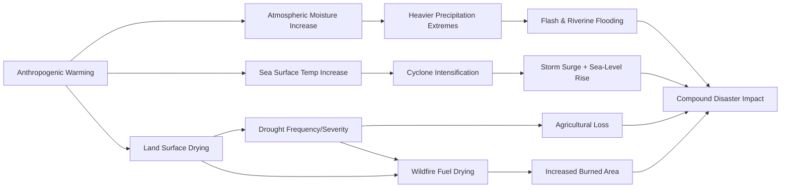

## Climate Related Disaster Trends

### Definition and Scope

Climate-related disaster trends refer to the observed and projected changes in the frequency, intensity, duration, and spatial distribution of hydrometeorological and climatological hazards driven or modified by anthropogenic climate change. This includes events such as tropical cyclones, floods, droughts, heatwaves, wildfires, and sea-level-rise-driven coastal hazards. Distinguishing climate-related disasters from purely geophysical disasters (earthquakes, volcanic eruptions, tsunamis) is a core analytical task in disaster risk science, since only the former is directly modulated by the changing climate system.

### Classification of Climate-Related Hazards

Hazards tracked under climate-related disaster trend analysis are typically grouped into three categories:

1. **Hydrological** — floods (riverine, flash, coastal), landslides triggered by rainfall.
2. **Meteorological** — tropical cyclones, storms, extreme temperature events (heatwaves, cold waves).
3. **Climatological** — droughts, wildfires, desertification processes.

This taxonomy follows the classification used by international disaster databases such as EM-DAT (Emergency Events Database, maintained by CRED — the Centre for Research on the Epidemiology of Disasters).

### Core Attribution Concept: Climate Change vs. Natural Variability

A central technical distinction in this field is between:

- **Exposure and vulnerability trends** — increases in disaster losses driven by more people and assets in hazard-prone areas (urbanization, coastal development), independent of any change in hazard itself.
- **Hazard trends** — actual changes in the physical climate system altering frequency/intensity of events.

**Attribution science** (extreme event attribution) uses climate models to estimate how much more likely or intense a specific event was made by anthropogenic warming, typically expressed as a **Fraction of Attributable Risk (FAR)**:

$$FAR = 1 - \frac{P_0}{P_1}$$

Where $P_0$ is the probability of the event in a counterfactual world without anthropogenic forcing, and $P_1$ is the probability in the actual (forced) climate. This methodology underlies rapid-attribution studies published by groups such as World Weather Attribution.

### Observed Trends by Hazard Type

**Tropical Cyclones**

- [Unverified] Global frequency of tropical cyclones has not shown a statistically robust increasing trend across all basins, but the proportion of storms reaching high-intensity categories (Category 4–5) has increased in several basins according to IPCC AR6 assessments — this remains an area of active research with basin-specific variation.
- Rapid intensification events (sudden jumps in wind speed shortly before landfall) have shown observed increases in some regions, associated with warmer sea surface temperatures.
- Sea-level rise compounds cyclone-related storm surge, extending inland flood reach independent of storm intensity itself.

**Flooding**

- Increased atmospheric water-holding capacity (approximately 7% increase per 1°C of warming, following the Clausius-Clapeyron relationship) contributes to heavier precipitation extremes in many regions.
- Urbanization and impervious surface expansion compound climate-driven precipitation increases, amplifying flash flood risk independent of rainfall trends alone.

**Droughts**

- Increased frequency and severity of agricultural and hydrological droughts observed in multiple regions (e.g., Mediterranean, southwestern North America, parts of southern Africa), attributed with medium-to-high confidence by IPCC to anthropogenic warming interacting with regional precipitation variability.
- Compound drought-heatwave events are increasing, as soil moisture deficits amplify surface heating (land-atmosphere feedback).

**Wildfires**

- Longer fire seasons and increased burned area are documented across multiple biomes (western North America, Mediterranean Europe, Australia), driven by a combination of higher temperatures, reduced snowpack/earlier snowmelt, and vegetation drying — though local trends vary substantially with land-management practices, so [Inference] not all regional wildfire increases can be attributed primarily to climate drivers versus fuel-load and ignition-source factors.

**Heatwaves**

- Among the climate hazards with the strongest and most consistent attribution signal: increased frequency, duration, and intensity of heatwaves is observed nearly globally and is directly linked to mean warming trends with high confidence.

### The IPCC AR6 Framework for Trend Assessment

The IPCC's Sixth Assessment Report (AR6, Working Group I, 2021) formalized confidence levels for observed changes and human contribution across hazard types using a standardized calibrated language scale:

| Confidence Term | Approximate Likelihood Range |
| --- | --- |
| Virtually certain | 99–100% |
| Very likely | 90–100% |
| Likely | 66–100% |
| More likely than not | >50% |
| About as likely as not | 33–66% |
| Unlikely | 0–33% |

AR6 assigned **high confidence** to increased hot extremes and heavy precipitation trends globally, and **medium confidence** to trends in agricultural/ecological drought in specific regions, illustrating that attribution confidence is hazard- and region-specific rather than uniform.

### Compound and Cascading Hazards

A major theme in current disaster trend analysis is the increase in **compound events** — the co-occurrence or sequential occurrence of multiple hazards whose combined impact exceeds the sum of individual effects. Examples:

- Drought followed by wildfire followed by post-fire debris flow during subsequent rainfall.
- Heatwave concurrent with drought, amplifying agricultural and energy-system stress.
- Tropical cyclone landfall coinciding with high tide, amplifying storm surge flooding.

### Loss Data and Economic Trend Tracking

International bodies track economic and human losses through standardized databases:

- **EM-DAT** (CRED, Belgium) — global disaster event database used for Sendai Framework monitoring.
- **NatCatSERVICE** (Munich Re) — insurance-industry natural catastrophe loss database.
- **Sigma** (Swiss Re Institute) — reinsurance-sector catastrophe loss tracking.

[Inference] Reported increases in nominal economic losses from climate-related disasters over recent decades are driven by a combination of rising hazard frequency/intensity, greater asset exposure from economic growth and urbanization, and improved disaster reporting — separating these components requires normalization techniques (e.g., adjusting for inflation, population, and GDP growth) and remains methodologically contested in the loss-trend literature.

### Regional Vulnerability Patterns

Climate-related disaster impacts are not uniform; the IPCC and UNDRR frameworks emphasize:

- **Small Island Developing States (SIDS)** — disproportionate exposure to sea-level rise and cyclone intensification relative to land area and economic base.
- **Least Developed Countries (LDCs)** — lower adaptive capacity results in higher mortality per event despite often lower absolute economic losses compared to wealthy nations.
- **Urban informal settlements** — concentrated exposure to flooding and heat due to poor infrastructure and limited land-use regulation enforcement.

### Worked Example: Trend Analysis Workflow

**Scenario:** Assessing whether flood frequency has increased in a river basin over 50 years.

1. **Data compilation** — gather streamflow gauge records, historical flood event catalogs (e.g., from EM-DAT or national hydrological agencies).
2. **Statistical trend test** — apply a non-parametric trend test such as the **Mann-Kendall test** to detect monotonic trends in annual maximum flow series.
3. **Attribution step** — compare observed trend against climate model simulations with and without anthropogenic forcing (detection and attribution methodology).
4. **Exposure normalization** — separate hazard-driven trend from exposure-driven trend by holding population/asset data constant at a baseline year.
5. **Conclusion drafting** — report findings with explicit confidence language (e.g., "likely," "very likely") following IPCC calibrated uncertainty conventions rather than asserting unconditional certainty.

### Policy and Monitoring Linkages

Climate-related disaster trend data directly feeds into:

- **Sendai Framework Target B and C** monitoring (affected persons, economic loss).
- **National Adaptation Plans (NAPs)** under the UNFCCC Paris Agreement framework.
- **Loss and Damage** mechanisms and associated finance facility established under UNFCCC negotiations (formalized at COP27/COP28), which relies on disaster trend and attribution data to inform resource allocation.

### Common Critiques and Limitations

- Attribution confidence varies substantially by hazard type — well-established for heat extremes, more uncertain for cyclone frequency and some flood types.
- Historical loss databases have inconsistent reporting standards across countries and time periods, complicating long-term trend comparability.
- [Speculation] Some analysts argue current disaster trend models underweight cascading/compound risk pathways, though quantitative frameworks for compound-hazard probability estimation are still an actively developing area of climate science rather than a settled methodology.

### Related Topics

- Extreme event attribution science and methodology
- IPCC AR6 Working Group I and II hazard assessments
- Compound and cascading hazard risk modeling
- Loss and Damage finance mechanisms (UNFCCC)
- EM-DAT and global disaster loss databases
- Climate change adaptation vs. disaster risk reduction (convergence)
- Sea-level rise and coastal hazard compounding
- Early warning systems for climate-driven extremes