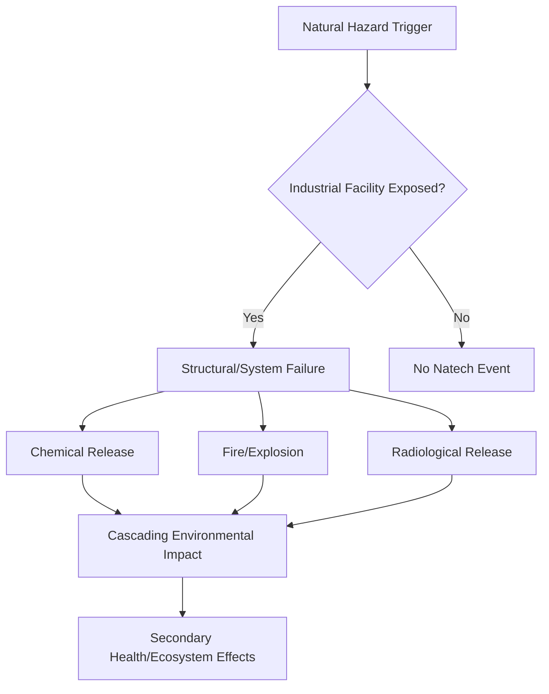

## Technological and Industrial Hazards

### Definition and Scope

Technological and industrial hazards (also termed "man-made" or "anthropogenic" hazards, and often abbreviated **Na-Tech** when they interact with natural hazards) are events originating from technological or industrial conditions, including accidents, dangerous procedures, infrastructure failures, or specific human activities, that may cause loss of life, injury, illness, or other health impacts, property damage, loss of livelihoods and services, social and economic disruption, or environmental damage. Unlike purely natural hazards, these hazards originate from human-engineered systems, though they frequently interact with natural hazards as triggers or amplifiers.

### Classification Taxonomy

Technological/industrial hazards are commonly categorized by mechanism:

1. **Chemical hazards (Chem)** — toxic releases, explosions, fires involving hazardous substances.
2. **Radiological/Nuclear hazards (Rad/Nuc)** — radioactive material releases from power plants, medical facilities, or transport.
3. **Biological hazards (Bio)** — accidental release of pathogens from laboratories or industrial biological processes.
4. **Infrastructure failures** — dam failures, bridge collapses, power grid failures, pipeline ruptures.
5. **Transportation accidents** — major hazardous material spills during rail, road, marine, or air transport.
6. **Mining-related hazards** — tailings dam failures, mine collapses, subsidence.

This classification aligns with the **CBRN(E)** framework (Chemical, Biological, Radiological, Nuclear, and Explosive) used in hazard and emergency management doctrine internationally.

### Natech Events: The Natural-Technological Interface

**Natech (Natural Hazard Triggering Technological Disaster)** events occur when a natural hazard (earthquake, flood, lightning) triggers a technological/industrial failure. This is a critical intersection point between environmental science and industrial safety:

- Earthquake → pipeline rupture → chemical release
- Flood → wastewater treatment plant failure → water contamination
- Lightning strike → oil storage tank fire

[Inference] Natech risk is generally considered to be increasing due to expanding industrial infrastructure sited in hazard-prone zones combined with climate-driven changes in the frequency of triggering natural hazards, though quantifying this trend systematically remains methodologically difficult due to inconsistent reporting standards across countries.

### Severity Classification Frameworks

**INES — International Nuclear and Radiological Event Scale**

Developed by the IAEA, INES rates nuclear/radiological events on a 0–7 logarithmic scale:

| Level | Descriptor | Example |
| --- | --- | --- |
| 7 | Major Accident | Chernobyl (1986), Fukushima Daiichi (2011) |
| 6 | Serious Accident | Kyshtym disaster (1957) |
| 5 | Accident with Wider Consequences | Three Mile Island (1979) |
| 4 | Accident with Local Consequences | Tokaimura (1999) |
| 1–3 | Incidents/Anomalies | Various operational deviations |
| 0 | Deviation, no safety significance | — |

**Seveso Directive Framework (EU)**

Classifies industrial establishments handling hazardous substances into **lower-tier** and **upper-tier** categories based on quantity thresholds of dangerous substances present, mandating safety management systems, external emergency plans, and land-use planning buffers around high-risk facilities.

### Core Risk Assessment Methodologies

**Quantitative Risk Assessment (QRA)** for industrial hazards typically follows this sequence:

1. **Hazard identification** — HAZOP (Hazard and Operability Study) or What-If analysis to identify failure scenarios.
2. **Frequency analysis** — Fault Tree Analysis (FTA) to estimate probability of failure events.
3. **Consequence modeling** — dispersion modeling for chemical releases (e.g., Gaussian plume models), blast overpressure modeling for explosions, thermal radiation modeling for fires.
4. **Risk characterization** — combining frequency and consequence into individual risk contours and societal risk (F-N curves).

Individual risk is often expressed as:

$$IR = \sum_{i} f_i \times P(fatality | event_i)$$

Where $f_i$ is the frequency of scenario $i$ and $P(fatality|event_i)$ is the conditional probability of fatality given that scenario occurs at a given location.

**Layer of Protection Analysis (LOPA)** is a semi-quantitative method used to verify that sufficient independent protection layers (alarms, safety instrumented systems, physical containment) exist to reduce risk to tolerable levels.

### Bowtie Analysis (Standard Visualization Method)

A **Bowtie diagram** is the standard risk communication tool in industrial hazard management, illustrating causes (left side), the central hazardous event (center), and consequences (right side), separated by preventive and mitigative barriers.

<svg xmlns="http://www.w3.org/2000/svg" viewBox="0 0 700 380" font-family="sans-serif" font-size="13">
<title>Bowtie Risk Analysis Diagram (svg_diagram)</title>
<circle cx="350" cy="190" r="35" fill="#C92A2A" />
<text x="350" y="195" fill="white" text-anchor="middle" font-weight="bold">Top Event</text>
<line x1="120" y1="80" x2="315" y2="175" stroke="#333" stroke-width="2" />
<line x1="120" y1="190" x2="315" y2="190" stroke="#333" stroke-width="2" />
<line x1="120" y1="300" x2="315" y2="205" stroke="#333" stroke-width="2" />
<rect x="60" y="65" width="120" height="30" fill="#4C6EF5" />
<text x="120" y="85" fill="white" text-anchor="middle">Cause A</text>
<rect x="60" y="175" width="120" height="30" fill="#4C6EF5" />
<text x="120" y="195" fill="white" text-anchor="middle">Cause B</text>
<rect x="60" y="285" width="120" height="30" fill="#4C6EF5" />
<text x="120" y="305" fill="white" text-anchor="middle">Cause C</text>
<rect x="220" y="70" width="14" height="180" fill="#12B886" />
<text x="227" y="270" fill="#333" text-anchor="middle" transform="rotate(90 227 270)">Barriers</text>
<line x1="385" y1="175" x2="580" y2="80" stroke="#333" stroke-width="2" />
<line x1="385" y1="190" x2="580" y2="190" stroke="#333" stroke-width="2" />
<line x1="385" y1="205" x2="580" y2="300" stroke="#333" stroke-width="2" />
<rect x="520" y="65" width="120" height="30" fill="#F59F00" />
<text x="580" y="85" fill="white" text-anchor="middle">Consequence X</text>
<rect x="520" y="175" width="120" height="30" fill="#F59F00" />
<text x="580" y="195" fill="white" text-anchor="middle">Consequence Y</text>
<rect x="520" y="285" width="120" height="30" fill="#F59F00" />
<text x="580" y="305" fill="white" text-anchor="middle">Consequence Z</text>
<rect x="466" y="70" width="14" height="180" fill="#7048E8" />
<text x="473" y="270" fill="#333" text-anchor="middle" transform="rotate(90 473 270)">Mitigation</text>
</svg>

### Major Historical Case Studies

- **Bhopal Gas Tragedy (1984, India)** — methyl isocyanate release from a pesticide plant; remains the reference case for chemical industrial disaster consequence severity and regulatory reform (led to the U.S. Emergency Planning and Community Right-to-Know Act).
- **Chernobyl (1986, Ukraine/USSR)** — INES Level 7 nuclear accident from reactor design flaws combined with procedural failures during a safety test.
- **Fukushima Daiichi (2011, Japan)** — Natech event: earthquake and subsequent tsunami disabled cooling systems, leading to reactor meltdowns; a defining case study in Natech risk analysis.
- **Deepwater Horizon (2010, Gulf of Mexico)** — offshore drilling blowout causing the largest accidental marine oil spill in history, illustrating cascading technological and environmental hazard interaction.
- **Brumadinho and Mariana Dam Disasters (Brazil, 2019 and 2015)** — tailings dam failures illustrating mining-related infrastructure hazard risk and downstream ecosystem/community impact.

### Environmental and Ecosystem Impact Pathways

Industrial hazards intersect with environmental science primarily through:

- **Soil and groundwater contamination** from chemical spills, requiring long-term remediation (pump-and-treat, bioremediation, soil vapor extraction).
- **Atmospheric dispersion** of toxic plumes affecting air quality over wide areas, modeled using Gaussian plume or Lagrangian dispersion models.
- **Aquatic ecosystem damage** from oil spills and tailings releases, often requiring decades for recovery of benthic communities.
- **Bioaccumulation** of persistent contaminants (heavy metals, radionuclides) through food webs following release events.

### Regulatory and Institutional Frameworks

- **Seveso III Directive (EU, 2012)** — governs major-accident hazard control for establishments with hazardous substances.
- **OSHA Process Safety Management (PSM) Standard (US)** — regulates highly hazardous chemical processes.
- **IAEA Safety Standards** — international framework for nuclear and radiological safety.
- **Basel Convention** — governs transboundary movement of hazardous wastes, relevant to industrial waste-related environmental hazards.
- **UNECE Convention on Transboundary Effects of Industrial Accidents** — regional framework for cross-border industrial accident notification and response.

### Worked Example: Facility Risk Screening Workflow

**Scenario:** Screening a chemical storage facility for Natech and standalone industrial risk.

1. **Inventory hazardous substances** — quantify types and volumes against regulatory thresholds (e.g., Seveso Annex I substances).
2. **Natural hazard overlay** — cross-reference facility location against seismic hazard maps, flood zones, and lightning frequency data.
3. **Scenario development** — construct credible failure scenarios (tank rupture during flood, pipeline failure during earthquake).
4. **Consequence modeling** — run dispersion/fire/explosion models for each scenario to estimate affected radius.
5. **Barrier assessment** — apply LOPA to verify sufficient independent safeguards exist for each scenario.
6. **Land-use planning integration** — establish buffer zones and emergency response plans based on modeled consequence distances.

### Common Critiques and Limitations

- [Inference] Natech risk is often under-regulated relative to standalone industrial risk because most safety codes historically treated natural hazard loading and industrial process safety as separate regulatory domains, though this is gradually changing in updated international guidance (e.g., post-Fukushima IAEA revisions).
- QRA outputs are highly sensitive to input assumptions (failure frequencies, weather conditions used in dispersion modeling), so results should be interpreted as risk estimates with associated uncertainty rather than precise predictions; actual outcomes during a real event may vary substantially from modeled scenarios.
- Reporting and classification standards for industrial accidents vary significantly between countries, complicating global trend comparisons.

### Related Topics

- Natech risk assessment methodology
- Quantitative Risk Assessment (QRA) and Layer of Protection Analysis (LOPA)
- Nuclear and radiological emergency preparedness (INES scale)
- Tailings dam failure risk and mining hazard management
- Chemical spill remediation techniques (bioremediation, pump-and-treat)
- Seveso Directive and industrial land-use planning
- Environmental impact assessment for industrial facilities
- Transboundary hazardous waste management (Basel Convention)