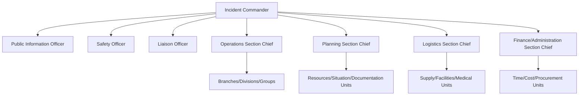

## Emergency Preparedness and Response Planning

### Definition and Scope

Emergency preparedness and response planning encompasses the systematic processes, structures, and capabilities developed to anticipate, prepare for, respond to, and initiate recovery from disaster events. It is the operational counterpart to disaster risk reduction policy — while DRR frameworks set strategic priorities, preparedness and response planning translates those priorities into actionable protocols, trained personnel, resource stockpiles, and command structures that function during an actual emergency.

### Distinction from Related Concepts

- **Preparedness** — pre-event actions: planning, training, resource pre-positioning, early warning system establishment.
- **Response** — actions during and immediately after an event: search and rescue, evacuation, emergency medical care, damage assessment.
- **Recovery** — post-event actions: restoring services, rebuilding, psychosocial support (covered separately from preparedness/response proper, though planning frameworks often address the transition).

This mirrors the DRR cycle structure but focuses specifically on the operational and institutional mechanics of the preparedness-response segment.

### Core Planning Framework: The PPRR Model

Many national emergency management systems (notably Australia, and adapted variants elsewhere) structure their approach around four pillars:

1. **Prevention** — measures to eliminate or reduce hazard occurrence.
2. **Preparedness** — arrangements to ensure resources and services can effectively respond.
3. **Response** — actions taken immediately before, during, or after an emergency.
4. **Recovery** — coordinated process of supporting affected communities' reconstruction.

### Incident Command System (ICS)

The **Incident Command System** is the most widely adopted standardized on-scene management structure for emergency response, originally developed in the US for wildfire management (FIRESCOPE program, 1970s) and now a global standard component of broader emergency management frameworks.

**Core ICS Organizational Structure:**

**Key ICS Principles:**

- **Unity of command** — each individual reports to only one designated supervisor.
- **Span of control** — one supervisor manages 3–7 subordinates (5 is the recommended optimum).
- **Common terminology** — standardized titles and terms across agencies to prevent confusion during multi-agency response.
- **Modular organization** — the structure expands or contracts based on incident complexity.
- **Manageable scalability** — ICS can be applied to incidents ranging from a single-engine house fire to a multi-state disaster.

In the US, ICS is embedded within the broader **National Incident Management System (NIMS)**, which additionally covers resource management, communications interoperability, and public information coordination across all response levels.

### Emergency Operations Center (EOC) Structures

An **EOC** is the physical or virtual location where coordination of information and resources supporting incident management occurs, distinct from the on-scene Incident Command Post. EOCs typically follow one of three organizational models:

- **ICS-based EOC** — mirrors field ICS structure (Operations, Planning, Logistics, Finance sections).
- **Emergency Support Function (ESF) model** — organizes coordination around functional areas (e.g., ESF-1 Transportation, ESF-6 Mass Care, ESF-8 Public Health, following the US National Response Framework's 15 ESFs).
- **Departmental/agency model** — each responding agency maintains its own representative and reporting line into a coordinating body.

### Preparedness Planning Components

**Hazard-specific and all-hazards planning:**

Modern preparedness doctrine favors an **all-hazards approach** — building generalizable response capabilities (communication, evacuation, medical surge, logistics) that apply across hazard types, supplemented by hazard-specific annexes for unique risks (e.g., radiological response protocols, chemical decontamination procedures).

**Core planning documents typically include:**

1. **Emergency Operations Plan (EOP)** — the foundational document establishing roles, responsibilities, and general response procedures.
2. **Hazard-specific annexes** — detailed protocols for particular hazard types.
3. **Standard Operating Procedures (SOPs)** — step-by-step operational guidance for specific tasks.
4. **Mutual aid agreements** — pre-arranged agreements for resource sharing between jurisdictions.
5. **Continuity of Operations Plans (COOP)** — ensuring essential government/organizational functions continue during disruption.

### Early Warning Systems (EWS) as a Preparedness Pillar

Multi-Hazard Early Warning Systems integrate four interdependent components, per the UN Office for Disaster Risk Reduction (UNDRR) framework:

1. **Risk knowledge** — systematic hazard and vulnerability data collection.
2. **Detection, monitoring, and forecasting** — technical hazard monitoring capability (seismographs, weather radar, stream gauges).
3. **Warning dissemination and communication** — reaching at-risk populations through multiple channels (SMS-based cell broadcast, sirens, radio, community networks).
4. **Response capability** — ensuring warned populations know how and are able to act (evacuation routes, shelters, drills).

A system failing on any one of these four components will not achieve effective risk reduction outcomes even if the other three function well — this is a widely cited principle in EWS design literature.

### Evacuation Planning

Key technical elements of evacuation planning include:

- **Evacuation zone delineation** — often tiered (e.g., Zone A/B/C in hurricane evacuation planning) based on hazard modeling (storm surge inundation models, flood extent mapping).
- **Clearance time modeling** — traffic simulation estimating time required to evacuate a zone's population given road network capacity, often using models like the **Hurricane Evacuation Studies (HES)** methodology in the US.
- **Special needs populations planning** — protocols for populations requiring assistance (mobility-impaired, medical-dependent, institutionalized populations).
- **Shelter-in-place vs. evacuation decision criteria** — hazard-specific thresholds determining which protective action is safer (e.g., shelter-in-place for certain chemical releases vs. evacuation for flood/wildfire).

### Resource and Logistics Management

- **Stockpiling** — pre-positioning of emergency supplies (medical, food, water, shelter materials) at strategic locations based on hazard risk mapping.
- **Mutual aid and resource-sharing compacts** — e.g., the US **Emergency Management Assistance Compact (EMAC)**, enabling interstate resource sharing during declared emergencies.
- **Logistics tracking systems** — resource typing and inventory management systems ensuring interoperable equipment/personnel classification across responding agencies (a core NIMS component).

### Communication and Interoperability

- **Common Alerting Protocol (CAP)** — an international standard XML-based data format for exchanging public warnings across different alerting systems and media, enabling a single warning message to be disseminated simultaneously via multiple channels (radio, TV, cell broadcast, sirens).
- **Interoperable communications** — shared radio frequencies/protocols enabling multi-agency communication during joint response, a persistent technical challenge identified in after-action reviews of major disasters (e.g., communication failures documented after Hurricane Katrina and the 9/11 response).

### Drills, Exercises, and Capability Testing

The **Homeland Security Exercise and Evaluation Program (HSEEP)** framework (widely referenced internationally as a model) categorizes exercises into:

- **Discussion-based exercises** — seminars, workshops, tabletop exercises (TTX), games.
- **Operations-based exercises** — drills, functional exercises (FE), full-scale exercises (FSE).

Progressive exercise programs typically build from tabletop exercises (testing plans and decision-making in a low-stress discussion format) toward full-scale exercises (testing actual field deployment of personnel and equipment under realistic conditions).

### Worked Example: Preparedness Planning Cycle for a Flood-Prone Municipality

1. **Risk assessment** — flood hazard mapping combined with population/asset exposure data.
2. **Plan development** — drafting a flood-specific annex to the municipal EOP, including trigger thresholds for evacuation orders tied to river gauge readings.
3. **Resource allocation** — pre-positioning sandbags, boats, and emergency shelter supplies at accessible staging areas outside the flood zone.
4. **Communication protocol** — establishing CAP-compliant alert dissemination through SMS, sirens, and local broadcast partnerships.
5. **Training and exercising** — conducting an annual tabletop exercise, escalating to a full-scale evacuation drill every 3–5 years.
6. **After-action review** — following any actual activation or major exercise, conducting a structured after-action report (AAR) to identify corrective actions and update plans.

### Standards and Institutional Frameworks

- **ISO 22320:2018** — Security and resilience — Emergency management — Guidelines for incident management.
- **National Response Framework (NRF, US)** — guides how the nation responds to all types of disasters.
- **Sendai Framework Priority 4** — "Enhancing disaster preparedness for effective response" directly maps to this domain at the policy level.
- **UNDRR Words into Action guidelines** — practical implementation guidance documents for MHEWS and preparedness planning.

### Common Critiques and Limitations

- [Inference] Plans that exist only on paper without regular exercising tend to underperform during actual incidents, a pattern frequently cited in after-action reports, though the precise relationship between exercise frequency and real-event performance is difficult to establish through controlled study given the rarity and heterogeneity of major disasters.
- ICS and NIMS structures, while widely adopted, were developed primarily in a US institutional context; adaptation to different governance and cultural contexts internationally requires modification rather than direct transplantation.
- Warning dissemination gaps persist for populations without access to targeted communication channels (language barriers, disability access, areas with low connectivity), and technical system performance may vary from tested conditions during actual large-scale events due to network congestion or infrastructure damage.

### Related Topics

- Incident Command System (ICS) and NIMS implementation
- Common Alerting Protocol (CAP) and multi-channel warning dissemination
- Hurricane/flood evacuation clearance time modeling
- Continuity of Operations Planning (COOP)
- After-action review (AAR) methodology
- Mutual aid compacts and interagency resource management
- Special needs population planning in emergencies
- Multi-Hazard Early Warning Systems (MHEWS) architecture