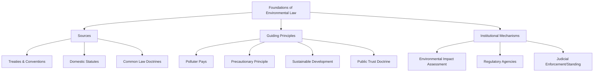

## Foundations of Environmental Law

### Definition and Scope

Environmental law is the body of treaties, statutes, regulations, common law principles, and customary norms that govern the relationship between human activity and the natural environment. It functions as an interdisciplinary legal field, drawing on public international law, administrative law, property law, tort law, and constitutional law to regulate pollution, allocate natural resources, protect biodiversity, and manage environmental risk. Its foundations rest on a combination of legal doctrines, guiding principles, and institutional structures that have developed cumulatively since the mid-20th century.

### Sources of Environmental Law

Environmental law derives from multiple overlapping sources, generally following the standard hierarchy of legal sources with environment-specific elaborations:

1. **International treaties and conventions** — binding agreements between states (e.g., UNFCCC, Convention on Biological Diversity, Basel Convention).
2. **Customary international law** — practices accepted as legally binding through consistent state practice (e.g., the "no-harm principle").
3. **Constitutional provisions** — many national constitutions now include explicit environmental rights or state duties (e.g., environmental rights provisions found in the constitutions of countries such as India, South Africa, and Ecuador).
4. **Domestic statutes and regulations** — national and subnational legislation (e.g., the US Clean Air Act, Clean Water Act, EU environmental directives).
5. **Common law / judicial doctrine** — court-developed principles such as nuisance, trespass, and riparian rights, historically the earliest legal tools for addressing environmental harm before dedicated statutes existed.
6. **Soft law instruments** — non-binding declarations, guidelines, and resolutions (e.g., the Rio Declaration) that influence subsequent binding law development.

### Core Guiding Principles

**1. Polluter Pays Principle (PPP)**

The party responsible for producing pollution should bear the costs of managing it to prevent damage to human health or the environment. Formally endorsed by the OECD in 1972 and incorporated into numerous national frameworks and EU environmental policy (Article 191 TFEU).

**2. Precautionary Principle**

Where there are threats of serious or irreversible environmental damage, lack of full scientific certainty should not be used as a reason for postponing cost-effective measures to prevent environmental degradation. Formally articulated in Principle 15 of the 1992 Rio Declaration.

**3. Principle of Sustainable Development**

Development that meets the needs of the present without compromising the ability of future generations to meet their own needs — originating from the 1987 Brundtland Report ("Our Common Future") and subsequently embedded across international environmental instruments.

**4. Intergenerational Equity**

The principle that the current generation holds the environment in trust for future generations, obligating conservation of natural and cultural resources.

**5. Common but Differentiated Responsibilities (CBDR)**

Recognizes that all states share responsibility for addressing global environmental problems, but with differentiated obligations reflecting differing historical contributions and capacities — a foundational principle in climate law (UNFCCC Article 3, later contested and renegotiated in the Paris Agreement's more universal participation model).

**6. Public Trust Doctrine**

A common-law-derived principle holding that certain natural resources (navigable waters, air, wildlife) are preserved for public use, and the government holds these resources in trust for the public, constraining its ability to fully privatize or degrade them.

**7. Principle of Prevention**

Emphasizes preventing environmental harm before it occurs, rather than remedying it after the fact — reflected in requirements such as environmental impact assessment.

### Historical Development

**Pre-1960s: Common Law Era**

Environmental disputes were addressed primarily through tort doctrines — nuisance (interference with use/enjoyment of land), trespass, and negligence — applied case-by-case without dedicated environmental statutes.

**1960s–1970s: Emergence of Modern Statutory Environmental Law**

Triggered substantially by growing public awareness of pollution (e.g., publication of Rachel Carson's *Silent Spring* in 1962, and visible pollution events such as the Cuyahoga River fire). This period saw the establishment of dedicated environmental agencies and statutes, notably the US National Environmental Policy Act (NEPA, 1970) — widely regarded as the first modern environmental impact assessment law — followed by the Clean Air Act (1970) and Clean Water Act (1972).

**1972: Stockholm Conference**

The UN Conference on the Human Environment produced the Stockholm Declaration, the first major international document articulating environmental principles as a matter of international concern, and led to the creation of the **UN Environment Programme (UNEP)**.

**1987: Brundtland Report**

Formalized the concept of sustainable development as the organizing principle for reconciling environmental protection with economic development.

**1992: Rio Earth Summit**

Produced the Rio Declaration on Environment and Development, Agenda 21, and opened for signature both the UN Framework Convention on Climate Change (UNFCCC) and the Convention on Biological Diversity (CBD) — a foundational moment for modern international environmental law architecture.

**2000s–Present: Consolidation and Climate Focus**

Expansion of climate-specific legal frameworks (Kyoto Protocol 1997, Paris Agreement 2015), growth of environmental constitutionalism, and increasing recognition of environmental rights and rights of nature in domestic legal systems.

### Environmental Impact Assessment (EIA) as a Legal Mechanism

EIA is one of the most widely adopted procedural tools in environmental law, requiring assessment of the likely environmental effects of a proposed project before authorization. Standard EIA process components:

1. **Screening** — determining whether a project requires EIA.
2. **Scoping** — identifying which impacts and alternatives must be assessed.
3. **Impact analysis** — technical assessment of predicted environmental effects.
4. **Mitigation planning** — measures to avoid, minimize, or offset impacts.
5. **Public participation** — mandated stakeholder/public comment period.
6. **Review and decision** — regulatory authority approval, conditional approval, or rejection.
7. **Monitoring** — post-approval compliance tracking.

EIA requirements are now near-universal in national legal systems, generally modeled either on the US NEPA approach or the EU Environmental Impact Assessment Directive (2011/92/EU, as amended).

### Standing and Access to Justice

A recurring foundational issue in environmental law is **legal standing** — who may bring a claim before a court to enforce environmental protections. Approaches vary significantly:

- **Traditional standing doctrine** — requires a plaintiff to demonstrate direct, particularized injury (historically limiting environmental claims, since environmental harm is often diffuse).
- **Liberalized/public interest standing** — many jurisdictions (India, several Latin American and African countries) have relaxed standing requirements to allow public interest environmental litigation.
- **Aarhus Convention (1998, UNECE)** — establishes rights of access to environmental information, public participation in decision-making, and access to justice in environmental matters, influential particularly across European legal systems.

### Rights of Nature and Emerging Legal Personhood

An emerging and still-developing doctrinal area grants legal rights or personhood status directly to natural entities:

- Ecuador's 2008 Constitution was the first to recognize constitutional rights of nature (*Pachamama*).
- New Zealand's Whanganui River was granted legal personhood status in 2017 through the Te Awa Tupua Act.
- [Unverified] The broader legal and practical effectiveness of rights-of-nature provisions in producing enforceable environmental protection outcomes remains contested and unsettled across jurisdictions, as case law applying these provisions is still relatively limited and evolving.

### Institutional and Enforcement Mechanisms

- **Command-and-control regulation** — direct regulatory standards with permitting and penalty enforcement (dominant historical model, e.g., emission limits under the Clean Air Act).
- **Market-based mechanisms** — cap-and-trade systems, carbon taxes, tradeable pollution permits, designed to achieve environmental goals with greater economic efficiency than pure command-and-control.
- **Environmental courts and tribunals** — specialized judicial bodies (e.g., India's National Green Tribunal, established 2010) created to handle the technical complexity of environmental disputes more effectively than general courts.
- **International dispute resolution** — the International Court of Justice, WTO dispute panels (where trade and environment intersect), and treaty-specific compliance mechanisms (e.g., the Paris Agreement's facilitative compliance committee).

### Worked Example: Applying Foundational Principles to a Case

**Scenario:** A proposed industrial facility risks discharging pollutants into a river used by a downstream community.

1. **Precautionary principle application** — absent complete scientific certainty about discharge impact, regulators may require conservative discharge limits or additional study before approval.
2. **EIA requirement** — the project likely triggers mandatory environmental impact assessment under domestic law, requiring public consultation with the downstream community.
3. **Public trust doctrine** — since the river is a shared public resource, the state has an obligation to protect its usability, potentially constraining permit terms.
4. **Polluter pays principle** — if pollution occurs despite safeguards, the facility operator bears remediation and compensation costs rather than the public.
5. **Standing analysis** — downstream community members would need to establish sufficient standing (or benefit from liberalized public interest standing rules) to challenge an inadequate permit decision in court.

### Common Critiques and Limitations

- Enforcement gaps persist even in jurisdictions with strong environmental statutes, often attributed in the literature to under-resourced regulatory agencies and political economy pressures, though the specific causes vary by country and sector.
- International environmental law generally lacks centralized enforcement mechanisms comparable to domestic legal systems, relying instead on state compliance, reporting obligations, and reputational/diplomatic pressure.
- Tension exists between sovereignty-based international law structures and the inherently transboundary nature of many environmental problems (climate change, ocean pollution, biodiversity loss), creating persistent coordination challenges.

### Related Topics

- International environmental treaties and conventions (UNFCCC, CBD, Basel Convention)
- Environmental Impact Assessment (EIA) procedural design
- Precautionary principle in regulatory decision-making
- Rights of nature and environmental constitutionalism
- Environmental courts and specialized tribunals
- Market-based environmental regulation (cap-and-trade, carbon pricing)
- Aarhus Convention and access to environmental justice
- Public trust doctrine in natural resource management