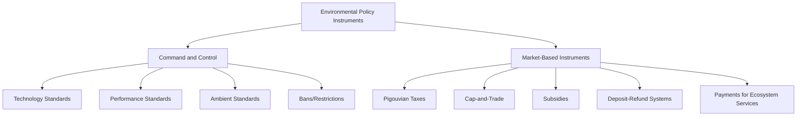

## Command and Control Versus Market Based Policy Instruments

### Definition and Scope

Environmental policy instruments are the regulatory tools governments use to achieve environmental objectives — reducing pollution, conserving resources, or managing risk. These instruments are broadly classified into two paradigms: **command-and-control (CAC)** regulation, which prescribes specific behaviors or technologies directly, and **market-based instruments (MBI)**, which use economic incentives to guide behavior toward environmental goals while allowing flexibility in how compliance is achieved. Understanding the comparative strengths, weaknesses, and appropriate application contexts of each paradigm is foundational to environmental policy design.

### Command-and-Control Regulation

**Definition:** A regulatory approach in which government sets specific legally binding standards — either performance-based (maximum allowable emissions) or technology-based (mandated pollution control equipment) — and enforces compliance through permitting, inspection, and penalties.

**Core Subtypes:**

1. **Technology-based standards** — mandate specific equipment or processes (e.g., requiring flue-gas desulfurization scrubbers on coal power plants).
2. **Performance-based standards** — set a maximum allowable emission or discharge level, leaving the method of compliance to the regulated entity (e.g., a facility must not exceed X tons of $SO_2$ per year, regardless of method used).
3. **Ambient standards** — set maximum allowable concentrations of a pollutant in the receiving environment (e.g., National Ambient Air Quality Standards under the US Clean Air Act).
4. **Product bans/restrictions** — outright prohibition of specific substances or products (e.g., bans on certain persistent organic pollutants under the Stockholm Convention).

**Advantages:**

- Provides regulatory certainty and predictability for both regulators and regulated entities.
- Easier to monitor and enforce for pollutants with well-established measurement technology.
- Politically legible — clear, easily communicated standards that visibly demonstrate government action.
- Effective for pollutants where any exposure poses severe risk (e.g., banning highly toxic substances outright rather than "pricing" their use).

**Disadvantages:**

- [Inference] Generally considered less cost-effective than market-based approaches for problems where abatement costs vary substantially across polluters, because uniform standards do not account for the fact that some firms can reduce pollution far more cheaply than others.
- Provides limited ongoing incentive for innovation beyond the mandated standard, since compliance requirements do not reward exceeding the standard.
- Can be administratively burdensome, requiring detailed technical rule-making and case-by-case permitting.

### Market-Based Instruments

**Definition:** Policy tools that use price signals, tradeable rights, or other economic incentives to internalize environmental externalities, allowing regulated entities flexibility in determining the most cost-effective compliance method.

**Core Subtypes:**

**1. Pigouvian (Environmental) Taxes**

A tax set equal to the marginal external cost of a negative externality, aiming to align private cost with social cost. The theoretical foundation traces to economist Arthur Pigou's early 20th-century work on externalities.

$$Tax = MEC$$

Where $MEC$ is the marginal external cost at the socially optimal output level. Examples include carbon taxes (e.g., Sweden's carbon tax, among the world's highest per-ton rates) and landfill levies.

**2. Cap-and-Trade (Tradeable Permit Systems)**

Government sets an aggregate emissions cap, divides it into tradeable permits/allowances, and allows firms to buy and sell permits. Firms with low abatement costs sell surplus permits to firms with high abatement costs, theoretically achieving the cap at minimum total cost.

Reference example: the **US Acid Rain Program** (est. 1990, Clean Air Act Title IV Amendments) for $SO_2$ trading is widely cited as the first large-scale successful cap-and-trade program, and the **EU Emissions Trading System (EU ETS)**, established in 2005, remains the largest operating carbon cap-and-trade system.

**3. Subsidies and Tax Incentives**

Positive financial incentives for adopting environmentally beneficial technology or behavior (renewable energy production tax credits, subsidies for electric vehicles, agricultural conservation payments).

**4. Deposit-Refund Systems**

A surcharge is added at purchase, refunded upon return of the product/packaging for proper disposal or recycling (e.g., bottle deposit programs).

**5. Payments for Ecosystem Services (PES)**

Direct payments to landholders for maintaining or enhancing ecosystem services (e.g., Costa Rica's national PES program compensating landowners for forest conservation).

### Economic Theory Underlying Market-Based Instruments

**Marginal Abatement Cost (MAC) Curves**

The core economic argument for MBIs rests on heterogeneous marginal abatement costs across polluters. If Firm A can reduce a ton of pollution at $10 while Firm B's cost is $100, a uniform command-and-control standard requiring both to reduce equally is inefficient — it would be cheaper for society if Firm A reduced more and Firm B reduced less (or paid Firm A to over-comply, as under cap-and-trade).

Under a well-functioning cap-and-trade system, the market reaches a cost-minimizing equilibrium where the marginal abatement cost is equalized across all firms:

$$MAC_A = MAC_B = ... = MAC_n = Permit\ Price$$

This equimarginal principle is the central theoretical justification for the cost-effectiveness claims made about market-based instruments.

**Coase Theorem Connection**

Cap-and-trade systems draw conceptual lineage from Ronald Coase's argument that, given well-defined property rights and low transaction costs, private parties can bargain to an efficient allocation of resources regardless of initial rights allocation — tradeable permits effectively create the property rights needed for this bargaining to occur around pollution.

### Comparative Analysis Table

| Criterion | Command-and-Control | Market-Based Instruments |
| --- | --- | --- |
| Cost-effectiveness | Lower (uniform standards ignore cost heterogeneity) | Higher (allows cost-minimizing reallocation) |
| Innovation incentive | Limited beyond compliance threshold | Continuous (any reduction has ongoing value) |
| Regulatory certainty (on emissions level) | High (fixed limits) | High under cap-and-trade; variable under taxes |
| Price certainty | N/A (not price-based) | High under taxes; variable under cap-and-trade |
| Administrative complexity | High (detailed technical rule-setting) | Moderate to high (requires market infrastructure, monitoring) |
| Political feasibility | Often higher (visible, direct action) | Can face resistance (perceived as a "tax" or "license to pollute") |
| Distributional/equity concerns | Can be addressed via targeted standards | Requires deliberate design (e.g., revenue recycling, free allocation) |
| Suitability for highly toxic/irreversible harms | Well-suited (bans, strict limits) | Less suited (pricing implies acceptable residual harm) |

### Hybrid and Complementary Approaches

In practice, most modern environmental regulatory regimes combine both paradigms rather than relying exclusively on one:

- **Price floors/ceilings within cap-and-trade** — combining features of taxes and trading to manage price volatility (e.g., "cost containment reserves" in some regional US cap-and-trade programs).
- **Baseline-and-credit systems** — a hybrid where firms below an assigned baseline generate tradeable credits, common in performance-based emissions trading.
- **Technology mandates paired with trading** — e.g., renewable portfolio standards (a command-style mandate) implemented alongside tradeable renewable energy certificates (a market mechanism).
- **Information-based instruments** — eco-labeling, mandatory disclosure requirements — sometimes classified as a third category distinct from both CAC and MBI, since they work by correcting information asymmetries rather than direct regulation or pricing.

### Worked Example: Comparing Instrument Choice for Industrial Air Pollution

**Scenario:** A government must reduce sulfur dioxide emissions from a set of power plants with varying ages, technologies, and abatement costs.

1. **Command-and-control option:** Mandate scrubber installation on all plants. Ensures uniform technology adoption but forces even low-cost-abatement plants to install expensive equipment and may force high-cost plants into costly retrofits disproportionate to their emissions share.
2. **Cap-and-trade option:** Set an aggregate emissions cap equal to the desired total reduction, allocate tradeable allowances, and let plants decide whether to install scrubbers, switch fuels, or purchase allowances from lower-cost-abatement plants. This generally achieves the same aggregate reduction at lower total cost, per the equimarginal principle, though it introduces the administrative requirement of a functioning permit market and monitoring system.
3. **Tax option:** Impose a per-ton $SO_2$ tax. Provides price certainty and continuous abatement incentive, but the resulting total emissions level is less predictable in advance than under a fixed cap, since it depends on how firms respond to the price signal.

The historical US Acid Rain Program is frequently cited in environmental economics literature as empirical support for the cap-and-trade approach achieving substantial cost savings relative to a command-and-control counterfactual, though [Inference] the precise magnitude of cost savings estimated in such studies depends on the counterfactual modeling assumptions used, which vary across analyses.

### Common Critiques and Limitations

- Market-based instruments assume reasonably competitive, well-monitored markets; where monitoring capacity is weak (common in many developing-country contexts), trading systems are harder to implement reliably than direct standards.
- Carbon and pollution taxes can raise distributional equity concerns (regressive impact on lower-income households) unless revenue recycling mechanisms (rebates, targeted redistribution) are deliberately incorporated into policy design.
- Cap-and-trade systems can experience price volatility and, in cases of over-allocation of permits, weakened price signals (a criticized feature of the early phases of the EU ETS before subsequent reforms tightened the cap).
- Command-and-control approaches remain the preferred paradigm for hazards where the environmental or health consequence of any exposure is considered unacceptable, since pricing mechanisms implicitly tolerate some level of continued harm in exchange for payment.

### Related Topics

- Marginal abatement cost curves and cost-effectiveness analysis
- Carbon pricing mechanisms (carbon tax vs. cap-and-trade design)
- EU Emissions Trading System (EU ETS) case study
- US Acid Rain Program and $SO_2$ allowance trading
- Payments for Ecosystem Services (PES) program design
- Coase Theorem and property rights approaches to externalities
- Environmental justice and distributional impacts of carbon pricing
- Information-based regulatory instruments (eco-labeling, disclosure)