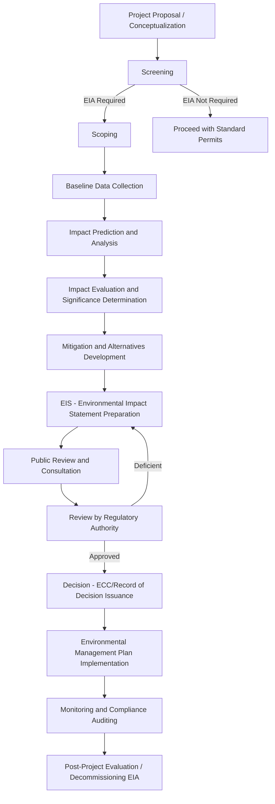

## Environmental Impact Assessment Processes

### Definition and Purpose

Environmental Impact Assessment (EIA) is a systematic, evidence-based process for identifying, predicting, evaluating, and mitigating the biophysical, social, and other relevant effects of proposed development projects prior to major decisions being taken and commitments made. Its core function is anticipatory and precautionary: to inform decision-makers of likely environmental consequences *before* irreversible actions occur, rather than remediating damage after the fact.

The foundational legal definition, per the U.S. **National Environmental Policy Act (NEPA) of 1969** — widely regarded as the world's first modern EIA statute — established the principle that environmental consequences must be considered as an integral part of agency decision-making, not an afterthought.

### Guiding Principles

- **Precautionary Principle** — lack of full scientific certainty should not be used to postpone cost-effective measures to prevent environmental degradation
- **Polluter Pays Principle** — the entity responsible for pollution bears the cost of managing it to prevent damage to human health or the environment
- **Public Participation** — affected communities and stakeholders must have meaningful opportunity to review and comment on proposed projects
- **Transparency and Access to Information** — EIA documents must generally be publicly accessible (subject to legitimate confidentiality exceptions)
- **Integration** — environmental considerations must be integrated into the earliest stages of project planning, not appended afterward
- **Mitigation Hierarchy** — a sequential preference order: Avoid → Minimize → Rehabilitate/Restore → Offset

### The Generic EIA Process (International Standard Model)

Most national EIA systems (whether under NEPA, the EU EIA Directive 2011/92/EU, or the Philippine EIS System) follow a broadly similar sequence of stages, though terminology and legal weight vary by jurisdiction.

### Stage-by-Stage Technical Breakdown

#### 1. Screening

Determines whether a proposed project requires an EIA at all, and if so, at what level of detail. Screening mechanisms include:

- **Inclusion/Exclusion lists** — predefined lists of project types automatically requiring or exempted from EIA (e.g., thermal power plants above a certain MW threshold)
- **Threshold-based screening** — quantitative criteria (project size, capacity, location sensitivity)
- **Case-by-case screening** — discretionary review, often used for borderline projects

Screening outcomes typically classify a project into tiers, such as (Philippine EIS System example):

- **Environmentally Critical Projects (ECPs)** — always require a full EIA regardless of location
- **Projects in Environmentally Critical Areas (ECAs)** — required based on location sensitivity (e.g., proximity to protected areas, aquifers, geohazard zones)
- **Non-critical projects** — may only require simpler instruments (e.g., Certificate of Non-Coverage)

#### 2. Scoping

Defines the boundaries of the assessment — which impacts, alternatives, and geographic/temporal scope will be studied in detail. Outputs a **Terms of Reference (ToR)**. Scoping typically involves:

- Identification of Valued Ecosystem Components (VECs) or Valued Environmental Components — the specific environmental, social, or cultural features considered significant enough to warrant detailed study
- Stakeholder consultation to surface community concerns early
- Determination of the spatial boundary (direct impact area vs. indirect/cumulative impact area) and temporal boundary (construction, operation, decommissioning phases)

#### 3. Baseline Data Collection

Establishes pre-project environmental and socioeconomic conditions against which predicted impacts and post-project monitoring will be compared. Typically covers:

| Component | Example Parameters |
| --- | --- |
| Air quality | PM2.5, PM10, NOx, SOx, ambient noise levels |
| Water resources | Surface/groundwater quality, hydrology, flow rates |
| Land | Soil type, geology, seismicity, land use/cover |
| Biological | Flora/fauna inventory, endangered species presence, habitat connectivity |
| Socioeconomic | Population, livelihoods, land tenure, cultural/heritage sites |

#### 4. Impact Prediction and Analysis

Applies quantitative and qualitative methods to forecast changes from baseline conditions. Common technical tools include:

- **Matrix methods** (e.g., Leopold Matrix) — cross-tabulates project activities against environmental components, scoring magnitude and importance
- **Network/cause-effect diagrams** — trace indirect and cascading impacts
- **Overlay mapping (GIS-based)** — spatial overlay of impact zones against sensitive receptors
- **Mathematical/simulation models** — e.g., AERMOD or CALPUFF for air dispersion modeling, MIKE 11/HEC-RAS for hydrological impact, underwater noise propagation models for marine projects
- **Checklists** — simple/descriptive or scaled/weighted checklists for rapid impact screening

**Leopold Matrix scoring convention** (illustrative):

$$Significance_{ij} = Magnitude_{ij} \times Importance_{ij}$$

Where $i$ indexes project activities and $j$ indexes environmental components, with each typically scored on a scale (e.g., 1–10), and the sign (+/–) indicating beneficial or adverse direction.

#### 5. Evaluation of Significance

Not all identified impacts warrant equal regulatory concern. Significance determination typically weighs:

- Magnitude and spatial extent of the impact
- Duration and reversibility (short-term vs. permanent; reversible vs. irreversible)
- Probability of occurrence
- Sensitivity/value of the affected receptor (e.g., impact on a critical habitat vs. degraded land)
- Cumulative and synergistic effects with other existing or planned projects

#### 6. Mitigation and Alternatives

The EIA must present a reasonable range of alternatives, including the "No Action" alternative, and apply the mitigation hierarchy:

1. **Avoidance** — redesign or relocate to eliminate the impact entirely
2. **Minimization** — reduce the duration, intensity, or extent of the impact
3. **Rehabilitation/Restoration** — repair affected ecosystems post-impact
4. **Offsetting/Compensation** — compensate for residual, unavoidable impacts (e.g., biodiversity offsets, reforestation at a different site)

[Inference] The "No Net Loss" or "Net Positive Impact" targets increasingly required by lenders (e.g., IFC Performance Standard 6) represent a more stringent evolution of the mitigation hierarchy's offsetting tier, though their consistent enforcement varies significantly by jurisdiction and project financing structure.

#### 7. Environmental Impact Statement (EIS) / Environmental Impact Assessment Report (EIAR)

The core legal document synthesizing all prior stages, typically structured as:

- Executive Summary
- Project Description and Alternatives
- Legal and Institutional Framework
- Baseline Environmental Description
- Impact Assessment and Significance
- Environmental Management Plan (EMP) / Environmental Management and Monitoring Plan (EMMP)
- Public consultation record
- Non-technical summary (for lay public accessibility)

#### 8. Public Review and Consultation

Legally mandated mechanisms vary but commonly include public hearings, comment periods (often 30–60 days), and formal response-to-comments documentation. [Unverified] The specific minimum consultation periods and hearing requirements differ substantially across jurisdictions and are subject to periodic legislative amendment, so current local regulations should always be verified against the applicable statute in force.

#### 9. Decision-Making

The regulatory authority issues one of:

- **Approval** (with or without conditions) — e.g., Environmental Compliance Certificate (ECC) in the Philippines, Record of Decision (ROD) under NEPA
- **Conditional approval** requiring additional mitigation or monitoring commitments
- **Denial**
- **Request for supplementary EIA/EIS** (deficiency finding)

#### 10. Monitoring and Compliance

Post-approval, an **Environmental Management Plan (EMP)** and **Environmental Monitoring Plan** govern ongoing compliance, typically including:

- Multipartite Monitoring Teams (MMT) — in the Philippine context, joint government-proponent-community monitoring bodies
- Periodic compliance monitoring reports (CMRs)
- Environmental audits and non-compliance penalty structures

### Comparative Legal Frameworks

| Jurisdiction/System | Key Instrument | Approval Document |
| --- | --- | --- |
| United States | NEPA (1969) | Record of Decision (ROD) / Finding of No Significant Impact (FONSI) |
| European Union | EIA Directive 2011/92/EU (amended 2014/52/EU) | Development Consent |
| Philippines | PD 1586 (1978) — Philippine EIS System | Environmental Compliance Certificate (ECC) |
| World Bank/IFC (project finance) | Environmental and Social Framework (ESF) / Performance Standards | Environmental and Social Impact Assessment (ESIA) approval |

### Practical Example: Proposed Coastal Resort Development

**Scenario:** A 50-hectare beachfront resort is proposed adjacent to a mangrove-fringed bay.

**Screening:** Falls under "Projects in Environmentally Critical Areas" due to proximity to mangrove forest (an ECA) — full EIA required.

**Scoping:** Key VECs identified: mangrove ecosystem, adjacent coral reef, local fisherfolk livelihoods, coastal groundwater aquifer.

**Baseline:** Surveys find 3.2 hectares of mangrove within the direct footprint, a fringing reef with 35% live coral cover 200m offshore, and 40 households dependent on nearshore fishing.

**Impact Prediction:** Modeling predicts:

- Direct habitat loss: 3.2 ha of mangrove removed
- Sedimentation plume during construction potentially affecting reef photosynthesis within 150m
- Increased wastewater loading risk to groundwater without adequate treatment

**Mitigation Hierarchy Applied:**

- *Avoid*: Resort footprint redesigned to reduce mangrove clearing from 3.2 ha to 0.8 ha
- *Minimize*: Silt curtains and construction scheduling outside spawning season
- *Restore*: Replanting of cleared mangrove area at a 3:1 ratio
- *Offset*: Funding of a community-managed marine protected area (MPA) to compensate for residual reef impact risk

**Decision:** ECC issued with conditions requiring quarterly water quality monitoring, an established buffer zone, and MMT formation including fisherfolk representatives.

### EIA vs. Related Instruments

| Instrument | Scope | Timing |
| --- | --- | --- |
| Strategic Environmental Assessment (SEA) | Policies, plans, and programs (higher-level than individual projects) | Upstream, before project-level decisions |
| Environmental Impact Assessment (EIA) | Individual project | Pre-approval, project-specific |
| Environmental Audit | Existing/operating facility compliance | Post-approval, operational phase |
| Social Impact Assessment (SIA) | Social/community effects specifically | Often integrated within or parallel to EIA |
| Health Impact Assessment (HIA) | Public health effects specifically | Often integrated within or parallel to EIA |

### Common Pitfalls and Limitations

- **Scoping too narrow**: excluding cumulative or indirect impacts (e.g., induced development, in-migration effects) that later prove significant
- **Baseline data inadequacy**: insufficient seasonal coverage (e.g., single dry-season survey missing wet-season hydrological behavior)
- **Weak public participation**: consultation treated as a procedural formality rather than a substantive input mechanism
- **Post-approval compliance gaps**: EMP commitments not enforced due to weak institutional monitoring capacity — a frequently cited weakness in EIA systems globally
- **Segmentation/piecemealing**: deliberately dividing a large project into smaller sub-projects to fall below EIA screening thresholds
- [Speculation] Some critics argue that EIA processes in certain jurisdictions function more as a legal risk-management exercise for proponents than as a genuine environmental safeguard mechanism; this remains a contested normative position within environmental governance literature rather than an empirically settled finding.

### Related Topics

- Strategic Environmental Assessment (SEA)
- Environmental Management Plans (EMP) and Monitoring Protocols
- Biodiversity Offsetting and No Net Loss Frameworks
- Public Participation and Free, Prior, and Informed Consent (FPIC) in EIA
- Cumulative Impact Assessment Methodologies
- Environmental Compliance Certification Systems (Philippine EIS System)
- Social and Health Impact Assessment Integration
- Environmental Auditing and Enforcement Mechanisms