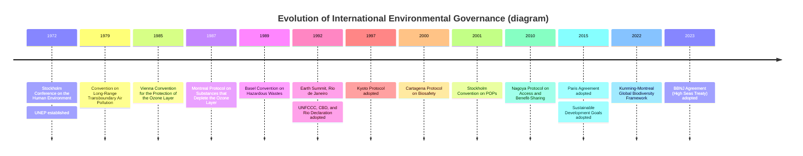
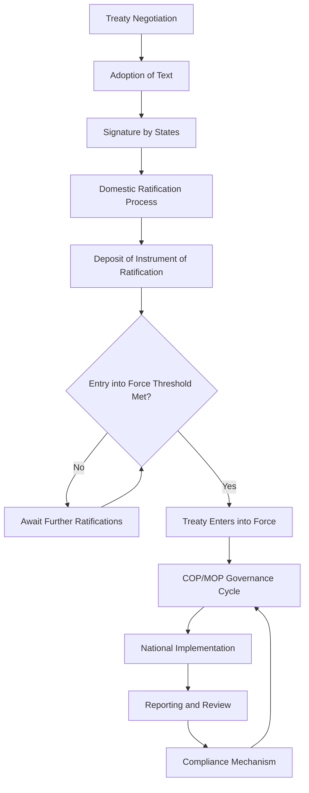

## International Environmental Agreements and Treaties

### Overview

International environmental agreements (IEAs) are legally or politically binding instruments negotiated between states to address transboundary or global environmental problems that no single nation can solve unilaterally. They form the backbone of global environmental governance, translating scientific consensus on issues like climate change, biodiversity loss, and pollution into cooperative commitments, institutions, and compliance mechanisms.

### Foundational Concepts

**Key Points**

- **Treaty**: A formal, legally binding agreement between states or international organizations, governed by international law (specifically the Vienna Convention on the Law of Treaties, 1969).
- **Convention**: Often used interchangeably with "treaty," typically denotes a multilateral agreement open to broad participation (e.g., Convention on Biological Diversity).
- **Protocol**: A subsidiary agreement that adds specific, often more stringent, obligations to a parent convention (e.g., the Kyoto Protocol under the UNFCCC).
- **Declaration**: A non-binding political statement of principles or intent (e.g., the Rio Declaration), often preceding binding instruments.
- **Soft law**: Non-binding norms, guidelines, or codes of conduct that influence state behavior without formal legal obligation, frequently serving as a precursor to hard law.
- **State parties**: Countries that have ratified, accepted, approved, or acceded to a treaty, thereby becoming legally bound by it.

### Sources of International Environmental Law

International environmental law derives from several recognized sources under Article 38 of the Statute of the International Court of Justice:

1. **Treaties and conventions** — the primary source, created through explicit negotiation.
2. **Customary international law** — practices so widespread and consistent that they are accepted as legally binding (e.g., the "no-harm principle," obligating states not to cause environmental damage to other states or areas beyond national jurisdiction).
3. **General principles of law** — concepts recognized across legal systems, such as the precautionary principle and polluter-pays principle.
4. **Judicial decisions and scholarly writings** — used as subsidiary means for interpreting law (e.g., rulings from the International Court of Justice or International Tribunal for the Law of the Sea).
5. **Soft law instruments** — declarations, resolutions, and action plans that shape emerging norms.

### Core Guiding Principles

**Key Points**

- **Precautionary principle**: Lack of full scientific certainty should not be used as a reason to postpone cost-effective measures to prevent environmental degradation (Principle 15, Rio Declaration).
- **Polluter-pays principle**: The party responsible for producing pollution should bear the costs of managing it to prevent damage to human health or the environment.
- **Common but differentiated responsibilities (CBDR)**: All states share responsibility for global environmental problems, but developed nations bear greater responsibility due to historical contributions and greater capacity — foundational to the UNFCCC and Paris Agreement.
- **Intergenerational equity**: Present generations must manage resources so as not to compromise the ability of future generations to meet their needs.
- **Sustainable development**: Development that meets present needs without compromising future generations, as articulated in the Brundtland Report (1987) and operationalized through subsequent treaties.
- **State sovereignty vs. shared responsibility**: States retain sovereign rights over their natural resources but bear responsibility for ensuring activities within their jurisdiction do not damage other states' environments or the global commons (Stockholm Declaration, Principle 21).

### Historical Development Timeline

### Major Multilateral Environmental Agreements by Domain

#### Atmosphere and Climate

**Vienna Convention (1985) and Montreal Protocol (1987)**

- Addresses depletion of the stratospheric ozone layer caused by chlorofluorocarbons (CFCs) and related substances.
- The Montreal Protocol is widely regarded as the most successful environmental treaty, achieving near-universal ratification (198 parties) and phasing out over 99% of controlled ozone-depleting substances.
- Employs a **non-compliance mechanism** with a Multilateral Fund to assist developing countries in transitioning to alternatives.
- The **Kigali Amendment (2016)** extended the Protocol to phase down hydrofluorocarbons (HFCs), potent greenhouse gases, linking ozone protection to climate mitigation.

**United Nations Framework Convention on Climate Change (UNFCCC, 1992)**

- Establishes the objective of stabilizing greenhouse gas concentrations to prevent dangerous anthropogenic interference with the climate system.
- Introduces the CBDR principle, distinguishing Annex I (developed) and non-Annex I (developing) countries.
- Governed by an annual **Conference of the Parties (COP)**.

**Kyoto Protocol (1997)**

- First binding instrument to set quantified emission reduction targets, applying only to Annex I countries.
- Introduced flexible mechanisms: **Emissions Trading**, **Clean Development Mechanism (CDM)**, and **Joint Implementation (JI)**.
- Weakened by the non-participation of the United States and exclusion of major emerging emitters from binding targets.

**Paris Agreement (2015)**

- Shifts from top-down binding targets to a bottom-up structure based on **Nationally Determined Contributions (NDCs)**.
- Aims to limit global warming to well below 2°C above pre-industrial levels, pursuing efforts toward 1.5°C.
- Establishes a **global stocktake** every five years to assess collective progress and ratchet ambition.
- Includes provisions for climate finance, technology transfer, and the **Loss and Damage Fund** (operationalized at COP27/COP28).

#### Biodiversity and Species Protection

**Convention on International Trade in Endangered Species (CITES, 1973)**

- Regulates international trade in specimens of wild animals and plants through a permit system.
- Classifies species into three Appendices based on the degree of protection required:
  - Appendix I: Species threatened with extinction; commercial trade generally prohibited.
  - Appendix II: Species not currently threatened but requiring trade controls.
  - Appendix III: Species protected in at least one country that has requested assistance from other parties.

**Convention on Biological Diversity (CBD, 1992)**

- Three main objectives: conservation of biological diversity, sustainable use of its components, and fair and equitable sharing of benefits from genetic resources.
- **Cartagena Protocol on Biosafety (2000)**: governs transboundary movement of living modified organisms (LMOs).
- **Nagoya Protocol (2010)**: establishes access and benefit-sharing (ABS) framework for genetic resources.
- **Kunming-Montreal Global Biodiversity Framework (2022)**: sets the "30x30" target — protecting 30% of terrestrial and marine areas by 2030.

**Ramsar Convention on Wetlands (1971)**

- Provides a framework for the conservation and wise use of wetlands, designating "Wetlands of International Importance" (Ramsar Sites).

**Convention on Migratory Species (CMS/Bonn Convention, 1979)**

- Protects migratory species across their range states, addressing species that cross national boundaries during their lifecycle.

#### Chemicals, Waste, and Hazardous Substances

**Basel Convention (1989)**

- Controls transboundary movements of hazardous wastes and their disposal, aiming to minimize waste generation and prevent dumping in developing countries.
- **Basel Ban Amendment**: prohibits export of hazardous waste from OECD to non-OECD countries.

**Rotterdam Convention (1998)**

- Establishes a **Prior Informed Consent (PIC)** procedure for hazardous chemicals and pesticides in international trade, ensuring importing countries have information to make informed decisions.

**Stockholm Convention on Persistent Organic Pollutants (POPs, 2001)**

- Aims to eliminate or restrict production and use of POPs (e.g., DDT, PCBs, dioxins) due to their toxicity, persistence, and bioaccumulation.

**Minamata Convention on Mercury (2013)**

- Addresses anthropogenic mercury emissions and releases, covering the full lifecycle from mining to waste disposal.

#### Oceans and Marine Environment

**United Nations Convention on the Law of the Sea (UNCLOS, 1982)**

- The "constitution for the oceans," establishing maritime zones (territorial sea, exclusive economic zone, continental shelf, high seas) and governing marine resource use, navigation, and environmental protection.

**MARPOL Convention (1973/1978)**

- International Convention for the Prevention of Pollution from Ships, regulating operational and accidental pollution from vessels.

**BBNJ Agreement / "High Seas Treaty" (2023)**

- Formally the Agreement under UNCLOS on Biodiversity Beyond National Jurisdiction.
- Establishes mechanisms for marine protected areas, environmental impact assessments, and benefit-sharing of marine genetic resources in areas beyond national jurisdiction. [Unverified: entry-into-force status and ratification count should be checked against the latest UN Treaty Collection records, as ratification was ongoing as of the knowledge cutoff.]

#### Desertification and Land Degradation

**United Nations Convention to Combat Desertification (UNCCD, 1994)**

- One of the three "Rio Conventions" (alongside UNFCCC and CBD), addressing land degradation particularly in arid, semi-arid, and dry sub-humid areas.
- Promotes the concept of **Land Degradation Neutrality (LDN)**.

### Institutional Architecture and Governance Mechanisms

**Key Points**

- **Conference/Meeting of the Parties (COP/MOP)**: The supreme decision-making body of a convention, typically meeting annually or biennially to review implementation and adopt decisions.
- **Secretariat**: Administrative body supporting treaty implementation (e.g., UNFCCC Secretariat in Bonn, CBD Secretariat in Montreal).
- **Subsidiary bodies**: Technical and scientific advisory groups (e.g., IPCC for UNFCCC, though IPCC is formally independent; SBSTTA for CBD).
- **Compliance committees**: Mechanisms to assess and address non-compliance, ranging from facilitative (dialogue-based) to enforcement-oriented (sanctions-based).
- **Financial mechanisms**: Dedicated funds to support developing country implementation, such as the **Global Environment Facility (GEF)**, **Green Climate Fund (GCF)**, and **Multilateral Fund** (Montreal Protocol).
- **Monitoring, Reporting, and Verification (MRV)**: Systems requiring parties to report on progress, often reviewed by independent experts or peer review processes.

### Treaty Lifecycle: Negotiation to Enforcement

1. **Negotiation**: Multilateral discussions, often facilitated by a UN body (e.g., UNEP), involving scientific input, diplomatic bargaining, and drafting committees.
2. **Adoption**: Formal acceptance of the treaty text by negotiating parties, typically by consensus or vote.
3. **Signature**: States indicate intent to be bound, though signature alone is generally not legally binding.
4. **Ratification/Accession**: Domestic legal process (often requiring legislative approval) by which a state formally consents to be bound.
5. **Entry into force**: Occurs once a specified threshold of ratifications is met (e.g., the Paris Agreement required 55 parties representing at least 55% of global emissions).
6. **Implementation**: Domestic legislation, policy measures, and institutional arrangements to fulfill treaty obligations.
7. **Compliance and enforcement**: Reporting, peer review, dispute resolution, and in rare cases, trade sanctions or exclusion from mechanisms.

### Compliance and Enforcement Challenges

**Key Points**

- International environmental law generally lacks a centralized enforcement authority comparable to domestic legal systems.
- Most IEAs rely on **facilitative compliance mechanisms** (assistance, capacity-building) rather than punitive sanctions, reflecting the consensus-based nature of international relations.
- **Free-rider problem**: Since environmental benefits (e.g., climate stability) are non-excludable global public goods, states may benefit from others' mitigation efforts without contributing themselves.
- **Naming and shaming**: Public reporting of non-compliance is often the primary enforcement tool, leveraging reputational costs.
- **Trade-related measures**: Some treaties (e.g., CITES, Montreal Protocol) permit trade restrictions against non-complying or non-party states as an enforcement lever.
- **Dispute resolution**: Available through bodies like the International Court of Justice, International Tribunal for the Law of the Sea, or treaty-specific arbitration panels, though invoked infrequently due to political sensitivities.

### Comparative Analysis of Major Frameworks

| Agreement | Year | Domain | Binding Nature | Key Mechanism |
| --- | --- | --- | --- | --- |
| Montreal Protocol | 1987 | Ozone layer | Legally binding | Phase-out schedules, trade sanctions |
| UNFCCC | 1992 | Climate | Framework (binding); targets vary | COP negotiations, NDCs (post-2015) |
| Kyoto Protocol | 1997 | Climate | Legally binding targets | Emissions trading, CDM, JI |
| Paris Agreement | 2015 | Climate | Binding process, non-binding targets | NDCs, global stocktake |
| CBD | 1992 | Biodiversity | Legally binding framework | National biodiversity strategies |
| CITES | 1973 | Species trade | Legally binding | Permit system, Appendices |
| Basel Convention | 1989 | Hazardous waste | Legally binding | PIC-like notification, Ban Amendment |
| UNCLOS | 1982 | Oceans | Legally binding | Maritime zones, dispute tribunals |

### Diagram: Treaty Hierarchy and Relationships

<svg xmlns="http://www.w3.org/2000/svg" viewBox="0 0 900 520" font-family="Arial, sans-serif">
<text x="450" y="30" font-size="20" font-weight="bold" text-anchor="middle" fill="#1a1a1a">Rio Conventions and Related Protocols (svg_diagram)</text>
<rect x="30" y="70" width="250" height="60" rx="8" fill="#cfe8ff" stroke="#2b6cb0" stroke-width="2" />
<text x="155" y="95" font-size="14" font-weight="bold" text-anchor="middle" fill="#1a1a1a">UNFCCC (1992)</text>
<text x="155" y="115" font-size="12" text-anchor="middle" fill="#333">Climate Change</text>
<rect x="325" y="70" width="250" height="60" rx="8" fill="#d4f7d4" stroke="#2f855a" stroke-width="2" />
<text x="450" y="95" font-size="14" font-weight="bold" text-anchor="middle" fill="#1a1a1a">CBD (1992)</text>
<text x="450" y="115" font-size="12" text-anchor="middle" fill="#333">Biological Diversity</text>
<rect x="620" y="70" width="250" height="60" rx="8" fill="#ffe8cc" stroke="#c05621" stroke-width="2" />
<text x="745" y="95" font-size="14" font-weight="bold" text-anchor="middle" fill="#1a1a1a">UNCCD (1994)</text>
<text x="745" y="115" font-size="12" text-anchor="middle" fill="#333">Desertification</text>
<line x1="155" y1="130" x2="155" y2="180" stroke="#2b6cb0" stroke-width="2" />
<rect x="30" y="180" width="250" height="55" rx="8" fill="#e8f2ff" stroke="#2b6cb0" stroke-width="1.5" />
<text x="155" y="203" font-size="13" font-weight="bold" text-anchor="middle" fill="#1a1a1a">Kyoto Protocol (1997)</text>
<text x="155" y="220" font-size="11" text-anchor="middle" fill="#333">Binding emission targets</text>
<line x1="155" y1="235" x2="155" y2="285" stroke="#2b6cb0" stroke-width="2" />
<rect x="30" y="285" width="250" height="55" rx="8" fill="#e8f2ff" stroke="#2b6cb0" stroke-width="1.5" />
<text x="155" y="308" font-size="13" font-weight="bold" text-anchor="middle" fill="#1a1a1a">Paris Agreement (2015)</text>
<text x="155" y="325" font-size="11" text-anchor="middle" fill="#333">NDCs, global stocktake</text>
<line x1="450" y1="130" x2="450" y2="180" stroke="#2f855a" stroke-width="2" />
<rect x="325" y="180" width="250" height="55" rx="8" fill="#e9f9e9" stroke="#2f855a" stroke-width="1.5" />
<text x="450" y="203" font-size="13" font-weight="bold" text-anchor="middle" fill="#1a1a1a">Cartagena Protocol (2000)</text>
<text x="450" y="220" font-size="11" text-anchor="middle" fill="#333">Biosafety / LMOs</text>
<line x1="450" y1="235" x2="450" y2="285" stroke="#2f855a" stroke-width="2" />
<rect x="325" y="285" width="250" height="55" rx="8" fill="#e9f9e9" stroke="#2f855a" stroke-width="1.5" />
<text x="450" y="308" font-size="13" font-weight="bold" text-anchor="middle" fill="#1a1a1a">Nagoya Protocol (2010)</text>
<text x="450" y="325" font-size="11" text-anchor="middle" fill="#333">Access &amp; benefit-sharing</text>
<line x1="745" y1="130" x2="745" y2="235" stroke="#c05621" stroke-width="2" />
<rect x="620" y="235" width="250" height="55" rx="8" fill="#fff3e0" stroke="#c05621" stroke-width="1.5" />
<text x="745" y="258" font-size="13" font-weight="bold" text-anchor="middle" fill="#1a1a1a">Land Degradation Neutrality</text>
<text x="745" y="275" font-size="11" text-anchor="middle" fill="#333">National targets framework</text>
<rect x="30" y="380" width="840" height="100" rx="8" fill="#f7f7f7" stroke="#888" stroke-width="1.5" stroke-dasharray="5,3" />
<text x="450" y="405" font-size="13" font-weight="bold" text-anchor="middle" fill="#1a1a1a">Common Institutional Support</text>
<text x="450" y="428" font-size="12" text-anchor="middle" fill="#333">Global Environment Facility (GEF) — primary financial mechanism for all three Rio Conventions</text>
<text x="450" y="448" font-size="12" text-anchor="middle" fill="#333">UN Environment Programme (UNEP) — secretariat and coordination support</text>
<text x="450" y="468" font-size="12" text-anchor="middle" fill="#333">Conference of the Parties (COP) — governance structure common to all three</text>
</svg>

### Worked Example: Analyzing a Treaty's Effectiveness

**Example**

Consider evaluating the **Montreal Protocol** using a standard treaty-effectiveness framework:

1. **Problem definition**: Stratospheric ozone depletion from CFCs, halons, and related compounds, driven by robust scientific consensus (the 1985 discovery of the Antarctic ozone hole).
2. **Institutional design**: Built-in flexibility through periodic "Adjustments" (allowing acceleration of phase-out schedules without full ratification) and "Amendments" (adding new controlled substances, requiring ratification).
3. **Differentiated obligations**: Developing countries (Article 5 parties) received a grace period and financial/technical assistance via the Multilateral Fund.
4. **Compliance mechanism**: A non-adversarial Implementation Committee reviews data reported by parties; persistent non-compliance can lead to suspension of specific treaty privileges.
5. **Outcome measurement**: Atmospheric monitoring data show declining concentrations of ozone-depleting substances, with the ozone layer on a projected recovery path by mid-century. [Inference: precise recovery timelines depend on continued full compliance and are subject to periodic scientific reassessment by the Scientific Assessment Panel.]

This case illustrates why the Protocol is frequently cited as a governance model: clear scientific basis, adaptable legal architecture, dedicated financing, and a non-punitive compliance system.

### Common Critiques and Limitations

**Key Points**

- **Sovereignty constraints**: Treaties cannot override domestic law without national ratification and implementing legislation, creating gaps between international commitments and domestic enforcement.
- **Lowest common denominator outcomes**: Consensus-based negotiation often produces weaker commitments than science recommends, as seen in critiques of the Paris Agreement's non-binding NDCs.
- **Fragmentation**: Overlapping mandates among conventions (e.g., climate change intersecting with biodiversity and land degradation) can create coordination challenges and duplicated reporting burdens.
- **North-South tensions**: Disputes over historical responsibility, finance, and technology transfer persist, particularly regarding loss and damage funding and differentiated obligations.
- **Verification gaps**: Self-reported data under many MRV systems can lack independent verification, particularly in countries with limited technical capacity.
- **Ratification lag**: Treaties may take years or decades to reach entry-into-force thresholds, delaying practical impact (e.g., UNCLOS took 12 years to enter into force after adoption).

### Emerging and Evolving Frameworks

- **BBNJ Agreement (High Seas Treaty)**: Extends biodiversity governance to the roughly two-thirds of the ocean beyond national jurisdiction, filling a long-recognized gap in UNCLOS.
- **Plastics Treaty negotiations**: Ongoing negotiations under UNEA (UN Environment Assembly) toward a legally binding instrument to end plastic pollution across its full lifecycle. [Unverified: final treaty text and adoption status should be confirmed against current UNEP/INC negotiation records, as this process was still ongoing as of the knowledge cutoff.]
- **Loss and Damage Fund**: Operationalized under the UNFCCC/Paris framework to address climate impacts in vulnerable countries that exceed adaptation capacity.
- **Climate litigation and advisory opinions**: Growing role of international courts (e.g., ICJ advisory opinions, ITLOS) in clarifying state obligations under existing treaties and customary law.

### Related Topics

- Environmental Impact Assessment (EIA) frameworks and transboundary EIA requirements
- National implementation of international environmental law (domestic legislation and enforcement)
- Climate finance mechanisms (Green Climate Fund, Adaptation Fund, carbon markets)
- The Sustainable Development Goals (SDGs) and their linkage to environmental treaties
- Environmental justice and equity in international negotiations
- Role of non-state actors (NGOs, corporations, subnational governments) in global environmental governance
- Trade and environment linkages (WTO rules vs. multilateral environmental agreements)
- Regional environmental agreements (e.g., EU environmental directives, ASEAN Agreement on Transboundary Haze Pollution)