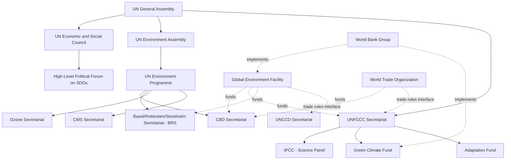

## Global Environmental Governance Institutions

### Overview

Global environmental governance institutions are the organizational architecture through which the international community coordinates environmental policy, science, finance, and law. Unlike a single world environmental government, this architecture is polycentric — composed of UN bodies, treaty secretariats, financial mechanisms, scientific panels, and hybrid public-private institutions that interact, overlap, and sometimes compete for mandate and resources.

### Conceptual Framework: What Constitutes "Governance"

**Key Points**

- **Institutions** are formal organizations (e.g., UNEP) as well as the rules, norms, and decision-making procedures that structure state behavior.
- **Governance architecture** refers to the overall structure of institutions, treaties, and actors addressing a given issue area (e.g., the "climate governance architecture" includes UNFCCC, IPCC, GCF, and national agencies together).
- **Polycentricity**: Environmental governance is deliberately or organically distributed across multiple centers of authority at global, regional, national, and local scales, rather than centralized in one body.
- **Regime**: A set of implicit or explicit principles, norms, rules, and decision-making procedures around which actor expectations converge in a given issue area (a foundational concept from international relations theory).
- **Institutional fragmentation**: The proliferation of overlapping bodies with related but distinct mandates, which can create either productive division of labor or costly duplication and conflict.

### Institutional Architecture Map

### Core United Nations Bodies

#### United Nations Environment Programme (UNEP)

- Established in 1972 following the Stockholm Conference, headquartered in Nairobi, Kenya — the first major UN body headquartered in the Global South.
- Functions as the leading global authority on environmental matters, though it is a **programme**, not a specialized agency, meaning it has more limited independent authority and budget compared to bodies like the WHO or ILO.
- Core functions: environmental assessment and monitoring (e.g., the *Global Environment Outlook* reports), policy development, capacity building, and coordination among UN agencies via the **Environment Management Group**.
- Hosts the secretariats of several major conventions (CBD, CMS, Ozone Secretariat, Basel/Rotterdam/Stockholm Conventions).

#### United Nations Environment Assembly (UNEA)

- Established in 2012 (upgraded from the UNEP Governing Council) as the world's highest-level decision-making body on the environment, with universal membership of all 193 UN member states.
- Meets biennially in Nairobi to set the global environmental policy agenda and adopt resolutions guiding UNEP's work.
- Notable outcome: the 2022 resolution launching negotiations for a legally binding global plastics treaty.

#### UN Framework Convention on Climate Change Secretariat

- Administers the UNFCCC, Kyoto Protocol, and Paris Agreement; organizes the annual **Conference of the Parties (COP)**.
- Distinct from UNEP in institutional lineage, reflecting the political weight given to climate change as a standalone governance track since 1992.

#### Economic and Social Council (ECOSOC) and the High-Level Political Forum (HLPF)

- ECOSOC coordinates the economic, social, and environmental work of the UN system.
- The HLPF, meeting under ECOSOC's auspices, is the central UN platform for follow-up and review of the 2030 Agenda and Sustainable Development Goals, including environment-related SDGs (6, 7, 11, 12, 13, 14, 15).

### Scientific Assessment Bodies

**Key Points**

- **Intergovernmental Panel on Climate Change (IPCC)**: Established in 1988 by UNEP and the World Meteorological Organization (WMO); does not conduct original research but synthesizes and assesses peer-reviewed climate science through periodic Assessment Reports (AR) and Special Reports, subject to line-by-line government approval of Summaries for Policymakers.
- **Intergovernmental Science-Policy Platform on Biodiversity and Ecosystem Services (IPBES)**: Established in 2012 as the biodiversity analog to the IPCC, producing global and thematic assessments on biodiversity loss and ecosystem services.
- **Scientific and Technical Advisory Panels**: Most conventions maintain dedicated technical bodies (e.g., CBD's Subsidiary Body on Scientific, Technical and Technological Advice — SBSTTA; the Montreal Protocol's Scientific, Environmental Effects, and Technology and Economic Assessment Panels).
- These bodies exemplify the **boundary organization** model, mediating between scientific expertise and political negotiation while maintaining credibility with both communities.

### Financial Mechanisms

#### Global Environment Facility (GEF)

- Established in 1991, serving as the financial mechanism for multiple conventions simultaneously (UNFCCC, CBD, UNCCD, Stockholm Convention, Minamata Convention).
- Operates on a replenishment cycle (typically four years) funded by donor countries, disbursing grants and concessional financing through implementing agencies (World Bank, UNDP, UNEP, regional development banks).
- Uses an **incremental cost** principle: funding covers the additional cost of achieving global environmental benefits beyond what a country would otherwise spend for national development purposes.

#### Green Climate Fund (GCF)

- Established in 2010 under the UNFCCC, operational since 2014, headquartered in Songdo, South Korea.
- The largest dedicated climate fund, supporting both mitigation and adaptation projects in developing countries with a target of balanced allocation between the two.
- Governed by a Board with equal representation from developed and developing countries — a notable departure from the donor-weighted governance of institutions like the World Bank.

#### Adaptation Fund and Loss and Damage Fund

- The **Adaptation Fund** (established under the Kyoto Protocol) finances concrete adaptation projects, historically funded in part by a levy on Clean Development Mechanism credits.
- The **Loss and Damage Fund**, operationalized following COP27/COP28 decisions, addresses irreversible climate impacts in vulnerable nations that exceed adaptation limits, marking a significant institutional innovation in climate finance architecture.

### Regional and Cross-Cutting Institutions

**Key Points**

- **Regional Seas Programmes** (UNEP-coordinated): Frameworks such as the Mediterranean Action Plan (Barcelona Convention) and Caribbean Environment Programme address shared marine environments through regional conventions and action plans.
- **Regional economic and political bodies**: The European Union operates one of the most developed supranational environmental legal systems, with directly binding directives and regulations (e.g., the EU Emissions Trading System, REACH chemicals regulation).
- **Multilateral development banks**: The World Bank, Asian Development Bank, and others increasingly integrate environmental safeguards and climate finance into lending operations, functioning as de facto environmental governance actors.
- **World Trade Organization (WTO)**: Not an environmental body, but its rules on trade-related environmental measures (e.g., Article XX exceptions of GATT) create an important interface and occasional tension with multilateral environmental agreements.
- **International Union for Conservation of Nature (IUCN)**: A unique hybrid membership organization combining government agencies and civil society organizations, producing the authoritative **IUCN Red List of Threatened Species** and providing technical guidance to treaty bodies.

### Institutional Comparison Table

| Institution | Established | Type | Primary Function | Headquarters |
| --- | --- | --- | --- | --- |
| UNEP | 1972 | UN Programme | Coordination, assessment, secretariat hosting | Nairobi, Kenya |
| UNEA | 2012 | UN Governing Body | Highest-level environmental policy decisions | Nairobi, Kenya |
| IPCC | 1988 | Scientific Panel | Climate science assessment | Geneva, Switzerland |
| IPBES | 2012 | Scientific Panel | Biodiversity/ecosystem assessment | Bonn, Germany |
| GEF | 1991 | Financial Mechanism | Multi-convention project financing | Washington, D.C., USA |
| GCF | 2010 | Financial Mechanism | Climate mitigation/adaptation financing | Songdo, South Korea |
| UNFCCC Secretariat | 1992 | Treaty Secretariat | Climate treaty administration | Bonn, Germany |
| IUCN | 1948 | Hybrid Union | Conservation science and standards | Gland, Switzerland |

### Governance Process: How a Global Assessment Shapes Policy

**Example**

Tracing the IPCC's institutional workflow illustrates the science-policy interface in practice:

1. **Scoping**: Governments and scientists jointly agree on the scope of an assessment report at an IPCC Plenary session.
2. **Author nomination and selection**: Governments and observer organizations nominate scientists; the Bureau selects Coordinating Lead Authors, Lead Authors, and Review Editors to ensure geographic and disciplinary balance.
3. **Drafting and review**: Multiple rounds of expert and government review ensure scientific rigor and broad ownership, with authors required to respond to every review comment.
4. **Approval**: The Summary for Policymakers is approved line-by-line by government delegates in a plenary session, while the full underlying report is simply accepted (not altered) — a mechanism designed to preserve scientific integrity while building political buy-in.
5. **Uptake**: Approved findings feed directly into UNFCCC negotiations, national climate policies, and corporate/financial risk disclosure frameworks. [Inference: the degree to which specific policy outcomes are causally attributable to a given IPCC report versus other political drivers is difficult to isolate empirically.]

### Diagram: Financial Flow Architecture

<svg xmlns="http://www.w3.org/2000/svg" viewBox="0 0 900 420" font-family="Arial, sans-serif">
<text x="450" y="30" font-size="20" font-weight="bold" text-anchor="middle" fill="#1a1a1a">Environmental Finance Flow Architecture (svg_diagram)</text>
<rect x="30" y="70" width="220" height="55" rx="8" fill="#cfe8ff" stroke="#2b6cb0" stroke-width="2" />
<text x="140" y="102" font-size="13" font-weight="bold" text-anchor="middle" fill="#1a1a1a">Donor Countries</text>
<line x1="140" y1="125" x2="140" y2="175" stroke="#2b6cb0" stroke-width="2" marker-end="url(#arrow1)" />
<rect x="30" y="175" width="220" height="55" rx="8" fill="#d4f7d4" stroke="#2f855a" stroke-width="2" />
<text x="140" y="207" font-size="13" font-weight="bold" text-anchor="middle" fill="#1a1a1a">GEF Trust Fund</text>
<line x1="140" y1="230" x2="140" y2="280" stroke="#2f855a" stroke-width="2" marker-end="url(#arrow1)" />
<rect x="30" y="280" width="220" height="55" rx="8" fill="#ffe8cc" stroke="#c05621" stroke-width="2" />
<text x="140" y="305" font-size="12" font-weight="bold" text-anchor="middle" fill="#1a1a1a">Implementing Agencies</text>
<text x="140" y="322" font-size="10" text-anchor="middle" fill="#333">World Bank, UNDP, UNEP</text>
<rect x="340" y="70" width="220" height="55" rx="8" fill="#cfe8ff" stroke="#2b6cb0" stroke-width="2" />
<text x="450" y="102" font-size="13" font-weight="bold" text-anchor="middle" fill="#1a1a1a">Developed Country Pledges</text>
<line x1="450" y1="125" x2="450" y2="175" stroke="#2b6cb0" stroke-width="2" marker-end="url(#arrow1)" />
<rect x="340" y="175" width="220" height="55" rx="8" fill="#d4f7d4" stroke="#2f855a" stroke-width="2" />
<text x="450" y="207" font-size="13" font-weight="bold" text-anchor="middle" fill="#1a1a1a">Green Climate Fund</text>
<line x1="450" y1="230" x2="450" y2="280" stroke="#2f855a" stroke-width="2" marker-end="url(#arrow1)" />
<rect x="340" y="280" width="220" height="55" rx="8" fill="#ffe8cc" stroke="#c05621" stroke-width="2" />
<text x="450" y="298" font-size="12" font-weight="bold" text-anchor="middle" fill="#1a1a1a">Accredited Entities</text>
<text x="450" y="315" font-size="10" text-anchor="middle" fill="#333">National + multilateral</text>
<rect x="650" y="70" width="220" height="55" rx="8" fill="#cfe8ff" stroke="#2b6cb0" stroke-width="2" />
<text x="760" y="95" font-size="12" font-weight="bold" text-anchor="middle" fill="#1a1a1a">Voluntary/Assessed</text>
<text x="760" y="112" font-size="12" font-weight="bold" text-anchor="middle" fill="#1a1a1a">Contributions</text>
<line x1="760" y1="125" x2="760" y2="175" stroke="#2b6cb0" stroke-width="2" marker-end="url(#arrow1)" />
<rect x="650" y="175" width="220" height="55" rx="8" fill="#d4f7d4" stroke="#2f855a" stroke-width="2" />
<text x="760" y="200" font-size="12" font-weight="bold" text-anchor="middle" fill="#1a1a1a">Loss and Damage Fund</text>
<line x1="760" y1="230" x2="760" y2="280" stroke="#2f855a" stroke-width="2" marker-end="url(#arrow1)" />
<rect x="650" y="280" width="220" height="55" rx="8" fill="#ffe8cc" stroke="#c05621" stroke-width="2" />
<text x="760" y="298" font-size="12" font-weight="bold" text-anchor="middle" fill="#1a1a1a">Vulnerable Nations</text>
<text x="760" y="315" font-size="10" text-anchor="middle" fill="#333">Direct + intermediated access</text>
<rect x="30" y="360" width="840" height="45" rx="8" fill="#f7f7f7" stroke="#888" stroke-width="1.5" stroke-dasharray="5,3" />
<text x="450" y="387" font-size="12" text-anchor="middle" fill="#333">Common downstream recipients: national governments, NGOs, and project developers in eligible countries</text>
</svg>

### Governance Challenges and Structural Critiques

**Key Points**

- **Weak central authority**: Unlike the World Trade Organization or World Health Organization, no single specialized UN agency has binding authority over environmental matters; proposals for a "World Environment Organization" have been debated for decades without adoption.
- **Coordination costs**: Overlapping mandates among UNEP, convention secretariats, and financial mechanisms require ongoing inter-agency coordination (e.g., through the UN System Chief Executives Board and the Environment Management Group), which can be resource-intensive and imperfect.
- **Resource asymmetry**: Voluntary funding models (as opposed to assessed contributions) leave institutions like UNEP vulnerable to budget volatility based on donor political priorities.
- **Representation and equity**: Developing countries often have fewer technical staff and resources to engage across the growing number of parallel negotiation tracks, raising capacity and equity concerns in effective participation.
- **Accountability gaps**: Financial mechanisms and implementing agencies operate at arm's length from the conventions they serve, creating complex principal-agent relationships and periodic tension over funding priorities and access modalities.
- **Non-state actor integration**: Growing recognition of businesses, cities, and civil society as governance actors (e.g., through initiatives tracked in the UNFCCC's Global Climate Action portal) sits alongside ongoing debate about their formal role in intergovernmental decision-making.

### Reform Proposals and Institutional Evolution

- **UNEP strengthening**: The 2012 Rio+20 outcome (universal membership, secure and increased funding) represented an incremental strengthening short of full specialized-agency status.
- **Streamlining Rio Convention synergies**: Ongoing initiatives seek to align reporting requirements and joint work programs across the UNFCCC, CBD, and UNCCD secretariats to reduce duplication for national governments.
- **One UN environment cluster proposals**: Periodic proposals to consolidate environment-related UN entities have been raised but face political resistance tied to sovereignty and institutional inertia. [Speculation: the likelihood and timeline of major structural consolidation remains contested among governance scholars and is not a settled trajectory.]

### Related Topics

- International Environmental Agreements and Treaties (treaty-specific legal mechanisms)
- Climate finance architecture and carbon market governance
- The Sustainable Development Goals (SDGs) and the 2030 Agenda
- Non-state and subnational climate action (C40 Cities, corporate net-zero pledges)
- Environmental diplomacy and negotiation dynamics at COP meetings
- Comparative environmental governance: EU vs. UN system models
- Science-policy interface theory and boundary organizations