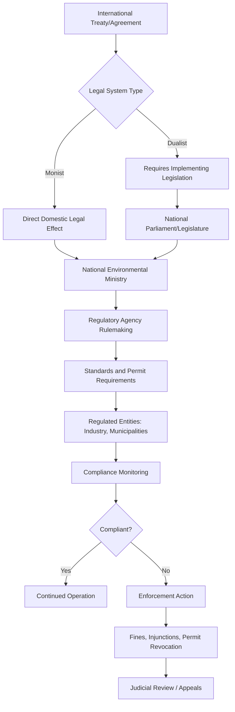

## National and Regional Regulatory Frameworks

### Overview

National and regional regulatory frameworks translate international environmental commitments and domestic policy priorities into enforceable legal instruments. While international environmental agreements establish norms and aspirations, it is domestic law — statutes, regulations, permits, and enforcement agencies — that actually constrains polluting behavior, allocates resources, and creates liability. Regional frameworks (particularly the European Union) occupy an intermediate tier, creating supranational law that binds member states more directly than typical international treaties.

### Conceptual Foundations

**Key Points**

- **Environmental federalism**: The division of regulatory authority between national/central governments and subnational units (states, provinces, municipalities), which varies significantly by country structure.
- **Command-and-control regulation**: Traditional regulatory approach using mandatory standards, permits, and penalties (e.g., technology-based emission limits).
- **Market-based instruments**: Regulatory tools that use price signals or tradable rights to achieve environmental goals more cost-effectively (e.g., cap-and-trade systems, carbon taxes, tradable permits).
- **Direct effect and supremacy** (EU-specific): Legal doctrines under which EU regulations apply directly in member states and EU law takes precedence over conflicting national law.
- **Dualist vs. monist legal systems**: In dualist systems (e.g., UK, many Commonwealth countries), international treaties require domestic implementing legislation to have legal effect; in monist systems (e.g., many civil law countries), ratified treaties can have direct domestic legal force.
- **Subsidiarity principle** (EU-specific): Decisions should be made at the most local level capable of effectively addressing the issue, with EU-level action reserved for matters better addressed collectively.

### Regulatory Architecture: From International Norm to Domestic Enforcement

### United States Regulatory Framework

#### Foundational Statutes

- **National Environmental Policy Act (NEPA, 1969)**: Requires federal agencies to assess environmental impacts of major actions through Environmental Assessments (EAs) or Environmental Impact Statements (EIS) before proceeding — a procedural rather than substantive requirement.
- **Clean Air Act (CAA, 1970, major amendments 1977 and 1990)**: Establishes National Ambient Air Quality Standards (NAAQS) for criteria pollutants, requires State Implementation Plans (SIPs), and regulates hazardous air pollutants and mobile source emissions.
- **Clean Water Act (CWA, 1972)**: Regulates discharge of pollutants into "waters of the United States" through the National Pollutant Discharge Elimination System (NPDES) permitting program.
- **Resource Conservation and Recovery Act (RCRA, 1976)**: Governs hazardous waste management "from cradle to grave."
- **Comprehensive Environmental Response, Compensation, and Liability Act (CERCLA/"Superfund," 1980)**: Establishes liability for cleanup of contaminated sites, including retroactive and strict liability for potentially responsible parties.
- **Endangered Species Act (ESA, 1973)**: Provides for listing and protection of threatened and endangered species and their critical habitat.
- **Toxic Substances Control Act (TSCA, 1976, amended 2016)**: Regulates the manufacture, use, and disposal of chemical substances.

#### Institutional Structure

- **Environmental Protection Agency (EPA)**: Established in 1970 as an independent federal agency (not a Cabinet department) responsible for rulemaking and enforcement under most major federal environmental statutes.
- **Federalism in practice**: The CAA and CWA operate on a "cooperative federalism" model — federal law sets minimum standards, but states can adopt more stringent requirements and typically administer permitting programs under EPA-approved state plans.
- **Judicial review**: Federal courts, particularly the D.C. Circuit Court of Appeals, play a significant role in reviewing EPA rulemaking, with the Supreme Court periodically addressing the scope of agency authority. [Unverified: the precise current scope of judicial deference doctrines applicable to environmental agency rulemaking should be checked against the most recent Supreme Court jurisprudence, as this area has seen significant doctrinal shifts.]

### European Union Regulatory Framework

#### Legal Instrument Types

- **Regulations**: Directly applicable and binding in their entirety across all member states without requiring national transposition (e.g., REACH Regulation, EU Emissions Trading System framework).
- **Directives**: Binding as to the result to be achieved, but member states retain discretion over the form and method of implementation through national transposition legislation, typically within a specified deadline (e.g., the Water Framework Directive, Habitats Directive).
- **Decisions**: Binding only on those to whom they are addressed (specific states, companies, or individuals).

#### Key Frameworks

- **EU Emissions Trading System (EU ETS)**: The world's first major carbon cap-and-trade system, established in 2005, covering power generation, industrial installations, and (increasingly) aviation and maritime transport; operates on a declining emissions cap with tradable allowances.
- **REACH Regulation (Registration, Evaluation, Authorisation and Restriction of Chemicals, 2006)**: Places the burden of proof on manufacturers and importers to demonstrate chemical safety before market access, reversing the traditional regulator-must-prove-harm model.
- **Habitats and Birds Directives**: Form the legal basis for the **Natura 2000** network, the largest coordinated network of protected areas in the world.
- **Water Framework Directive (2000)**: Requires member states to achieve "good ecological status" for all water bodies through integrated river basin management planning.
- **European Green Deal (2019) and "Fit for 55" package**: An overarching policy framework targeting climate neutrality by 2050, translated into a suite of binding legislative revisions across energy, transport, and industrial sectors.
- **Corporate Sustainability Reporting Directive (CSRD)**: Mandates detailed environmental, social, and governance (ESG) disclosure for large companies operating in the EU market.

#### Enforcement Mechanisms

- **Infringement procedure**: The European Commission can initiate proceedings against member states failing to transpose or comply with EU environmental law, potentially escalating to the **Court of Justice of the European Union (CJEU)**, which can impose financial penalties for non-compliance.
- **Direct effect doctrine**: Under certain conditions, individuals can invoke EU directive provisions directly before national courts even absent proper national transposition, strengthening practical enforceability.

### Comparative Regulatory Models

| Jurisdiction | Primary Legal Basis | Central Agency | Enforcement Approach | Notable Instrument |
| --- | --- | --- | --- | --- |
| United States | Federal statutes (CAA, CWA, etc.) | EPA + state agencies | Cooperative federalism, permits, litigation | NPDES permitting |
| European Union | Regulations and Directives | European Commission + national authorities | Infringement procedures, CJEU rulings | EU ETS, REACH |
| China | National laws + five-year plans | Ministry of Ecology and Environment | Centralized target-setting, inspections | Ecological "red lines" |
| India | Constitutional provisions + statutes | Central Pollution Control Board + state boards | Permits, National Green Tribunal | Environment Protection Act (1986) |
| Japan | Basic Environment Law + sectoral laws | Ministry of the Environment | Negotiated compliance, guidance | Top Runner energy efficiency program |

### Other National Approaches (Comparative Snapshot)

**Key Points**

- **China**: Combines top-down five-year plan targets with a rapidly strengthened legal framework since the 2014 revision of the Environmental Protection Law; uses "ecological red lines" to designate areas off-limits to development and has implemented a national carbon emissions trading scheme (launched 2021, initially covering the power sector).
- **India**: Operates through a combination of constitutional environmental provisions (Article 48A, 51A(g)), the Environment (Protection) Act 1986, and a specialized **National Green Tribunal** for expeditious environmental dispute resolution, alongside State Pollution Control Boards for implementation.
- **Japan**: Historically pioneered pollution control law following industrial pollution crises (e.g., Minamata disease), and has developed innovative regulatory tools such as the "Top Runner" program, which sets efficiency standards based on the best-performing product in a category.
- **Federal vs. unitary structures**: Federal systems (US, India, Australia, Germany) typically involve constitutionally allocated or negotiated authority between national and subnational governments, while unitary systems (France, Japan) generally centralize environmental lawmaking with administrative delegation to regional offices.

### Regulatory Instrument Design Patterns

**Key Points**

- **Technology-based standards**: Require use of specific pollution control technology or "best available technology" (BAT), providing regulatory certainty but potentially less flexibility for cost-effective compliance.
- **Performance/ambient standards**: Set maximum allowable pollutant concentrations or emission rates, leaving compliance methods to the regulated entity.
- **Permitting systems**: Require facilities to obtain authorization before operating or discharging, embedding specific conditions, monitoring requirements, and reporting obligations (e.g., NPDES permits, EU Industrial Emissions Directive permits).
- **Environmental Impact Assessment (EIA) requirements**: Procedural requirements mandating environmental review before approval of projects likely to have significant environmental effects, present in some form in the large majority of national legal systems.
- **Liability regimes**: Strict liability (no fault required, as under CERCLA) versus fault-based liability regimes affect incentives for precautionary behavior and cleanup cost allocation.
- **Market-based mechanisms**: Cap-and-trade systems, carbon taxes, and tradable development rights internalize environmental costs through price signals rather than prescriptive rules.

### Worked Example: Comparing Command-and-Control vs. Market-Based Regulation

**Example**

Consider regulating sulfur dioxide (SO₂) emissions from power plants using two different regulatory designs:

**Command-and-control approach**: A regulator mandates that every power plant install flue-gas desulfurization ("scrubber") technology achieving a specified removal efficiency, regardless of each plant's marginal abatement cost. This guarantees a technology-defined outcome but can be economically inefficient — a plant with very low-cost abatement options is required to do no more than a plant with very high-cost options.

**Market-based approach (cap-and-trade)**: A regulator sets an aggregate emissions cap and issues tradable allowances (as under the US Acid Rain Program, established under the 1990 Clean Air Act Amendments). Plants with low abatement costs can reduce emissions beyond their allowance and sell surplus credits; plants with high abatement costs can purchase allowances rather than installing expensive controls. The aggregate environmental outcome (the cap) is preserved while total compliance cost is theoretically minimized. [Inference: realized cost savings versus a pure command-and-control counterfactual are estimated through ex-post economic analysis and vary by program design and market conditions, rather than being guaranteed by the mechanism's structure alone.]

This example illustrates why market-based instruments have become increasingly prominent in national and regional frameworks (EU ETS, California's cap-and-trade program, China's national ETS) alongside traditional command-and-control elements, which remain dominant for hazard-based regulation (e.g., toxic substance bans) where price signals are considered inappropriate.

### Diagram: EU Legislative-to-National Implementation Pathway

<svg xmlns="http://www.w3.org/2000/svg" viewBox="0 0 900 380" font-family="Arial, sans-serif">
<text x="450" y="30" font-size="20" font-weight="bold" text-anchor="middle" fill="#1a1a1a">EU Directive Transposition Pathway (svg_diagram)</text>
<rect x="30" y="70" width="200" height="60" rx="8" fill="#cfe8ff" stroke="#2b6cb0" stroke-width="2" />
<text x="130" y="95" font-size="13" font-weight="bold" text-anchor="middle" fill="#1a1a1a">European Commission</text>
<text x="130" y="115" font-size="11" text-anchor="middle" fill="#333">Proposes Directive</text>
<line x1="230" y1="100" x2="290" y2="100" stroke="#2b6cb0" stroke-width="2" marker-end="url(#arrow2)" />
<rect x="290" y="70" width="200" height="60" rx="8" fill="#d4f7d4" stroke="#2f855a" stroke-width="2" />
<text x="390" y="95" font-size="13" font-weight="bold" text-anchor="middle" fill="#1a1a1a">Parliament + Council</text>
<text x="390" y="115" font-size="11" text-anchor="middle" fill="#333">Co-decision adoption</text>
<line x1="490" y1="100" x2="550" y2="100" stroke="#2f855a" stroke-width="2" marker-end="url(#arrow2)" />
<rect x="550" y="70" width="200" height="60" rx="8" fill="#ffe8cc" stroke="#c05621" stroke-width="2" />
<text x="650" y="95" font-size="13" font-weight="bold" text-anchor="middle" fill="#1a1a1a">Directive Adopted</text>
<text x="650" y="115" font-size="11" text-anchor="middle" fill="#333">Transposition deadline set</text>
<line x1="650" y1="130" x2="650" y2="180" stroke="#c05621" stroke-width="2" marker-end="url(#arrow2)" />
<rect x="450" y="180" width="400" height="60" rx="8" fill="#f0e6ff" stroke="#6b46c1" stroke-width="2" />
<text x="650" y="205" font-size="13" font-weight="bold" text-anchor="middle" fill="#1a1a1a">Member State National Legislation</text>
<text x="650" y="225" font-size="11" text-anchor="middle" fill="#333">Transposes directive within deadline</text>
<line x1="450" y1="210" x2="130" y2="210" stroke="#888" stroke-width="2" stroke-dasharray="4,3" />
<line x1="130" y1="210" x2="130" y2="130" stroke="#888" stroke-width="2" stroke-dasharray="4,3" marker-end="url(#arrow3)" />
<text x="290" y="255" font-size="11" text-anchor="middle" fill="#c0392b">If transposition fails or is inadequate</text>
<rect x="30" y="270" width="300" height="60" rx="8" fill="#ffe0e0" stroke="#c0392b" stroke-width="2" />
<text x="180" y="295" font-size="13" font-weight="bold" text-anchor="middle" fill="#1a1a1a">Infringement Procedure</text>
<text x="180" y="315" font-size="11" text-anchor="middle" fill="#333">Commission v. Member State</text>
<line x1="330" y1="300" x2="390" y2="300" stroke="#c0392b" stroke-width="2" marker-end="url(#arrow2)" />
<rect x="390" y="270" width="300" height="60" rx="8" fill="#ffe0e0" stroke="#c0392b" stroke-width="2" />
<text x="540" y="295" font-size="13" font-weight="bold" text-anchor="middle" fill="#1a1a1a">Court of Justice of the EU</text>
<text x="540" y="315" font-size="11" text-anchor="middle" fill="#333">Financial penalties possible</text>
</svg>

### Subnational and Local Regulatory Layers

**Key Points**

- **State/provincial regulation**: In federal systems, subnational governments often adopt standards exceeding federal minimums (e.g., California's vehicle emissions standards under a special Clean Air Act waiver; German Länder implementation of federal environmental framework laws).
- **Municipal ordinances**: Local governments regulate land use, zoning, building codes, and increasingly climate adaptation measures (e.g., urban heat mitigation, stormwater management) within authority delegated or reserved by higher levels of government.
- **Preemption doctrine**: Determines whether subnational regulation can exceed, must match, or is barred from exceeding national standards — a frequently litigated question, particularly in the US context.
- **Polycentric climate action**: Networks such as C40 Cities and the Under2 Coalition enable subnational governments to make and coordinate climate commitments independent of (though often aligned with) national policy.

### Common Regulatory Design Trade-offs

**Key Points**

- **Stringency vs. compliance cost**: Tighter standards generally increase environmental protection but raise compliance costs, which can affect competitiveness and political feasibility.
- **Flexibility vs. certainty**: Market-based and performance-based instruments offer regulatory flexibility but can create monitoring and enforcement complexity compared to prescriptive technology standards.
- **Harmonization vs. local adaptation**: Regional harmonization (as in the EU) reduces trade distortion and regulatory arbitrage but can override locally appropriate solutions; conversely, fragmented national frameworks can create "pollution haven" dynamics where firms relocate to jurisdictions with weaker standards. [Inference: the empirical magnitude of pollution haven effects is contested in the economic literature and varies substantially by sector and study methodology.]
- **Enforcement capacity gaps**: Ambitious legal standards without adequate agency funding, technical capacity, or judicial independence often result in a substantial "implementation gap" between law on paper and law in practice, a persistent challenge particularly (though not exclusively) noted in developing-country regulatory contexts.

### Related Topics

- International Environmental Agreements and Treaties (interface between international and domestic law)
- Environmental Impact Assessment (EIA) methodology and procedural design
- Carbon pricing mechanisms: cap-and-trade systems vs. carbon taxes
- Environmental litigation and judicial review of agency rulemaking
- Corporate environmental compliance and ESG regulatory disclosure requirements
- Environmental federalism and subnational climate policy
- Regulatory takings and property rights in environmental law
- Global Environmental Governance Institutions (international coordination layer)