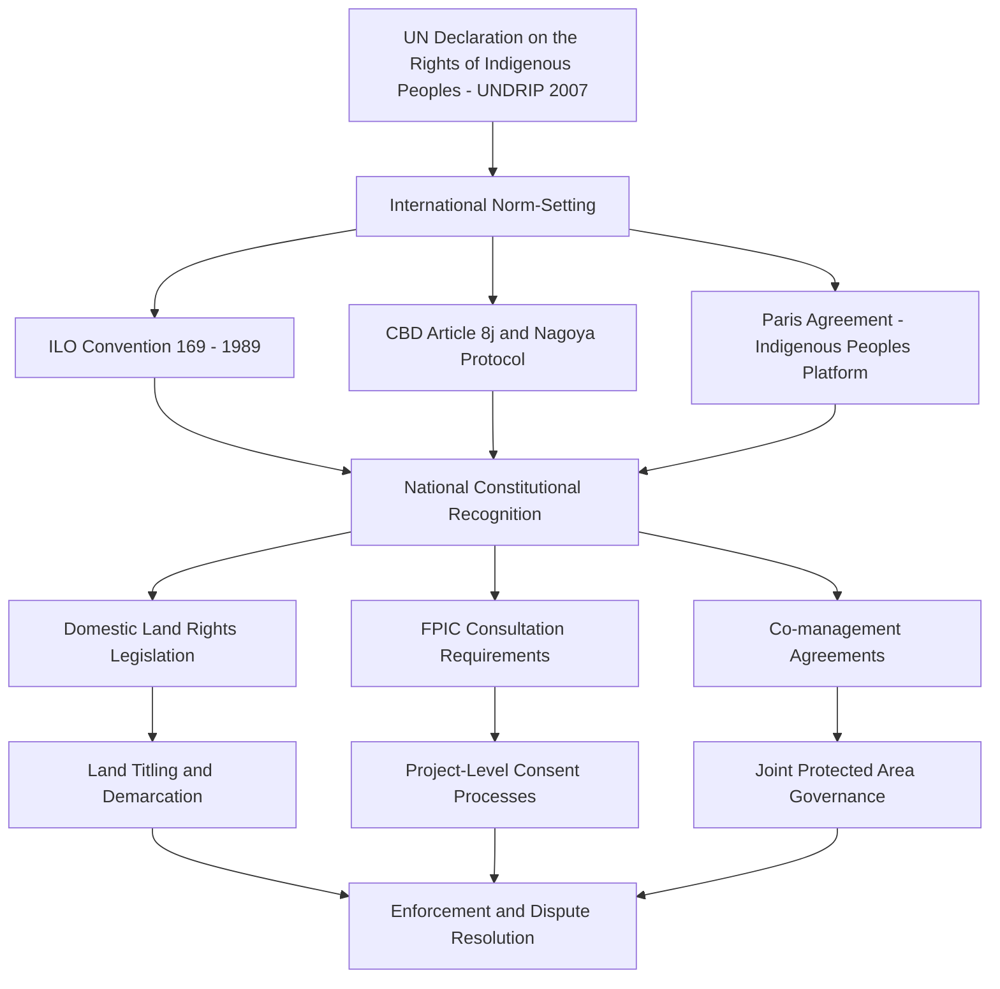

## Indigenous Rights and Traditional Ecological Knowledge

### Overview

Indigenous rights and traditional ecological knowledge (TEK) represent a distinct and increasingly central pillar of environmental policy and governance. This domain addresses the legal recognition of Indigenous peoples' rights to land, resources, and self-determination, alongside growing scientific and institutional recognition that Indigenous knowledge systems — developed and refined over generations of direct ecological observation — provide critical insights for biodiversity conservation, climate adaptation, and sustainable resource management.

### Conceptual Foundations

**Key Points**

- **Traditional Ecological Knowledge (TEK)**: A cumulative body of knowledge, practice, and belief evolving through adaptive processes and handed down through generations, concerning the relationship of living beings (including humans) with one another and their environment.
- **Free, Prior, and Informed Consent (FPIC)**: A specific right recognizing Indigenous peoples' entitlement to give or withhold consent to projects affecting their lands, territories, or resources, obtained without coercion, in advance of authorization, and based on full disclosure of relevant information.
- **Self-determination**: The right of Indigenous peoples to freely determine their political status and pursue their economic, social, and cultural development, recognized as a foundational right underpinning other Indigenous rights claims.
- **Customary land tenure**: Land rights systems based on Indigenous or local community custom and practice, often lacking formal legal title recognition under state property law despite long-standing occupation and use.
- **Biocultural diversity**: The interlinked diversity of biological and cultural systems, reflecting the observation that areas of high biodiversity frequently overlap with areas of high linguistic and cultural diversity, often correlating with Indigenous stewardship.
- **Two-Eyed Seeing (Etuaptmumk)**: A framework, originating from Mi'kmaw Elder Albert Marshall, for weaving together Indigenous and Western scientific ways of knowing in research and management, using the strengths of each rather than subordinating one to the other.

### Legal and Policy Framework

### Key International Instruments

#### UN Declaration on the Rights of Indigenous Peoples (UNDRIP, 2007)

- The most comprehensive international instrument on Indigenous rights, adopted by the UN General Assembly, though as a **declaration** it is not formally binding in the same manner as a ratified treaty.
- Articles 25–29 specifically address the relationship between Indigenous peoples and their lands, territories, and resources, including the right to conservation and protection of the environment.
- Article 32 establishes the requirement for FPIC before approval of projects affecting Indigenous lands or resources.
- Despite non-binding status, UNDRIP has substantially influenced national constitutional reform, judicial interpretation, and corporate due diligence standards.

#### ILO Convention 169 (Indigenous and Tribal Peoples Convention, 1989)

- A legally binding treaty of the International Labour Organization, ratified by a more limited set of states (predominantly in Latin America) compared to UNDRIP's broader normative reach.
- Establishes binding obligations regarding consultation, land rights, and cultural preservation for ratifying states.

#### Convention on Biological Diversity — Article 8(j) and the Nagoya Protocol

- CBD Article 8(j) requires parties to respect, preserve, and maintain the knowledge, innovations, and practices of Indigenous and local communities relevant to biodiversity conservation, subject to their approval and involvement.
- The **Nagoya Protocol (2010)** operationalizes access and benefit-sharing (ABS) for genetic resources and associated traditional knowledge, requiring FPIC and mutually agreed terms for access to community-held knowledge.

#### Paris Agreement and the Local Communities and Indigenous Peoples Platform (LCIPP)

- The Paris Agreement's preamble explicitly references the need to respect, promote, and consider Indigenous peoples' rights when taking climate action.
- The **LCIPP**, established at COP23 (2017), formalizes a structured mechanism for Indigenous knowledge holders to engage in UNFCCC processes and inform climate policy design.

#### Kunming-Montreal Global Biodiversity Framework (2022)

- Explicitly recognizes the contributions of Indigenous peoples and local communities as custodians of biodiversity and incorporates rights-based language across multiple targets, including the "30x30" area-based conservation target, which requires recognition of Indigenous and traditional territories within counted protected areas.

### Traditional Ecological Knowledge: Domains of Application

**Key Points**

- **Fire management**: Indigenous cultural burning practices (e.g., Aboriginal Australian "cool burns," Native American prescribed fire traditions) are increasingly integrated into wildfire risk reduction strategies, informed by generations of fine-scale observation of fuel loads, seasonal timing, and landscape response.
- **Wildlife and fisheries management**: TEK-based indicators (animal behavior, phenological timing, population cues) often provide fine-grained, long-term local data that complements or fills gaps in formal scientific monitoring, particularly in remote or historically under-studied regions.
- **Climate adaptation and early warning**: Indigenous seasonal calendars and environmental indicator systems (e.g., Arctic Indigenous observations of sea ice conditions, Pacific Islander wave and star navigation knowledge) provide localized adaptive capacity that complements downscaled climate models.
- **Agrobiodiversity and seed systems**: Traditional agricultural knowledge maintains crop genetic diversity and resilience (e.g., Andean potato diversity management, traditional swidden/rotational agriculture systems) that underpins food security and adaptive capacity.
- **Ethnobotany and medicine**: Indigenous knowledge of plant properties has historically informed and continues to inform pharmaceutical research and biodiversity bioprospecting, raising direct benefit-sharing considerations under the Nagoya Protocol.

### Land Tenure and Conservation Outcomes

**Key Points**

- **Indigenous and Community Conserved Areas (ICCAs)**: Territories and areas conserved by Indigenous peoples and local communities through customary laws or other effective means, recognized by IUCN and increasingly counted toward international area-based conservation targets.
- **Comparative land management outcomes**: Multiple empirical studies across tropical forest regions have found that deforestation rates are frequently lower in Indigenous-managed or -titled territories compared to adjacent non-Indigenous-managed areas under similar ecological and pressure conditions. [Inference: causal attribution varies by study design and region; some of the observed effect reflects the ecological and geographic characteristics of the specific territories examined, alongside tenure security itself, and results should not be generalized as a universal or fixed quantitative relationship across all contexts.]
- **"Fortress conservation" critique**: Historically dominant conservation models that exclude or displace Indigenous and local communities from protected areas have faced sustained critique for both human rights violations and, in many documented cases, worse conservation outcomes than collaborative or community-led alternatives.
- **Co-management arrangements**: Increasingly common institutional arrangements sharing authority between government conservation agencies and Indigenous governance bodies (e.g., Canada's Indigenous Protected and Conserved Areas, Australia's Indigenous Protected Areas program).

### Comparative National Approaches

| Country/Region | Legal Recognition Mechanism | Notable Institution/Program | Key Feature |
| --- | --- | --- | --- |
| Canada | Constitution Act (1982), Section 35 | Indigenous Protected and Conserved Areas | Treaty rights, land claims agreements |
| Australia | Native Title Act (1993) | Indigenous Protected Areas Program | Native title following *Mabo* decision |
| Bolivia/Ecuador | Constitutional "Rights of Nature" provisions | Plurinational state framework | Constitutional recognition of Pachamama/Nature rights |
| New Zealand | Treaty of Waitangi | Legal personhood for Whanganui River | Rivers/natural features granted legal personhood |
| Philippines | Indigenous Peoples' Rights Act (1997) | National Commission on Indigenous Peoples | Ancestral domain title (CADT) |
| Brazil | Constitutional recognition (1988) | FUNAI (National Indian Foundation) | Indigenous territory demarcation process |

### Worked Example: FPIC in Practice

**Example**

Consider a proposed mining project affecting land traditionally used by an Indigenous community, illustrating how FPIC is intended to operate as a governance safeguard:

1. **Free**: Consultation must occur without coercion, manipulation, intimidation, or bribery — the community must be able to say no without facing retaliation or undue pressure.
2. **Prior**: Consent must be sought sufficiently in advance of project authorization or commencement of activities, before irreversible commitments are made, allowing genuine influence over the outcome rather than post-hoc validation.
3. **Informed**: The community must receive complete, accurate, and accessible information about the project's scope, potential environmental and social impacts, benefits, and risks — often requiring translation, culturally appropriate communication formats, and independent technical assistance.
4. **Consent**: The process must respect the community's own decision-making institutions and customary governance structures, with the possibility of withholding consent — not merely a consultation exercise where objections are noted but do not affect the final decision.

In practice, implementation challenges are well-documented: determining which entity constitutes a legitimate representative of "the community" can be contested, government agencies and companies retain significant power asymmetries in the negotiation process, and legal FPIC requirements vary substantially in stringency and enforceability across jurisdictions — from binding veto rights in some national frameworks to non-binding consultation obligations in others. [Unverified: the specific FPIC standard applicable to a given project depends on the jurisdiction's domestic legal framework and the specific international instruments it has ratified, and should be verified against current national law for any specific case.]

### Diagram: Knowledge Integration Framework

<svg xmlns="http://www.w3.org/2000/svg" viewBox="0 0 900 400" font-family="Arial, sans-serif">
<text x="450" y="30" font-size="20" font-weight="bold" text-anchor="middle" fill="#1a1a1a">Two-Eyed Seeing: Knowledge Integration Model (svg_diagram)</text>
<ellipse cx="320" cy="200" rx="220" ry="140" fill="#cfe8ff" fill-opacity="0.6" stroke="#2b6cb0" stroke-width="2" />
<text x="220" y="120" font-size="14" font-weight="bold" fill="#1a1a1a">Indigenous Knowledge</text>
<text x="220" y="145" font-size="11" fill="#333">Generational observation</text>
<text x="220" y="163" font-size="11" fill="#333">Place-based, holistic</text>
<text x="220" y="181" font-size="11" fill="#333">Oral transmission</text>
<text x="220" y="199" font-size="11" fill="#333">Relational worldview</text>
<ellipse cx="580" cy="200" rx="220" ry="140" fill="#ffe8cc" fill-opacity="0.6" stroke="#c05621" stroke-width="2" />
<text x="620" y="120" font-size="14" font-weight="bold" fill="#1a1a1a">Western Science</text>
<text x="640" y="145" font-size="11" fill="#333">Quantitative measurement</text>
<text x="640" y="163" font-size="11" fill="#333">Peer-reviewed method</text>
<text x="640" y="181" font-size="11" fill="#333">Written documentation</text>
<text x="640" y="199" font-size="11" fill="#333">Reductionist analysis</text>
<rect x="380" y="240" width="140" height="80" rx="10" fill="#d4f7d4" stroke="#2f855a" stroke-width="2" />
<text x="450" y="265" font-size="12" font-weight="bold" text-anchor="middle" fill="#1a1a1a">Integration Zone</text>
<text x="450" y="283" font-size="10" text-anchor="middle" fill="#333">Co-produced</text>
<text x="450" y="298" font-size="10" text-anchor="middle" fill="#333">management</text>
<text x="450" y="313" font-size="10" text-anchor="middle" fill="#333">strategies</text>

<text x="450" y="365" font-size="12" text-anchor="middle" fill="#333" font-style="italic">Neither system subordinated — each contributes distinct, complementary strengths</text>

</svg>

### Governance Challenges and Structural Critiques

**Key Points**

- **Recognition-implementation gap**: Constitutional or legal recognition of Indigenous rights frequently outpaces practical implementation, with demarcation, titling, and enforcement processes often significantly delayed or under-resourced relative to legal entitlements.
- **Extractive industry pressure**: Indigenous territories frequently overlap with areas of high mineral, timber, or hydrocarbon resource value, creating persistent tension between national economic development priorities and Indigenous land rights.
- **Knowledge appropriation concerns**: Historical and ongoing cases of TEK being extracted, published, or commercialized without proper attribution, consent, or benefit-sharing have generated substantial concern within Indigenous communities regarding "biopiracy" and intellectual property protection.
- **Internal community diversity**: Indigenous communities are not monolithic; internal diversity of perspective, generational differences, and varying governance structures mean that engagement processes must avoid assuming a single unified "Indigenous view" exists on any given issue.
- **Data sovereignty**: Growing movement (e.g., the CARE Principles for Indigenous Data Governance — Collective benefit, Authority to control, Responsibility, Ethics) asserting Indigenous peoples' right to govern the collection, ownership, and application of data about their communities, lands, and knowledge.
- **Climate policy tensions**: Some market-based climate mechanisms (e.g., certain REDD+ carbon offset projects) have faced documented criticism for insufficient FPIC processes or inequitable benefit distribution, prompting safeguards development within international climate finance frameworks.

### Emerging Developments

- **Rights of Nature movement**: Legal recognition of ecosystems (rivers, forests, mountains) as rights-bearing entities, often directly informed by Indigenous cosmologies and worldviews (e.g., New Zealand's Whanganui River, Ecuador's constitutional Rights of Nature provisions, India's since-modified Ganges River personhood ruling).
- **IPCC and IPBES formal knowledge integration**: Recent assessment cycles of both bodies have increasingly incorporated dedicated chapters, expert contributions, and methodological guidance for integrating Indigenous and local knowledge alongside conventional scientific literature.
- **Corporate due diligence standards**: Growing integration of FPIC and Indigenous rights due diligence into voluntary and mandatory corporate sustainability frameworks, supply chain standards, and development finance safeguards policies.
- **Indigenous-led conservation finance**: Emerging mechanisms directing climate and biodiversity finance more directly to Indigenous-led organizations and territories, responding to long-standing critiques that intermediary-heavy funding channels capture a disproportionate share of resources before reaching frontline communities. [Inference: the scale and effectiveness of this shift in practice is an active area of monitoring and evaluation rather than a settled outcome.]

### Related Topics

- International Environmental Agreements and Treaties (CBD, Nagoya Protocol legal mechanisms)
- Global Environmental Governance Institutions (LCIPP, IPBES knowledge integration)
- Protected area management and biodiversity conservation planning
- Environmental justice and equity in policy design
- Rights of Nature and legal personhood for ecosystems
- Community-based natural resource management
- REDD+ and forest carbon finance safeguards