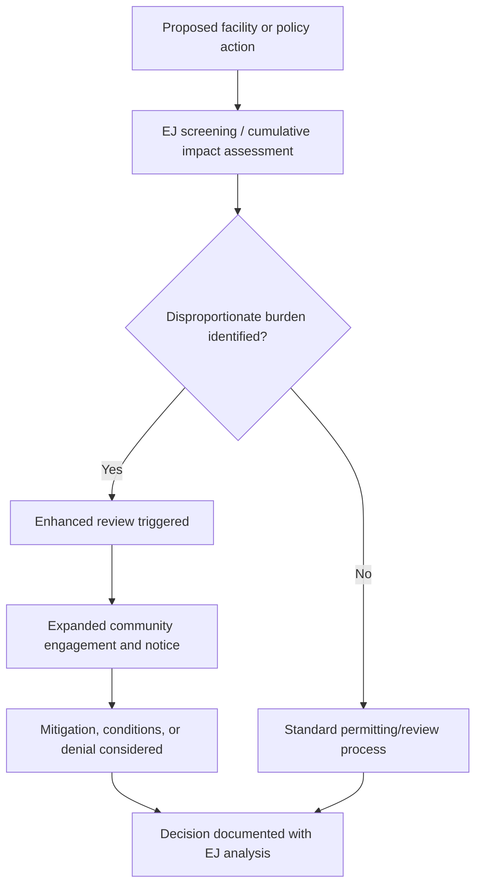

## Environmental Justice and Policy Equity

### Definition and Core Concept

Environmental justice (EJ) is the principle that all people, regardless of race, ethnicity, income, national origin, or Indigenous status, are entitled to fair treatment and meaningful involvement in the development, implementation, and enforcement of environmental laws, regulations, and policies. "Fair treatment" means no group should bear a disproportionate share of negative environmental consequences from industrial, governmental, or commercial operations. "Meaningful involvement" means affected communities have real opportunities to participate in decisions that affect their environment and health, their input is genuinely considered, and decision-makers seek out and facilitate that participation.

Policy equity extends this idea into the design of the policy instruments themselves — asking not just whether outcomes are fair, but whether the rules, funding formulas, permitting processes, and enforcement mechanisms are structured in ways that prevent or perpetuate disparities.

### Historical Origins

- **1982, Warren County, North Carolina**: Protests against a PCB landfill sited in a majority-Black, low-income county are widely cited as the catalyst event for the modern EJ movement.
- **1987, "Toxic Wastes and Race in the United States"**: A report by the United Church of Christ's Commission for Racial Justice provided early statistical evidence linking race to the siting of hazardous waste facilities in the US.
- **1991, First National People of Color Environmental Leadership Summit**: Produced the "17 Principles of Environmental Justice," a foundational framework still referenced today.
- **1994, US Executive Order 12898**: Directed federal agencies to identify and address disproportionately high adverse human health or environmental effects of their programs on minority and low-income populations. This remains a cornerstone of US federal EJ policy.

### Key Concepts

**Disproportionate Impact**

Certain populations — often low-income communities and communities of color — experience higher exposure to pollution sources (industrial facilities, highways, waste sites) and correspondingly higher rates of related health effects (asthma, cardiovascular disease, certain cancers), even when accounting for behavioral factors.

**Cumulative Impact**

Communities frequently face multiple overlapping environmental stressors simultaneously (air pollution, water contamination, noise, industrial risk), and policy analysis that evaluates permits one at a time can miss the compounded burden. Cumulative impact assessment attempts to evaluate the aggregate effect of multiple sources and stressors on a single community.

**Procedural Justice**

Focuses on whether affected communities have fair, accessible, and meaningful opportunities to participate in decisions — public hearings held at convenient times/locations, materials translated into relevant languages, adequate notice periods, and genuine responsiveness to input (as opposed to pro forma consultation).

**Distributive Justice**

Concerns the fair allocation of environmental benefits (parks, clean air, safe water infrastructure) and burdens (pollution sources, waste facilities) across populations.

**Recognition Justice**

Concerns whether the distinct histories, knowledge systems, and vulnerabilities of different communities (e.g., Indigenous communities, immigrant communities) are acknowledged and incorporated into policy design, rather than treating all communities as interchangeable.

**Restorative/Corrective Justice**

Addresses how policy should respond to historical or ongoing harms — remediation of contaminated sites, funding directed to historically burdened communities, and accountability mechanisms for responsible parties.

### Policy Mechanisms and Tools

| Tool | Function |
| --- | --- |
| EJ screening tools (e.g., EPA's EJScreen, CalEnviroScreen) | Combine demographic and environmental indicator data to identify and map communities facing combined burdens |
| Cumulative impact permitting requirements | Require regulators to consider existing burden before approving new pollution sources in a given area |
| Community benefit agreements | Legally binding agreements between developers and communities specifying mitigations or benefits tied to a project |
| Targeted infrastructure/remediation funding | Directs a defined share of environmental spending to identified disadvantaged communities (e.g., the US "Justice40" initiative target of 40% of certain federal climate/clean energy investment benefits) |
| Enhanced public participation requirements | Mandated translation services, extended comment periods, community liaison requirements in permitting processes |
| Anti-displacement provisions | Policy safeguards (e.g., in green infrastructure or park investment) intended to prevent environmental improvements from driving up housing costs and displacing existing residents — sometimes called "green gentrification" mitigation |

### Analytical Framework Example

A simplified cumulative burden score used in screening tools can be represented conceptually as:

$$CBI = \sum_{i=1}^{n} w_i \cdot E_i \cdot V_i$$

Where $CBI$ is the cumulative burden index, $E_i$ is the exposure level for stressor $i$, $V_i$ is a vulnerability/sensitivity weighting factor (e.g., reflecting population health baseline or socioeconomic sensitivity), and $w_i$ is a policy-determined weight for stressor $i$. [Inference: this is a generalized conceptual formulation for teaching purposes; actual screening tools such as EJScreen and CalEnviroScreen use their own specific published methodologies and indicator sets, which vary by tool and jurisdiction.]

### Process Flow: How an EJ Concern Typically Enters Policy Decision-Making

### Practical Example

A proposed asphalt plant is sited in a census tract that already hosts two other permitted industrial emitters and has elevated rates of childhood asthma. Under a cumulative-impact-aware permitting framework:

1. The screening tool flags the tract as high-burden based on existing pollution and health indicators.
2. The permitting agency is required to conduct enhanced review rather than standard single-source review.
3. Public hearings are held locally, with translated materials, rather than only at a central agency office.
4. The agency evaluates whether the new source, combined with existing sources, pushes cumulative exposure past a defined threshold.
5. Possible outcomes include permit denial, additional emissions controls as a condition of approval, or an offset requirement (e.g., funding for community air monitoring or health programs).

Without such a framework, the same facility might be evaluated only against ambient air quality standards in isolation, without regard to the existing burden in that specific tract.

### Critiques and Debates

- **Measurement debates**: There is ongoing methodological debate over which indicators (race, income, health outcomes, or composite indices) most validly identify "disadvantaged" communities, and screening tools differ in their weighting choices. [Unverified: the "correct" weighting is a policy and methodological question without universal consensus.]
- **Economic development tension**: Facility siting decisions often carry local job and tax revenue implications, creating tension between EJ objectives and local economic development interests.
- **Legal standing and enforceability**: In the US, EJ claims have historically had a difficult path under some civil rights statutes (e.g., proving discriminatory intent versus disparate impact under certain legal standards), which has shaped how much of EJ policy operates through executive/administrative action rather than direct litigation. [Inference: this reflects a commonly cited pattern in US EJ legal scholarship rather than a single settled rule, since case law and agency practice continue to evolve.]
- **Green gentrification**: Environmental improvements (parks, remediation, transit) can raise property values and indirectly displace the very communities they were meant to benefit, which policy design increasingly tries to anticipate.

### International Dimensions

Environmental justice concepts appear internationally under related framings — e.g., the "polluter pays" principle in EU environmental law, Indigenous rights and free, prior, and informed consent (FPIC) frameworks in resource extraction contexts, and climate justice debates concerning differentiated responsibility between higher-emitting and lower-emitting, more climate-vulnerable nations.

**Related Topics / Next Steps**

- Environmental impact assessment (EIA) processes and their intersection with EJ
- Climate justice and differentiated national responsibility frameworks
- Cumulative risk assessment methodologies
- Environmental racism: historical case studies (e.g., "Cancer Alley," Flint water crisis)
- Green gentrification and anti-displacement policy design
- Indigenous environmental sovereignty and free, prior, and informed consent (FPIC)
- Environmental law enforcement and Title VI civil rights claims (US context)