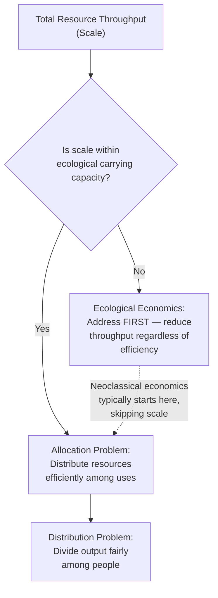

## Ecological Versus Neoclassical Economic Perspectives

### Overview

Environmental economics sits at the intersection of two competing paradigms for understanding how human economies relate to the natural world: **Neoclassical Environmental Economics** and **Ecological Economics**. Both attempt to address environmental degradation, resource scarcity, and sustainability, but they diverge fundamentally in their assumptions about the relationship between the economy and the biosphere, the role of markets, the treatment of natural capital, and the very definition of "value."

### Foundational Worldview Differences

**Neoclassical Economic Perspective**

Neoclassical environmental economics treats the environment as a **subset of the economy** — natural resources and ecosystem services are inputs into production functions, and pollution is an "externality" (a market failure) that can, in principle, be corrected by properly pricing it. The economy is conceptually a circular flow between households and firms, with the environment appearing mainly as a source of raw materials and a sink for waste.

Key assumptions:

- **Substitutability**: Natural capital (forests, fisheries, minerals) can generally be substituted with manufactured or human capital (technology, machinery, knowledge). This is often called **weak sustainability**.
- **Marginalism**: Decisions are evaluated at the margin — the optimal level of pollution or resource extraction is where marginal benefit equals marginal cost, not zero.
- **Anthropocentric utility**: Value derives from human preferences, typically measured through willingness-to-pay (WTP) or willingness-to-accept (WTA).
- **Growth is generally positive**: Continuous economic growth (GDP growth) is compatible with environmental sustainability if decoupling occurs — the idea that pollution/resource use per unit of GDP can decline over time (relative or absolute decoupling).

**Ecological Economic Perspective**

Ecological economics treats the economy as an **open subsystem embedded within, and wholly dependent upon, the finite biosphere**. This is sometimes visualized as concentric circles rather than a circular flow diagram: the economy cannot grow indefinitely inside a materially closed, non-growing planet.

Key assumptions:

- **Non-substitutability (or limited substitutability)**: Certain forms of natural capital (climate stability, biodiversity, the ozone layer) are **critical natural capital** — no amount of manufactured capital can replace them. This underlies **strong sustainability**.
- **Thermodynamic constraints**: Grounded in the laws of thermodynamics (particularly entropy), economic production is understood as a process that transforms low-entropy resources into high-entropy waste; this transformation is irreversible at the scale that matters (Georgescu-Roegen's bioeconomics).
- **Biophysical limits**: The economy must operate within **planetary boundaries** and a sustainable **scale** — a concept largely absent from neoclassical models, which focus on efficient allocation but not the maximum permissible size of the economic subsystem.
- **Ecocentric or biocentric value**: Ecosystems and other species may have intrinsic value independent of human utility, not just instrumental value.

### The Three-Part Framework: Allocation, Distribution, Scale

Ecological economist Herman Daly proposed that any economic system must resolve three separate problems, and argued neoclassical economics only formally addresses one:

1. **Allocation** — How are resources divided among competing uses? (Neoclassical economics excels here — via price mechanisms, markets, and optimization.)
2. **Distribution** — How are resources/income divided among people? (Treated as a matter of ethics/politics in neoclassical theory, addressed via taxation and transfers, not central to efficiency analysis.)
3. **Scale** — What is the total physical size of the economy relative to the containing ecosystem? (Ecological economics considers this the primary, prior question — an economy can be efficiently allocated and equitably distributed while still being ecologically unsustainable in absolute scale.)

### Valuation of Nature

**Neoclassical valuation methods** attempt to express ecosystem value in monetary terms so it can be compared against other goods in a cost-benefit analysis (CBA):

- **Revealed preference methods**: Hedonic pricing (e.g., inferring clean-air value from housing prices), travel cost method (inferring recreational value from expenditure to visit a site).
- **Stated preference methods**: Contingent valuation (survey-based WTP), choice experiments.
- **Production function approaches**: Valuing an ecosystem service (e.g., wetland flood control) by its contribution to downstream economic output.

A common formula in neoclassical CBA is the **Net Present Value (NPV)** of a project, which requires **discounting** future costs and benefits:

$$NPV = \sum_{t=0}^{T} \frac{B_t - C_t}{(1+r)^t}$$

where $B_t$ and $C_t$ are benefits and costs in year $t$, and $r$ is the discount rate. Ecological economists frequently criticize this practice: a positive discount rate systematically undervalues long-term and irreversible harms (e.g., species extinction, climate tipping points), because damages occurring decades from now are mathematically shrunk to near-zero present value.

**Ecological economics** is generally skeptical of full monetization, arguing:

- Many ecosystem functions (climate regulation, genetic diversity, existence value) are **incommensurable** with market goods — they cannot be meaningfully reduced to a single price without losing essential information.
- Preference for **biophysical indicators** alongside or instead of monetary ones: emergy (energy memory) analysis, ecological footprint, material flow accounting, exergy analysis.
- Support for **safe minimum standards** and the **precautionary principle** rather than marginal cost-benefit trade-offs when risks are irreversible or catastrophic.

### Growth, Steady-State, and Degrowth

| Dimension | Neoclassical View | Ecological View |
| --- | --- | --- |
| GDP growth | Generally desirable; can be decoupled from environmental impact via technology/efficiency | Physically limited; decoupling at the scale/speed required is largely unproven ([Inference] — empirical decoupling literature is contested and evolving) |
| Optimal economy size | Determined by market equilibrium; no inherent ceiling | Bounded by planetary boundaries; Daly's **steady-state economy** concept — constant stocks of capital and population maintained at a level within ecological limits |
| Policy prescription | Green growth: carbon pricing, tradable permits, efficiency standards | Degrowth or a-growth: planned reduction in material/energy throughput in high-income economies, alongside redistribution |
| Technology's role | Central — assumed to continually raise resource productivity | Necessary but insufficient alone; subject to the **Jevons Paradox**, where efficiency gains can increase total consumption |

### Core Policy Tools Compared

**Neoclassical policy toolkit** (market-based instruments, aiming for cost-effective allocation):

- **Pigouvian taxes**: A tax set equal to the marginal external cost of an activity (e.g., a carbon tax), internalizing the externality so the private cost equals the social cost.
- **Cap-and-trade / tradable permits**: Government sets a total quantity cap; firms trade permits, and the market finds the cost-minimizing distribution of abatement effort (Coase Theorem logic).
- **Property rights solutions**: Following Ronald Coase, clearly defined and enforceable property rights can allow private bargaining to resolve externalities without government intervention, assuming low transaction costs.

**Ecological economics policy toolkit** (quantity-based, precautionary, and institutional):

- **Cap-based standards set by biophysical limits first**, then let price emerge from the cap (a stricter version of cap-and-trade, prioritizing scale over efficiency).
- **Ecological tax reform**: Shifting taxation from labor/income to resource throughput and pollution.
- **Common property/commons governance**: Drawing on Elinor Ostrom's work on managing shared resources through community institutions rather than only privatization or state control.
- **Moratoria and outright bans** on activities exceeding safe ecological thresholds, rather than merely pricing them.

### Illustrative Example: Valuing a Wetland

**Example**

A 100-hectare wetland is slated for conversion into a shopping complex.

- *Neoclassical approach*: Economists estimate the wetland's value via flood-control services avoided (production function method), recreational fishing (travel cost method), and existence value (contingent valuation survey). These are summed and discounted over 30 years, then compared to the discounted profit stream of the shopping complex. If the complex's NPV exceeds the wetland's NPV, conversion is deemed economically efficient.
- *Ecological approach*: Analysts would first ask whether wetland loss breaches a regional biophysical threshold (e.g., a wetland-area floor for maintaining water table stability and biodiversity corridors). If so, conservation is prioritized as a **safe minimum standard**, regardless of the monetized cost-benefit comparison, because the wetland's hydrological and ecological functions are treated as non-substitutable.

### Common Ground

Despite sharp theoretical divides, the two schools are not entirely opposed in practice:

- Both recognize **market failure** (externalities, public goods, information asymmetry) as a central environmental problem.
- Both support internalizing environmental costs, even if they disagree on method (tax/price vs. cap/standard).
- Many practicing environmental economists blend tools — e.g., using cap-and-trade (an ecologically-informed quantity instrument) alongside cost-benefit analysis (a neoclassical evaluative tool).
- **Ecological-environmental economics** is sometimes used as an umbrella term for this practical convergence, especially in applied policy contexts. [Inference — the degree of convergence varies significantly by institution and researcher; this is a characterization of a diverse field, not a settled taxonomy.]

### Conceptual Diagram: Economy-in-Environment Models

<svg xmlns="http://www.w3.org/2000/svg" viewBox="0 0 640 320">
<text x="320" y="24" text-anchor="middle" font-size="16" font-weight="bold" fill="#1a1a1a">Neoclassical vs. Ecological Economic Models (svg_diagram)</text>

<text x="150" y="55" text-anchor="middle" font-size="13" font-weight="bold" fill="`#2b6cb0`">Neoclassical: Economy-Centric</text>

<rect x="40" y="70" width="220" height="180" rx="10" fill="`#eaf3fb`" stroke="`#2b6cb0`" stroke-width="2" />

<text x="150" y="90" text-anchor="middle" font-size="11" fill="`#2b6cb0`">Environment (input source / sink)</text>

<circle cx="150" cy="170" r="70" fill="`#ffffff`" stroke="`#2b6cb0`" stroke-width="2" />

<text x="150" y="165" text-anchor="middle" font-size="11" fill="`#1a1a1a`">Economy</text>

<text x="150" y="180" text-anchor="middle" font-size="10" fill="`#1a1a1a`">(Households ⇄ Firms)</text>

<path d="M 220 130 A 90 90 0 0 1 150 240" fill="none" stroke="`#2b6cb0`" stroke-width="1.5" marker-end="url(#arrow1)" />

<text x="245" y="115" font-size="9" fill="`#2b6cb0`">resources in</text>

<path d="M 150 240 A 90 90 0 0 1 80 130" fill="none" stroke="`#c53030`" stroke-width="1.5" marker-end="url(#arrow2)" />

<text x="30" y="115" font-size="9" fill="`#c53030`">waste out</text>

<text x="480" y="55" text-anchor="middle" font-size="13" font-weight="bold" fill="`#2f855a`">Ecological: Economy-in-Biosphere</text>

<circle cx="480" cy="170" r="95" fill="`#eafaf1`" stroke="`#2f855a`" stroke-width="2" />

<text x="480" y="90" text-anchor="middle" font-size="10" fill="`#2f855a`">Biosphere (finite, closed to matter)</text>

<circle cx="480" cy="175" r="60" fill="`#fdf6e3`" stroke="`#d69e2e`" stroke-width="2" />

<text x="480" y="145" text-anchor="middle" font-size="9" fill="`#975a16`">Society</text>

<circle cx="480" cy="185" r="30" fill="`#ffffff`" stroke="`#c53030`" stroke-width="2" />

<text x="480" y="189" text-anchor="middle" font-size="9" fill="`#1a1a1a`">Economy</text>

</svg>

### Key Points

- Neoclassical economics treats the environment as a **subset of the economy**, focused on efficient allocation via markets, prices, and marginal analysis; ecological economics treats the economy as a **subset of the biosphere**, bound by biophysical limits (scale).
- **Weak sustainability** (neoclassical) assumes substitutability between natural and manufactured capital; **strong sustainability** (ecological) treats critical natural capital as non-substitutable.
- Daly's tripartite framework — **allocation, distribution, scale** — highlights that neoclassical economics primarily addresses allocation, while ecological economics insists scale must be resolved first.
- Valuation methods differ: neoclassical economics monetizes nature via WTP/WTA and discounted cost-benefit analysis; ecological economics favors biophysical indicators and the precautionary principle for irreversible risks.
- Policy tools diverge in emphasis — Pigouvian taxes and cap-and-trade (price/efficiency-oriented) versus biophysically-set caps, ecological tax reform, and commons governance (limits-oriented).
- The **discount rate** is a key point of contention: standard positive discounting can trivialize long-term environmental damages in NPV calculations.
- Growth debates: "green growth" and decoupling (neoclassical) versus **steady-state economics** and degrowth (ecological), with the **Jevons Paradox** as a shared caution against overreliance on efficiency alone.

### Related Topics

- Externalities and Pigouvian Taxation
- Coase Theorem and Property Rights Solutions
- Planetary Boundaries Framework
- Herman Daly's Steady-State Economics
- Georgescu-Roegen's Entropy Law and Bioeconomics
- Contingent Valuation and Stated Preference Methods
- Ecological Footprint and Material Flow Accounting
- Discounting and Intergenerational Equity
- Strong vs. Weak Sustainability Criteria
- Degrowth and A-Growth Movements
- Elinor Ostrom and Commons Governance
- Cost-Benefit Analysis in Environmental Policy
- Jevons Paradox and Rebound Effects