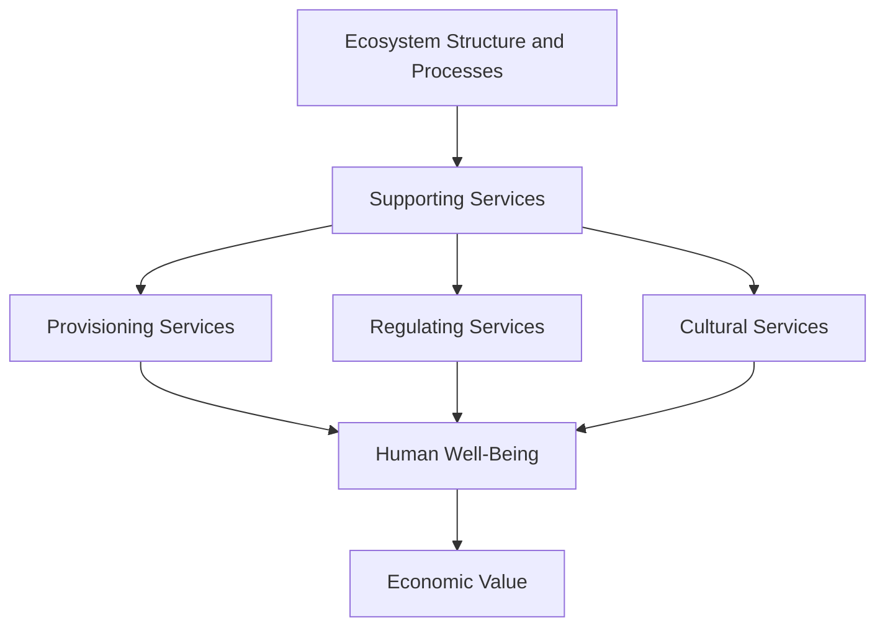
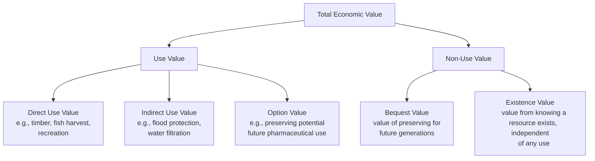

## Valuing Ecosystem Services

### Overview

Ecosystem services are the benefits humans derive, directly or indirectly, from ecosystem functions and processes. Because most of these benefits are not bought and sold in markets, they lack observable prices, creating a systematic risk that they are undervalued or entirely ignored in policy and investment decisions. **Ecosystem service valuation (ESV)** is the set of methods economists and ecologists use to estimate the economic worth of these services — either in monetary terms, or through non-monetary/biophysical metrics — so they can be weighed against conventional market goods in decision-making.

### Classification of Ecosystem Services (MEA Framework)

The Millennium Ecosystem Assessment (MEA, 2005) established the standard four-category typology still widely used today:

1. **Provisioning services** — Tangible products extracted from ecosystems: food, freshwater, timber, fiber, genetic resources, biochemicals/pharmaceuticals.
2. **Regulating services** — Benefits from the regulation of ecosystem processes: climate regulation (carbon sequestration), water purification, flood control, pollination, disease regulation, erosion control.
3. **Cultural services** — Non-material benefits: recreation, ecotourism, aesthetic value, spiritual/religious significance, education and scientific value.
4. **Supporting services** — Underlying processes necessary for producing all other services: nutrient cycling, soil formation, primary production, photosynthesis. (These are often excluded from direct monetary valuation to avoid double-counting, since their value is already captured in the other three categories.)

A related and increasingly used framework is the **Common International Classification of Ecosystem Services (CICES)**, which similarly separates provisioning, regulating & maintenance, and cultural services but with more granular subcategories designed for statistical accounting (notably for the UN's **System of Environmental-Economic Accounting**, SEEA).

### The Total Economic Value Framework

Valuation typically decomposes an ecosystem's worth into a nested hierarchy called **Total Economic Value (TEV)**, distinguishing use values from non-use values:

- **Use values** derive from actual or potential interaction with the ecosystem (consumptive or non-consumptive).
- **Option value** reflects the value of preserving future choice under uncertainty (e.g., an undiscovered medicinal compound in a rainforest plant).
- **Non-use values** (also called **passive use values**) capture value unrelated to any personal use — a person may value the continued existence of coral reefs even if they will never visit one.

### Monetary Valuation Methods

Valuation techniques are generally grouped by whether they infer value from actual market behavior (revealed preference) or from survey responses (stated preference), plus cost-based proxies.

**1. Revealed Preference Methods** (inferred from observed market behavior)

- **Market Price Method**: Uses the market price of a directly traded ecosystem output (e.g., fish catch, timber) as a direct value proxy. Simple but only applies to provisioning services with existing markets.
- **Hedonic Pricing**: Decomposes property or wage differentials to isolate the implicit price of an environmental attribute. For example, regressing house prices on proximity to a park, controlling for other housing characteristics, to estimate the marginal value of green space:

$$P_i = \beta_0 + \beta_1 X_i + \beta_2 E_i + \varepsilon_i$$

where $P_i$ is the property price, $X_i$ is a vector of standard housing characteristics, $E_i$ is the environmental attribute (e.g., distance to park or air quality index), and $\beta_2$ is the estimated implicit price of that environmental attribute.

- **Travel Cost Method (TCM)**: Estimates recreational value of a natural site by treating travel expenditure and time as an implicit "price" of access, then deriving a demand curve for visits. Widely used for parks, lakes, and protected areas.
- **Averting/Defensive Expenditure Method**: Infers value from spending to mitigate environmental harm (e.g., money spent on water filters as a lower-bound estimate of the value of clean water).
- **Production Function Approach (also called Replacement Cost / Damage Cost Avoided variants)**: Values a regulating service by its contribution to a marketed output — e.g., valuing a wetland's water filtration by the cost avoided in downstream water treatment, or valuing mangroves by the reduction in storm damage they provide to coastal property.

**2. Stated Preference Methods** (inferred from hypothetical survey scenarios)

- **Contingent Valuation Method (CVM)**: Directly surveys people about their willingness to pay (WTP) for a specified environmental improvement or willingness to accept (WTA) compensation for its loss, typically via a hypothetical referendum-style question.
- **Choice Experiments (Discrete Choice Modeling)**: Presents respondents with sets of alternatives that vary across several environmental and cost attributes, asking them to choose their preferred option repeatedly; statistical models (e.g., conditional logit) then decompose the implicit value of each attribute.

Stated preference methods are the only approaches capable of capturing **non-use values** (existence, bequest), since these have no behavioral trace in any market. They are, however, susceptible to well-documented biases: hypothetical bias (stated WTP often differs from actual WTP), embedding effects, and strategic response bias.

**3. Cost-Based Methods** (proxies, not true value estimates)

- **Replacement Cost Method**: Estimates value as the cost of replacing the ecosystem service with a human-made substitute (e.g., cost of a water treatment plant as a proxy for a wetland's purification service). [Inference — this method estimates the cost of substitution, not necessarily the true economic value, since it assumes people would actually pay to replace the service if lost, which may not hold.]
- **Restoration Cost Method**: Uses the cost of restoring a degraded ecosystem to its prior state as a value proxy.

**4. Benefit Transfer**

Given the expense and time required for primary valuation studies, **benefit transfer** applies value estimates from an existing study at one site ("study site") to a different but ecologically similar site ("policy site"), often adjusted for income, population, and ecological differences. This is common in large-scale or rapid policy assessments but introduces transfer error, especially over greater ecological or socioeconomic distance between sites.

### Non-Monetary and Biophysical Valuation Approaches

Ecological economists and many ecosystem scientists argue that reducing all ecosystem functions to a single monetary figure is conceptually and practically problematic, given issues of incommensurability, irreversibility, and distributional fairness. Alternative or complementary approaches include:

- **Biophysical accounting**: Measuring services in physical units — tons of carbon sequestered, cubic meters of water filtered, hectares of pollinator habitat — without converting to currency.
- **Multi-Criteria Decision Analysis (MCDA)**: Weighing ecological, social, and economic criteria simultaneously without forcing a single monetary metric, often through stakeholder-informed weighting.
- **Deliberative/Group Valuation**: Facilitated group discussions to arrive at socially negotiated values, treating valuation as a democratic process rather than an aggregation of individual private preferences.
- **Ecosystem Condition/Extent Accounts** (per SEEA Ecosystem Accounting): Tracking the physical extent and condition of ecosystem assets over time as a leading indicator, independent of monetary valuation.

### Landmark Studies and Global Estimates

The field gained major traction with **Costanza et al. (1997)**, which produced one of the first global estimates of the value of the world's ecosystem services and natural capital, generating substantial academic debate over methodology (particularly around aggregation across biomes and extrapolation). A widely cited **updated estimate (Costanza et al., 2014)** revised the global figure and highlighted substantial losses in ecosystem service value due to land-use change between 1997 and 2011. [Unverified — exact dollar figures vary by publication and year and are not restated here numerically, as different sources report different updated ranges; consult the original papers for current cited values.]

The **TEEB initiative (The Economics of Ecosystems and Biodiversity)**, launched in the late 2000s, extended this work into a structured, policy-oriented framework used by governments and international bodies to mainstream ecosystem and biodiversity values into decision-making, including national accounting standards.

### Worked Example: Valuing a Coastal Mangrove Forest

**Example**

A 500-hectare mangrove forest provides multiple services. A combined valuation approach might proceed as follows:

- **Provisioning (fisheries nursery)**: Market price method — estimate the annual fish catch attributable to mangrove-dependent nursery habitat, valued at local market fish prices.
- **Regulating (storm protection)**: Replacement cost / damage cost avoided — estimate the cost of a seawall that would provide equivalent coastal protection, or model avoided property damage from storm surge attenuation using historical storm data.
- **Regulating (carbon sequestration — "blue carbon")**: Multiply estimated tons of $CO_2$ sequestered annually by the prevailing carbon price (e.g., from a voluntary or compliance carbon market) or the **social cost of carbon**.
- **Cultural (ecotourism)**: Travel cost method — survey visitor origin, travel expenditure, and time cost to estimate a recreational demand curve for mangrove tours.
- **Non-use (existence/bequest value)**: Contingent valuation survey of a broader population (including non-visitors) on WTP for mangrove preservation.

The sum of these components (while avoiding double-counting between overlapping services) constitutes an estimate of the mangrove's Total Economic Value, which can then be compared against the NPV of converting the land to aquaculture ponds or coastal development.

### Critiques and Limitations

- **Commensurability problem**: Reducing ecological complexity and intrinsic/cultural value to a single number may misrepresent what is actually at stake, particularly for indigenous or spiritual values that resist monetization.
- **Baseline and non-linearity issues**: Many ecosystem services do not degrade linearly; there can be threshold effects or tipping points where marginal valuation (small incremental loss = small incremental cost) fails to capture catastrophic, non-marginal risk.
- **Distributional blindness**: Aggregate monetary values can obscure who bears costs and who receives benefits — a wealthy population's high WTP for scenery may outweigh a poorer population's dependence on the same land for subsistence, even though the latter's need may be more urgent in welfare terms.
- **Double-counting risk**: Overlap between provisioning, regulating, and cultural service estimates for the same underlying ecological process can inflate aggregate figures if not carefully separated.
- **Commodification critique**: Some scholars (largely aligned with ecological economics and political ecology) argue that market-based valuation frames nature instrumentally and can facilitate its commodification, potentially undermining conservation motivations rooted in non-economic values (a phenomenon sometimes linked to "crowding out" of intrinsic motivation).

### Policy Applications

- **Payments for Ecosystem Services (PES)**: Programs (e.g., Costa Rica's Pagos por Servicios Ambientales) that use valuation estimates to compensate landowners for maintaining service-providing land cover, such as forest conservation for watershed protection.
- **Natural Capital Accounting**: Integrating ecosystem asset values into national accounts (e.g., the UN SEEA framework) to complement or adjust GDP, reflecting depletion of natural capital alongside conventional economic output.
- **Environmental Impact Assessment (EIA) and Cost-Benefit Analysis**: Valuation estimates feed directly into project appraisal, informing whether development projects' benefits exceed their environmental costs.
- **Biodiversity Offsetting and No Net Loss Policies**: Valuation informs the required scale of compensatory habitat restoration or preservation when development unavoidably damages ecosystem services elsewhere.

### Key Points

- Ecosystem services are classified into **provisioning, regulating, cultural, and supporting** categories (MEA) or the more granular **CICES** typology used in formal accounting.
- **Total Economic Value** separates **use value** (direct, indirect, option) from **non-use value** (bequest, existence) — non-use values require stated preference methods to capture.
- **Revealed preference methods** (hedonic pricing, travel cost, production function) infer value from actual market behavior; **stated preference methods** (contingent valuation, choice experiments) use hypothetical surveys and are the only tools capturing non-use value, but carry hypothetical bias risk.
- **Cost-based methods** (replacement cost, restoration cost) are practical proxies but do not necessarily reflect true willingness to pay.
- **Benefit transfer** allows reuse of existing valuation studies at new sites but introduces transfer error.
- Non-monetary approaches (biophysical accounting, MCDA, deliberative valuation) address concerns about commensurability and are increasingly used alongside, or instead of, monetary methods.
- Valuation feeds directly into **Payments for Ecosystem Services**, **natural capital accounting**, and **cost-benefit analysis** for environmental policy and project appraisal.
- Persistent critiques include commensurability, non-linear/threshold ecological dynamics, distributional blindness, double-counting, and commodification concerns.

### Related Topics

- Millennium Ecosystem Assessment and CICES Classification
- Total Economic Value Framework in Depth
- Contingent Valuation Method: Survey Design and Bias
- Payments for Ecosystem Services (PES) Program Design
- Natural Capital Accounting and the UN SEEA Framework
- Social Cost of Carbon and Blue Carbon Markets
- Biodiversity Offsetting and No Net Loss Policy
- Ecological Versus Neoclassical Economic Perspectives (comparative valuation philosophy)
- TEEB Initiative and Global Ecosystem Value Estimates
- Hedonic Pricing and Travel Cost Method: Econometric Specification
- Critiques of Ecosystem Service Commodification