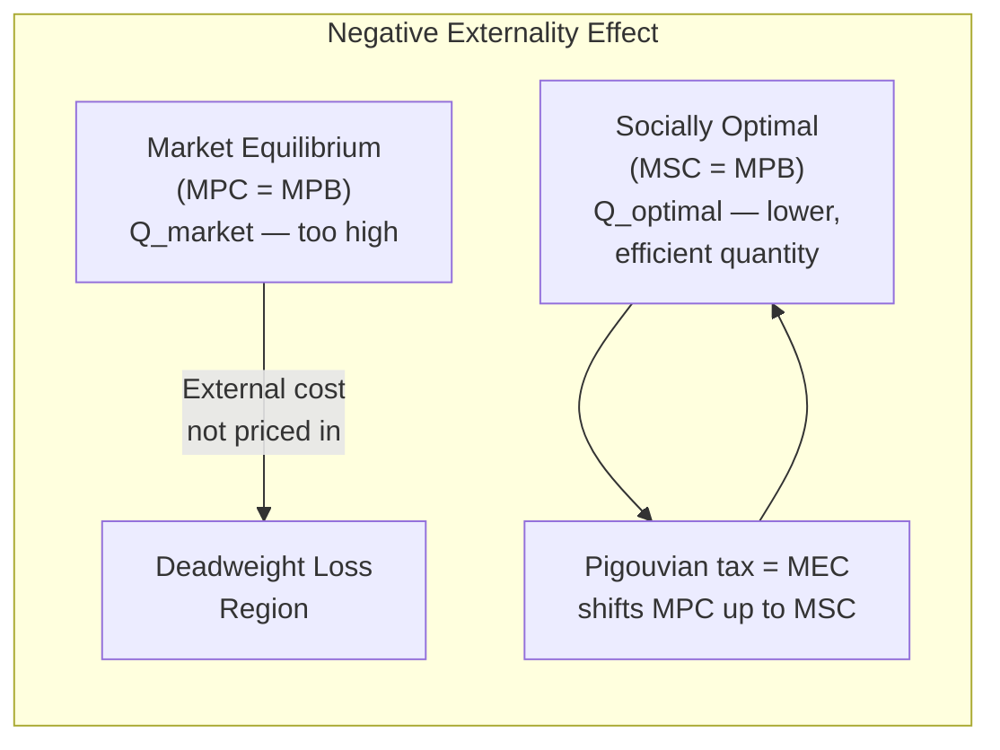
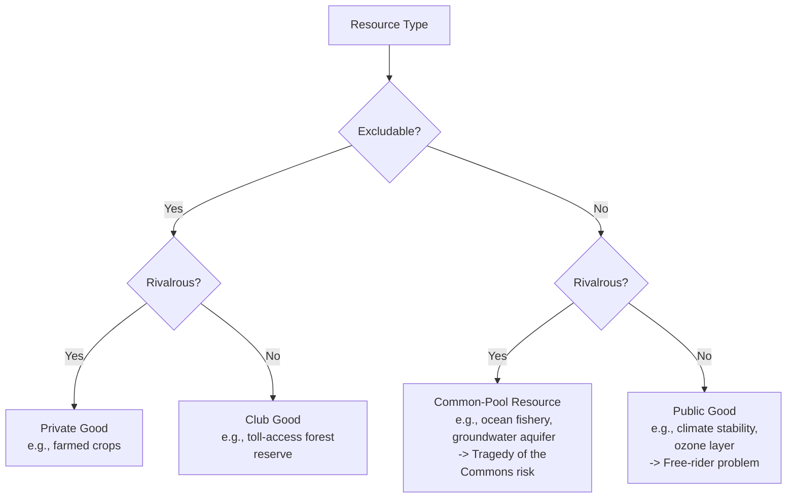

## Externalities and Market Failures

### Overview

Externalities occur when the actions of a producer or consumer impose costs or benefits on third parties who are not party to the underlying market transaction, and those costs or benefits are not reflected in the market price. Because the price signal fails to capture the full social consequences of an economic activity, markets systematically over-produce goods with negative externalities and under-produce goods with positive externalities. This divergence between **private cost/benefit** and **social cost/benefit** is a foundational concept in environmental economics and the primary theoretical justification for most environmental regulation and market-based intervention.

### Defining Externalities

An externality exists whenever:

$$\text{Social Cost (or Benefit)} \neq \text{Private Cost (or Benefit)}$$

More formally, for a **negative externality**:

$$MSC = MPC + MEC$$

where $MSC$ is marginal social cost, $MPC$ is marginal private cost (borne by the producer), and $MEC$ is marginal external cost (borne by third parties, e.g., pollution damage). For a **positive externality**, the equivalent relationship applies to benefits:

$$MSB = MPB + MEB$$

where $MSB$ is marginal social benefit, $MPB$ is marginal private benefit, and $MEB$ is marginal external benefit.

### Types of Externalities

**1. Negative Production Externalities**

A factory emitting sulfur dioxide imposes health and environmental costs on nearby residents not reflected in the factory's production costs or the price of its output. Classic environmental examples: air pollution, water contamination, greenhouse gas emissions, noise pollution, habitat destruction.

**2. Negative Consumption Externalities**

Consumption of a good imposes costs on others — e.g., driving a gasoline vehicle contributes to local air pollution and climate-forcing emissions affecting people who did not purchase the fuel.

**3. Positive Production Externalities**

A beekeeper's hives pollinate a neighboring orchard, increasing the orchard owner's yield without compensation to the beekeeper. Reforestation projects can generate positive externalities via improved regional water cycling and biodiversity spillovers to surrounding land.

**4. Positive Consumption Externalities**

An individual's investment in home insulation or solar panels can reduce local grid strain and air pollution, benefiting neighbors. Vaccination (a public-health rather than strictly environmental example) is the textbook case.

### Graphical Representation: Negative Externality

In a standard supply-and-demand diagram, the **Marginal Private Cost (MPC)** curve represents the supply curve as perceived by producers. When a negative externality exists, the **Marginal Social Cost (MSC)** curve lies above MPC by the amount of the marginal external cost. The market equilibrium (where MPC meets demand/MPB) occurs at a higher quantity $Q_{market}$ than the socially optimal quantity $Q_{optimal}$ (where MSC meets demand), producing a **deadweight loss** — the shaded triangle representing the excess social cost of overproduction.

<svg xmlns="http://www.w3.org/2000/svg" viewBox="0 0 640 400">
<text x="320" y="24" text-anchor="middle" font-size="16" font-weight="bold" fill="#1a1a1a">Negative Externality: Market vs. Social Optimum (svg_diagram)</text>

<line x1="80" y1="350" x2="580" y2="350" stroke="#1a1a1a" stroke-width="1.5" />
<line x1="80" y1="350" x2="80" y2="50" stroke="#1a1a1a" stroke-width="1.5" />
<text x="580" y="370" font-size="11" text-anchor="middle" fill="#1a1a1a">Quantity</text>
<text x="55" y="50" font-size="11" text-anchor="middle" fill="#1a1a1a">Price</text>

<line x1="100" y1="80" x2="560" y2="320" stroke="#2b6cb0" stroke-width="2" />
<text x="565" y="325" font-size="10" fill="#2b6cb0">MPB = MSB (Demand)</text>

<line x1="100" y1="320" x2="500" y2="90" stroke="#2f855a" stroke-width="2" />
<text x="505" y="88" font-size="10" fill="#2f855a">MPC (Private Cost)</text>

<line x1="100" y1="280" x2="420" y2="90" stroke="#c53030" stroke-width="2" />
<text x="425" y="88" font-size="10" fill="#c53030">MSC = MPC + MEC</text>

<circle cx="360" cy="192" r="4" fill="#1a1a1a" />
<line x1="360" y1="192" x2="360" y2="350" stroke="#888" stroke-dasharray="4,3" />
<text x="360" y="365" font-size="10" text-anchor="middle" fill="#1a1a1a">Q_market</text>

<circle cx="290" cy="168" r="4" fill="#1a1a1a" />
<line x1="290" y1="168" x2="290" y2="350" stroke="#888" stroke-dasharray="4,3" />
<text x="290" y="365" font-size="10" text-anchor="middle" fill="#1a1a1a">Q_optimal</text>

<polygon points="290,168 360,192 360,222" fill="#f6ad5533" stroke="#dd6b20" stroke-width="1" />
<text x="300" y="215" font-size="9" fill="#dd6b20">DWL</text>
</svg>

### Sources of Environmental Market Failure

Externalities are one of several classes of market failure relevant to environmental economics; they typically co-occur with or stem from the following structural conditions:

**1. Public Goods**

Many environmental resources (clean air, climate stability, biodiversity) exhibit both:

- **Non-excludability**: It is impractical or impossible to prevent someone from enjoying the benefit (e.g., stable climate) even if they did not pay for it.
- **Non-rivalry**: One person's enjoyment does not diminish another's ability to enjoy it (up to a point).

This combination leads to the **free-rider problem**: individuals have an incentive to under-contribute to the good's provision since they can benefit from others' contributions without paying, resulting in systematic underprovision relative to the social optimum.

**2. Common-Pool Resources (Open-Access Resources)**

Resources that are **non-excludable but rivalrous** — e.g., ocean fisheries, groundwater aquifers, atmospheric $CO_2$ absorption capacity. This structure produces the well-known **Tragedy of the Commons** (Hardin, 1968): because no individual user bears the full cost of their extraction (part of the cost is externalized onto other users), each rational actor has an incentive to over-extract, leading to resource depletion or collapse even when all users would be better off with restraint.

**3. Information Asymmetry and Uncertainty**

Environmental harms are often diffuse, delayed, and scientifically uncertain (e.g., the long causal chain from individual emissions to specific climate damages decades later), making it difficult for markets, regulators, or affected parties to accurately price risk. This is compounded by **incomplete markets** — for many environmental goods, no formal market mechanism exists at all, so there is no price to fail in the first place; the market failure is one of *absence*, not just mispricing.

**4. Moral Hazard and Principal-Agent Problems**

Relevant in contexts like corporate environmental compliance, where the entity managing environmental risk (e.g., a subcontractor) may not bear the full consequences of failure, weakening incentives for careful risk management.

### The Coase Theorem and Its Limits

The **Coase Theorem** (Ronald Coase, 1960) argues that if property rights are clearly defined and transaction costs are zero (or sufficiently low), private parties can bargain to an efficient outcome regardless of who initially holds the property right — externalities can be internalized through voluntary negotiation without government intervention.

**Example**

A factory pollutes a river used by a downstream fishery. If the fishery has a legal right to clean water, the factory must pay the fishery for permission to pollute (or install abatement equipment, whichever is cheaper). If instead the factory has the right to pollute, the fishery must pay the factory to reduce emissions. Coase's insight is that, absent transaction costs, both property-rights assignments lead to the same efficient level of pollution abatement — only the direction of payment changes.

**Conditions typically required (rarely met in practice for large-scale environmental problems):**

- Clearly defined and enforceable property rights.
- Low transaction costs (negotiation, monitoring, enforcement).
- Small number of affected/negotiating parties.
- No significant income effects influencing valuation.

For diffuse, large-scale externalities like climate change — involving billions of emitters and victims across generations, with essentially prohibitive transaction costs — the Coase Theorem's conditions clearly fail, which is the standard justification for government intervention (regulation, taxation, or cap-and-trade) rather than relying on private bargaining. [Inference — this is the mainstream economic consensus rationale; some scholars dispute the practical relevance of Coasean bargaining even at smaller scales due to strategic behavior and holdout problems.]

### Correcting Externalities: Policy Instruments

**1. Pigouvian Taxes**

Named after Arthur Pigou, a tax set equal to the marginal external cost at the socially optimal quantity:

$$t^* = MEC(Q_{optimal})$$

This shifts the private cost curve up to match the social cost curve, causing producers to internalize the externality and naturally reduce output/emissions to the efficient level. A carbon tax is the paradigmatic environmental example.

**2. Pigouvian Subsidies**

For positive externalities, a subsidy equal to the marginal external benefit encourages producers/consumers to increase output/consumption toward the socially optimal level — e.g., subsidies for renewable energy installation or reforestation.

**3. Cap-and-Trade (Quantity-Based Instruments)**

Rather than pricing the externality directly, government sets a total allowable quantity (the cap) and issues tradable permits. The market then determines the price through trading, theoretically achieving the same efficient outcome as a well-calibrated tax under certainty, but with the total quantity of pollution guaranteed rather than the price. Price and quantity instruments diverge in performance under uncertainty about abatement costs, per **Weitzman's "Prices vs. Quantities" analysis (1974)**: quantity instruments (caps) are generally preferable when marginal damage costs rise steeply with quantity (e.g., risk of ecological thresholds), while price instruments (taxes) are preferable when marginal abatement costs are highly uncertain and volatile.

**4. Command-and-Control Regulation**

Direct regulatory limits (technology standards, emission limits, outright bans) rather than market-based incentives. Simpler to enforce and monitor in some contexts, but generally considered less cost-effective than market-based instruments because it does not allow firms with lower abatement costs to do proportionally more abatement.

**5. Property Rights Extension**

Creating or clarifying property rights over previously open-access resources — e.g., **Individual Transferable Quotas (ITQs)** in fisheries management, which assign tradable harvest shares to individual fishers, converting a common-pool resource problem into something closer to a private-goods framework with market-based allocation.

### Comparative Table: Market Failure Types

| Market Failure | Key Feature | Environmental Example | Common Policy Response |
| --- | --- | --- | --- |
| Negative externality | Social cost > private cost | Industrial air/water pollution | Pigouvian tax, cap-and-trade, regulation |
| Positive externality | Social benefit > private benefit | Reforestation, pollinator habitat | Subsidies, payments for ecosystem services |
| Public good | Non-excludable, non-rivalrous | Climate stability, ozone protection | Government provision, international agreements |
| Common-pool resource | Non-excludable, rivalrous | Fisheries, aquifers, atmospheric sink capacity | ITQs, quotas, commons governance institutions |
| Information asymmetry / incomplete markets | Missing or inaccurate price signals | Long-term, diffuse climate damages | Disclosure mandates, scientific assessment bodies, standardized accounting |

### Worked Numerical Example

**Example**

A power plant's private marginal cost of electricity production is $MPC = 10 + 0.5Q$. Each unit of electricity generates pollution damage estimated at a constant marginal external cost of $MEC = 8$. Demand (equal to marginal private/social benefit) is $MPB = 50 - 0.5Q$.

- **Market (unregulated) equilibrium**: Set $MPC = MPB$:

  $$10 + 0.5Q = 50 - 0.5Q \implies Q_{market} = 40$$
- **Socially optimal equilibrium**: Set $MSC = MPC + MEC = 18 + 0.5Q$ equal to $MPB$:

  $$18 + 0.5Q = 50 - 0.5Q \implies Q_{optimal} = 32$$
- **Pigouvian tax required**: $t^* = MEC = 8$ per unit, which shifts the effective private cost curve to $10 + 8 + 0.5Q = 18 + 0.5Q$, exactly matching $MSC$ and inducing firms to voluntarily reduce output from 40 to the socially optimal 32 units.

This illustrates the standard result: the unregulated market overproduces by 8 units relative to the social optimum, and a correctly calibrated Pigouvian tax exactly closes that gap.

### Real-World Complications

- **Setting the correct tax/cap level requires accurate valuation of external damages** — itself a major empirical and methodological challenge (see ecosystem service valuation methods: hedonic pricing, contingent valuation, etc.).
- **Political economy constraints**: Optimal Pigouvian taxes are often politically difficult to implement at the theoretically correct level due to industry lobbying, distributional concerns (regressive impacts on lower-income households), and cross-border competitiveness concerns (carbon leakage).
- **Spatial and temporal heterogeneity**: Marginal external costs may vary by location (a ton of particulate pollution in a dense city vs. a rural area) and by time (peak vs. off-peak emissions), complicating uniform tax/cap design.
- **Non-marginal and catastrophic risk**: Standard marginal analysis assumes smooth, continuous cost functions; it is less well-suited to threshold effects, tipping points, or catastrophic and irreversible damages, which several economists argue require precautionary approaches beyond simple Pigouvian correction. [Inference — this critique is prominent in ecological economics and some strands of climate economics, but is not universally accepted as requiring departure from marginalist tools.]

### Key Points

- An externality arises when private and social costs/benefits diverge because a third-party effect is not reflected in market prices, formally expressed as $MSC = MPC + MEC$ (negative) or $MSB = MPB + MEB$ (positive).
- Unregulated markets **overproduce** goods with negative externalities and **underproduce** goods with positive externalities relative to the social optimum, creating deadweight loss.
- Public goods (non-excludable, non-rivalrous) generate the **free-rider problem**; common-pool resources (non-excludable, rivalrous) generate the **Tragedy of the Commons**.
- The **Coase Theorem** shows that, under zero transaction costs and clear property rights, private bargaining alone could resolve externalities — but these conditions rarely hold for large-scale environmental problems, justifying government intervention.
- **Pigouvian taxes** price the externality directly; **cap-and-trade** fixes the quantity and lets price emerge; the choice between price and quantity instruments depends on the relative uncertainty of abatement costs versus marginal damage costs (Weitzman's framework).
- **Command-and-control regulation** and **property rights extension** (e.g., ITQs) are additional policy tools, each with distinct efficiency and implementation trade-offs.
- Real-world implementation is complicated by valuation uncertainty, political economy constraints, spatial/temporal heterogeneity in damages, and non-marginal or catastrophic risk.

### Related Topics

- Pigouvian Taxation: Design and Case Studies (Carbon Tax)
- Cap-and-Trade Systems and Emissions Trading Schemes (EU ETS, RGGI)
- The Coase Theorem: Theoretical Foundations and Critiques
- Tragedy of the Commons and Common-Pool Resource Management
- Individual Transferable Quotas in Fisheries Management
- Weitzman's Prices vs. Quantities Framework
- Public Goods Theory and Free-Rider Problem
- Valuing Ecosystem Services (valuation methods underlying MEC estimation)
- Elinor Ostrom's Commons Governance Institutions
- Carbon Leakage and Border Carbon Adjustments
- Precautionary Principle and Non-Marginal Environmental Risk