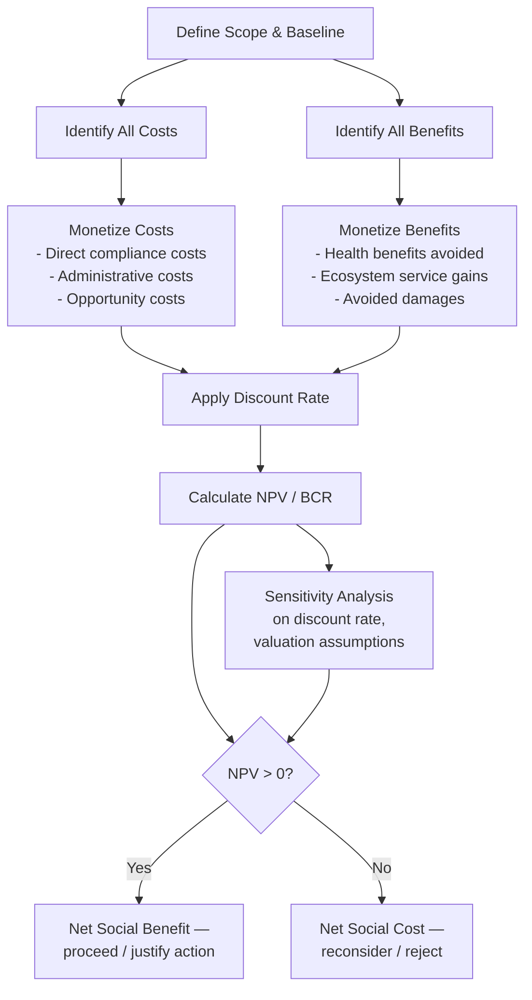

## Cost Benefit Analysis in Environmental Decision Making

### Overview

Cost-Benefit Analysis (CBA) is a systematic decision-making framework that compares the total expected costs of an action (a policy, regulation, or project) against its total expected benefits, expressed in commensurable — typically monetary — terms, in order to determine whether the action increases overall social welfare. In environmental decision-making, CBA is the dominant analytical tool used by regulatory agencies (e.g., the U.S. EPA, the UK's HM Treasury) to evaluate environmental regulations, infrastructure projects, conservation investments, and climate policy, but it is also one of the most contested tools in the field due to the inherent difficulty of monetizing ecological and intergenerational values.

### Core Analytical Structure

The basic decision rule of CBA is straightforward: an action is socially desirable if its Net Present Value (NPV) is positive.

$$NPV = \sum_{t=0}^{T} \frac{B_t - C_t}{(1+r)^t}$$

where:

- $B_t$ = benefits accruing in year $t$
- $C_t$ = costs accruing in year $t$
- $r$ = the discount rate
- $T$ = the time horizon of the analysis

Related decision metrics derived from the same cash-flow structure include the **Benefit-Cost Ratio (BCR)**:

$$BCR = \frac{\sum_{t=0}^{T} \frac{B_t}{(1+r)^t}}{\sum_{t=0}^{T} \frac{C_t}{(1+r)^t}}$$

where a BCR greater than 1 indicates the project's discounted benefits exceed its discounted costs, and the **Internal Rate of Return (IRR)**, the discount rate at which NPV equals zero — used to compare a project's implicit return against an alternative benchmark rate.

### Stages of an Environmental CBA

1. **Define the scope and baseline (counterfactual)**: Establish what would happen in the absence of the proposed action ("business as usual"), against which the policy's incremental costs and benefits are measured.
2. **Identify affected parties and impact categories**: Enumerate who bears costs (industry, taxpayers, consumers) and who receives benefits (public health, ecosystems, future generations), including cross-border and intergenerational effects where relevant.
3. **Quantify physical impacts**: Use scientific and engineering models to estimate physical changes — e.g., tons of pollutant reduced, hectares of habitat preserved, cases of respiratory illness avoided.
4. **Monetize impacts**: Convert physical impacts into dollar values using established valuation techniques (market prices where available; hedonic pricing, travel cost method, contingent valuation, or benefit transfer where no market exists — see ecosystem service valuation methods).
5. **Discount future values to present value**: Apply a discount rate to render costs and benefits occurring at different times comparable.
6. **Aggregate and compare**: Sum discounted benefits and costs to calculate NPV, BCR, and/or IRR.
7. **Conduct sensitivity and uncertainty analysis**: Test how conclusions change under different assumptions (discount rate, valuation estimates, physical impact models) via scenario analysis, Monte Carlo simulation, or breakeven analysis.
8. **Assess distributional impacts**: Increasingly required as a supplement to aggregate NPV, examining who specifically bears costs versus who receives benefits (equity analysis).

### Categories of Environmental Costs and Benefits

**Typical Costs:**

- Direct compliance costs (pollution control equipment, process changes)
- Administrative and monitoring costs (government and firm-level)
- Transition costs (job displacement, retraining, stranded assets)
- Opportunity costs of foregone alternative land/resource use

**Typical Benefits:**

- **Avoided health damages**: Reduced mortality and morbidity from improved air/water quality, often the single largest benefit category in air pollution regulations, calculated using the **Value of a Statistical Life (VSL)** — a construct representing aggregate societal willingness to pay for small reductions in mortality risk, not the value of any specific individual's life.
- **Avoided ecological damages**: Preserved ecosystem services (see ecosystem service valuation), avoided biodiversity loss.
- **Avoided property and infrastructure damage**: E.g., reduced flood or storm damage from wetland or mangrove preservation.
- **Productivity gains**: E.g., agricultural yield improvements from reduced pollution or improved soil health.
- **Co-benefits**: Secondary benefits beyond the primary policy target — e.g., a climate policy reducing $CO_2$ may simultaneously reduce local particulate matter, generating immediate local health co-benefits alongside long-term global climate benefits.

### The Discount Rate: Theory and Controversy

The discount rate is arguably the single most consequential and contested parameter in environmental CBA, because environmental policies (especially climate policy) often involve costs borne now and benefits realized decades or centuries in the future.

**Two main theoretical approaches to setting $r$:**

**1. Descriptive (market-based) approach**: Sets the discount rate based on observed market rates of return (e.g., government bond yields or the opportunity cost of capital), reflecting how society actually trades off present versus future consumption in observed behavior.

**2. Prescriptive (ethical) approach**: Derives the discount rate from the **Ramsey equation**, explicitly separating ethical judgments from empirical observation:

$$r = \delta + \eta \cdot g$$

where:

- $\delta$ = the **pure rate of time preference** (a normative judgment about how much less society should weight future generations' welfare purely due to time; many ethicists argue $\delta$ should be at or near zero, since there is no ethical basis for discounting someone's welfare merely because they are born later)
- $\eta$ = the elasticity of marginal utility of consumption (how quickly the marginal value of consumption declines as consumption rises — reflecting diminishing marginal utility)
- $g$ = the expected growth rate of per-capita consumption

This formula famously divides economists: the **Stern Review (2006)** on climate change used a near-zero $\delta$, producing a low discount rate (~1.4%) and concluding that aggressive near-term climate action was strongly justified. **William Nordhaus's DICE model** used a higher, more market-consistent discount rate (closer to 4-6%, incorporating a positive $\delta$ closer to observed market behavior), producing a more gradual optimal emissions abatement path. [Inference — this framing reflects the well-documented Stern/Nordhaus debate; the specific numeric parameters cited are commonly referenced figures in the literature but exact values differ slightly across model versions and should be verified against primary sources for precise citation.] This divergence illustrates how a seemingly technical parameter choice can entirely reverse a policy's apparent justification.

**Declining discount rates**: Given uncertainty about future interest rates and ethical concerns about long-horizon discounting, several regulatory bodies (e.g., UK Green Book guidance) now recommend **time-declining discount rates** — using a higher rate for near-term impacts and progressively lower rates for more distant future impacts, reflecting both uncertainty about future rates and reduced confidence in extrapolating short-term market behavior over centuries.

### The Social Cost of Carbon: CBA Applied to Climate Policy

The **Social Cost of Carbon (SCC)** is a direct application of CBA logic to greenhouse gas emissions: it represents the monetized present value of all future damages caused by emitting one additional ton of $CO_2$ today, calculated using **Integrated Assessment Models (IAMs)** such as DICE, FUND, and PAGE, which combine:

- A climate model (emissions → atmospheric concentration → temperature change)
- A damage function (temperature change → economic damages, e.g., agricultural loss, sea-level rise costs, extreme weather damage)
- A discounting module (converting future damages to present value)

The SCC is then used as a shadow price for carbon in regulatory CBA — any policy reducing emissions is credited with a benefit equal to (tons of $CO_2$ reduced) × (SCC). Because the SCC embeds a chosen discount rate and damage function, its estimated value varies substantially across models and assumptions, making it one of the most actively debated single numbers in environmental economics. [Unverified — specific current SCC dollar figures are subject to frequent regulatory and academic revision; consult current agency guidance (e.g., EPA) for the applicable figure in a given jurisdiction and year.]

### Handling Uncertainty and Irreversibility

Standard CBA implicitly assumes impacts can be estimated with reasonable confidence and treated via expected-value calculations. Environmental decision-making often violates this assumption due to:

- **Deep uncertainty**: Some environmental outcomes (e.g., climate tipping points, novel chemical toxicity) have poorly characterized probability distributions, not just point-estimate uncertainty.
- **Irreversibility**: Loss of a species, destruction of old-growth ecosystems, or crossing a climate tipping point cannot be undone by future compensating investment, unlike most conventional capital.
- **Catastrophic/fat-tailed risk**: Climate damage distributions may have "fat tails" — a non-trivial probability of extreme, civilization-scale outcomes — which standard expected-value NPV calculations can systematically underweight. [Inference — this is a prominent critique (associated with economist Martin Weitzman's "dismal theorem") within the field, not a settled resolution; mainstream IAM-based CBA continues to be used alongside this critique.]

**Adjustments and alternative frameworks used to address these issues:**

- **Option value / quasi-option value**: Explicitly valuing the preservation of future flexibility under uncertainty (e.g., delaying irreversible habitat conversion until more information is available).
- **Real options analysis**: Applying financial options-pricing logic to environmental decisions with uncertain, resolving-over-time information.
- **Safe minimum standards**: A rule-based (rather than marginal cost-benefit) approach that sets a floor below which a resource or ecosystem should not be depleted, regardless of a favorable CBA calculation, particularly for irreversible losses.
- **Precautionary principle**: Shifts the burden of proof toward demonstrating safety before proceeding, rather than requiring proof of harm before restricting an activity — used especially where scientific uncertainty is high and potential harm is severe or irreversible.

### Distributional and Equity Analysis

Because standard NPV aggregates costs and benefits across all of society into a single number, it can mask significant distributional consequences — a policy with positive net NPV might still impose disproportionate costs on low-income or marginalized populations while benefits accrue elsewhere (an **environmental justice** concern). Increasingly, environmental CBA is supplemented with:

- **Distributional weighting**: Applying higher weights to costs/benefits affecting lower-income populations, reflecting diminishing marginal utility of income.
- **Disaggregated reporting**: Presenting CBA results broken out by income group, geography, or demographic category rather than only as an aggregate figure.
- **Environmental justice screening tools**: Geographic information system (GIS)-based tools (e.g., EPA's EJScreen) used to identify whether costs or benefits are concentrated in historically overburdened communities.

### Worked Example: Evaluating a Proposed Air Quality Regulation

**Example**

A proposed regulation requires power plants to install emissions scrubbers reducing sulfur dioxide ($SO_2$) output by 40%.

- **Costs**: Capital cost of scrubber installation ($500 million upfront), plus annual operating and maintenance costs ($20 million/year) over a 20-year equipment life.
- **Benefits**:
  - Avoided premature mortality: Epidemiological studies estimate the reduction prevents an estimated number of premature deaths annually; each is valued using the VSL (a standard regulatory input, not a valuation of any individual's life).
  - Avoided morbidity: Reduced hospital admissions and asthma incidents, valued via avoided medical costs and lost productivity.
  - Avoided acid rain damage to forests and waterways: Valued via replacement/restoration cost methods.
  - Visibility improvement in national parks: Valued via stated preference (contingent valuation) surveys of park visitors.

An analyst would discount both cost and benefit streams to present value using an agency-specified discount rate (often presenting results at multiple rates, e.g., 3% and 7%, per standard U.S. regulatory guidance), then compare aggregate discounted benefits to discounted costs. If discounted health benefits alone exceed total discounted costs — a common finding in air pollution CBAs, where mortality-risk-reduction benefits are typically the dominant category — the regulation would be judged to pass a standard benefit-cost test, though the analysis would typically also report distributional findings (e.g., whether affected communities near the plants are disproportionately low-income) as a supplementary consideration alongside the aggregate NPV result.

### Critiques of Environmental CBA

- **Monetization critique**: Assigning dollar values to non-market goods like a human life, a species, or a sacred natural site is ethically contentious and methodologically fraught (see valuation method critiques).
- **Discounting critique**: Any positive discount rate mathematically shrinks the present value of harms occurring beyond roughly 50-100 years to near-zero, effectively discounting the interests of future generations — a significant ethical concern for climate and biodiversity policy operating on multi-generational timescales.
- **Aggregation critique**: Summing gains and losses across different individuals treats a dollar of benefit to a wealthy person as equivalent to a dollar of cost to a poor person, ignoring diminishing marginal utility of income unless explicitly weighted.
- **Scope and boundary critique**: CBA results are highly sensitive to which costs/benefits are included or excluded (system boundary choice), creating potential for selective framing to favor a predetermined conclusion.
- **Ecological economics critique**: As discussed under ecological versus neoclassical perspectives, some economists argue CBA is inappropriate for decisions involving critical natural capital or systemic ecological thresholds, favoring safe minimum standards or precautionary rules instead of marginal cost-benefit optimization in those cases.

### Complementary and Alternative Decision Frameworks

- **Cost-Effectiveness Analysis (CEA)**: Compares the cost of achieving a fixed, predetermined target (e.g., cost per ton of $CO_2$ reduced) across different policy options, avoiding the need to monetize the benefit side — useful when the goal (e.g., a legislated emissions target) is set independently of a CBA justification.
- **Multi-Criteria Decision Analysis (MCDA)**: Evaluates options against multiple weighted criteria without forcing full monetization, often incorporating stakeholder-derived weights.
- **Environmental Impact Assessment (EIA)**: A broader regulatory and procedural framework (required under laws like the U.S. National Environmental Policy Act) that documents environmental effects of a proposed project, of which monetized CBA may be one component among qualitative and biophysical assessments.

### Key Points

- Environmental CBA compares monetized costs and benefits using $NPV = \sum \frac{B_t - C_t}{(1+r)^t}$, with a positive NPV generally indicating the action improves aggregate social welfare.
- The **discount rate** is the most consequential and contested parameter; the **Ramsey equation** ($r = \delta + \eta g$) separates the ethical judgment ($\delta$, the pure rate of time preference) from consumption growth effects, and different assumptions (Stern vs. Nordhaus) can reverse a climate policy's apparent economic justification.
- The **Social Cost of Carbon** applies CBA logic to greenhouse gas emissions via Integrated Assessment Models, embedding both a climate-damage function and a discount rate choice.
- Standard CBA assumes reasonably estimable, non-catastrophic, reversible impacts; environmental decisions often involve **deep uncertainty, irreversibility, and fat-tailed catastrophic risk**, motivating alternative tools like safe minimum standards, real options analysis, and the precautionary principle.
- **Distributional/equity analysis** increasingly supplements aggregate NPV to reveal who bears costs versus who receives benefits, addressing environmental justice concerns.
- Major critiques center on the ethics and feasibility of monetization, the treatment of future generations under discounting, and aggregation across individuals with different marginal utility of income.
- **Cost-effectiveness analysis** and **multi-criteria decision analysis** serve as complementary or alternative frameworks when full monetization is impractical or normatively undesirable.

### Related Topics

- The Ramsey Equation and Discount Rate Debates (Stern vs. Nordhaus)
- Social Cost of Carbon and Integrated Assessment Models (DICE, FUND, PAGE)
- Value of a Statistical Life: Methodology and Controversy
- Valuing Ecosystem Services (valuation inputs feeding CBA benefit estimates)
- Precautionary Principle and Safe Minimum Standards
- Environmental Justice and Distributional Weighting in Policy Analysis
- Cost-Effectiveness Analysis vs. Cost-Benefit Analysis
- Real Options Analysis Under Environmental Uncertainty
- Weitzman's Dismal Theorem and Fat-Tailed Climate Risk
- Environmental Impact Assessment (EIA) Procedures
- Ecological Versus Neoclassical Economic Perspectives (philosophical critique of CBA)