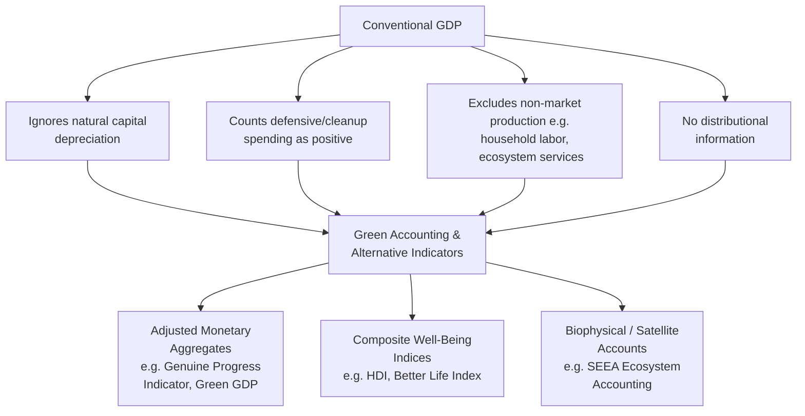

## Green National Accounting and Alternative Indicators

### Overview

Conventional national accounting systems — centered on **Gross Domestic Product (GDP)** — measure the total market value of final goods and services produced within an economy over a given period, but were never designed to capture environmental degradation, natural resource depletion, or non-market dimensions of well-being. **Green national accounting** (also called **environmental-economic accounting** or **natural capital accounting**) refers to a family of frameworks that adjust or supplement conventional GDP-based accounts to incorporate the depletion and degradation of natural capital, alongside a broader set of **alternative indicators** designed to measure genuine welfare, sustainability, or well-being more directly than GDP alone.

### The Core Critique of GDP

GDP was developed in the 1930s–40s (notably by Simon Kuznets) primarily to measure market production and macroeconomic activity, not welfare or sustainability. Its structural limitations relevant to environmental economics include:

- **Treats natural capital depletion as income, not capital loss**: When a country liquidates a forest, drains an aquifer, or depletes a fishery, the sale of the extracted resource registers as a *positive* contribution to GDP, with no corresponding deduction for the loss of the underlying natural asset — analogous to a business counting the sale of its factory machinery as profit rather than asset liquidation.
- **Ignores externalities and defensive expenditures**: Cleanup costs, healthcare spending on pollution-related illness, and disaster recovery spending all *increase* GDP, even though they represent responses to welfare-reducing events rather than genuine welfare gains. This is sometimes called counting "bads" as "goods."
- **Excludes non-market production and services**: Unpaid household labor, subsistence agriculture, ecosystem services, and volunteer work are absent from GDP despite contributing substantially to well-being.
- **No adjustment for distribution**: GDP is an aggregate/average measure and says nothing about how income or resources are distributed across a population.
- **No adjustment for the composition or durability of growth**: GDP growth driven by irreversible resource liquidation is counted identically to growth driven by productivity gains or renewable value creation.

### Framework 1: The System of Environmental-Economic Accounting (SEEA)

The **SEEA** is the international statistical standard, adopted by the UN Statistical Commission, for integrating environmental data with conventional economic accounts. It is designed as a **satellite account system** — meaning it extends the System of National Accounts (SNA, the standard underlying conventional GDP) without altering GDP itself, allowing environmental data to be compared directly against economic data using consistent accounting conventions and units.

The SEEA has two principal components:

**1. SEEA Central Framework**

Focuses on **stocks and flows of natural resources and pollution** in both physical and monetary terms:

- **Physical asset accounts**: Track stocks and changes in stocks of natural resources (minerals, timber, water, fish) in physical units (tons, cubic meters, hectares).
- **Monetary asset accounts**: Value those same stocks and flows in monetary terms using resource rent and net present value methods, enabling calculation of **natural capital depletion** as an explicit deduction.
- **Physical flow accounts**: Track flows of materials and energy through the economy (material flow accounts) and pollutant emissions (air emission accounts, water accounts).

**2. SEEA Ecosystem Accounting (SEEA EA)**

A newer, formally adopted (2021) extension focused specifically on **ecosystems** rather than individual resource stocks:

- **Ecosystem extent accounts**: Track the physical area of different ecosystem types (forest, wetland, grassland) over time.
- **Ecosystem condition accounts**: Track the quality/health of ecosystems using biophysical indicators (soil health, biodiversity indices, water quality).
- **Ecosystem services flow accounts**: Track the flow of services (in physical and monetary terms) generated by ecosystems and used by the economy or society, connecting directly to ecosystem service valuation methodology.

SEEA EA's ecosystem accounts are structured similarly to a balance sheet, tracking **opening stock + additions − reductions = closing stock** for ecosystem extent and condition, mirroring how conventional accounting tracks produced capital.

### Framework 2: Adjusted and Alternative Monetary Aggregates

These frameworks retain a GDP-like monetary structure but modify it to correct for natural capital depletion and/or social costs.

**Green GDP (Environmentally Adjusted Net Domestic Product, EDP)**

$$EDP = GDP - D_p - D_n$$

where $D_p$ is depreciation of produced (manufactured) capital (already subtracted in conventional Net Domestic Product calculations) and $D_n$ is the estimated depletion/degradation of natural capital (the "green" adjustment). China notably attempted a large-scale **Green GDP** initiative in the mid-2000s; the effort was suspended after revealing that adjusted growth rates in some provinces would be reduced dramatically, illustrating both the methodological difficulty and political sensitivity of the exercise. [Unverified — specific suspension details and cited growth-rate reductions vary across secondary sources; treated here as an illustrative, widely-reported case rather than a precisely sourced statistic.]

**Genuine Progress Indicator (GPI)** and its predecessor, the **Index of Sustainable Economic Welfare (ISEW)**

GPI starts from personal consumption expenditure (a GDP component) and applies roughly two dozen adjustments, broadly grouped as:

- **Additions**: Value of unpaid household and volunteer labor, value of higher education, value of leisure time, services from durable goods and infrastructure.
- **Subtractions**: Costs of crime, costs of commuting, costs of pollution (air, water, noise), cost of loss of farmland/wetlands, cost of ozone depletion, cost of long-term environmental damage (e.g., climate change), depletion of non-renewable resources, and defensive/cleanup expenditures reclassified as costs rather than gains.

$$GPI = \text{Personal Consumption} + \text{Non-market benefits} - \text{Defensive/social costs} - \text{Natural capital depletion} - \text{Income inequality adjustment}$$

A key empirical finding across multiple national and sub-national GPI studies is the **"threshold hypothesis"**: GPI tends to track GDP growth reasonably closely at lower levels of economic development, but the two measures diverge — GPI plateauing or declining even as GDP continues to rise — beyond a certain income threshold, as the marginal social and environmental costs of additional growth begin to outweigh the marginal welfare benefits. [Inference — this pattern is a recurring empirical finding across multiple GPI studies, though the precise threshold and its universality across all economies remains debated in the literature.]

**Inclusive Wealth / Genuine Savings (World Bank / UNEP)**

Rather than adjusting an annual flow measure like GDP, this approach tracks the **stock of a nation's total capital base** across three categories — produced capital, human capital, and natural capital — and measures whether that total stock is growing or shrinking over time.

$$\text{Genuine Savings} = \text{Gross Savings} - \text{Depreciation of Produced Capital} - \text{Depletion of Natural Resources} + \text{Investment in Human Capital (education)} - \text{Pollution Damages}$$

A country can show positive conventional GDP growth while genuine savings are negative — indicating the country is depleting its total capital base faster than it is investing in replacement capital, a strong signal of **weak unsustainability** in the technical sense used by this framework (i.e., failing even the substitutability-permissive weak sustainability criterion, not just the stronger ecological criterion).

### Framework 3: Composite Well-Being and Multidimensional Indices

These indices step further away from monetary units entirely, combining multiple weighted indicators (economic, social, environmental) into a single composite score.

- **Human Development Index (HDI)**: UNDP index combining life expectancy, education, and per-capita income into a single 0–1 score; foundational but historically lacked an explicit environmental dimension (subsequent variants, such as the Planetary Pressures-adjusted HDI, have attempted to address this gap).
- **OECD Better Life Index**: A multidimensional framework allowing users to weight 11 topics (housing, income, jobs, community, education, environment, civic engagement, health, life satisfaction, safety, work-life balance) according to personal or policy priorities, deliberately avoiding a single forced aggregate score.
- **Happy Planet Index (HPI)**: Explicitly designed as an ecological efficiency metric, calculated roughly as:

$$HPI = \frac{\text{Wellbeing} \times \text{Life Expectancy}}{\text{Ecological Footprint}}$$

rewarding countries that achieve high subjective well-being and longevity with a comparatively small ecological footprint, rather than rewarding raw output or consumption.

- **Gross National Happiness (GNH)**: Bhutan's constitutionally embedded alternative development framework, using a multidimensional index across nine domains (including ecological diversity and resilience) rather than GDP as the primary national policy target.

### Framework 4: Biophysical and Footprint-Based Indicators

These indicators sidestep monetary valuation entirely, measuring sustainability in physical/biophysical units — a methodological choice favored particularly within ecological economics (see comparative discussion under ecological versus neoclassical perspectives).

- **Ecological Footprint**: Measures the biologically productive land and sea area required to produce the resources a population consumes and absorb its waste (particularly $CO_2$), expressed in standardized units called **global hectares (gha)**. Compared against **biocapacity** (the productive area actually available), yielding an **ecological deficit or reserve**.
- **Material Flow Accounting (MFA) / Domestic Material Consumption (DMC)**: Tracks the total tonnage of raw materials extracted, imported, and consumed by an economy, used to assess resource intensity and progress toward "decoupling" of material use from GDP growth.
- **Carbon Footprint / Territorial vs. Consumption-Based Emissions Accounting**: Distinguishes emissions produced within a country's borders (territorial/production-based) from emissions embedded in goods a country consumes regardless of where they were produced (consumption-based), which matters significantly for countries that have offshored manufacturing.
- **Planetary Boundaries Framework**: Not a single indicator but a scientific framework identifying nine Earth-system processes (climate change, biodiversity loss, biogeochemical flows, land-system change, freshwater use, ocean acidification, stratospheric ozone depletion, atmospheric aerosol loading, novel entities) with proposed safe operating thresholds, increasingly used as a normative benchmark against which national/global resource use and emissions can be assessed.

### Comparative Table of Major Alternative Indicators

| Indicator | Type | Units | Key Strength | Key Limitation |
| --- | --- | --- | --- | --- |
| SEEA (Central + Ecosystem Accounting) | Satellite account system | Physical + monetary | UN-standardized, integrates with existing SNA, internationally comparable | Complex, data-intensive; does not itself produce a single "bottom-line" welfare number |
| Green GDP / EDP | Adjusted monetary flow | Currency | Directly comparable to GDP; intuitive | Requires contested monetary valuation of natural capital; politically sensitive |
| Genuine Progress Indicator (GPI) | Adjusted monetary flow | Currency | Captures welfare, inequality, and environmental costs together | Methodologically complex; adjustment list and weights are somewhat subjective |
| Genuine/Adjusted Net Savings | Capital stock flow | Currency (% of GNI) | Directly signals (un)sustainability of total capital base | Still requires monetizing natural capital depletion; doesn't capture ecosystem quality/thresholds directly |
| Human Development Index (HDI) | Composite index | Unitless (0–1) | Simple, widely adopted, shifted focus beyond income | Traditionally weak/absent environmental dimension |
| Ecological Footprint | Biophysical | Global hectares | No monetary valuation required; intuitive "living within limits" framing | Aggregates diverse impacts into one land-area metric, obscuring some distinctions (e.g., toxicity) |
| Planetary Boundaries | Scientific threshold framework | Mixed (process-specific units) | Grounded in Earth-system science; identifies non-negotiable limits | Primarily global-scale; downscaling to national/local accountability is methodologically difficult |

### Worked Example: GDP vs. GPI Divergence

**Example**

Consider a hypothetical region that experiences a large oil spill cleanup effort in a given year, alongside a mining boom that depletes a non-renewable mineral deposit.

- **Under conventional GDP**: The mining boom's extracted mineral sales are counted as a straightforward positive contribution to output. The oil spill cleanup — remediation contractor payments, medical treatment for affected residents, replacement of damaged fishing equipment — is also counted as positive economic activity (spending is spending), so GDP for the year *rises* due to both events.
- **Under GPI**: The mineral depletion is subtracted as a loss of non-renewable natural capital (valued at, e.g., replacement or resource-rent cost). The cleanup and medical spending are reclassified as **defensive expenditures** — costs incurred to offset a welfare-reducing event — and subtracted rather than added. Lost fishing income and long-term ecosystem damage (e.g., to coastal habitat) are also subtracted using ecosystem service valuation methods.

The result: GDP for the region rises, while GPI for the same region and year falls — illustrating precisely the kind of divergence these alternative indicators are designed to expose, where conventional accounting and genuine welfare/sustainability measures point in opposite directions.

### Implementation Challenges

- **Valuation methodology dependence**: Nearly every adjusted monetary indicator (Green GDP, GPI, Genuine Savings) inherits the same underlying valuation controversies as ecosystem service valuation — resource rent calculations, discount rate choices, and contingent valuation biases all propagate into the final adjusted figure.
- **Data availability**: Comprehensive natural capital and ecosystem condition data (especially at fine temporal/spatial resolution) remain far less developed than conventional economic statistics in many countries, particularly in the Global South.
- **Political economy resistance**: As the China Green GDP episode illustrates, adjusted indicators that reveal environmentally unsustainable growth patterns can face significant institutional and political resistance to adoption as official statistics.
- **Aggregation and weighting subjectivity**: Composite indices (HDI, Better Life Index, GNH) require normative choices about which dimensions matter and how heavily to weight them — choices that are inherently value-laden rather than purely technical.
- **Single-number risk**: Critics note that replacing GDP with a *different* single aggregate number (Green GDP, GPI) risks reproducing the same reductionism problem GDP is criticized for, rather than genuinely capturing multidimensional sustainability — an argument favoring **dashboards** (e.g., the UN Sustainable Development Goals indicator set, or the OECD Better Life Index's non-aggregated presentation) over any single replacement metric. [Inference — this represents one influential position within the broader alternative-indicators literature, not a universally settled methodological consensus.]

### Key Points

- Conventional GDP treats natural capital depletion as income rather than capital loss, counts defensive/cleanup spending as positive output, and excludes non-market production — motivating the development of green accounting frameworks.
- The **SEEA** (System of Environmental-Economic Accounting), including **SEEA Ecosystem Accounting**, is the UN-adopted international statistical standard, using satellite accounts to track physical and monetary stocks/flows of natural resources and ecosystems alongside conventional national accounts.
- **Adjusted monetary aggregates** — Green GDP/EDP, the Genuine Progress Indicator (GPI), and Genuine/Adjusted Net Savings — modify GDP-like flow or stock measures to subtract natural capital depletion and social costs, often revealing a **GDP-GPI divergence** at higher income levels (the threshold hypothesis).
- **Composite well-being indices** (HDI, OECD Better Life Index, Happy Planet Index, Gross National Happiness) combine economic, social, and (increasingly) environmental dimensions into indices that de-emphasize raw output.
- **Biophysical indicators** (Ecological Footprint, Material Flow Accounting, consumption-based emissions accounting, Planetary Boundaries) sidestep monetary valuation, measuring sustainability directly in physical or land-area units.
- Genuine/Adjusted Net Savings can reveal that a country is experiencing positive GDP growth while its total capital base (natural + produced + human) is actually shrinking — a direct signal of unsustainability.
- Implementation faces persistent challenges: valuation methodology dependence, data availability gaps, political resistance to unfavorable results, and debate over whether a single adjusted aggregate or a multidimensional dashboard better serves policy needs.

### Related Topics

- SEEA Ecosystem Accounting: Extent, Condition, and Service Flow Accounts
- Genuine Progress Indicator: Methodology and the Threshold Hypothesis
- Genuine/Adjusted Net Savings and Weak Sustainability Testing
- Ecological Footprint and Biocapacity Accounting
- Planetary Boundaries Framework in Depth
- Valuing Ecosystem Services (valuation methods feeding monetary green accounts)
- Ecological Versus Neoclassical Economic Perspectives (theoretical roots of alternative indicators)
- Consumption-Based vs. Production-Based Emissions Accounting
- Human Development Index and Its Environmental Extensions
- Degrowth, Steady-State Economics, and Post-GDP Policy Frameworks
- China's Green GDP Initiative: Case Study in Political Economy of Accounting