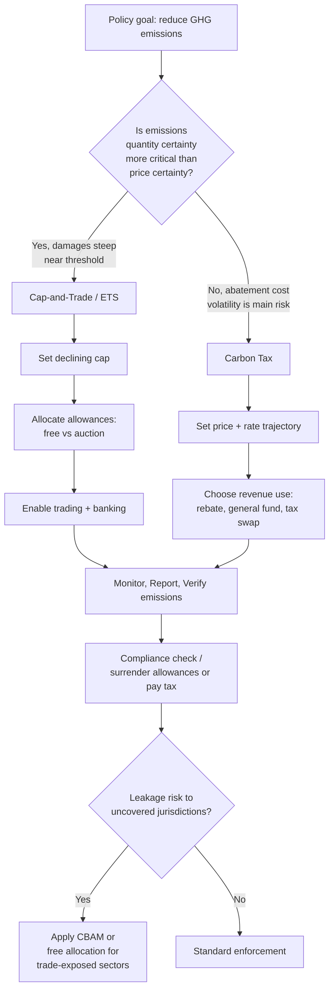

## Carbon Pricing and Emissions Trading

### Overview

Carbon pricing is a policy approach that assigns a monetary cost to greenhouse gas (GHG) emissions, internalizing the externality of climate damage into economic decision-making. The theoretical foundation rests on Pigouvian economics: when the private cost of an activity (e.g., burning fossil fuels) is lower than its social cost (climate damage, health impacts, ecosystem degradation), the market overproduces that activity. Carbon pricing corrects this by making emitters pay for the externality, shifting production and consumption toward lower-carbon alternatives.

Two dominant mechanisms exist: **carbon taxes** (price-based instruments) and **emissions trading systems** (ETS, quantity-based instruments, also called cap-and-trade). Hybrid and complementary instruments — carbon border adjustments, offset markets, and internal carbon pricing — extend these core tools.

### Theoretical Foundations

**Externalities and market failure**

Emitting $CO_2$ imposes costs on third parties (future generations, other countries, ecosystems) that are not reflected in the price of fossil fuels or carbon-intensive goods. Without intervention, the socially optimal quantity of emissions $Q^*$ is below the market equilibrium quantity $Q_m$, because marginal private cost (MPC) diverges from marginal social cost (MSC):

$$MSC = MPC + MEC$$

where $MEC$ is the marginal external cost. A carbon price set equal to $MEC$ at $Q^*$ theoretically restores efficiency — this is the basis of the **Social Cost of Carbon (SCC)**, an estimate (in $/tonne $CO_2$) of the present-value damage caused by emitting one additional tonne.

**Coase Theorem and property rights**

An alternative framing (Coase, 1960) suggests that if property rights over the atmosphere's absorptive capacity are clearly defined and transaction costs are low, private bargaining between polluters and affected parties could reach an efficient outcome regardless of who initially holds the rights. Emissions trading operationalizes this by creating property rights (allowances) over emissions capacity, then letting the market discover the efficient price through trading.

**Price vs. quantity instruments (Weitzman, 1974)**

The choice between a carbon tax (fixes price, lets quantity float) and cap-and-trade (fixes quantity, lets price float) depends on the relative slopes of marginal abatement cost (MAC) and marginal damage cost (MDC) curves:

- If MDC is relatively flat and MAC is steep (uncertain, volatile abatement costs) → a **price instrument** (tax) minimizes welfare loss, since a rigid quantity cap could force very expensive abatement in bad years.
- If MDC is steep (damages escalate sharply near a threshold, e.g., tipping points) → a **quantity instrument** (cap) is preferred, since bounding emissions matters more than the exact price.

This is a foundational result explaining why some jurisdictions choose taxes and others choose cap-and-trade.

### Carbon Taxes

**Mechanism**

A carbon tax sets a fixed price per tonne of $CO_2$-equivalent ($CO_2e$) emitted, typically levied upstream (on fossil fuel extraction or import) or midstream (on fuel distributors), which passes through to downstream prices. The tax liability for an entity is:

$$T = p_c \times E$$

where $p_c$ is the tax rate ($/tonne $CO_2e$) and $E$ is verified emissions (tonnes).

**Key design parameters**

- **Coverage**: which sectors/fuels are taxed (energy, industrial processes, agriculture, waste)
- **Rate trajectory**: many systems (e.g., Sweden, Canada's federal backstop) pre-announce a rising schedule to give investment certainty
- **Revenue recycling**: how tax revenue is used — general fund, dividend/rebate to households ("fee-and-dividend"), tax swaps (offsetting labor/corporate taxes), or green investment
- **Border adjustments**: mechanisms to prevent competitiveness loss and "carbon leakage" for trade-exposed industries

**Example jurisdictions**

- Sweden: one of the highest carbon tax rates globally (over $120/tonne as of recent years), in place since 1991
- Canada: federal carbon pricing backstop combining a fuel charge with output-based pricing for large emitters, revenue mostly returned via household rebates
- South Africa: carbon tax with substantial free allowances/offset provisions to ease transition burden on emissions-intensive industries

**Worked example**

A cement plant emits 500,000 tonnes $CO_2e$/year in a jurisdiction with a $50/tonne carbon tax:

$$T = \$50 \times 500{,}000 = \$25{,}000{,}000/\text{year}$$

If the plant can reduce emissions by installing carbon capture at a marginal abatement cost of $40/tonne for the first 200,000 tonnes, it minimizes total cost (abatement + remaining tax) by abating up to the point where marginal abatement cost equals the tax rate.

### Emissions Trading Systems (Cap-and-Trade)

**Mechanism**

A regulator sets a **cap** — a maximum aggregate quantity of emissions permitted across covered entities — that typically declines over time. The cap is divided into **allowances** (each representing the right to emit one tonne $CO_2e$), which are distributed via **free allocation** (grandfathering or benchmarking) or **auctioning**. Entities that emit less than their allowance holdings can sell surplus allowances; entities that emit more must buy additional allowances or offsets, or face penalties.

**Core components**

- **Cap**: total allowances issued, usually declining annually (linear reduction factor)
- **Allocation**: free allocation (protects trade-exposed sectors from leakage) vs. auctioning (raises revenue, better price signal)
- **Compliance cycle**: reporting period, verification, surrender deadline, penalties for shortfall
- **Banking and borrowing**: whether unused allowances can be saved for future periods (banking) or future allowances used early (borrowing)
- **Market Stability Reserve / price floor-ceiling mechanisms**: tools to manage price volatility (e.g., EU ETS's Market Stability Reserve, California's price floor and Allowance Price Containment Reserve)
- **Offsets**: allowing regulated entities to meet a portion of obligations via emissions reductions from uncovered sectors (e.g., forestry, methane capture)

**Major operating systems**

- **EU Emissions Trading System (EU ETS)**: the largest and oldest major carbon market, launched 2005, covering power, industry, and (from 2024) partially aviation and maritime; now in Phase 4 with a declining cap and a Market Stability Reserve
- **California Cap-and-Trade Program**: linked with Québec's system, covers most of California's economy, includes a price floor and ceiling
- **China National ETS**: launched 2021, currently the largest ETS by covered emissions, initially covering the power sector with intensity-based (not absolute) benchmarks
- **RGGI (Regional Greenhouse Gas Initiative)**: US Northeast states, power sector only, quarterly auctions

**Price determination**

Market price emerges from supply (cap level) and demand (aggregate abatement costs across entities). In equilibrium, the market price approximates the marginal abatement cost of the marginal (most expensive) unit of abatement needed to meet the cap:

$$p^* \approx MAC_{marginal\ entity}$$

**Worked example**

Two firms face different abatement costs. Firm A can abate at $20/tonne; Firm B can abate at $60/tonne. Both are allocated 1,000 allowances but each needs to cover 1,200 tonnes of emissions (200-tonne shortfall each).

- Firm A abates its own 200 tonnes at $20/tonne = $4,000, needing no purchases
- Firm A could instead abate 400 tonnes (its own 200 + Firm B's 200) at $20/tonne = $8,000, and sell 200 allowances to Firm B
- Firm B pays Firm A a market price between $20 and $60/tonne (say $40) for 200 allowances = $8,000, avoiding its own $60/tonne abatement cost

Total abatement cost with trading: $8,000 (all abatement at the cheaper $20/tonne cost), versus $4,000 (Firm A) + $12,000 (Firm B) = $16,000 without trading. Trading achieves the same aggregate emissions reduction at lower total cost — the core efficiency argument for cap-and-trade.

### Comparing Tax vs. Cap-and-Trade

| Dimension | Carbon Tax | Cap-and-Trade |
| --- | --- | --- |
| Certainty | Price certain, emissions uncertain | Emissions certain, price uncertain |
| Administrative complexity | Simpler to administer | Requires registry, MRV infrastructure, market oversight |
| Revenue | Predictable, easy to forecast | Depends on auction revenue and price |
| Price volatility | None by design | Can be significant absent price controls |
| Political economy | "Tax" framing can face resistance | "Cap" framing sometimes more politically palatable |
| Linkage potential | Harder to link tax rates across jurisdictions | Systems can link (mutual allowance recognition) |

[Inference] The practical performance gap between the two instruments narrows considerably when cap-and-trade systems include price floors/ceilings and when carbon taxes include rate-adjustment mechanisms, since both hybrid designs blend price and quantity certainty.

### Carbon Offsets and Crediting Mechanisms

Offsets allow emitters to compensate for their emissions by funding verified reductions elsewhere (reforestation, methane capture, renewable energy in regions without pricing coverage). Key components of credible offset systems:

- **Additionality**: the reduction would not have occurred without the offset revenue
- **Permanence**: particularly relevant for nature-based offsets (e.g., forest carbon can be reversed by fire or logging)
- **Leakage**: whether protecting one area of forest simply shifts deforestation elsewhere
- **Verification standards**: Verra (VCS), Gold Standard, American Carbon Registry
- **Compliance vs. voluntary markets**: compliance offsets are used to meet regulatory obligations (e.g., California's program); voluntary markets are used for corporate net-zero claims outside regulation

[Unverified] Persistent criticism in the voluntary carbon market literature (including investigative reporting from 2023–2024) has questioned whether a large share of forestry-based offset credits reflect genuine additional reductions; the scale and generalizability of these findings remain actively debated among researchers and standard-setting bodies.

### Carbon Border Adjustment Mechanisms (CBAM)

To prevent **carbon leakage** — production shifting to jurisdictions with weaker climate policy — some regions apply a border tax on imports based on their embedded carbon content, ensuring imports face costs comparable to domestic carbon-priced goods.

- **EU CBAM**: entering into force in phases through 2026, initially covering cement, iron and steel, aluminum, fertilizers, electricity, and hydrogen; importers must purchase CBAM certificates reflecting the EU ETS price minus any carbon price already paid in the country of origin

### System Diagram (svg_diagram)

<svg xmlns="http://www.w3.org/2000/svg" viewBox="0 0 900 480">
<text x="450" y="30" font-size="18" font-weight="bold" text-anchor="middle" fill="#1a1a1a">Carbon Pricing Mechanisms (svg_diagram)</text>
<rect x="40" y="60" width="360" height="180" rx="8" fill="#eef5ff" stroke="#2c6fbb" stroke-width="2" />
<text x="220" y="90" font-size="15" font-weight="bold" text-anchor="middle" fill="#1a3c5e">Carbon Tax</text>
<text x="60" y="120" font-size="12" fill="#333">1. Regulator sets price (\$/tonne)</text>
<text x="60" y="145" font-size="12" fill="#333">2. Emitters pay per tonne emitted</text>
<text x="60" y="170" font-size="12" fill="#333">3. Emissions level responds to price</text>
<text x="60" y="195" font-size="12" fill="#333">4. Revenue: general fund / rebate /</text>
<text x="60" y="215" font-size="12" fill="#333"> tax swap</text>
<rect x="500" y="60" width="360" height="180" rx="8" fill="#fff3e6" stroke="#c97a1a" stroke-width="2" />
<text x="680" y="90" font-size="15" font-weight="bold" text-anchor="middle" fill="#5e3c1a">Cap-and-Trade (ETS)</text>
<text x="520" y="120" font-size="12" fill="#333">1. Regulator sets emissions cap</text>
<text x="520" y="145" font-size="12" fill="#333">2. Allowances allocated (free/auction)</text>
<text x="520" y="170" font-size="12" fill="#333">3. Entities trade allowances</text>
<text x="520" y="195" font-size="12" fill="#333">4. Market price emerges from supply</text>
<text x="520" y="215" font-size="12" fill="#333"> and abatement cost differences</text>
<rect x="270" y="280" width="360" height="140" rx="8" fill="#eafaf0" stroke="#1f9d55" stroke-width="2" />
<text x="450" y="310" font-size="15" font-weight="bold" text-anchor="middle" fill="#14532d">Shared Outcome</text>
<text x="290" y="340" font-size="12" fill="#333">Internalizes externality (MEC)</text>
<text x="290" y="365" font-size="12" fill="#333">Incentivizes least-cost abatement</text>
<text x="290" y="390" font-size="12" fill="#333">Price signal ≈ marginal abatement cost</text>
<line x1="220" y1="240" x2="400" y2="280" stroke="#2c6fbb" stroke-width="2" />
<line x1="680" y1="240" x2="500" y2="280" stroke="#c97a1a" stroke-width="2" />

<text x="450" y="450" font-size="11" text-anchor="middle" fill="#666">Weitzman (1974): choice depends on relative slopes of MAC vs. MDC curves</text>

</svg>

### Policy Design Decision Flow

### Monitoring, Reporting, and Verification (MRV)

Both instruments depend on credible MRV systems to function:

- **Monitoring**: continuous emissions monitoring systems (CEMS) or calculation-based methods (fuel use × emission factor)
- **Reporting**: annual facility-level reports submitted to regulators
- **Verification**: third-party auditors confirm reported data accuracy before compliance obligations are finalized

Emission factor calculation example (calculation-based method):

$$E = \sum_i (AD_i \times EF_i \times OF_i)$$

where $AD_i$ is activity data (e.g., fuel consumed, tonnes), $EF_i$ is the emission factor (tonnes $CO_2$/tonne fuel), and $OF_i$ is the oxidation factor.

### Interaction with Other Policy Instruments

Carbon pricing rarely operates alone. It typically interacts with:

- **Renewable portfolio standards / feed-in tariffs**: can reduce the effective carbon price needed to drive renewable deployment, sometimes causing "waterbed effect" in ETS systems (emissions reductions in one sector free up allowances for use elsewhere, unless the cap is adjusted)
- **Fossil fuel subsidies**: subsidies work against carbon pricing signals; subsidy reform is often modeled as complementary policy
- **Internal carbon pricing**: many corporations apply a shadow price ($/tonne) in internal investment decisions even absent regulatory requirement, to stress-test projects against future policy risk

### Limitations and Critiques

- **Regressivity**: carbon taxes can disproportionately burden lower-income households (larger share of income spent on energy), addressed via revenue recycling/dividends
- **Carbon leakage**: absent border adjustments, energy-intensive industries may relocate to jurisdictions with weaker pricing
- **Price volatility (ETS)**: demand shocks (e.g., 2008 financial crisis, COVID-19) can crash allowance prices, weakening the incentive; addressed via reserve mechanisms
- **Political durability**: price levels are often set below estimated social cost of carbon due to political constraints, limiting effectiveness
- **Coverage gaps**: agriculture, land use, and informal sectors are frequently excluded due to MRV difficulty

[Inference] Given current global carbon prices generally remain well below most published social cost of carbon estimates, existing systems likely function as partial rather than fully corrective price signals in most jurisdictions.

**Related Topics**

- Social Cost of Carbon (SCC) estimation methodologies
- Environmental Kuznets Curve
- Pigouvian taxation theory
- Command-and-control vs. market-based environmental regulation
- Renewable Energy Certificates (RECs) and Green Tariffs
- Just Transition and distributional impacts of climate policy
- International carbon market linkage (Article 6 of the Paris Agreement)
- Life-cycle assessment (LCA) and embedded carbon accounting
- Green fiscal reform and double dividend hypothesis