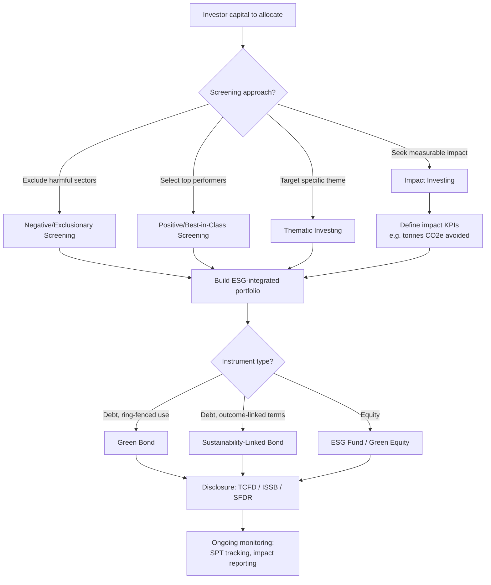

## Sustainable Finance and Green Investment

### Overview

Sustainable finance encompasses financial services, instruments, and investment practices that integrate environmental, social, and governance (ESG) considerations into capital allocation decisions. It seeks to redirect capital flows toward activities that support environmental sustainability, climate change mitigation and adaptation, and broader ecological resilience, while managing the financial risks that environmental factors pose to investments. Green investment is the subset of sustainable finance focused specifically on environmental outcomes — renewable energy, clean technology, conservation, pollution reduction, and climate resilience.

The field emerged from the recognition that environmental externalities (see Carbon Pricing and Emissions Trading) create financial risk that traditional financial analysis often ignored, and that achieving climate targets (e.g., the Paris Agreement's 1.5°C–2°C goal) requires mobilizing private capital at a scale public finance alone cannot achieve.

### Theoretical Foundations

**Market failure and information asymmetry**

Traditional financial markets misprice environmental risk because:

- Climate-related risks are often long-horizon and probabilistic, poorly captured by conventional discount rates
- Environmental externalities are not reflected in asset prices absent policy intervention (carbon pricing, regulation)
- Disclosure of environmental risk exposure has historically been voluntary and inconsistent, creating information asymmetry between issuers and investors

**Double materiality**

A core conceptual framework in sustainable finance, particularly in EU regulation, distinguishing two directions of impact:

- **Financial materiality**: how environmental/climate factors affect the financial performance of a company (outside-in)
- **Impact materiality**: how a company's activities affect the environment and society (inside-out)

Sustainable finance frameworks increasingly require disclosure on both dimensions, whereas traditional financial reporting only considered financial materiality.

**Risk categorization**

Climate-related financial risk is typically decomposed into:

- **Physical risk**: direct damage from climate impacts (extreme weather, sea-level rise, chronic heat stress) affecting assets, supply chains, and operations
- **Transition risk**: financial risk from the shift to a low-carbon economy (policy changes, technology shifts, changing consumer preferences, stranded assets)
- **Liability risk**: legal exposure from climate-related litigation against companies or their directors

### Green Financial Instruments

**Green bonds**

Debt instruments where proceeds are earmarked exclusively for projects with environmental benefits (renewable energy, energy efficiency, clean transportation, sustainable water management). Structurally identical to conventional bonds in terms of credit risk and coupon structure — the distinguishing feature is *use of proceeds*.

Key components of credible green bond frameworks (per the ICMA Green Bond Principles):

1. **Use of proceeds**: eligible green project categories defined upfront
2. **Process for project evaluation and selection**: criteria and governance for selecting eligible projects
3. **Management of proceeds**: tracking of proceeds, often via sub-accounts or portfolio approach
4. **Reporting**: annual reporting on allocation and, where feasible, environmental impact (e.g., tonnes $CO_2e$ avoided)

**Worked example (green bond impact calculation)**

A utility issues a $500 million green bond to fund a 300 MW wind farm. If the wind farm displaces grid electricity with an average emissions factor of 0.4 tonnes $CO_2e$/MWh and generates 900,000 MWh/year:

$$\text{Avoided emissions} = 900{,}000 \text{ MWh} \times 0.4 \text{ tonnes } CO_2e/\text{MWh} = 360{,}000 \text{ tonnes } CO_2e/\text{year}$$

This figure would typically appear in the bond's annual impact report.

**Other labeled debt instruments**

- **Sustainability-linked bonds (SLBs)**: unlike green bonds, proceeds are *not* ring-fenced for specific projects; instead, the bond's financial terms (usually coupon rate) are tied to the issuer achieving predefined Sustainability Performance Targets (SPTs), such as a percentage reduction in Scope 1+2 emissions by a target date. Failure to meet SPTs typically triggers a coupon step-up (penalty)
- **Social bonds**: proceeds fund projects with positive social outcomes (affordable housing, healthcare access)
- **Sustainability bonds**: hybrid, funding a mix of green and social projects
- **Transition bonds**: finance decarbonization of hard-to-abate sectors (steel, cement, shipping) that are not yet "green" but are moving along a credible transition pathway

**Green equity and funds**

- **ESG-themed funds and ETFs**: apply screening (negative/exclusionary, positive/best-in-class, or norms-based) to portfolio construction
- **Thematic green funds**: concentrated exposure to clean energy, water, or climate solutions sectors
- **Green venture capital and private equity**: early-stage funding for climate technology (climate tech), often characterized by higher capital intensity and longer development timelines than typical software VC

**Blended finance**

Structures combining public/philanthropic capital (concessional, higher risk-tolerance) with private capital (return-seeking) to de-risk investments in emerging markets or unproven technologies. Common structures:

- **First-loss tranches**: public/philanthropic capital absorbs initial losses, protecting private investors
- **Guarantees**: public entities guarantee a portion of private capital against default
- **Technical assistance grants**: paired with investment to improve project viability

### Instrument Comparison

| Instrument | Proceeds earmarked? | Financial terms tied to outcomes? | Typical issuer |
| --- | --- | --- | --- |
| Green bond | Yes | No | Corporates, sovereigns, municipalities |
| Sustainability-linked bond | No | Yes (coupon step-up) | Corporates across sectors |
| Social bond | Yes (social projects) | No | Development banks, governments |
| Transition bond | Yes (transition activities) | No | Hard-to-abate sector issuers |
| Green loan | Yes | Sometimes (margin ratchets) | Corporates, project finance |

### ESG Integration Approaches

Investment approaches for incorporating ESG factors vary in intensity and methodology:

- **Negative/exclusionary screening**: excluding sectors or companies (e.g., thermal coal, tobacco) from the investable universe
- **Positive/best-in-class screening**: selecting top ESG performers within each sector
- **Norms-based screening**: excluding companies that violate international norms (e.g., UN Global Compact principles)
- **ESG integration**: systematically incorporating ESG factors into traditional financial analysis alongside conventional metrics
- **Thematic investing**: targeting specific sustainability themes (clean energy, water scarcity, circular economy)
- **Impact investing**: investments made with the explicit intention to generate measurable positive environmental/social impact alongside financial return, typically with active impact measurement
- **Active ownership/stewardship**: using shareholder voting rights and engagement to influence corporate behavior

[Inference] Because these approaches differ substantially in rigor and intent, they are frequently conflated in public discourse; the label "ESG fund" alone does not indicate which approach — or combination — a given fund applies without examining its stated methodology.

### Disclosure and Regulatory Frameworks

**Task Force on Climate-related Financial Disclosures (TCFD)**

A voluntary framework (now largely superseded by mandatory successor standards in several jurisdictions) organizing climate disclosure around four pillars:

1. Governance (oversight of climate risk)
2. Strategy (impact of climate risk on business strategy)
3. Risk Management (processes to identify and manage climate risk)
4. Metrics and Targets (including Scope 1, 2, and 3 emissions)

**IFRS Sustainability Disclosure Standards (ISSB)**

The International Sustainability Standards Board issued IFRS S1 (general sustainability-related disclosures) and IFRS S2 (climate-specific disclosures), building on the TCFD framework, intended to become a global baseline for sustainability reporting comparable to financial accounting standards.

**EU Sustainable Finance Framework**

- **EU Taxonomy Regulation**: a classification system defining which economic activities qualify as "environmentally sustainable" based on substantial contribution to at least one of six environmental objectives (climate mitigation, climate adaptation, water, circular economy, pollution prevention, biodiversity) while doing no significant harm to the others
- **Sustainable Finance Disclosure Regulation (SFDR)**: requires asset managers to classify funds (commonly referenced as "Article 6," "Article 8," and "Article 9" funds, in increasing order of sustainability ambition) and disclose sustainability-related information
- **Corporate Sustainability Reporting Directive (CSRD)**: expands mandatory sustainability reporting requirements to a broad range of EU and non-EU companies operating in the EU

**Scope emissions categories (used across most disclosure frameworks)**

- **Scope 1**: direct emissions from owned or controlled sources
- **Scope 2**: indirect emissions from purchased electricity, steam, heat, or cooling
- **Scope 3**: all other indirect emissions in the value chain (upstream suppliers, downstream product use) — typically the largest and hardest-to-measure category for most companies

### Risk Assessment Framework Diagram (svg_diagram)

<svg xmlns="http://www.w3.org/2000/svg" viewBox="0 0 900 420">
<text x="450" y="30" font-size="18" font-weight="bold" text-anchor="middle" fill="#1a1a1a">Climate Risk to Financial Assets (svg_diagram)</text>
<rect x="40" y="70" width="250" height="160" rx="8" fill="#fdeaea" stroke="#c0392b" stroke-width="2" />
<text x="165" y="100" font-size="14" font-weight="bold" text-anchor="middle" fill="#7b241c">Physical Risk</text>
<text x="55" y="130" font-size="11" fill="#333">Acute: floods, storms,</text>
<text x="55" y="148" font-size="11" fill="#333">wildfires damaging assets</text>
<text x="55" y="176" font-size="11" fill="#333">Chronic: sea-level rise,</text>
<text x="55" y="194" font-size="11" fill="#333">heat stress, water scarcity</text>
<rect x="325" y="70" width="250" height="160" rx="8" fill="#eaf2fd" stroke="#2874a6" stroke-width="2" />
<text x="450" y="100" font-size="14" font-weight="bold" text-anchor="middle" fill="#1a4971">Transition Risk</text>
<text x="340" y="130" font-size="11" fill="#333">Policy: carbon pricing,</text>
<text x="340" y="148" font-size="11" fill="#333">regulation changes</text>
<text x="340" y="176" font-size="11" fill="#333">Technology: stranded</text>
<text x="340" y="194" font-size="11" fill="#333">assets, substitution</text>
<rect x="610" y="70" width="250" height="160" rx="8" fill="#fdf3e3" stroke="#b9770e" stroke-width="2" />
<text x="735" y="100" font-size="14" font-weight="bold" text-anchor="middle" fill="#7d5a0a">Liability Risk</text>
<text x="625" y="130" font-size="11" fill="#333">Litigation against</text>
<text x="625" y="148" font-size="11" fill="#333">companies/directors</text>
<text x="625" y="176" font-size="11" fill="#333">for climate-related</text>
<text x="625" y="194" font-size="11" fill="#333">harm or misrepresentation</text>
<rect x="270" y="290" width="360" height="100" rx="8" fill="#eafaf0" stroke="#1f9d55" stroke-width="2" />
<text x="450" y="320" font-size="14" font-weight="bold" text-anchor="middle" fill="#14532d">Financial Materiality</text>
<text x="290" y="350" font-size="11" fill="#333">Asset repricing, credit downgrades,</text>
<text x="290" y="368" font-size="11" fill="#333">insurance cost increases, capital flight</text>
<line x1="165" y1="230" x2="400" y2="290" stroke="#c0392b" stroke-width="2" />
<line x1="450" y1="230" x2="450" y2="290" stroke="#2874a6" stroke-width="2" />
<line x1="735" y1="230" x2="500" y2="290" stroke="#b9770e" stroke-width="2" />
</svg>

### Sustainable Investment Decision Flow

### Risks: Greenwashing

**Greenwashing** refers to misleading claims about the environmental benefits of a product, investment, or corporate practice, whether through exaggeration, vague terminology, or lack of substantiation. In sustainable finance, greenwashing manifests as:

- Labeling a fund "green" or "ESG" without a rigorous, disclosed methodology
- Green bonds funding projects with marginal or contested environmental benefit
- Sustainability-linked instruments with unambitious targets ("SPTs") that would likely be met regardless of the financing
- Selective disclosure emphasizing positive metrics while omitting material negative impacts (cherry-picking)

Regulatory responses include the EU's SFDR fund classification system, the UK's Sustainability Disclosure Requirements (SDR) and associated anti-greenwashing rule, and enforcement actions by securities regulators (e.g., SEC enforcement against ESG-related disclosure misstatements).

[Unverified] The precise prevalence of greenwashing across labeled sustainable finance products is difficult to quantify systematically and estimates vary considerably depending on methodology and jurisdiction studied; claims of specific percentages should be treated with caution absent a cited primary source.

### Climate Tech and Green Venture Capital

Climate technology investment spans several subsectors with distinct financing dynamics:

- **Energy**: renewables generation, storage, grid modernization — often capital-intensive, project-finance-heavy
- **Industrial decarbonization**: green hydrogen, carbon capture and storage (CCS), low-carbon cement/steel — long development timelines, high technology risk
- **Mobility**: electric vehicles, battery technology, alternative fuels
- **Food and agriculture**: alternative proteins, precision agriculture, methane reduction
- **Carbon removal**: direct air capture (DAC), enhanced weathering, biochar — an emerging category attracting dedicated purchase commitments (e.g., corporate offtake agreements) as a financing mechanism distinct from traditional equity/debt

[Inference] Climate tech investment often requires longer holding periods and higher capital intensity than typical venture-backed software, which has driven the emergence of specialized climate-focused VC funds and blended finance structures rather than reliance on conventional VC models alone.

### Central Bank and Financial System-Level Responses

- **Climate stress testing**: central banks and regulators (e.g., Bank of England, ECB) conduct scenario analysis to assess systemic financial stability risk from climate change
- **Network for Greening the Financial System (NGFS)**: a coalition of central banks and supervisors developing climate scenario frameworks and sharing best practices
- **Green monetary policy tools**: some central banks have explored preferential collateral treatment or targeted refinancing for green assets, though this remains contested regarding central bank mandate boundaries

### Limitations and Critiques

- **Definitional inconsistency**: lack of a single global standard for "green" or "sustainable" creates comparability challenges across jurisdictions and products
- **Measurement challenges**: Scope 3 emissions and real-world impact attribution remain methodologically difficult, undermining confidence in reported metrics
- **Scale gap**: estimates of the investment required to meet global climate targets consistently exceed current sustainable finance flows, though the magnitude of this gap varies by source and methodology
- **Short-termism**: financial market incentive structures (quarterly reporting, near-term return expectations) can conflict with the long-horizon nature of climate risk and green investment payback periods
- **Just transition concerns**: rapid reallocation of capital away from carbon-intensive sectors can have significant employment and regional economic impacts if not managed with complementary social policy

**Related Topics**

- Carbon Pricing and Emissions Trading
- Social Cost of Carbon (SCC) estimation methodologies
- Environmental, Social, and Governance (ESG) reporting standards
- Stranded Assets and the Carbon Bubble
- Just Transition and distributional impacts of climate policy
- Natural Capital Accounting
- Climate Scenario Analysis and Stress Testing
- Circular Economy financing models