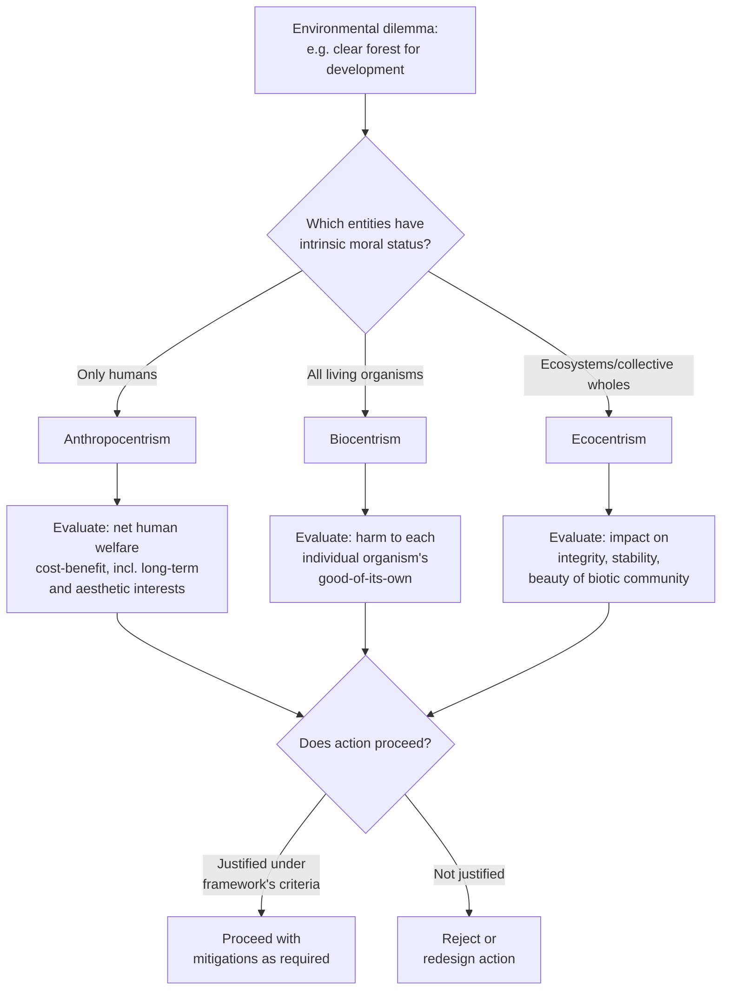

## Anthropocentrism, Biocentrism, and Ecocentrism

### Overview

Anthropocentrism, biocentrism, and ecocentrism are the three foundational ethical frameworks in environmental philosophy that address a core question: **what entities possess moral status, and on what basis?** Moral status (or "moral considerability") determines whether an entity's interests must be weighed in ethical decision-making. These frameworks differ fundamentally in where they draw the boundary of the "moral community" — the set of beings whose welfare matters intrinsically rather than merely instrumentally.

This taxonomy structures much of applied environmental ethics: policy debates over conservation, resource extraction, animal welfare, and ecosystem management often trace back to implicit or explicit commitments to one of these three positions (or a hybrid).

### Core Conceptual Distinctions

**Intrinsic value vs. instrumental value**

- **Instrumental value**: an entity's worth derives from its usefulness to something else (e.g., a forest valued for timber or carbon sequestration)
- **Intrinsic value**: an entity's worth exists independent of its usefulness to others — it is valuable "in itself" or "for its own sake"

The three frameworks are distinguished primarily by which entities they attribute intrinsic value to.

**Moral considerability vs. moral significance**

- **Moral considerability**: whether an entity's interests count at all in ethical deliberation (a threshold, binary-ish question)
- **Moral significance**: how much weight an entity's interests carry relative to others (a matter of degree, often contested even among thinkers who agree on considerability)

### Anthropocentrism

**Definition**

Anthropocentrism holds that human beings are the sole or primary bearers of intrinsic moral value; non-human entities (animals, plants, ecosystems) have, at most, instrumental value insofar as they serve human interests (survival, wellbeing, aesthetic enjoyment, scientific knowledge).

**Philosophical roots**

- Traceable to Aristotelian teleology (a "great chain of being" with humans at the pinnacle due to rational capacity) and reinforced by certain readings of Judeo-Christian dominion theology (e.g., Genesis 1:26–28)
- Kantian ethics is often classified as anthropocentric: Kant argued that only rational, autonomous beings (persons) are ends-in-themselves; duties regarding animals are indirect duties — we should not be cruel to animals because cruelty cultivates vicious character traits harmful to how we treat other humans, not because animals themselves have moral standing

**Variants**

- **Strong/hard anthropocentrism**: only human interests count; nature has purely instrumental value
- **Weak/enlightened anthropocentrism**: human interests remain primary, but the concept of human interest is broadened to include long-term, aesthetic, scientific, and spiritual interests in a flourishing environment — sometimes making practical prescriptions similar to non-anthropocentric views even though the underlying justification remains human-centered

**Environmental policy implications**

Weak anthropocentrism underlies much mainstream environmental policy and economics, including cost-benefit analysis frameworks that value ecosystems via their contribution to human welfare (e.g., ecosystem services valuation, the Social Cost of Carbon as damage to human welfare — see Carbon Pricing and Emissions Trading).

**Key critique**

Critics (biocentrists and ecocentrists) argue anthropocentrism is a form of "speciesism" — an unjustified privileging of one species' interests analogous to racism or sexism — and that it fails to explain the wrongness of, for example, driving a species to extinction that has no discernible use to humans.

### Biocentrism

**Definition**

Biocentrism (from Greek *bios*, life) extends intrinsic moral value to all individual living organisms, not merely humans. The central claim is that being alive — having a good of one's own, a *telos* or biological function that can be furthered or frustrated — is sufficient grounds for moral status, independent of sentience or rationality.

**Key theorists**

- **Albert Schweitzer**: articulated "reverence for life" (*Ehrfurcht vor dem Leben*), holding that all life has a will to live deserving of respect
- **Paul Taylor** (*Respect for Nature*, 1986): the most systematic biocentric theory, arguing that every living organism is a "teleological center of life" pursuing its own good, and that this grounds equal inherent worth across species — a position termed **biocentric egalitarianism**
- **Peter Singer** and **Tom Regan**, while not strictly biocentrist, extended moral status to sentient animals specifically (via capacity for suffering, in Singer's utilitarian framework, or as "subjects-of-a-life" with inherent value, in Regan's rights-based framework) — this is sometimes classified as a distinct **sentientist** or **zoocentric** position, intermediate between anthropocentrism and full biocentrism

**Taylor's four core beliefs underpinning biocentrism**

1. Humans are members of the Earth's community of life on the same terms as other living things
2. All species are part of an interconnected system of interdependence
3. Each organism is a teleological center of life, pursuing its own good in its own way
4. Humans are not inherently superior to other living things

**Practical challenge: the problem of competing claims**

If all organisms have equal inherent worth, how does biocentrism justify humans eating, or antibiotics killing bacteria? Taylor addresses this with priority principles (e.g., self-defense, proportionality between human and non-human interests, minimum wrong) allowing differential treatment without abandoning equal inherent worth — a widely debated area of the theory.

### Ecocentrism

**Definition**

Ecocentrism locates intrinsic value not (only) in individual organisms but in collective ecological entities — species, ecosystems, the biotic community, or the biosphere as a whole. The unit of moral concern shifts from the individual to the systemic/holistic level.

**Key theorists**

- **Aldo Leopold**: originated the **land ethic** in *A Sand County Almanac* (1949), famously summarized: "A thing is right when it tends to preserve the integrity, stability, and beauty of the biotic community. It is wrong when it tends otherwise." Leopold argued for expanding the moral community to include "soils, waters, plants, and animals, or collectively: the land"
- **Arne Naess**: founded **Deep Ecology** (1973), distinguishing "shallow ecology" (environmentalism for human benefit — resource conservation, pollution control) from "deep ecology," which questions anthropocentric assumptions at a foundational level and asserts the equal right of all life forms to "live and blossom," including non-living components of ecosystems in some formulations
- **J. Baird Callicott**: developed and defended Leopold's land ethic philosophically, grounding it partly in Humean/Darwinian sentiment-based ethics (moral sentiments extended via evolutionary kinship and ecological interdependence)

**Deep Ecology's eight-point platform (Naess and Sessions, 1984)**

A widely cited summary includes principles such as: the flourishing of human and non-human life has intrinsic value independent of human usefulness; richness and diversity of life forms are themselves values; humans have no right to reduce this diversity except to satisfy vital needs; present human interference with the non-human world is excessive; and substantial ideological, political, and economic change is required.

**Key critique**

Ecocentrism faces the charge of **"environmental fascism"** (a term coined by Tom Regan) — the concern that prioritizing the collective good of the biotic community over individuals could, in principle, justify sacrificing individual organisms (including humans) for ecosystem "integrity," raising questions about individual rights within a holistic framework. Defenders argue this critique misreads the land ethic as a totalizing single-principle system rather than one consideration among several in an ethical framework.

### Comparative Summary

| Framework | Locus of intrinsic value | Key criterion | Representative thinker | Common critique |
| --- | --- | --- | --- | --- |
| Anthropocentrism | Humans only | Rationality/personhood | Kant | Speciesism |
| Biocentrism | All individual living organisms | Having a "good of one's own" / telos | Paul Taylor | Impractical egalitarianism |
| Ecocentrism | Collective ecological wholes | Ecosystem integrity/stability | Aldo Leopold | Risk of "environmental fascism" |

### Conceptual Structure Diagram (svg_diagram)

<svg xmlns="http://www.w3.org/2000/svg" viewBox="0 0 900 460">
<text x="450" y="30" font-size="18" font-weight="bold" text-anchor="middle" fill="#1a1a1a">Expanding Circles of Moral Considerability (svg_diagram)</text>
<circle cx="450" cy="270" r="180" fill="#eafaf0" stroke="#1f9d55" stroke-width="2" />
<text x="450" y="110" font-size="13" font-weight="bold" text-anchor="middle" fill="#14532d">Ecocentrism</text>
<text x="450" y="128" font-size="10" text-anchor="middle" fill="#333">Ecosystems, species, biotic community</text>
<circle cx="450" cy="290" r="120" fill="#eef5ff" stroke="#2c6fbb" stroke-width="2" />
<text x="450" y="185" font-size="13" font-weight="bold" text-anchor="middle" fill="#1a3c5e">Biocentrism</text>
<text x="450" y="203" font-size="10" text-anchor="middle" fill="#333">All individual living organisms</text>
<circle cx="450" cy="320" r="60" fill="#fff3e6" stroke="#c97a1a" stroke-width="2" />
<text x="450" y="315" font-size="12" font-weight="bold" text-anchor="middle" fill="#5e3c1a">Anthropo-</text>
<text x="450" y="330" font-size="12" font-weight="bold" text-anchor="middle" fill="#5e3c1a">centrism</text>
<text x="450" y="345" font-size="9" text-anchor="middle" fill="#333">Humans only</text>

<text x="450" y="440" font-size="11" text-anchor="middle" fill="#666">Each outer ring adds a broader class of morally considerable entities</text>

</svg>

### Ethical Framework Application Flow

### Applications in Environmental Policy and Practice

- **Anthropocentric framing**: environmental impact assessments, ecosystem services valuation, cost-benefit analysis in regulatory policy, most international climate agreements' justification language (protecting human welfare, health, economic stability)
- **Biocentric framing**: individual species protection under endangered species legislation, animal welfare provisions in environmental law, wildlife rehabilitation ethics
- **Ecocentric framing**: ecosystem-based management, rewilding initiatives, the land ethic's influence on conservation biology, and the emerging legal movement granting **legal personhood or rights of nature** to rivers, forests, and ecosystems (e.g., Whanganui River in New Zealand, 2017; various rights-of-nature provisions in Ecuador's constitution)

[Inference] Because these frameworks yield differing prescriptions primarily in edge cases (e.g., culling an invasive species to protect ecosystem integrity, which anthropocentrism might justify instrumentally, biocentrism might resist on individual-organism grounds, and ecocentrism might endorse for holistic reasons), much real-world environmental policy operates as an implicit, sometimes inconsistent blend of these frameworks rather than a pure application of any single one.

### Related Debates and Extensions

- **Ecofeminism**: argues that the domination of nature and the domination of women share conceptual roots in patriarchal dualistic thinking, offering a distinct critique of anthropocentrism from a different theoretical angle than deep ecology
- **Social ecology** (Murray Bookchin): argues ecological problems stem from hierarchical social domination among humans, which must be resolved before human domination of nature can be addressed — a materially and politically grounded alternative to deep ecology's more spiritual/philosophical approach
- **Environmental pragmatism**: a methodological position (associated with Bryan Norton and others) suggesting environmental ethics should focus on practical policy convergence across frameworks rather than resolving foundational metaphysical disputes about intrinsic value

### Limitations and Open Questions

- **Biocentrism's individualism** struggles to account for ecological wholes (species, ecosystems) as objects of concern in their own right, since a species is not itself a living organism with a telos
- **Ecocentrism's holism** struggles to account for the moral status of individual suffering, potentially licensing sacrifice of individuals for systemic goals
- **Weak anthropocentrism's flexibility** raises the question of whether it is a genuinely distinct position or simply a broadened version of self-interest that converges practically with non-anthropocentric conclusions without sharing their justification
- **Cross-cultural scope**: much canonical Western environmental ethics (Leopold, Naess, Taylor) developed independently of, but with notable convergence to, indigenous and non-Western cosmologies (e.g., many Indigenous worldviews embedding relational, non-hierarchical human-nature relationships) — a growing area of comparative environmental philosophy scholarship

**Related Topics**

- The Land Ethic and Aldo Leopold's Conservation Philosophy
- Deep Ecology and Arne Naess
- Animal Rights vs. Animal Welfare Ethics
- Rights of Nature and Legal Personhood for Ecosystems
- Ecofeminism and Environmental Justice
- Intergenerational Ethics and Sustainability
- Social Cost of Carbon (link to Environmental Economics chapter)
- Indigenous Environmental Knowledge and Relational Ontologies