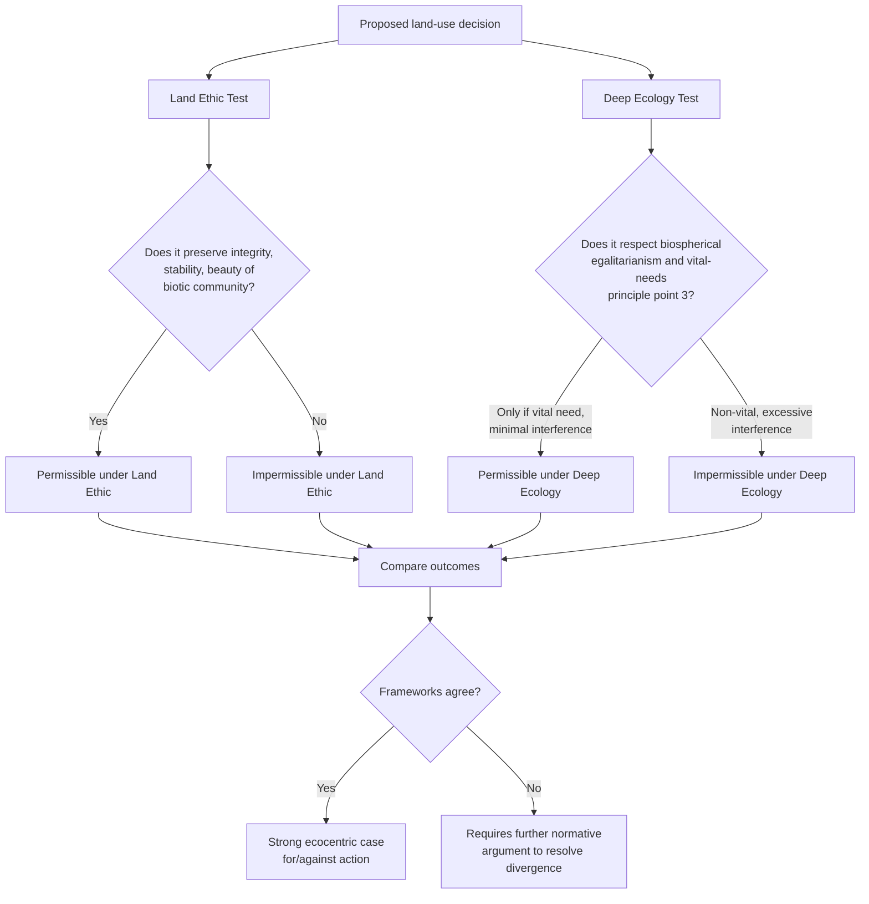

## The Land Ethic and Deep Ecology

### Overview

The Land Ethic and Deep Ecology are the two most influential formulations of ecocentric environmental philosophy, both extending moral consideration beyond individual organisms to ecological wholes. Though frequently discussed together and mutually reinforcing, they emerged from distinct intellectual traditions — the Land Ethic from American conservation biology and pragmatist ethics, Deep Ecology from Scandinavian philosophy and a more explicit engagement with metaphysics, spirituality, and radical social critique. This item builds directly on the ecocentrism category introduced under Anthropocentrism, Biocentrism, and Ecocentrism, providing a focused treatment of these two specific frameworks.

### The Land Ethic

**Origin and central text**

Formulated by American forester, ecologist, and conservationist **Aldo Leopold** (1887–1948) in the essay "The Land Ethic," the concluding chapter of *A Sand County Almanac* (published posthumously, 1949). Leopold's career — spanning the U.S. Forest Service, game management, and wilderness advocacy — informed a philosophy grounded in field ecology rather than abstract metaphysics.

**Core formulation**

Leopold's most cited principle:

> "A thing is right when it tends to preserve the integrity, stability, and beauty of the biotic community. It is wrong when it tends otherwise."

This is a **holistic, consequentialist-structured** ethical maxim: rightness is evaluated by effect on the community as a whole (integrity, stability, beauty), not by effect on any single individual within it.

**The "community concept" and its historical extension**

Leopold's key philosophical move was framed as a natural extension of the historical broadening of ethics ("ethical sequence"):

1. Ethics originally governed relations between individuals (e.g., Mosaic Decalogue)
2. Ethics expanded to govern relations between individual and society (democratic institutions, civil rights)
3. Leopold argued the next necessary extension is an ethic governing the relation of humans to land — "soils, waters, plants, and animals, or collectively: the land"

He termed this an enlargement of "the boundaries of the community to include soils, waters, plants, and animals, or collectively: the land," changing the human role "from conqueror of the land-community to plain member and citizen of it."

**Key concepts within the Land Ethic**

- **Biotic community**: the interdependent web of organisms and their environment, functioning analogously to a human community with interlocking roles ("land pyramid" — Leopold's trophic-level model with soil at the base, ascending through plants, insects, birds/rodents, to larger carnivores)
- **Land health**: Leopold's concept of ecosystem function/capacity for self-renewal, a precursor to modern ecological resilience theory
- **"Thinking like a mountain"**: an essay within the same book illustrating a shift from short-term, single-species management perspective (e.g., eliminating wolves to protect deer) to a systems-level, long-term ecological perspective (wolf removal causing deer overpopulation, overgrazing, and long-term land degradation)

**Philosophical grounding (via J. Baird Callicott)**

Leopold's own writing was more evocative than systematically argued; philosopher **J. Baird Callicott** later provided rigorous philosophical grounding, drawing on:

- **Humean/Darwinian moral sentiment theory**: moral obligations arise from sentiments (sympathy, fellow-feeling) that evolution has extended from kin, to tribe, to species, to — Callicott argues — the broader biotic community, as ecological science reveals genuine interdependence
- This grounds the Land Ethic in naturalistic ethics rather than requiring novel metaphysical claims about intrinsic value in ecosystems as such

**The "environmental fascism" critique and responses**

Philosopher **Tom Regan** argued the Land Ethic, if taken as an overriding single principle, could justify sacrificing individuals (including humans) for the sake of "ecosystem integrity" — a charge of holism overriding individual rights. Callicott's response (in later work, sometimes called the "second-order" or "mixed community" revision) argued:

- The land ethic is not meant to *replace* prior ethical obligations (to family, community, fellow humans) but to *supplement* them as an additional, outermost circle of concern
- Obligations are stronger toward "nearer" communities (human society) than toward the more diffuse biotic community, avoiding the strongest forms of the fascism charge

### Deep Ecology

**Origin and founder**

Coined by Norwegian philosopher **Arne Naess** in his 1973 paper "The Shallow and the Deep, Long-Range Ecology Movement." Naess distinguished:

- **Shallow ecology**: environmentalism motivated by and limited to human interests — pollution control, resource conservation for continued human use, anthropocentric in justification even when its actions resemble deep ecology's
- **Deep ecology**: a more radical position questioning the anthropocentric assumptions underlying shallow ecology at a foundational level, asking "deeper" questions about human relationship to nature, technology, and consumption

**Core philosophical claims**

- **Biospherical egalitarianism (in principle)**: all living beings have an equal right to live and flourish ("blossom"), a position with affinities to biocentrism but extended by Naess to ecological *relations* and *systems*, not only individual organisms
- **Relational, total-field image**: Naess rejected the traditional subject-in-environment ontology (organisms as discrete entities existing "in" an environment) in favor of a **relational total-field image**, where organisms are constituted by their relations within the ecological web — the self is not separable from its ecological relations

**Self-realization and the "ecological Self"**

A distinctive and often-cited concept: Naess argued for expanding the notion of "self" from the narrow ego (**self**, lowercase) to an **ecological Self** (capitalized) that identifies with the wider natural world. Under this framework, protecting nature is not altruistic self-sacrifice but an expression of expanded self-interest, since a fully realized ecological Self experiences harm to nature as harm to itself. This draws partly on Naess's engagement with Spinoza and Gandhian philosophy (non-violence rooted in identification with all beings).

**The eight-point Deep Ecology Platform (Naess and George Sessions, 1984)**

A widely cited summary of core commitments, commonly paraphrased as:

1. The flourishing of human and non-human life has intrinsic value, independent of usefulness for human purposes
2. Richness and diversity of life forms contribute to this flourishing and are values in themselves
3. Humans have no right to reduce this richness and diversity except to satisfy vital needs
4. Present human interference with the non-human world is excessive, and the situation is worsening
5. Flourishing of human life and cultures is compatible with a substantially smaller human population; flourishing of non-human life requires such a decrease
6. Significant change in economic, technological, and ideological structures is required
7. The ideological change is mainly about appreciating quality of life rather than adhering to an increasingly higher standard of living
8. Those who accept the foregoing points have an obligation to participate in implementing necessary changes

**Distinguishing feature: platform vs. ultimate premises**

Naess deliberately structured Deep Ecology so the eight-point platform could be reached from multiple different "ultimate premises" — Buddhist, Christian, secular philosophical, Indigenous, or other worldviews — provided they converge on the platform's practical conclusions. This was intended to make Deep Ecology a pluralistic movement rather than requiring adherence to one specific metaphysics.

### Comparing the Land Ethic and Deep Ecology

| Dimension | Land Ethic (Leopold/Callicott) | Deep Ecology (Naess) |
| --- | --- | --- |
| Intellectual tradition | American conservation biology, Humean ethics | Scandinavian philosophy, Spinozism, Eastern spirituality |
| Central unit of concern | Biotic community (ecosystem) | All beings + relational ecological Self |
| Grounding | Evolved moral sentiment, ecological interdependence | Metaphysical identification (expanded Self) |
| Scope of critique | Land management practices | Entire industrial-consumerist civilization |
| Practical orientation | Conservation science, land management ethics | Radical social/political/personal transformation |
| Population stance | Not explicitly central | Explicit call for population decrease (Point 5) |

### Conceptual Diagram (svg_diagram)

<svg xmlns="http://www.w3.org/2000/svg" viewBox="0 0 900 440">
<text x="450" y="30" font-size="17" font-weight="bold" text-anchor="middle" fill="#1a1a1a">Two Paths to Ecocentrism (svg_diagram)</text>
<rect x="50" y="70" width="360" height="300" rx="8" fill="#eafaf0" stroke="#1f9d55" stroke-width="2" />
<text x="230" y="100" font-size="14" font-weight="bold" text-anchor="middle" fill="#14532d">Land Ethic (Leopold)</text>
<text x="70" y="130" font-size="11" fill="#333">Field ecology + moral sentiment</text>
<text x="70" y="155" font-size="11" fill="#333">↓</text>
<text x="70" y="180" font-size="11" fill="#333">Biotic community as extended</text>
<text x="70" y="198" font-size="11" fill="#333">"community" in ethical sequence</text>
<text x="70" y="225" font-size="11" fill="#333">↓</text>
<text x="70" y="250" font-size="11" fill="#333">Rightness = preserves integrity,</text>
<text x="70" y="268" font-size="11" fill="#333">stability, beauty of biotic community</text>
<text x="70" y="295" font-size="11" fill="#333">↓</text>
<text x="70" y="320" font-size="11" fill="#333">Applied to: land management,</text>
<text x="70" y="338" font-size="11" fill="#333">conservation policy</text>
<rect x="490" y="70" width="360" height="300" rx="8" fill="#eef5ff" stroke="#2c6fbb" stroke-width="2" />
<text x="670" y="100" font-size="14" font-weight="bold" text-anchor="middle" fill="#1a3c5e">Deep Ecology (Naess)</text>
<text x="510" y="130" font-size="11" fill="#333">Relational ontology + Spinozism</text>
<text x="510" y="155" font-size="11" fill="#333">↓</text>
<text x="510" y="180" font-size="11" fill="#333">Total-field image: organisms</text>
<text x="510" y="198" font-size="11" fill="#333">constituted by ecological relations</text>
<text x="510" y="225" font-size="11" fill="#333">↓</text>
<text x="510" y="250" font-size="11" fill="#333">Self-realization: expanded</text>
<text x="510" y="268" font-size="11" fill="#333">"ecological Self" identifies with nature</text>
<text x="510" y="295" font-size="11" fill="#333">↓</text>
<text x="510" y="320" font-size="11" fill="#333">Applied to: radical social,</text>
<text x="510" y="338" font-size="11" fill="#333">economic, personal transformation</text>
<line x1="410" y1="220" x2="490" y2="220" stroke="#888" stroke-width="2" stroke-dasharray="4" />
<text x="450" y="212" font-size="10" text-anchor="middle" fill="#666">converge:</text>
<text x="450" y="400" font-size="12" text-anchor="middle" fill="#333">Both reject anthropocentrism; both ground ethics in ecological interdependence</text>
</svg>

### Reasoning Flow: Applying Both Frameworks

### Influence and Applications

**Land Ethic influence**

- Foundational to modern **conservation biology** as a discipline, particularly ecosystem-based and landscape-scale management approaches
- Cited as philosophical grounding for U.S. environmental legislation debates (though rarely cited directly in statutory text) and for the shift from single-species to ecosystem management in wildlife agencies
- Influenced the **rights of nature** legal movement indirectly, by establishing philosophical precedent for treating ecological wholes as having a "good" that can be preserved or damaged

**Deep Ecology influence**

- Directly inspired **radical environmental movements**, including Earth First! (founded 1980), and various bioregionalist and voluntary-simplicity movements
- Influenced the development of **ecopsychology**, which explores psychological wellbeing through reconnection with nature, drawing on the "ecological Self" concept
- Shaped **wilderness preservation advocacy**, particularly arguments for large-scale rewilding and opposition to human development in remaining wild areas

### Key Critiques

**Of the Land Ethic**

- The "environmental fascism" objection (addressed above via Callicott's mixed-community revision)
- **Vagueness of "integrity, stability, beauty"**: critics note these terms are not operationally well-defined; ecological science has increasingly emphasized dynamic, non-equilibrium ecosystem models, complicating "stability" as a clear management target
- **Is-ought concerns**: deriving ethical obligation from ecological facts about interdependence has been challenged as a naturalistic fallacy, though Callicott's Humean framing (sentiment-based, not fact-deriving-value) is partly designed to avoid this charge

**Of Deep Ecology**

- **Vagueness and internal diversity**: because the eight-point platform is deliberately compatible with many "ultimate premises," critics argue Deep Ecology lacks a single coherent philosophical core, functioning more as a loose movement than a rigorous theory
- **Population politics**: Point 5's call for population reduction has drawn criticism, including concerns (from environmental justice and Global South perspectives) that population-focused environmentalism can shift responsibility away from disproportionate resource consumption in wealthy nations
- **Misanthropy concerns**: critics have argued some rhetoric associated with Deep Ecology (particularly from more radical adherents, not necessarily Naess himself) can read as hostile to human welfare, complicating alliances with social justice and anti-poverty movements
- **Ecofeminist critique**: figures such as Val Plumwood argued Deep Ecology's emphasis on abstract "identification" with nature can obscure how domination of nature is historically and structurally linked to gendered domination, a dynamic requiring more specific socio-political analysis than Deep Ecology's framework provides

[Inference] Given the differing emphases — Leopold/Callicott oriented toward applied land management within existing institutions, Naess oriented toward foundational civilizational critique — these frameworks are more often invoked for different purposes (policy justification vs. movement/identity philosophy) than treated as directly competing theories requiring a choice between them.

**Related Topics**

- Anthropocentrism, Biocentrism, and Ecocentrism
- Ecofeminism and the Critique of Dualistic Thinking
- Rights of Nature and Legal Personhood for Ecosystems
- Conservation Biology and Ecosystem Management
- Ecopsychology and Nature Connectedness
- Social Ecology (Murray Bookchin) as an Alternative Radical Framework
- Bioregionalism and Radical Environmental Movements
- Intergenerational Ethics and Sustainability