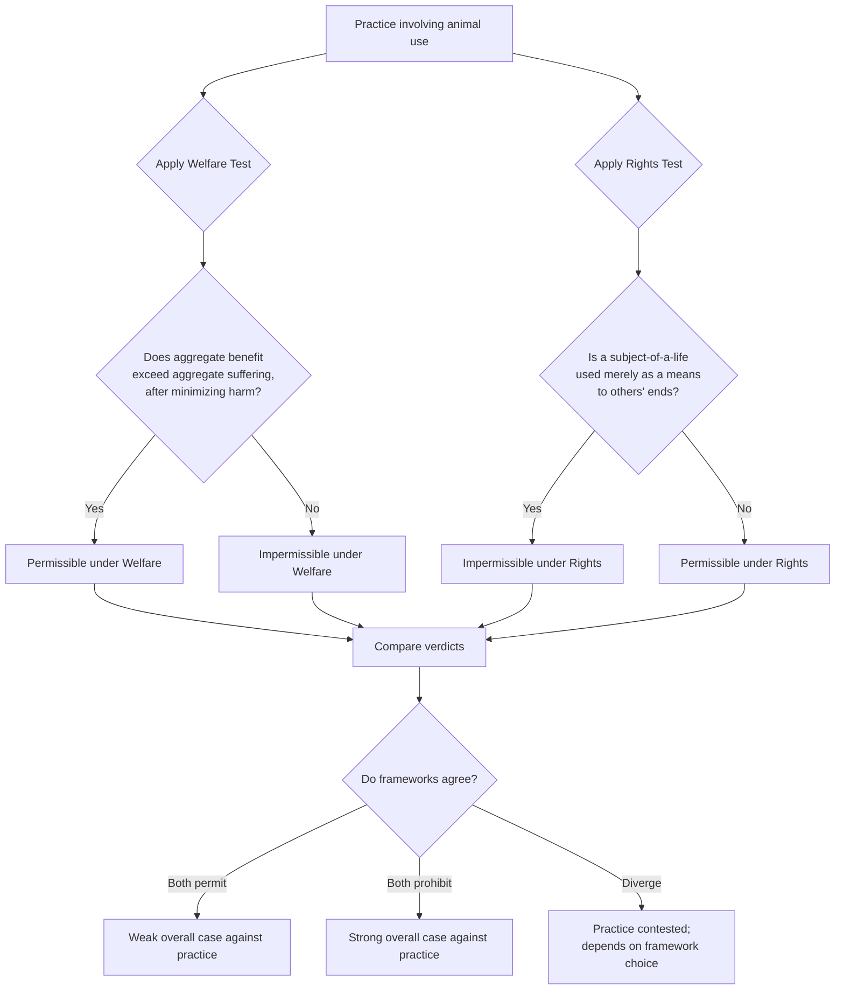

## Animal Rights and Welfare Perspectives

### Overview

Animal rights and animal welfare are two distinct — though sometimes conflated — ethical frameworks addressing the moral status of non-human animals. Both reject strict anthropocentrism's denial of any direct moral status to animals, but they differ fundamentally in the *kind* of moral claim animals are thought to have and, consequently, in their practical prescriptions. Welfare perspectives generally accept the use of animals for human purposes provided suffering is minimized; rights perspectives generally hold that certain uses of animals are impermissible regardless of how humanely they are conducted. This item extends the biocentrism/sentientism discussion introduced under Anthropocentrism, Biocentrism, and Ecocentrism with focused treatment of the animal ethics literature specifically.

### Foundational Distinction: Welfare vs. Rights

| Dimension | Animal Welfare | Animal Rights |
| --- | --- | --- |
| Core claim | Animal suffering matters morally and should be minimized | Certain animals possess rights that may not be permissibly violated |
| Use of animals | Permissible if suffering is adequately minimized | Impermissible for many uses regardless of suffering minimization (e.g., use as property, means to human ends) |
| Ethical framework | Typically consequentialist/utilitarian | Typically deontological (rights-based) |
| Practical goal | Improved conditions (housing, slaughter methods, research protocols) | Abolition of certain practices (factory farming, animal research, some forms of captivity) |
| Key theorist | Peter Singer | Tom Regan |

### Animal Welfare: Utilitarian Foundations

**Peter Singer and preference utilitarianism**

Peter Singer's *Animal Liberation* (1975) is the foundational text of the modern animal welfare/liberation movement, grounded in utilitarian ethics extended from Jeremy Bentham's earlier formulation.

**Bentham's foundational question**

Singer repeatedly cites Bentham's 18th-century framing as the correct starting point for animal ethics:

> "The question is not, Can they *reason*? nor, Can they *talk*? but, Can they *suffer*?"

This reframes moral status around **sentience** (capacity to experience suffering/wellbeing) rather than rationality, language, or personhood — directly countering the Kantian anthropocentric criterion discussed in the prior item.

**The principle of equal consideration of interests**

Singer's central ethical principle is not that animals and humans are *equal* in all respects, but that **relevantly similar interests deserve equal moral weight**, regardless of the species of the being who holds them. A comparable amount of suffering counts equally whether experienced by a human or a non-human animal — moral weight tracks the interest itself (the capacity to suffer), not species membership.

**Speciesism**

Singer coined/popularized the term **speciesism** — analogous to racism or sexism — to describe the unjustified assignment of different moral weight to interests based solely on species membership. He argues this is the same logical error underlying historically rejected forms of discrimination: an arbitrary characteristic (species, race, sex) used to disregard otherwise comparable interests.

**Practical implications: the "argument from marginal cases"**

A widely discussed argument used by Singer and others: many humans (infants, individuals with severe cognitive disabilities) lack the higher cognitive capacities (rationality, self-awareness, moral agency) sometimes proposed as the basis for human moral status. If such capacities are the true criterion, these humans would lack full moral status too — a conclusion virtually all frameworks reject. Since we do not deny moral status to these humans, the argument holds that cognitive capacity cannot coherently be the criterion separating humans from animals with comparable capacities; sentience remains the more defensible baseline criterion.

**Calculating suffering: the utilitarian calculus applied to animal use**

Under Singer's framework, whether a practice is justified depends on aggregate welfare: does the practice produce more suffering than benefit, weighted appropriately across all sentient beings affected? This permits, in principle, animal use where benefits substantially outweigh suffering (e.g., some forms of medical research with high expected human benefit and minimized animal suffering) while condemning practices with high aggregate suffering and low benefit (e.g., factory farming for taste preference).

### Animal Rights: Deontological Foundations

**Tom Regan and the "subject-of-a-life" criterion**

Tom Regan's *The Case for Animal Rights* (1983) rejects the utilitarian framework entirely, arguing it permits impermissible harms to individuals whenever aggregate welfare calculations favor it (e.g., in principle, sacrificing one being's serious interests if it maximizes aggregate utility). Regan instead grounds animal ethics in **inherent value** and **rights**.

**The subject-of-a-life criterion**

Regan argues that any being that is a **"subject-of-a-life"** possesses inherent value and, correspondingly, basic moral rights. A subject-of-a-life:

- Has beliefs and desires
- Has perception, memory, and a sense of the future, including its own future
- Has an emotional life, with feelings of pleasure and pain
- Has preference- and welfare-interests
- Has the ability to initiate action in pursuit of desires and goals
- Has a psychophysical identity over time
- Has an individual welfare in the sense that its life can go well or badly for it, independent of its utility to others

Regan argues normal mammals (roughly age one or more) clearly meet this criterion.

**Inherent value and the "respect principle"**

Beings with inherent value must be treated as ends in themselves (echoing Kantian structure, but extended beyond rational agents) — never merely as means to others' ends. This is a stronger and more absolute claim than welfare's "minimize suffering": it implies certain uses of animals (as research subjects, as food, as entertainment) are wrong in principle, not merely wrong when conducted cruelly.

**Critique of utilitarianism's "aggregation problem"**

Regan's central objection to Singer: utilitarianism, in principle, could justify severe harm to an individual (human or animal) if it produces sufficient aggregate benefit to others — treating the individual as a vessel of experiences to be summed rather than a being with inviolable status. Rights theory blocks this by treating certain interests as protected regardless of aggregate calculation.

### Comparative Table: Practical Divergence

| Practice | Welfare (Singer) verdict | Rights (Regan) verdict |
| --- | --- | --- |
| Factory farming | Wrong due to severe, unnecessary suffering; improved conditions could reduce (not necessarily eliminate) the wrong | Wrong in principle; animals used purely as means/property regardless of conditions |
| Humane, pasture-raised farming with painless slaughter | Potentially permissible if suffering is genuinely minimized and benefits justify remaining harm | Still wrong; animal's life and interests are subordinated to human ends regardless of conditions |
| Animal research (high-benefit medical) | Potentially justified case-by-case via cost-benefit analysis | Generally impermissible; using a subject-of-a-life merely as a means violates the respect principle |
| Zoos/captivity | Evaluated by welfare conditions provided | Generally opposed; confinement itself may violate the animal's basic rights/interests regardless of care quality |

### Sentientism as an Intermediate Category

Both Singer's welfarism and Regan's rights theory are sometimes grouped under the broader label **sentientism** — extending moral status specifically to sentient beings (capable of subjective experience), distinguishing them from full biocentrism (which extends status to all living things, sentient or not, per Paul Taylor). This positions animal ethics as occupying a middle ground on the spectrum introduced in the anthropocentrism/biocentrism/ecocentrism taxonomy: broader than strict anthropocentrism, narrower than full biocentrism.

### Conceptual Diagram (svg_diagram)

<svg xmlns="http://www.w3.org/2000/svg" viewBox="0 0 900 420">
<text x="450" y="30" font-size="17" font-weight="bold" text-anchor="middle" fill="#1a1a1a">Two Frameworks for Animal Ethics (svg_diagram)</text>
<rect x="50" y="70" width="360" height="280" rx="8" fill="#eef5ff" stroke="#2c6fbb" stroke-width="2" />
<text x="230" y="100" font-size="14" font-weight="bold" text-anchor="middle" fill="#1a3c5e">Welfare (Singer)</text>
<text x="70" y="130" font-size="11" fill="#333">Criterion: capacity to suffer</text>
<text x="70" y="155" font-size="11" fill="#333">(sentience)</text>
<text x="70" y="185" font-size="11" fill="#333">Framework: utilitarian —</text>
<text x="70" y="203" font-size="11" fill="#333">equal consideration of interests</text>
<text x="70" y="233" font-size="11" fill="#333">Test: does aggregate benefit</text>
<text x="70" y="251" font-size="11" fill="#333">outweigh aggregate suffering?</text>
<text x="70" y="281" font-size="11" fill="#333">Prescription: minimize suffering;</text>
<text x="70" y="299" font-size="11" fill="#333">some uses remain permissible</text>
<text x="70" y="329" font-size="11" fill="#333">if net positive</text>
<rect x="490" y="70" width="360" height="280" rx="8" fill="#fdeaea" stroke="#c0392b" stroke-width="2" />
<text x="670" y="100" font-size="14" font-weight="bold" text-anchor="middle" fill="#7b241c">Rights (Regan)</text>
<text x="510" y="130" font-size="11" fill="#333">Criterion: subject-of-a-life</text>
<text x="510" y="155" font-size="11" fill="#333">(beliefs, desires, sense of future)</text>
<text x="510" y="185" font-size="11" fill="#333">Framework: deontological —</text>
<text x="510" y="203" font-size="11" fill="#333">inherent value, respect principle</text>
<text x="510" y="233" font-size="11" fill="#333">Test: does the practice use the</text>
<text x="510" y="251" font-size="11" fill="#333">animal merely as a means?</text>
<text x="510" y="281" font-size="11" fill="#333">Prescription: abolish practices</text>
<text x="510" y="299" font-size="11" fill="#333">treating subjects-of-a-life as</text>
<text x="510" y="317" font-size="11" fill="#333">property or mere means</text>
</svg>

### Ethical Evaluation Flow

### Applications and Policy Relevance

- **Animal welfare legislation**: most existing law (humane slaughter acts, animal welfare acts, research protocol requirements such as the "3Rs" — Replacement, Reduction, Refinement) reflects welfare rather than rights logic, regulating conditions of use rather than prohibiting use itself
- **Animal rights advocacy**: informs abolitionist movements seeking to end specific practices entirely (e.g., campaigns against fur farming, some forms of animal testing, factory farming as a category) rather than merely improve conditions
- **Legal personhood litigation**: rights-based reasoning has informed legal efforts (e.g., the Nonhuman Rights Project's habeas corpus litigation on behalf of chimpanzees and elephants) seeking to establish limited legal personhood for animals with advanced cognitive capacities, distinct from property status
- **Corporate and consumer response**: welfare-oriented certification schemes (cage-free, pasture-raised, "humane certified" labeling) reflect welfarist logic; plant-based/veganism advocacy is frequently (though not always) grounded in rights-based reasoning

### Key Critiques

**Of Welfare (Singer)**

- **Aggregation problem** (from rights theorists): utilitarian calculus can, in principle, justify severe individual harm if aggregate benefit is sufficient, a structural feature critics find morally troubling regardless of how it plays out in specific cases
- **Preference utilitarianism's demandingness**: consistently applying equal consideration of interests arguably requires far more radical changes to human behavior (diet, research practices, land use) than most welfare-labeled reforms actually implement, creating a gap between theory and typical welfarist practice

**Of Rights (Regan)**

- **Line-drawing problem**: the subject-of-a-life criterion, while clearer than "sentience" in some respects, still requires a threshold (e.g., "normal mammals age one or more") that critics argue is somewhat arbitrary and difficult to extend principled to invertebrates, insects, or other organisms with uncertain cognitive profiles
- **Practical inflexibility**: rights-based absolutism can struggle with genuine conflict cases (e.g., necessary medical research with no adequate non-animal alternative) where welfare's cost-benefit structure offers more actionable guidance
- **Scope limitation**: because it depends on relatively rich cognitive criteria, Regan's framework provides less clear guidance for the vast majority of animals (most fish, all invertebrates) that plausibly do not meet the subject-of-a-life threshold, despite plausibly having welfare interests

[Inference] Because welfare and rights frameworks yield convergent prescriptions in many real-world cases (both condemn factory farming, both support improved research protocols) but diverge sharply on whether reform or abolition is the appropriate goal, most public debate and policy in this area proceeds along welfarist lines even where rights-based arguments provide the more philosophically demanding foundation — a gap frequently noted within the animal ethics literature itself.

**Related Topics**

- Anthropocentrism, Biocentrism, and Ecocentrism
- The Land Ethic and Deep Ecology
- Speciesism and the Argument from Marginal Cases
- Factory Farming and Industrial Agriculture Ethics
- Legal Personhood for Non-Human Animals
- Utilitarian vs. Deontological Ethical Frameworks
- Ecofeminism and Animal Ethics
- Wildlife Conservation Ethics and Population Management