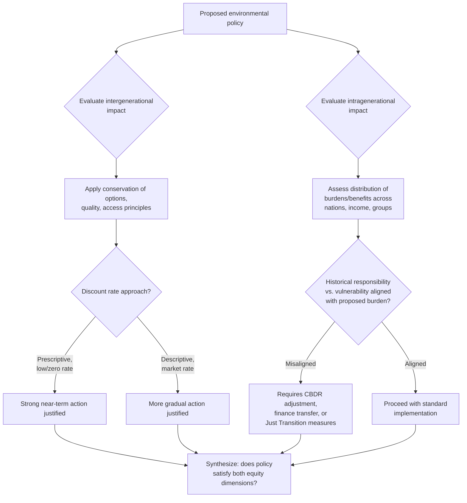

## Intergenerational and Intragenerational Equity

### Overview

Intergenerational and intragenerational equity are the two principal justice dimensions structuring environmental ethics and sustainability theory. **Intergenerational equity** concerns fairness between present and future generations — what obligations current people owe to those not yet born. **Intragenerational equity** concerns fairness *within* the current generation — how environmental benefits, burdens, and decision-making power are distributed across nations, communities, and social groups living today. Both concepts are foundational to the standard definition of sustainable development and recur throughout climate policy, resource management, and environmental justice discourse.

### Intergenerational Equity

**Conceptual foundation**

Intergenerational equity asks: do future generations have moral claims against present decision-makers, and if so, what do those claims require? This raises distinctive philosophical puzzles because future people:

- Do not yet exist and cannot participate in present decision-making or bargaining
- Have no ability to reciprocate benefits conferred or protest harms imposed
- Have identities and preferences partly *determined by* present choices (the "non-identity problem," below), complicating standard harm-based reasoning

**The Brundtland formulation**

The most widely cited definition of sustainable development, from the 1987 UN World Commission on Environment and Development report *Our Common Future* ("the Brundtland Report"), explicitly frames sustainability around intergenerational equity:

> "Development that meets the needs of the present without compromising the ability of future generations to meet their own needs."

This formulation established intergenerational equity as the organizing principle of mainstream sustainability policy, though it leaves significant interpretive latitude regarding what "needs" encompasses and how tradeoffs are to be assessed.

**Edith Brown Weiss's theory of intergenerational equity**

International law scholar Edith Brown Weiss developed one of the most systematic legal-philosophical treatments (*In Fairness to Future Generations*, 1989), proposing three core principles derived from treating generations as partners in a trust relationship over the planet:

1. **Conservation of options**: each generation should conserve the diversity of natural and cultural resources so as not to unduly restrict future generations' options for solving their own problems
2. **Conservation of quality**: each generation should maintain the quality of the planet so it is passed on in no worse condition than it was received
3. **Conservation of access**: each generation should provide equitable access to the use and benefits of the legacy from past generations, and conserve this access for future generations

**Discounting and the ethics of the discount rate**

A central technical-ethical debate concerns how to weigh costs and benefits occurring at different points in time, especially relevant to climate economics (see Carbon Pricing and Emissions Trading, Social Cost of Carbon). The standard discounted present value formula:

$$PV = \frac{V_t}{(1+r)^t}$$

where $V_t$ is value at time $t$ and $r$ is the discount rate. A positive discount rate means costs/benefits to future generations are weighted less than equivalent costs/benefits today.

The choice of $r$ has enormous practical consequences for climate policy, most famously illustrated by the divergence between:

- **Stern Review (2006)**: used a very low discount rate (close to zero, reflecting an ethical argument that pure time preference — valuing the present over the future *merely because* it is present — is unjustifiable), concluding aggressive near-term climate action is strongly justified on cost-benefit grounds
- **William Nordhaus's DICE model**: used a higher, more market-based discount rate reflecting observed savings/investment behavior, concluding a more gradual, less front-loaded climate policy is economically optimal

This is often summarized as a dispute between a **prescriptive approach** (what discount rate is ethically justified, independent of market behavior) and a **descriptive approach** (what discount rate reflects actual observed preferences, via market interest rates).

**The non-identity problem (Derek Parfit)**

A well-known philosophical puzzle in Parfit's *Reasons and Persons* (1984): policy choices affecting the environment also affect *which* people come to exist in the future (different policies lead to different people being born, due to effects on timing of conception, migration, etc.). This complicates standard harm-based reasoning: if a future person would not have existed at all under an alternative policy, can that person be said to be "harmed" by a policy that leaves them worse off than some *other possible future person*, if their own existence depends on the very policy in question? Parfit argues we still have strong reasons to care about future welfare, but that these reasons cannot always be grounded in claims about harming *specific identifiable individuals* — a challenge extensively discussed in population ethics and climate ethics literature.

**Practical instruments for intergenerational equity**

- **Public trust doctrine**: legal principle holding certain natural resources are held in trust by government for public use, including future generations, invoked in some climate litigation (e.g., youth-led climate lawsuits invoking government trustee obligations)
- **Sovereign wealth/resource funds**: mechanisms (e.g., Norway's Government Pension Fund Global) converting non-renewable resource revenue into financial assets intended to benefit future generations, operationalizing conservation of access
- **Long-term environmental targets and legislated carbon budgets**: binding multi-decade targets (e.g., net-zero legislation) designed to constrain near-term decisions in the interest of long-term outcomes

### Intragenerational Equity

**Conceptual foundation**

Intragenerational equity concerns the distribution of environmental benefits and burdens among people alive today, across dimensions including nation, income, race, gender, and Indigenous status. It is closely tied to, and substantially overlaps with, the **environmental justice** movement.

**Key dimensions of intragenerational inequity**

- **North-South disparities in responsibility and vulnerability**: industrialized nations have historically contributed disproportionately to cumulative global emissions, while many lower-income nations — often with lower historical emissions — face disproportionate climate change impacts (sea-level rise, extreme heat, agricultural disruption) due to geography and lower adaptive capacity
- **Within-country disparities**: lower-income communities and communities of color frequently bear disproportionate exposure to pollution, hazardous waste siting, and industrial contamination, a pattern extensively documented in environmental justice research since the 1980s (e.g., the 1987 United Church of Christ report on toxic waste siting patterns in the United States)
- **Gendered dimensions**: in many contexts, women bear disproportionate burdens from environmental degradation (e.g., water scarcity increasing labor burden in water collection) while remaining underrepresented in environmental decision-making processes
- **Indigenous and traditional communities**: often experience compounded environmental injustice, as resource extraction and conservation policy alike have historically displaced Indigenous communities from traditional lands without adequate consultation or benefit-sharing

**Common but Differentiated Responsibilities (CBDR)**

A foundational principle in international environmental law, first articulated in Principle 7 of the 1992 Rio Declaration, holding that while all states share responsibility for addressing global environmental problems, historical and current contributions to the problem — and differing capacities to respond — justify differentiated obligations between developed and developing nations. This principle has structured international climate negotiations, including the UNFCCC's original Annex I/Non-Annex I country distinction and ongoing debates over climate finance obligations.

**Climate finance and loss and damage**

Intragenerational equity concerns have driven specific international finance mechanisms:

- **Climate finance commitments**: developed countries' pledged financial support (e.g., the $100 billion/year commitment made at COP15/COP16, later extended and revised) to support developing country mitigation and adaptation
- **Loss and Damage Fund**: established at COP27 (2022) and operationalized in subsequent COPs, specifically addressing compensation for climate impacts that exceed the limits of adaptation, reflecting the principle that those least responsible for emissions often face the most severe unavoidable harms

**Just Transition**

A framework addressing intragenerational equity *within* the shift away from fossil fuel economies, emphasizing that workers and communities dependent on carbon-intensive industries (coal mining regions, for example) should not bear disproportionate costs of decarbonization without support — retraining programs, economic diversification investment, and social protection during transition.

### Comparative Framework

| Dimension | Intergenerational Equity | Intragenerational Equity |
| --- | --- | --- |
| Primary axis of concern | Present generation vs. future generations | Distribution among people alive today |
| Key challenge | Future people cannot participate/reciprocate; non-identity problem | Historical responsibility vs. current vulnerability mismatch |
| Key legal/policy concept | Public trust doctrine, conservation of options | Common but Differentiated Responsibilities |
| Key economic tool | Discount rate selection | Climate finance, Loss and Damage funding |
| Representative framework | Brown Weiss's trust principles | Just Transition, environmental justice movement |

### Interaction Between the Two Dimensions

The two forms of equity frequently interact and can create tension in policy design:

- Aggressive near-term decarbonization (favoring intergenerational equity, protecting future generations from severe climate damage) can impose significant near-term costs on carbon-dependent workers and lower-income energy consumers today (an intragenerational equity concern) unless paired with Just Transition measures
- Conversely, prioritizing near-term economic development in lower-income nations (an intragenerational equity claim, given historical responsibility asymmetries) can, absent decoupling of growth from emissions, increase cumulative emissions affecting future generations globally

[Inference] Because these two equity dimensions can pull toward different policy prescriptions in specific cases, much international climate negotiation friction (e.g., over differentiated obligations and finance) reflects an underlying, often implicit disagreement about how to weigh intergenerational and intragenerational equity claims against each other, rather than disagreement about climate science itself.

### Conceptual Diagram (svg_diagram)

<svg xmlns="http://www.w3.org/2000/svg" viewBox="0 0 900 440">
<text x="450" y="30" font-size="17" font-weight="bold" text-anchor="middle" fill="#1a1a1a">Two Axes of Environmental Equity (svg_diagram)</text>
<line x1="120" y1="220" x2="780" y2="220" stroke="#333" stroke-width="2" />
<text x="780" y="245" font-size="11" text-anchor="middle" fill="#333">Future</text>
<text x="120" y="245" font-size="11" text-anchor="middle" fill="#333">Present</text>
<text x="450" y="205" font-size="12" font-weight="bold" text-anchor="middle" fill="#1a3c5e">Intergenerational axis (time)</text>
<line x1="450" y1="80" x2="450" y2="360" stroke="#333" stroke-width="2" />
<text x="450" y="75" font-size="11" text-anchor="middle" fill="#333">High responsibility /\nlow vulnerability</text>
<text x="450" y="390" font-size="11" text-anchor="middle" fill="#333">Low responsibility /\nhigh vulnerability</text>
<text x="500" y="130" font-size="12" font-weight="bold" fill="#7b241c">Intragenerational axis (distribution)</text>
<circle cx="250" cy="150" r="8" fill="#2c6fbb" />
<text x="250" y="135" font-size="10" text-anchor="middle" fill="#333">Industrialized nations,</text>
<text x="250" y="120" font-size="10" text-anchor="middle" fill="#333">present day</text>
<circle cx="650" cy="150" r="8" fill="#c0392b" />
<text x="650" y="135" font-size="10" text-anchor="middle" fill="#333">Low-income nations,</text>
<text x="650" y="120" font-size="10" text-anchor="middle" fill="#333">present day</text>
<circle cx="650" cy="290" r="8" fill="#b9770e" />
<text x="650" y="315" font-size="10" text-anchor="middle" fill="#333">Future generations,</text>
<text x="650" y="330" font-size="10" text-anchor="middle" fill="#333">vulnerable regions</text>
</svg>

### Policy Reasoning Flow

### Applications in Policy and Law

- **UNFCCC and Paris Agreement architecture**: Nationally Determined Contributions (NDCs) combined with differentiated finance obligations operationalize both equity dimensions within a single treaty framework
- **Youth-led climate litigation**: cases invoking intergenerational equity and public trust doctrine (e.g., constitutional and public trust claims brought by young plaintiffs in multiple jurisdictions) directly test legal recognition of future generations' interests
- **Environmental justice regulatory frameworks**: siting requirements, cumulative impact assessments, and community engagement mandates in environmental permitting increasingly incorporate intragenerational equity considerations explicitly
- **Sustainable Development Goals (SDGs)**: the UN's 2030 Agenda integrates both dimensions, with goals addressing present inequality (SDG 10, reduced inequalities) alongside long-term sustainability targets (SDG 13, climate action)

### Limitations and Open Questions

- **Operationalizing "needs"**: the Brundtland definition's reference to "needs" leaves substantial interpretive latitude, with debates over whether it implies a minimum sufficiency threshold or a more expansive equity standard
- **Discount rate disagreement remains unresolved**: the Stern-Nordhaus divergence reflects a genuine, unresolved normative disagreement (not merely a technical/empirical one) about how to weigh present versus future welfare, with significant policy stakes
- **Non-identity problem's implications remain contested**: philosophers disagree about whether Parfit's puzzle meaningfully weakens obligations to future generations or whether alternative ethical frameworks (e.g., impersonal or population-level reasoning) adequately preserve strong future-oriented obligations despite it
- **Measuring historical responsibility**: attributing cumulative historical emissions responsibility involves contested methodological choices (production-based vs. consumption-based accounting, treatment of emissions predating widespread scientific understanding of climate change) that affect intragenerational equity calculations in international negotiations

**Related Topics**

- Social Cost of Carbon and Discount Rate Debates
- Environmental Justice and the Environmental Justice Movement
- Just Transition and Labor in Decarbonization
- The Non-Identity Problem and Population Ethics
- Common but Differentiated Responsibilities in International Law
- Loss and Damage Finance Mechanisms
- Carbon Pricing and Emissions Trading
- Sustainable Development Goals (SDGs) Framework