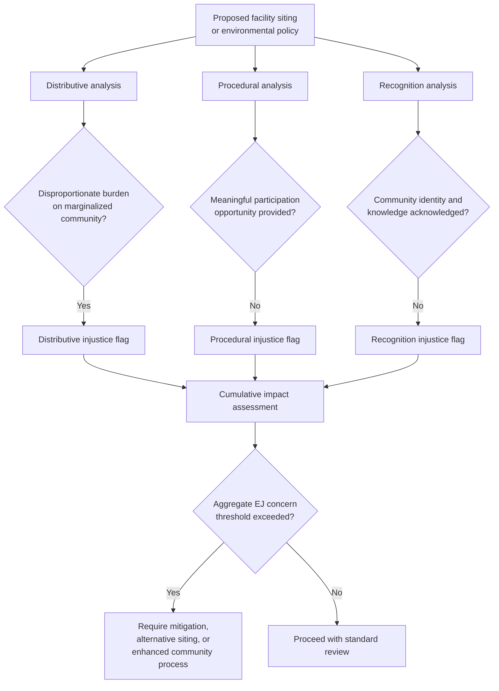

## Environmental Justice Theory

### Overview

Environmental Justice (EJ) theory examines the disproportionate distribution of environmental burdens and benefits across racial, ethnic, socioeconomic, and geographic lines, and the processes by which affected communities are — or are not — included in environmental decision-making. Unlike the more abstract normative frameworks covered in Anthropocentrism, Biocentrism, and Ecocentrism, environmental justice emerged substantially from grassroots social movements and empirical documentation of disparate environmental harm, later developing into a rigorous academic field integrating sociology, law, public health, and political theory. It operationalizes and extends the intragenerational equity concerns introduced in the prior item.

### Historical Origins

**Early grassroots catalysts**

- **Warren County, North Carolina (1982)**: widely cited as the catalytic event of the modern EJ movement — protests against the siting of a PCB (polychlorinated biphenyl) landfill in a predominantly Black, low-income county, resulting in over 500 arrests and drawing national attention to the pattern of hazardous waste siting in marginalized communities
- **1987 United Church of Christ report, "Toxic Wastes and Race in the United States"**: the first major national study systematically documenting the correlation between race and proximity to hazardous waste facilities, finding race to be the single most significant variable associated with the location of commercial hazardous waste facilities — more significant than income, home values, or other socioeconomic indicators tested
- **Robert Bullard**, often called the "father of environmental justice," produced foundational empirical scholarship (*Dumping in Dixie*, 1990) documenting environmental racism in siting decisions across the American South, establishing much of the field's early methodological approach

**The 1991 First National People of Color Environmental Leadership Summit**

A landmark gathering that produced the **17 Principles of Environmental Justice**, articulating a comprehensive framework connecting environmental protection to civil rights, self-determination, and social justice — establishing EJ as a movement led by and centered on affected communities of color rather than a subset of mainstream environmentalism.

**Institutional recognition**

- **Executive Order 12898** (1994, Clinton administration): directed U.S. federal agencies to identify and address disproportionately high adverse human health or environmental effects of their programs on minority and low-income populations, formally embedding EJ considerations into federal environmental review processes (though implementation and enforcement strength have varied considerably across subsequent administrations)
- **EPA Office of Environmental Justice**: established to coordinate federal EJ policy and, in various periods, administer EJ-focused grant programs and mapping tools (e.g., EJSCREEN, a national environmental justice screening and mapping tool)

### Theoretical Framework: Three Dimensions of Justice

Environmental justice scholarship typically decomposes justice into three interrelated dimensions, drawing on broader theories of justice (notably influenced by Iris Marion Young and Nancy Fraser's work on distribution and recognition):

**1. Distributive justice**

Concerns the *distribution* of environmental goods (clean air, green space, safe drinking water) and bads (pollution, hazardous facilities, contamination). The empirical core of EJ scholarship, documenting disparities such as:

- Disproportionate siting of landfills, incinerators, chemical plants, and highways near communities of color and low-income communities
- Elevated exposure to air pollution, lead contamination, and industrial toxins in marginalized neighborhoods
- Unequal access to environmental amenities — parks, tree canopy, clean water infrastructure

**2. Procedural justice**

Concerns *who participates* in environmental decision-making and *how* — whether affected communities have meaningful, informed input into permitting decisions, facility siting, and environmental policy, or whether decisions are made *about* them without adequate consultation. Procedural justice is often assessed by:

- Access to information (environmental impact disclosures, public hearing notices) in accessible language and formats
- Genuine opportunity to influence outcomes, not merely symbolic consultation after decisions are effectively finalized
- Presence of community members in decision-making bodies and regulatory agencies

**3. Recognition justice** (also termed justice as recognition)

Concerns whether the distinct identities, knowledge systems, and ways of life of affected communities are acknowledged and respected in environmental governance, rather than treated as generic or interchangeable populations. This dimension is particularly significant for:

- Indigenous communities, whose traditional ecological knowledge and land relationships are often marginalized in conventional environmental science and policy frameworks
- Communities whose cultural or subsistence practices (e.g., subsistence fishing, traditional agriculture) create exposure pathways not captured by standard risk assessment models calibrated to different populations

**A fourth dimension increasingly discussed in the literature**

**Capabilities-based justice** (drawing on Amartya Sen and Martha Nussbaum's capabilities approach): assesses environmental justice not only by distribution or process but by whether environmental conditions support each person's genuine capability to live a flourishing life — shifting focus from resource distribution alone to substantive opportunity and functioning.

### Environmental Racism

A term (attributed to Benjamin Chavis, who helped coin it in the context of the 1987 UCC report) describing the specific pattern by which environmental policies, practices, and decisions disproportionately burden communities of color, whether through:

- **Intentional discriminatory siting**: historical evidence of facility siting decisions explicitly or implicitly informed by racial composition of communities and reduced political power to resist
- **Structural/systemic patterns**: disparities arising from cumulative historical processes (redlining, zoning, disinvestment) that concentrated industrial land use and marginalized populations in overlapping geographic areas even absent single discrete discriminatory decisions

[Inference] The distinction between intentional and structural environmental racism matters significantly for legal remedies, since U.S. civil rights law (e.g., Title VI of the Civil Rights Act) has generally required proof of discriminatory intent for certain claims, a standard that critics argue is poorly suited to redressing disparities arising primarily from structural and historical processes rather than single identifiable discriminatory acts.

### Key Empirical Concepts and Methods

**Cumulative impact assessment**

Recognizes that communities are frequently exposed to *multiple* simultaneous environmental and social stressors (several pollution sources, poor housing quality, limited healthcare access, economic stress), and that conventional single-pollutant, single-source regulatory review can understate the actual health burden faced by a community. Cumulative impact frameworks attempt to model aggregate exposure and vulnerability rather than evaluating each permit or facility in isolation.

**Environmental justice mapping and screening tools**

GIS-based tools overlaying environmental hazard data with demographic and socioeconomic data to identify EJ communities, used for regulatory targeting, grant allocation, and research. Examples include EPA's EJSCREEN (U.S.) and equivalent tools in other jurisdictions, which typically combine indicators such as:

- Proximity to pollution sources (Superfund sites, air emissions, wastewater discharge)
- Demographic indicators (percent low-income, percent minority population)
- Health vulnerability indicators (asthma rates, life expectancy, low birth weight)

**Environmental health disparities research**

A substantial empirical literature has documented correlations between EJ community status and adverse health outcomes (respiratory illness, elevated blood lead levels, certain cancers), though establishing causal attribution for specific facilities or exposures — as opposed to documenting statistical association — often requires substantial additional epidemiological work given confounding factors (housing quality, healthcare access, occupational exposure) that frequently co-occur with facility proximity.

### Comparative Table: Three Justice Dimensions

| Dimension | Core question | Example indicator | Example remedy |
| --- | --- | --- | --- |
| Distributive | Who bears the pollution burden? | Facility proximity, exposure levels | Siting restrictions, cumulative impact caps |
| Procedural | Who has a voice in decisions? | Public participation quality, language access | Mandatory community consultation, translated materials |
| Recognition | Whose knowledge/identity is acknowledged? | Inclusion of traditional ecological knowledge | Co-management agreements, cultural impact assessment |
| Capabilities | Can people actually flourish? | Health outcomes, access to opportunity | Investment beyond pollution reduction alone |

### Conceptual Diagram (svg_diagram)

<svg xmlns="http://www.w3.org/2000/svg" viewBox="0 0 900 440">
<text x="450" y="30" font-size="17" font-weight="bold" text-anchor="middle" fill="#1a1a1a">Dimensions of Environmental Justice (svg_diagram)</text>
<rect x="60" y="70" width="230" height="280" rx="8" fill="#eef5ff" stroke="#2c6fbb" stroke-width="2" />
<text x="175" y="100" font-size="13" font-weight="bold" text-anchor="middle" fill="#1a3c5e">Distributive</text>
<text x="80" y="135" font-size="10" fill="#333">Who bears pollution,</text>
<text x="80" y="153" font-size="10" fill="#333">hazard, and burden?</text>
<text x="80" y="185" font-size="10" fill="#333">Measured via facility</text>
<text x="80" y="203" font-size="10" fill="#333">proximity, exposure data</text>
<rect x="330" y="70" width="230" height="280" rx="8" fill="#eafaf0" stroke="#1f9d55" stroke-width="2" />
<text x="445" y="100" font-size="13" font-weight="bold" text-anchor="middle" fill="#14532d">Procedural</text>
<text x="350" y="135" font-size="10" fill="#333">Who participates in</text>
<text x="350" y="153" font-size="10" fill="#333">decisions, and how?</text>
<text x="350" y="185" font-size="10" fill="#333">Measured via consultation</text>
<text x="350" y="203" font-size="10" fill="#333">quality, information access</text>
<rect x="600" y="70" width="230" height="280" rx="8" fill="#fff3e6" stroke="#c97a1a" stroke-width="2" />
<text x="715" y="100" font-size="13" font-weight="bold" text-anchor="middle" fill="#5e3c1a">Recognition</text>
<text x="620" y="135" font-size="10" fill="#333">Whose identity and</text>
<text x="620" y="153" font-size="10" fill="#333">knowledge is respected?</text>
<text x="620" y="185" font-size="10" fill="#333">Measured via inclusion of</text>
<text x="620" y="203" font-size="10" fill="#333">traditional/local knowledge</text>

<text x="450" y="400" font-size="12" text-anchor="middle" fill="#333">All three dimensions typically required for a community to be treated justly</text>

</svg>

### EJ Analysis Flow

### Global and Comparative Dimensions

While the movement originated substantially in the U.S. civil rights context, environmental justice concerns and frameworks have developed globally with distinct emphases:

- **Environmental justice in the Global South**: often centers on resource extraction conflicts (mining, oil extraction, deforestation), land dispossession, and the relationship between environmental degradation and post-colonial economic structures — sometimes framed through the related concept of **environmentalism of the poor** (Joan Martínez-Alier), emphasizing that marginalized communities' environmental activism is frequently driven by direct livelihood dependence on local ecosystems rather than post-material environmental values
- **Climate justice**: an extension of EJ principles to climate change specifically, connecting disproportionate climate vulnerability (see Intergenerational and Intragenerational Equity) to historical emissions responsibility and demanding both mitigation ambition and adaptation finance for most-affected, least-responsible populations
- **Indigenous environmental justice**: emphasizes sovereignty, treaty rights, and self-determination as distinct legal and political claims, not fully reducible to the distributive/procedural/recognition framework developed primarily in non-Indigenous contexts — often invoking free, prior, and informed consent (FPIC) as a specific procedural standard for projects affecting Indigenous lands

### Applications in Law and Policy

- **Environmental impact assessment reform**: incorporation of EJ screening and cumulative impact requirements into permitting processes in various jurisdictions
- **Title VI civil rights claims**: used (with mixed legal success historically, given intent-based standards) to challenge permitting decisions with disparate racial impact
- **State-level EJ legislation**: some U.S. states have adopted cumulative impact laws requiring enhanced review for permits in already-overburdened communities
- **Corporate and NGO screening**: EJ mapping tools increasingly used by investors, insurers, and NGOs to assess environmental and social risk exposure of proposed projects

### Limitations and Critiques

- **Causal attribution challenges**: distinguishing correlation from causation in siting-disparity research remains methodologically difficult, given the complex historical processes (redlining, zoning, land value dynamics) that jointly produced both demographic concentration and industrial siting patterns over decades
- **Definitional and boundary questions**: debates persist over how broadly to define "environmental justice community" for regulatory purposes, and how to weigh cumulative versus facility-specific impact in decision-making
- **Enforcement gaps**: EJ policy frameworks (particularly in the U.S. context) have frequently relied on executive orders and agency guidance rather than binding statutory requirements, creating vulnerability to shifting enforcement priorities across political administrations
- **Tension between local and global framings**: some scholars note friction between EJ's traditionally hyper-local, place-based origins and its extension to global climate justice framing, which operates at a very different geographic and temporal scale

[Inference] Because environmental justice draws together empirical social science, legal advocacy, and normative philosophy, disagreements within the field often reflect differences in disciplinary methodology (e.g., what counts as adequate causal evidence) as much as differences in underlying values about fairness — a dynamic that shapes ongoing debate over appropriate regulatory thresholds and remedies.

**Related Topics**

- Intergenerational and Intragenerational Equity
- Climate Justice and Loss and Damage Finance
- Indigenous Environmental Knowledge and Free, Prior, and Informed Consent
- Cumulative Impact Assessment Methodologies
- Environmental Racism and Civil Rights Law
- The Capabilities Approach (Sen and Nussbaum)
- Just Transition and Labor in Decarbonization
- Environmental Impact Assessment Processes