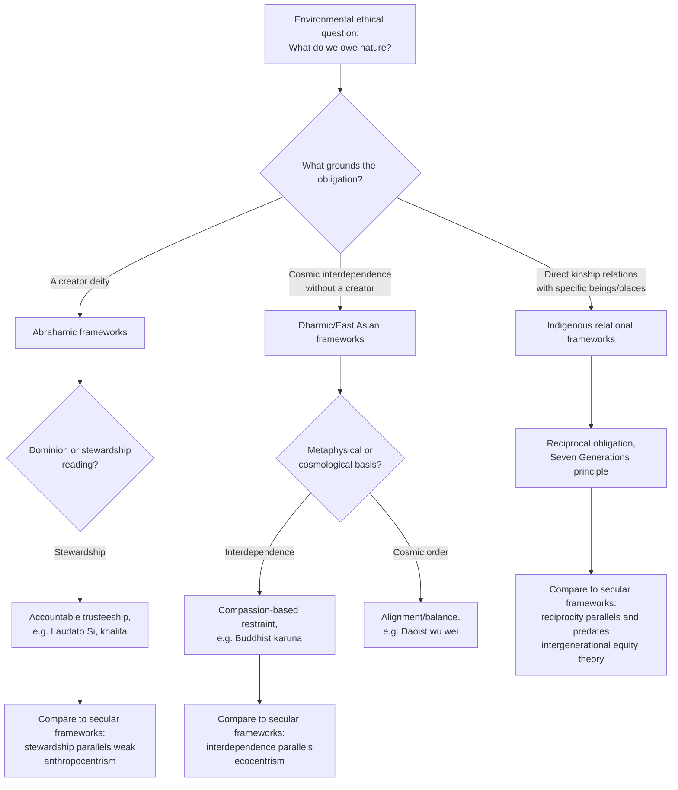

## Cultural and Religious Perspectives on Nature

### Overview

Cultural and religious traditions provide distinct cosmological and normative frameworks for understanding the human relationship to the natural world, frameworks that predate and continue to inform contemporary environmental philosophy. Where the frameworks discussed under Anthropocentrism, Biocentrism, and Ecocentrism developed largely within secular Western academic philosophy, this item surveys how major religious and cultural traditions independently conceptualize nature's value, humanity's place within it, and the ethical obligations that follow — offering both convergences with and distinct alternatives to the biocentric/ecocentric taxonomy.

### Analytical Framework for Comparison

Religious and cultural environmental ethics can be usefully compared along several axes:

- **Ontology**: is nature fundamentally separate from humans (dualism) or continuous with human existence (non-dualism)?
- **Source of value**: does nature derive value from a divine creator, from being ensouled/sentient, from cosmic interdependence, or from direct human relationship/stewardship?
- **Locus of obligation**: are environmental obligations grounded in duties to a deity, to other beings directly, to community (including ancestors and descendants), or to cosmic order itself?
- **Practical orientation**: does the tradition emphasize restraint/minimal interference, active stewardship/management, or ritual/reciprocal relationship?

### Abrahamic Traditions

**Judeo-Christian dominion and stewardship**

The Genesis creation narratives (Genesis 1:26–28, 2:15) have generated two historically influential and often contested interpretive traditions:

- **Dominion interpretation**: humans are granted "dominion" over the earth and commanded to "subdue" it, historically read (notably critiqued by historian Lynn White Jr. in his influential 1967 essay "The Historical Roots of Our Ecologic Crisis") as licensing human exploitation of nature and contributing to Western environmental degradation
- **Stewardship (dominion as trusteeship) interpretation**: a competing and increasingly dominant theological reading, emphasizing Genesis 2:15's charge "to till and keep" the garden — read as a mandate for responsible care and cultivation rather than exploitation, positioning humans as stewards accountable to God for creation's wellbeing rather than owners with unlimited license

**Contemporary Christian environmental theology**

- **Pope Francis's encyclical *Laudato Si'* (2015)**: a major contemporary statement explicitly linking environmental degradation to social injustice, consumerism, and a "throwaway culture," introducing the concept of **"integral ecology"** — the idea that environmental, economic, and social crises are interconnected and must be addressed together, and explicitly criticizing purely technocratic or market-based responses to ecological crisis as insufficient without deeper cultural and spiritual transformation
- **Evangelical environmental movements**: groups such as the Evangelical Environmental Network have developed "creation care" theology emphasizing stewardship obligations, representing a notable shift within a tradition sometimes associated (per the Lynn White critique) with weaker environmental engagement

**Islamic environmental ethics**

Islamic tradition grounds environmental obligation in several key concepts:

- **Khalifa (stewardship/vicegerency)**: humans are appointed as trustees (*khalifa*) of Earth on behalf of God, accountable for how they treat creation
- **Mizan (balance)**: the Quran describes creation as existing in a divinely established balance that humans are obligated not to disrupt
- **Tawhid (divine unity)**: the interconnectedness of all creation under one God is sometimes invoked to ground holistic environmental responsibility, paralleling ecocentric emphasis on interdependence
- The **Al-Mizan: A Covenant for the Earth** (2015) and other contemporary Islamic declarations on climate change have applied these classical concepts explicitly to modern environmental and climate policy

**Jewish environmental ethics**

- **Bal tashchit** ("do not destroy"): a Talmudic principle derived from Deuteronomy 20:19–20 (originally concerning trees during wartime siege), extended in rabbinic and contemporary interpretation into a broader prohibition against wasteful destruction of resources
- **Shmita (sabbatical year)**: the biblical practice of letting agricultural land lie fallow every seventh year, cited in contemporary Jewish environmental thought as an early model of sustainable land management and limits on continuous resource extraction

### Dharmic and East Asian Traditions

**Hindu perspectives**

- **Concept of the divine immanent in nature**: many Hindu traditions understand divinity as pervading the natural world (rivers, mountains, and other natural features are frequently sacred, e.g., the Ganges), grounding a form of nature reverence distinct from, but with some functional similarity to, ecocentric holism
- **Ahimsa (non-violence)**: extends ethical restraint toward all living beings, influencing vegetarianism and broader concern for animal welfare within many Hindu traditions
- **Dharma and cosmic order**: human action is understood as embedded within and obligated to a broader cosmic order (*rita*/*dharma*), with environmental degradation understood by some contemporary interpreters as a disruption of this order

**Buddhist perspectives**

- **Interdependent origination (*pratītyasamutpāda*)**: the foundational Buddhist metaphysical claim that all phenomena arise in mutual dependence, with no independently existing, permanent self — a framework with strong structural affinities to ecological interdependence and cited by scholars (notably Joanna Macy) as a natural basis for ecological ethics
- **Ahimsa and compassion (*karuna*) for all sentient beings**: grounds ethical concern extending beyond humans, with some affinity to the sentientist animal ethics frameworks (Singer, Regan) discussed in the prior item, though grounded in a distinct metaphysical framework
- **Engaged Buddhism**: a modern movement (associated with figures such as Thich Nhat Hanh) explicitly applying Buddhist principles of interdependence and compassion to environmental and social activism

**Daoist and Confucian perspectives**

- **Daoism — Wu wei ("non-action" / effortless action) and the Dao**: emphasizes alignment with the natural flow (*Dao*) of things rather than forceful imposition of human will upon nature; the *Dao De Jing* repeatedly emphasizes humility and restraint relative to natural processes, offering an ethic of minimal interference with affinities to some deep ecology themes
- **Confucianism — relational cosmology**: classical Confucian thought (particularly Neo-Confucian syntheses) frames humans, heaven, and earth as forming an interconnected triad, with human moral cultivation understood as continuous with, not separate from, cosmic and natural order — grounding environmental responsibility in the broader Confucian emphasis on relational harmony and proper role fulfillment

### Indigenous Worldviews

**General characteristics (with significant diversity across specific traditions)**

While Indigenous worldviews are highly diverse across distinct nations, cultures, and regions, environmental ethics scholarship has identified certain recurring characteristics contrasted with dominant Western frameworks:

- **Relational rather than hierarchical ontology**: many Indigenous cosmologies do not position humans above or separate from other beings in a "great chain of being," but as one relation among many kin — animals, plants, waters, and land often understood as having agency, personhood, or spirit
- **Reciprocity**: environmental relationships are frequently framed through reciprocal obligation (taking is paired with giving back, gratitude, and responsibility) rather than one-directional stewardship or dominion
- **Traditional Ecological Knowledge (TEK)**: place-based, intergenerationally transmitted knowledge systems developed through sustained relationship with specific ecosystems, increasingly recognized (though historically marginalized) within Western conservation science and resource management as a valuable and rigorous complementary knowledge source
- **Seven Generations principle**: articulated in various forms across Indigenous nations (notably associated with Haudenosaunee/Iroquois Confederacy political philosophy), holding that decisions should be evaluated for their impact on descendants seven generations into the future — a direct and influential precursor to intergenerational equity concepts (see Intergenerational and Intragenerational Equity)

**Contemporary legal and political manifestations**

Indigenous relational ontologies have directly informed the **rights of nature** legal movement (introduced under ecocentrism), including the 2017 recognition of the Whanganui River as a legal person in New Zealand — achieved specifically through Māori advocacy grounded in the traditional concept of the river as an ancestor (*tupuna*) rather than a resource, illustrating a direct translation of Indigenous relational cosmology into contemporary environmental law.

[Inference] Because Indigenous worldviews are not monolithic and vary substantially across thousands of distinct nations and communities globally, generalized characterizations (including those above) should be understood as identifying recurring scholarly themes rather than a single unified "Indigenous environmental philosophy"; specific claims about a particular nation's beliefs and practices require engagement with that nation's own sources and representatives.

### Comparative Table

| Tradition | Source of environmental value | Key concept | Practical orientation |
| --- | --- | --- | --- |
| Judeo-Christian (stewardship) | Divine creation, human trusteeship | Dominion as stewardship, *Laudato Si'* | Responsible cultivation and care |
| Islamic | Divine trust, cosmic balance | Khalifa, Mizan | Maintaining balance, accountability |
| Jewish | Divine command, resource ethics | Bal tashchit, Shmita | Restraint from waste, periodic rest for land |
| Hindu | Divine immanence, cosmic order | Ahimsa, dharma | Reverence, non-violence |
| Buddhist | Metaphysical interdependence | Pratītyasamutpāda, karuna | Compassion, minimal harm |
| Daoist | Alignment with natural flow | Wu wei, the Dao | Restraint, non-interference |
| Confucian | Relational cosmic triad | Heaven-earth-human harmony | Proper relational conduct |
| Indigenous (general themes) | Kinship, reciprocal relationship | Reciprocity, Seven Generations, TEK | Reciprocal, relational stewardship |

### Conceptual Diagram (svg_diagram)

<svg xmlns="http://www.w3.org/2000/svg" viewBox="0 0 900 420">
<text x="450" y="30" font-size="17" font-weight="bold" text-anchor="middle" fill="#1a1a1a">Sources of Environmental Value Across Traditions (svg_diagram)</text>
<rect x="50" y="70" width="250" height="150" rx="8" fill="#eef5ff" stroke="#2c6fbb" stroke-width="2" />
<text x="175" y="100" font-size="13" font-weight="bold" text-anchor="middle" fill="#1a3c5e">Divine Trust</text>
<text x="70" y="130" font-size="10" fill="#333">Judeo-Christian stewardship,</text>
<text x="70" y="148" font-size="10" fill="#333">Islamic khalifa/mizan</text>
<text x="70" y="176" font-size="10" fill="#333">Value derives from a creator;</text>
<text x="70" y="194" font-size="10" fill="#333">humans accountable as trustees</text>
<rect x="325" y="70" width="250" height="150" rx="8" fill="#fff3e6" stroke="#c97a1a" stroke-width="2" />
<text x="450" y="100" font-size="13" font-weight="bold" text-anchor="middle" fill="#5e3c1a">Cosmic Interdependence</text>
<text x="345" y="130" font-size="10" fill="#333">Buddhist pratityasamutpada,</text>
<text x="345" y="148" font-size="10" fill="#333">Daoist Dao, Confucian triad</text>
<text x="345" y="176" font-size="10" fill="#333">Value emerges from mutual</text>
<text x="345" y="194" font-size="10" fill="#333">arising and relational harmony</text>
<rect x="600" y="70" width="250" height="150" rx="8" fill="#eafaf0" stroke="#1f9d55" stroke-width="2" />
<text x="725" y="100" font-size="13" font-weight="bold" text-anchor="middle" fill="#14532d">Relational Kinship</text>
<text x="620" y="130" font-size="10" fill="#333">Indigenous worldviews,</text>
<text x="620" y="148" font-size="10" fill="#333">Hindu divine immanence</text>
<text x="620" y="176" font-size="10" fill="#333">Value from direct kinship</text>
<text x="620" y="194" font-size="10" fill="#333">and reciprocal relationship</text>

<text x="450" y="270" font-size="12" text-anchor="middle" fill="#333">Convergence: nearly all traditions reject pure exploitation absent obligation</text>

<text x="450" y="295" font-size="11" text-anchor="middle" fill="#666">Divergence: differ on whether obligation runs to a deity, to cosmic order, or to beings directly</text>

</svg>

### Tradition-Comparison Flow

### Convergences with Secular Environmental Philosophy

- **Stewardship traditions** (Judeo-Christian, Islamic) show functional affinities with **weak anthropocentrism**, retaining a hierarchically distinct human role while imposing substantive obligations toward nature
- **Interdependence-based traditions** (Buddhist, Daoist, Confucian) show strong structural affinities with **ecocentrism**, particularly Callicott's Humean grounding of the Land Ethic in recognized ecological interdependence
- **Indigenous reciprocity and Seven Generations thinking** directly anticipated, and in various documented cases directly influenced, contemporary **intergenerational equity** theory (Brown Weiss's conservation principles) and the **rights of nature** legal movement
- Compassion-based traditions (Buddhist karuna, Hindu ahimsa) parallel **sentientist animal ethics** (Singer, Regan), though grounded in distinct metaphysical commitments regarding rebirth, karma, or cosmic order rather than secular utilitarian or rights-based reasoning

### Applications and Contemporary Relevance

- **Interfaith environmental coalitions**: organizations such as the Interfaith Power & Light network and the Parliament of the World's Religions increasingly coordinate religiously grounded climate advocacy across traditions
- **Conservation partnerships with Indigenous and faith communities**: growing recognition within conservation biology that effective, durable conservation outcomes often require partnership with communities whose traditional practices and cosmologies have historically sustained biodiversity in specific landscapes
- **Religious environmental education and eco-theology programs**: seminaries and religious educational institutions across traditions have increasingly incorporated environmental ethics into formal religious training
- **Policy influence**: religiously grounded moral authority (e.g., papal encyclicals, joint religious leader statements ahead of UN climate conferences) has been used to build broader public and political support for climate action across otherwise disparate constituencies

### Limitations and Critiques

- **Risk of essentialism**: comparative surveys of this kind risk flattening significant internal diversity within each tradition (denominational, sectarian, regional, and historical variation) into oversimplified单-line characterizations
- **Historical complicity alongside reformist strands**: most traditions surveyed have historically been invoked to justify both exploitative *and* protective relationships with nature depending on interpretation and historical context; contemporary "green" readings are often recent reinterpretations responding to the ecological crisis rather than unbroken historical practice
- **Appropriation concerns**: use of Indigenous concepts (e.g., "Seven Generations") within secular or non-Indigenous environmental and policy discourse has drawn criticism when detached from the specific political, legal, and cultural context (sovereignty, land rights) from which they originate
- **Tension between universal and particular claims**: religious environmental ethics often ground obligations in tradition-specific theological claims not shared across traditions or by secular audiences, raising questions (paralleling Naess's "ultimate premises" pluralism in Deep Ecology) about how tradition-specific and secular environmental ethics can be reconciled in pluralistic policy contexts

**Related Topics**

- Anthropocentrism, Biocentrism, and Ecocentrism
- The Land Ethic and Deep Ecology
- Intergenerational and Intragenerational Equity
- Traditional Ecological Knowledge and Conservation Science
- Rights of Nature and Legal Personhood for Ecosystems
- Environmental Justice Theory
- Interfaith Environmental Movements
- Eco-theology and Integral Ecology