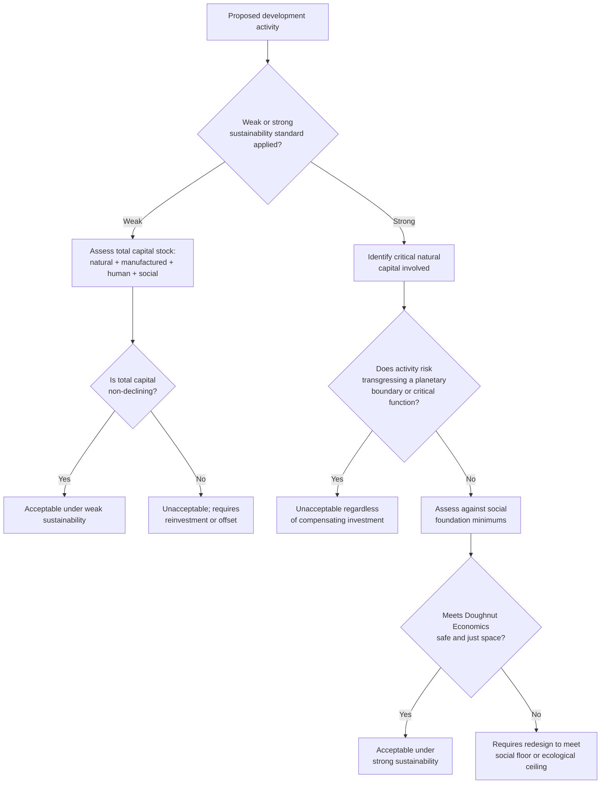

## Principles of Sustainable Development

### Overview

Sustainable development is the organizing framework linking environmental protection, economic development, and social equity into a single normative and policy paradigm. It emerged as an attempt to resolve the perceived tension between continued economic growth (particularly for developing nations) and environmental limits, proposing that development can proceed in a manner that does not compromise long-term ecological and social wellbeing. This item establishes the core principles underlying sustainable development as a framework, building on the intergenerational equity foundations introduced in the Environmental Ethics chapter and setting up subsequent circular economy and sustainability metrics topics.

### The Brundtland Definition and Its Structure

**Origin**

The term was formally defined in *Our Common Future* (1987), the report of the UN World Commission on Environment and Development, chaired by Gro Harlem Brundtland:

> "Development that meets the needs of the present without compromising the ability of future generations to meet their own needs."

**Two embedded concepts (as specified in the original report)**

The Brundtland Report itself identifies two key concepts within this definition, often overlooked in abbreviated citations:

1. **The concept of "needs"**, in particular the essential needs of the world's poor, to which overriding priority should be given
2. **The idea of limitations** imposed by the state of technology and social organization on the environment's ability to meet present and future needs

This structure makes clear that the Brundtland definition was never purely an environmental limits concept — it explicitly foregrounds poverty alleviation and intragenerational equity (see Environmental Justice Theory) alongside ecological limits, a dual emphasis frequently lost in simplified summaries.

### The Three Pillars Framework

Sustainable development is conventionally represented as resting on three interdependent pillars, sometimes called the **"triple bottom line"** (a term coined by John Elkington in 1994 for corporate sustainability accounting specifically, later generalized):

**1. Environmental sustainability**

Maintaining the integrity and productive capacity of ecological systems — biodiversity, ecosystem services, climate stability, resource regeneration capacity — such that natural capital is not depleted below levels needed for continued human and ecological wellbeing.

**2. Economic sustainability**

Maintaining economic systems capable of providing livelihoods, meeting material needs, and generating the resources required for social investment, without relying on unsustainable resource depletion or debt accumulation that undermines future economic capacity.

**3. Social sustainability**

Maintaining social cohesion, equity, and institutional capacity — including poverty reduction, health, education, and inclusive governance — recognizing that environmental and economic outcomes are unsustainable if they generate or perpetuate severe social inequity or instability.

**Critiques of the three-pillar model**

- **False equivalence concern**: critics (notably ecological economists) argue the three-pillar model implies the three domains are separable and can be "traded off" against each other in policy design, when in fact economic and social systems are fundamentally embedded within, and dependent upon, ecological systems — not parallel, independent domains
- **The "strong sustainability" alternative**: proposes a nested rather than parallel model (see below), where the economy is a subsystem of society, which is in turn a subsystem of the biosphere — implying ecological limits are not one consideration among three equals, but the outer constraint within which the other two must operate

### Weak vs. Strong Sustainability

A foundational distinction in sustainability economics concerning **substitutability between natural and human-made capital**:

**Weak sustainability**

Holds that natural capital ($K_n$) and human-made/manufactured capital ($K_m$) are substitutable — what matters is that the *total* capital stock (natural + manufactured + human + social) is non-declining over time, not the composition:

$$K_n + K_m + K_h + K_s \geq \text{constant (non-declining)}$$

Under weak sustainability, depleting a forest is acceptable if the proceeds are invested in, for example, infrastructure or education that provides equivalent or greater welfare-generating capacity. This position is associated with neoclassical environmental economics (e.g., Robert Solow's and John Hartwick's work on resource depletion and intergenerational welfare, including the **Hartwick Rule** — reinvesting resource rents into reproducible capital to maintain constant consumption over time).

**Strong sustainability**

Holds that certain forms of natural capital are **non-substitutable** — particularly "critical natural capital" providing life-support functions (climate regulation, biodiversity, freshwater systems) — and must be maintained in physical/functional terms independent of how much manufactured capital is accumulated. Under strong sustainability, no amount of infrastructure investment can compensate for, e.g., catastrophic biodiversity loss or climate destabilization, because these systems provide functions manufactured capital cannot replicate.

**Comparison**

| Dimension | Weak Sustainability | Strong Sustainability |
| --- | --- | --- |
| Capital substitutability | Natural and manufactured capital substitutable | Critical natural capital non-substitutable |
| Key constraint | Total capital stock non-declining | Critical natural capital maintained in physical terms |
| Associated economics | Neoclassical (Solow, Hartwick) | Ecological economics (Daly, Costanza) |
| Practical implication | Resource depletion acceptable if reinvested | Hard limits on depletion of critical ecosystems regardless of reinvestment |

### Planetary Boundaries Framework

Developed by Johan Rockström and colleagues (2009, updated 2015 and subsequently), this framework operationalizes strong sustainability by identifying nine Earth system processes with quantifiable boundaries, beyond which the risk of destabilizing the relatively stable Holocene-like conditions that have supported human civilization increases substantially:

1. Climate change
2. Biosphere integrity (genetic and functional diversity)
3. Land-system change
4. Freshwater use
5. Biogeochemical flows (nitrogen and phosphorus cycles)
6. Ocean acidification
7. Stratospheric ozone depletion
8. Atmospheric aerosol loading
9. Introduction of novel entities (chemical pollution, plastics, etc.)

[Unverified] Assessments of how many boundaries have been transgressed have been updated multiple times as the underlying science develops, and the precise number considered breached at any given point depends on the specific assessment cited and its publication date; readers should consult the most recent Planetary Boundaries update for current status rather than relying on any single fixed figure.

### The Doughnut Economics Model

Developed by economist Kate Raworth (2012, book published 2017), this model integrates planetary boundaries (the ecological ceiling) with a **social foundation** (a minimum threshold of wellbeing — food, health, education, income, political voice, and other basic needs derived from internationally agreed social minimums, including the SDGs). The "doughnut" is the safe and just space between the social foundation (below which humanity falls short) and the ecological ceiling (beyond which humanity overshoots planetary boundaries) — providing a visual and conceptual synthesis of environmental and social sustainability constraints simultaneously.

### The UN Sustainable Development Goals (SDGs)

**Structure**

Adopted in 2015 as part of the 2030 Agenda for Sustainable Development, the SDGs comprise 17 goals and 169 associated targets, representing the most comprehensive current global sustainable development framework, succeeding the earlier (2000–2015) Millennium Development Goals (MDGs).

**Key structural features**

- **Universality**: unlike the MDGs (primarily targeted at developing countries), the SDGs apply to all countries, reflecting recognition that unsustainable consumption and production patterns in wealthy nations are integral to the sustainability challenge, not merely a developing-world poverty problem
- **Integration and indivisibility**: the SDGs are explicitly designed as an interconnected system rather than independent targets — progress on one goal frequently depends on or affects others (e.g., SDG 2, Zero Hunger, interacts closely with SDG 13, Climate Action, and SDG 15, Life on Land)
- **"Wedding cake" model** (developed by the Stockholm Resilience Centre): reorganizes the 17 SDGs into three tiers — biosphere (foundational ecological goals), society (goals dependent on a stable biosphere), and economy (goals dependent on a functioning society) — explicitly reinforcing the nested, strong-sustainability structure over the flat three-pillar model

### Conceptual Diagram: Nested vs. Pillar Models (svg_diagram)

<svg xmlns="http://www.w3.org/2000/svg" viewBox="0 0 900 420">
<text x="450" y="30" font-size="17" font-weight="bold" text-anchor="middle" fill="#1a1a1a">Three-Pillar vs. Nested Sustainability Models (svg_diagram)</text>

<text x="230" y="60" font-size="13" font-weight="bold" text-anchor="middle" fill="#333">Three-Pillar (Weak) Model</text>

<circle cx="150" cy="180" r="80" fill="`#eafaf0`" stroke="`#1f9d55`" stroke-width="2" fill-opacity="0.7" />

<circle cx="230" cy="180" r="80" fill="`#eef5ff`" stroke="`#2c6fbb`" stroke-width="2" fill-opacity="0.7" />

<circle cx="190" cy="250" r="80" fill="`#fff3e6`" stroke="`#c97a1a`" stroke-width="2" fill-opacity="0.7" />

<text x="120" y="150" font-size="11" fill="`#14532d`">Environment</text>

<text x="250" y="150" font-size="11" fill="`#1a3c5e`">Economy</text>

<text x="180" y="300" font-size="11" fill="`#5e3c1a`">Society</text>

<text x="230" y="360" font-size="10" text-anchor="middle" fill="#666">Domains treated as</text>

<text x="230" y="378" font-size="10" text-anchor="middle" fill="#666">equal, tradeable spheres</text>

<text x="680" y="60" font-size="13" font-weight="bold" text-anchor="middle" fill="#333">Nested (Strong) Model</text>

<circle cx="680" cy="220" r="150" fill="`#eafaf0`" stroke="`#1f9d55`" stroke-width="2" />

<text x="680" y="90" font-size="11" font-weight="bold" fill="`#14532d`">Biosphere (ecological limits)</text>

<circle cx="680" cy="220" r="95" fill="`#eef5ff`" stroke="`#2c6fbb`" stroke-width="2" />

<text x="680" y="145" font-size="11" font-weight="bold" fill="`#1a3c5e`">Society</text>

<circle cx="680" cy="220" r="45" fill="`#fff3e6`" stroke="`#c97a1a`" stroke-width="2" />

<text x="680" y="225" font-size="11" font-weight="bold" text-anchor="middle" fill="`#5e3c1a`">Economy</text>

<text x="680" y="390" font-size="10" text-anchor="middle" fill="#666">Economy embedded in society,</text>

<text x="680" y="408" font-size="10" text-anchor="middle" fill="#666">both embedded in the biosphere</text>

</svg>

### Sustainability Assessment Flow

### Key Related Concepts

**Ecological footprint and biocapacity**

A widely used metric estimating the amount of biologically productive land and water area required to produce the resources a population consumes and absorb its waste (particularly $CO_2$), compared against the planet's or a region's **biocapacity** (available productive area). When footprint exceeds biocapacity at the global level, this is described as global **ecological overshoot**, tracked annually via "Earth Overshoot Day" — the calculated date each year when humanity's demand for ecological resources is estimated to exceed what Earth can regenerate in that year.

**Decoupling**

The concept of separating economic growth from environmental impact/resource use, distinguished as:

- **Relative decoupling**: environmental impact grows more slowly than economic output (impact intensity per unit of GDP declines) — commonly observed in many economies
- **Absolute decoupling**: environmental impact declines in absolute terms even as economic output continues growing — a stronger and more contested requirement for genuine long-term sustainability, with ongoing empirical and theoretical debate over whether absolute decoupling at a pace and scale sufficient to meet planetary boundaries has been achieved or is achievable at a global level

**Intragenerational and intergenerational equity**

As detailed in the prior chapter, sustainable development explicitly incorporates both equity dimensions: the Brundtland definition's "needs of the present" foregrounds intragenerational equity (particularly the poor), while "without compromising future generations" foregrounds intergenerational equity.

### Applications in Policy and Governance

- **National Sustainable Development Strategies**: many countries maintain formal strategies aligning domestic policy with SDG targets and sustainability principles
- **Environmental impact assessment integration**: sustainable development principles increasingly inform formal project and policy assessment requirements, extending beyond narrow environmental impact to consider social and economic sustainability jointly
- **Corporate sustainability reporting**: the triple bottom line concept directly informs corporate ESG and sustainability disclosure frameworks (see Sustainable Finance and Green Investment)
- **Sustainability-integrated development finance**: multilateral development banks (World Bank, regional development banks) increasingly screen and condition lending against sustainable development criteria, including environmental and social safeguards

### Limitations and Critiques

- **Definitional ambiguity and "constructive ambiguity"**: the Brundtland definition's breadth has allowed near-universal adoption but has also been criticized for permitting incompatible interpretations to coexist under the same banner — from continued growth-oriented development to degrowth-oriented critiques, both claiming consistency with "sustainable development"
- **Growth compatibility debate**: a persistent and unresolved tension exists between sustainable development's general assumption that continued economic growth (particularly in developing nations) is both necessary and compatible with ecological limits, and **degrowth** perspectives arguing that, at least in already-high-consumption economies, continued aggregate growth is fundamentally incompatible with remaining within planetary boundaries regardless of decoupling efforts
- **Implementation and enforcement gaps**: the SDGs, like earlier sustainable development frameworks, are non-binding, and progress assessments have generally indicated substantial gaps between stated targets and actual trajectories across multiple goal areas, with the precise magnitude and goal-specific status varying by assessment year and should be verified against current UN progress reporting
- **Measurement challenges**: translating multidimensional sustainability (ecological, social, economic) into comparable, actionable metrics remains methodologically contested, motivating continued development of alternative indices (Genuine Progress Indicator, Inclusive Wealth Index, Human Development Index adjustments) beyond GDP alone

[Inference] Given the persistent weak/strong sustainability divide and the unresolved growth-compatibility debate, "sustainable development" functions less as a single settled theory and more as a shared vocabulary within which substantially different, sometimes incompatible, policy programs are argued for — a characteristic that likely explains both its broad political adoption and the recurring critique that it lacks decisive operational content on its own.

**Related Topics**

- Circular Economy Principles and Design
- Planetary Boundaries and Earth System Science
- Doughnut Economics and Safe/Just Space Frameworks
- Degrowth and Post-Growth Economics
- UN Sustainable Development Goals (SDG) Implementation
- Ecological Footprint and Overshoot Metrics
- Intergenerational and Intragenerational Equity
- Sustainable Finance and Green Investment