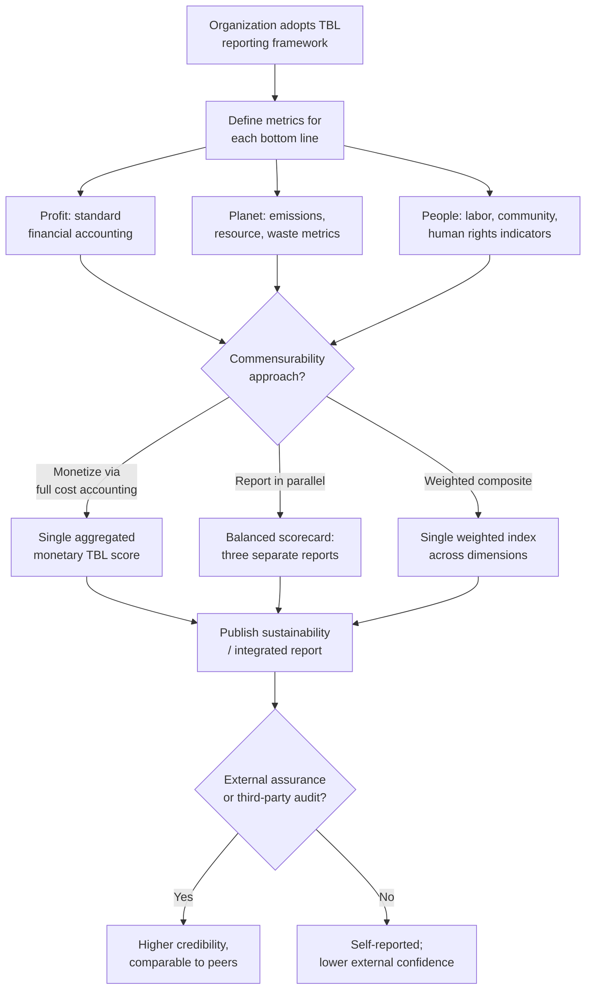

## The Triple Bottom Line Framework

### Overview

The Triple Bottom Line (TBL or "3BL") is a corporate and organizational accounting framework that evaluates performance across three dimensions — economic (Profit), social (People), and environmental (Planet) — rather than financial performance alone. Coined by British sustainability consultant **John Elkington** in his 1994 work and elaborated in *Cannibals with Forks: The Triple Bottom Line of 21st Century Business* (1997), TBL operationalizes the broader three-pillar sustainability concept (introduced under Principles of Sustainable Development) specifically at the organizational and corporate accounting level, providing the conceptual foundation for most subsequent corporate ESG and sustainability reporting practice.

### Origin and Core Formulation

**The "3 Ps": People, Planet, Profit**

Elkington's framework reframes the traditional single "bottom line" of financial accounting (net profit) into three simultaneous bottom lines:

1. **Profit (economic bottom line)**: traditional financial performance — revenue, costs, profitability, return on investment, and broader economic value created for shareholders and the economy
2. **People (social bottom line)**: the organization's impact on human capital and social wellbeing — employee welfare, labor practices, community relations, human rights within operations and supply chains, diversity and inclusion, customer welfare
3. **Planet (environmental bottom line)**: the organization's impact on natural capital — resource consumption, emissions, waste, pollution, biodiversity impact, and broader ecological footprint

**Underlying rationale**

Elkington's core argument was that organizations focused exclusively on financial performance systematically externalize social and environmental costs, and that sustainable long-term value creation requires simultaneously managing and reporting all three dimensions — analogous to the externality argument underlying carbon pricing (see Carbon Pricing and Emissions Trading), but applied at the level of voluntary corporate practice and disclosure rather than regulatory price correction.

### The TBL Measurement Challenge

**Asymmetric measurability across the three dimensions**

A defining practical challenge of TBL, extensively discussed in the sustainability accounting literature, is that the three bottom lines are not naturally commensurable:

- **Profit** has well-established, standardized accounting metrics (GAAP, IFRS) with centuries of methodological development
- **Planet** has increasingly standardized quantitative metrics for certain impacts (tonnes $CO_2e$ emitted, cubic meters of water consumed, tonnes of waste generated) but significant methodological variation remains for others (biodiversity impact, ecosystem service valuation)
- **People** metrics remain the least standardized dimension, often relying on qualitative or semi-quantitative indicators (employee satisfaction surveys, diversity ratios, community investment figures) that are harder to compare across organizations or aggregate meaningfully

This asymmetry has generated substantial methodological debate over how to construct a genuinely integrated "triple" bottom line rather than three separately reported, non-comparable metrics.

**Common quantification approaches**

- **Full cost accounting / true cost accounting**: attempts to monetize social and environmental externalities using shadow pricing (e.g., applying a social cost of carbon figure to emissions) to render all three dimensions comparable in a single monetary unit
- **Composite/weighted indices**: combining normalized indicators across the three dimensions into a single score (used in some corporate sustainability rating methodologies), at the cost of embedding contestable weighting judgments about relative importance
- **Balanced scorecard approaches**: reporting the three dimensions as distinct, parallel metrics without forcing monetary commensurability, preserving methodological rigor within each dimension at the cost of a single aggregate figure

### TBL and Contemporary ESG Reporting

**Relationship to ESG**

Modern **ESG (Environmental, Social, Governance)** reporting frameworks (see Sustainable Finance and Green Investment) can be understood as a direct descendant and elaboration of TBL, with two notable structural differences:

- ESG separates **Governance** as an explicit, distinct category (board composition, executive compensation, anti-corruption practices, shareholder rights) rather than folding governance considerations into "People" or "Profit," reflecting the specifically investor-oriented origins of the ESG framework (as opposed to TBL's broader organizational management origins)
- ESG frameworks have generally developed more standardized, auditable disclosure requirements (e.g., via GRI, SASB, and now ISSB standards) than the original, more conceptually oriented TBL framework, which Elkington himself did not prescribe specific standardized metrics for

**Elkington's own reassessment**

Notably, in a widely discussed 2018 *Harvard Business Review* article, Elkington issued a **"recall"** of the Triple Bottom Line concept, arguing that 25 years after its introduction, it had frequently been reduced by adopting organizations to an accounting and reporting exercise rather than the systemic transformation of capitalism he originally intended — expressing concern that TBL had become a compliance checkbox rather than a driver of fundamental change in how businesses create value. [Verified — this reassessment is a well-documented and frequently cited event in sustainability management literature.]

### Comparative Table: TBL vs. Traditional Accounting vs. ESG

| Dimension | Traditional Financial Accounting | Triple Bottom Line | ESG Framework |
| --- | --- | --- | --- |
| Bottom lines measured | 1 (financial profit) | 3 (profit, people, planet) | 3 (environmental, social, governance) |
| Standardization | High (GAAP/IFRS) | Low to moderate, varies by organization | Increasing (GRI, SASB, ISSB) |
| Primary audience | Shareholders, regulators | Broader stakeholders | Primarily investors |
| Governance treatment | Implicit in financial disclosure | Not separately categorized | Explicit third pillar |
| Commensurability | N/A (single metric) | Contested; often reported in parallel | Often scored/rated, methodology varies by provider |

### Conceptual Diagram (svg_diagram)

<svg xmlns="http://www.w3.org/2000/svg" viewBox="0 0 900 420">
<text x="450" y="30" font-size="17" font-weight="bold" text-anchor="middle" fill="#1a1a1a">Triple Bottom Line: Three Simultaneous Bottom Lines (svg_diagram)</text>
<rect x="60" y="80" width="230" height="260" rx="8" fill="#fff3e6" stroke="#c97a1a" stroke-width="2" />
<text x="175" y="115" font-size="15" font-weight="bold" text-anchor="middle" fill="#5e3c1a">Profit</text>
<text x="175" y="135" font-size="10" text-anchor="middle" fill="#666">(Economic)</text>
<text x="80" y="165" font-size="10" fill="#333">Revenue, cost efficiency,</text>
<text x="80" y="183" font-size="10" fill="#333">shareholder return</text>
<text x="80" y="215" font-size="10" fill="#333">Metric maturity: HIGH</text>
<text x="80" y="233" font-size="10" fill="#333">(GAAP/IFRS standardized)</text>
<rect x="335" y="80" width="230" height="260" rx="8" fill="#eafaf0" stroke="#1f9d55" stroke-width="2" />
<text x="450" y="115" font-size="15" font-weight="bold" text-anchor="middle" fill="#14532d">Planet</text>
<text x="450" y="135" font-size="10" text-anchor="middle" fill="#666">(Environmental)</text>
<text x="355" y="165" font-size="10" fill="#333">Emissions, resource use,</text>
<text x="355" y="183" font-size="10" fill="#333">waste, biodiversity impact</text>
<text x="355" y="215" font-size="10" fill="#333">Metric maturity: MODERATE</text>
<text x="355" y="233" font-size="10" fill="#333">(partial standardization)</text>
<rect x="610" y="80" width="230" height="260" rx="8" fill="#eef5ff" stroke="#2c6fbb" stroke-width="2" />
<text x="725" y="115" font-size="15" font-weight="bold" text-anchor="middle" fill="#1a3c5e">People</text>
<text x="725" y="135" font-size="10" text-anchor="middle" fill="#666">(Social)</text>
<text x="630" y="165" font-size="10" fill="#333">Labor practices, community</text>
<text x="630" y="183" font-size="10" fill="#333">impact, human rights</text>
<text x="630" y="215" font-size="10" fill="#333">Metric maturity: LOW</text>
<text x="630" y="233" font-size="10" fill="#333">(largely qualitative)</text>

<text x="450" y="390" font-size="11" text-anchor="middle" fill="#666">Asymmetric measurability across the three lines remains TBL's central methodological challenge</text>

</svg>

### TBL Assessment and Reporting Flow

### Applications in Practice

- **Integrated reporting**: frameworks such as the International Integrated Reporting Framework (now part of the IFRS Foundation) build on TBL logic, encouraging organizations to report on multiple forms of capital (financial, manufactured, intellectual, human, social, natural) in a connected narrative rather than isolated reports
- **B Corporation certification**: the B Corp certification process, administered by the nonprofit B Lab, operationalizes TBL-style assessment through a standardized "B Impact Assessment" evaluating governance, workers, community, environment, and customers
- **Public sector and nonprofit adaptation**: TBL logic has been adapted beyond for-profit business into public sector performance measurement and nonprofit impact assessment, sometimes reframed as "quadruple bottom line" models adding a fourth dimension (commonly culture, governance, or future generations)
- **Supply chain and procurement standards**: large organizations increasingly apply TBL-style criteria to supplier selection and evaluation, extending accountability beyond direct operations

### Extensions: Quadruple and Quintuple Bottom Line

Building on perceived gaps in the original three-dimension model, several extensions have been proposed in sustainability management literature:

- **Quadruple Bottom Line**: most commonly adds either **Governance** (aligning with ESG's explicit separation) or **Culture** (recognizing cultural heritage and identity as a distinct value dimension, particularly relevant in Indigenous and community-development contexts) as a fourth pillar
- **Quintuple Bottom Line**: some formulations further add explicit **Purpose** or **Future generations** dimensions, more directly incorporating intergenerational equity considerations (see Intergenerational and Intragenerational Equity) into the accounting structure

[Inference] These extensions generally emerged from practitioners finding the original three-category structure insufficiently granular for specific sectoral or mission-driven contexts (e.g., Indigenous economic development, mission-driven nonprofits), rather than from a single consolidated academic consensus on a "correct" expanded model; terminology and specific fourth/fifth dimensions vary considerably by source.

### Limitations and Critiques

- **Lack of standardized metrics**: unlike financial accounting, TBL as originally formulated does not specify required metrics, units, or reporting boundaries, leading to substantial inconsistency across organizations claiming TBL adoption — a gap subsequent frameworks (GRI, SASB, ISSB) have attempted to address
- **Elkington's own critique (the 2018 "recall")**: the framework's originator has publicly argued TBL was frequently implemented as an accounting exercise rather than the intended driver of fundamental business model transformation, raising questions about whether voluntary reporting frameworks alone can achieve genuine systemic change absent stronger regulatory or market incentive alignment
- **Greenwashing and "bluewashing" risk**: as with broader ESG and green finance concerns (see Sustainable Finance and Green Investment), voluntary TBL reporting can be selectively deployed to emphasize favorable metrics while omitting material negative impacts, absent external assurance or standardized audit requirements
- **Aggregation and tradeoff opacity**: composite scoring approaches that combine the three dimensions into a single index can obscure significant tradeoffs (e.g., strong environmental performance offsetting weak labor practices) behind an aggregate figure, potentially misleading stakeholders about an organization's actual profile across dimensions
- **Weak vs. strong sustainability tension carried over**: TBL, like the broader three-pillar sustainability model it operationalizes, has been critiqued (per the same logic discussed under Principles of Sustainable Development) for implicitly treating the three bottom lines as separable and tradeable rather than reflecting the nested dependency of economic and social systems on ecological systems

**Related Topics**

- Principles of Sustainable Development
- Sustainable Finance and Green Investment
- ESG Reporting Standards (GRI, SASB, ISSB)
- Full Cost Accounting and Natural Capital Valuation
- B Corporation Certification and Impact Assessment
- Corporate Sustainability Reporting Directive (CSRD)
- Integrated Reporting Frameworks
- Circular Economy Principles and Design