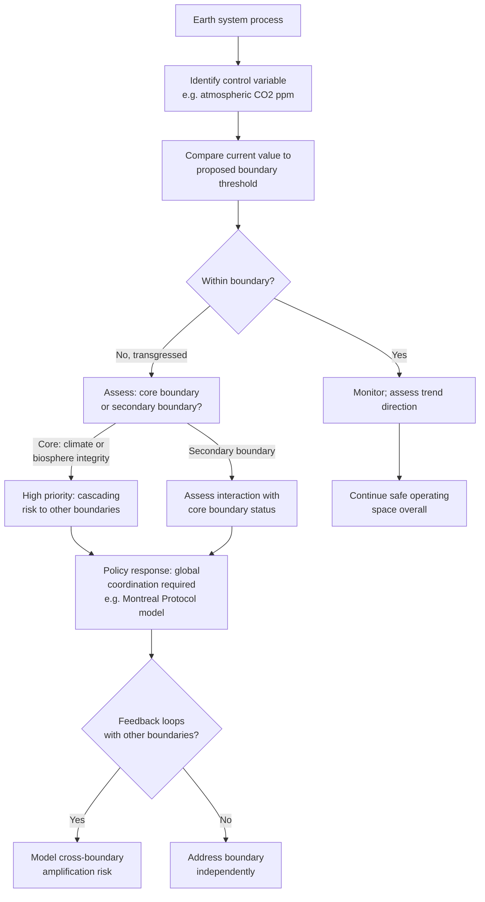

## The Planetary Boundaries Framework

### Overview

The Planetary Boundaries framework is a scientific model identifying nine Earth system processes that regulate the stability and resilience of the planet, each with a proposed quantifiable boundary that, if transgressed, increases the risk of destabilizing the relatively stable environmental conditions of the Holocene epoch — the epoch during which human civilization developed. Introduced by a team of 28 scientists led by Johan Rockström and Will Steffen and published in 2009 (with major updates in 2015 and subsequent years), the framework provides the primary scientific basis for the "strong sustainability" and nested-systems models introduced under Principles of Sustainable Development, translating the abstract concept of ecological limits into specific, measurable Earth-system parameters.

### Theoretical Foundation

**The Holocene stability argument**

The framework's core scientific premise is that the Holocene (the roughly 11,700-year period of relative climatic and environmental stability following the last ice age) provided the specific environmental conditions — stable temperatures, predictable seasons, relatively stable sea levels, and functioning biogeochemical cycles — under which agriculture, settled civilization, and complex human societies developed. The framework's authors argue that human activity since industrialization (a period increasingly termed the **Anthropocene**) has begun pushing Earth system processes outside this stable range, and that maintaining a "safe operating space" within the boundaries of Holocene-like conditions is a precondition for continued human development and wellbeing at global scale.

**Systems science basis: thresholds, tipping points, and feedback loops**

The framework draws on Earth system science concepts distinct from more familiar linear pollution-damage models:

- **Tipping points**: thresholds beyond which a system shifts to a qualitatively different state, often abruptly and with limited reversibility (e.g., ice sheet collapse, Amazon rainforest dieback converting to savanna)
- **Feedback loops**: mechanisms by which crossing one boundary can accelerate change in others (e.g., permafrost thaw releasing methane, amplifying climate change, which further accelerates permafrost thaw — a positive/reinforcing feedback loop)
- **Non-linearity**: unlike conventional pollution economics, which often assumes roughly proportional damage-to-emissions relationships (relevant to marginal abatement cost reasoning in Carbon Pricing and Emissions Trading), planetary boundary science emphasizes that damage can increase sharply and disproportionately once a threshold is crossed, rather than continuing smoothly

This non-linearity is a key reason the framework's authors argue for a precautionary, boundary-based approach rather than solely marginal cost-benefit optimization.

### The Nine Boundaries

**1. Climate change**

Measured via atmospheric $CO_2$ concentration (proposed boundary originally set at 350 ppm, later also expressed via radiative forcing, W/m²) and other greenhouse gas metrics. Widely regarded as one of the two "core" boundaries (along with biosphere integrity) because transgressing it has cascading effects across nearly all other boundaries.

**2. Biosphere integrity**

Subdivided into two components:

- **Genetic diversity**: measured via extinction rate (species lost per million species-years, E/MSY), compared against background extinction rates from the fossil record
- **Functional diversity**: the diversity of ecological roles and interactions sustaining ecosystem functioning, measured via metrics such as the Biodiversity Intactness Index (BII)

Also regarded as a "core" boundary alongside climate change, since biosphere integrity underpins the resilience and functioning of virtually all other Earth systems.

**3. Land-system change**

Measured primarily via the proportion of global forest cover (particularly forested biomes) remaining relative to original extent, reflecting land conversion's role in biodiversity loss, carbon storage capacity, and water cycle regulation.

**4. Freshwater use**

Originally measured via global consumptive water use (blue water — surface and groundwater withdrawal); the 2015 update introduced a more spatially explicit approach distinguishing **green water** (soil moisture available to plants, critical for terrestrial ecosystem and climate function) alongside blue water, reflecting growing recognition that freshwater boundaries operate at sub-global as well as global scales.

**5. Biogeochemical flows**

Covers disruption to the global **nitrogen (N) and phosphorus (P) cycles**, primarily driven by synthetic fertilizer production and application. Excess reactive nitrogen and phosphorus entering waterways drives eutrophication, algal blooms, and aquatic dead zones; both cycles are considered significantly transgressed in most assessments due to the scale of industrial fertilizer production relative to natural background cycling.

**6. Ocean acidification**

Measured via aragonite saturation state (Ω_arag) relative to pre-industrial levels, reflecting the ocean's absorption of atmospheric $CO_2$ and consequent decrease in pH, which threatens calcifying marine organisms (corals, shellfish, some plankton species foundational to marine food webs). Mechanistically linked to the climate change boundary, since both derive from atmospheric $CO_2$ concentration.

**7. Stratospheric ozone depletion**

Measured via stratospheric ozone concentration (Dobson units), historically driven by chlorofluorocarbon (CFC) emissions. Notable as the boundary with the clearest successful global governance response: the **Montreal Protocol** (1987) phased out ozone-depleting substances, and stratospheric ozone is widely assessed as recovering, cited by the framework's proponents as evidence that coordinated global action on planetary boundaries is achievable.

**8. Atmospheric aerosol loading**

Concerns the concentration of aerosol particles in the atmosphere (from combustion, industrial processes, and land-use change), which affects monsoon systems, regional and global climate patterns, and human health. This boundary remains less quantitatively developed than others, with the original framework proposing it primarily at a regional rather than fully global level (particularly relevant to South Asian monsoon disruption).

**9. Introduction of novel entities**

Originally termed "chemical pollution" in the 2009 formulation, broadened in the 2015 update to cover the introduction of new substances, materials, and organisms not naturally occurring in Earth systems — including synthetic chemicals, plastics, heavy metals, and radioactive materials — for which no historical precedent exists to establish safe thresholds. This boundary remains the least quantitatively defined, given the vast diversity of substances involved and limited comprehensive data on cumulative effects; a 2022 assessment specifically addressing this boundary concluded it had likely been transgressed, based on production volumes and release rates outpacing the capacity for safety assessment.

### Status Summary Table

[Unverified] The number of boundaries assessed as transgressed changes as the science and assessment methodology develop across successive publications (2009, 2015, and subsequent updates including a comprehensive 2023 assessment). The table below reflects the general structure and boundary status *categories* used by the framework; readers should consult the most recent primary publication from the Stockholm Resilience Centre or the original research team for current, specific status determinations rather than relying on any single fixed snapshot.

| Boundary | Key control variable | General status category (as of most recent published assessments) |
| --- | --- | --- |
| Climate change | Atmospheric $CO_2$ concentration | Transgressed (core boundary) |
| Biosphere integrity | Extinction rate / functional diversity | Transgressed (core boundary) |
| Land-system change | Forest cover remaining | Transgressed |
| Freshwater use | Blue + green water consumption | Assessed as transgressed in more recent updates incorporating green water |
| Biogeochemical flows (N, P) | Fertilizer-driven flows | Transgressed |
| Ocean acidification | Aragonite saturation | Within boundary in earlier assessments; trend of concern |
| Stratospheric ozone | Ozone concentration | Within boundary (recovering, post-Montreal Protocol) |
| Atmospheric aerosol loading | Aerosol concentration | Not yet fully quantified globally; regional concern |
| Novel entities | Production/release volume | Assessed as transgressed in the dedicated 2022 assessment |

### Conceptual Diagram (svg_diagram)

<svg xmlns="http://www.w3.org/2000/svg" viewBox="0 0 900 460">
<text x="450" y="30" font-size="17" font-weight="bold" text-anchor="middle" fill="#1a1a1a">Planetary Boundaries: Safe Operating Space (svg_diagram)</text>
<circle cx="450" cy="250" r="190" fill="none" stroke="#1f9d55" stroke-width="3" stroke-dasharray="6,3" />
<text x="450" y="70" font-size="12" font-weight="bold" text-anchor="middle" fill="#14532d">Safe operating space boundary</text>
<circle cx="450" cy="250" r="130" fill="#eafaf0" stroke="#1f9d55" stroke-width="1" />
<text x="450" y="250" font-size="13" font-weight="bold" text-anchor="middle" fill="#14532d">Holocene-like</text>
<text x="450" y="270" font-size="13" font-weight="bold" text-anchor="middle" fill="#14532d">stability</text>
<circle cx="450" cy="130" r="6" fill="#c0392b" />
<text x="450" y="115" font-size="10" text-anchor="middle" fill="#7b241c">Climate change</text>
<text x="450" y="100" font-size="9" text-anchor="middle" fill="#7b241c">(transgressed →)</text>
<circle cx="620" cy="180" r="6" fill="#c0392b" />
<text x="640" y="165" font-size="10" fill="#7b241c">Biosphere integrity</text>
<text x="640" y="150" font-size="9" fill="#7b241c">(transgressed →)</text>
<circle cx="640" cy="330" r="6" fill="#c0392b" />
<text x="660" y="335" font-size="10" fill="#7b241c">Biogeochemical flows</text>
<text x="660" y="350" font-size="9" fill="#7b241c">(transgressed →)</text>
<circle cx="280" cy="180" r="6" fill="#b9770e" />
<text x="260" y="165" font-size="10" text-anchor="end" fill="#5e3c1a">Land-system change</text>
<circle cx="260" cy="330" r="6" fill="#b9770e" />
<text x="240" y="345" font-size="10" text-anchor="end" fill="#5e3c1a">Freshwater use</text>
<circle cx="450" cy="370" r="6" fill="#1f9d55" />
<text x="450" y="395" font-size="10" text-anchor="middle" fill="#14532d">Ocean acidification</text>
<text x="450" y="410" font-size="9" text-anchor="middle" fill="#14532d">(within boundary)</text>

<text x="450" y="440" font-size="10" text-anchor="middle" fill="#666">Points inside the dashed ring = within safe boundary; points near/outside = transgressed</text>

</svg>

### Boundary Assessment and Policy Response Flow

### Applications and Influence

- **Doughnut Economics**: as introduced under Principles of Sustainable Development, Kate Raworth's framework directly incorporates the planetary boundaries as the "ecological ceiling" component of the doughnut model, pairing it with a social foundation floor
- **SDG "wedding cake" model**: the Stockholm Resilience Centre's reorganization of the UN SDGs explicitly nests society and economy goals within a biosphere foundation informed directly by planetary boundaries science
- **Corporate and financial risk assessment**: some corporate sustainability and financial risk frameworks have begun incorporating planetary boundaries science to assess systemic environmental risk exposure, extending beyond climate-specific risk (see Sustainable Finance and Green Investment) to biodiversity, freshwater, and biogeochemical risk
- **National and regional "downscaling" efforts**: researchers have worked to translate global boundaries into national or regional "fair shares," informing country-level environmental policy targets, though this downscaling involves significant methodological choices (e.g., population-based vs. historical-responsibility-based allocation) that are actively debated

### Limitations and Critiques

- **Boundary interdependence complicates independent assessment**: because boundaries interact through feedback loops, assessing and managing them as nine separate targets risks understating systemic risk arising from their interaction, a limitation the framework's authors acknowledge and have worked to address in later iterations
- **Uncertainty in specific threshold values**: precise numerical boundary values (particularly for less-quantified boundaries like aerosol loading and novel entities) involve substantial scientific uncertainty, and the framework's authors have explicitly characterized several boundaries as first approximations subject to revision as science develops
- **Global boundaries obscure regional variation**: several boundaries (freshwater use, land-system change, biogeochemical flows, aerosol loading) operate at sub-global scales where local transgression can occur well before global aggregate thresholds are reached, or vice versa — a limitation partially addressed by the 2015 update's introduction of biome-level and regional freshwater accounting
- **Downscaling and equity questions**: translating global boundaries into national-level responsibilities or "fair shares" involves normative choices about historical responsibility, population, and development need that are not resolved by the natural science underlying the boundaries themselves, connecting directly to the intragenerational equity debates discussed under Environmental Justice Theory
- **Critique of framing as purely biophysical**: some scholars argue the framework, by focusing on biophysical thresholds, can understate the social and economic drivers and power structures underlying transgression, a critique paralleling broader debates between biophysical and political-economy approaches to sustainability

[Inference] Given that the framework was explicitly designed as a scientific tool to identify safe biophysical limits rather than to prescribe specific policy instruments or distributional arrangements, translating planetary boundaries science into actionable, equitable policy (e.g., via carbon budgets, resource allocation, or national targets) necessarily requires additional normative and political frameworks beyond the boundaries science itself.

**Related Topics**

- Principles of Sustainable Development
- Doughnut Economics and Safe/Just Space Frameworks
- Carbon Pricing and Emissions Trading
- Biodiversity Loss and the Sixth Mass Extinction
- Ocean Acidification and Marine Ecosystem Impacts
- The Montreal Protocol and Successful Environmental Governance
- Tipping Points and Climate Feedback Loops
- Environmental Justice Theory