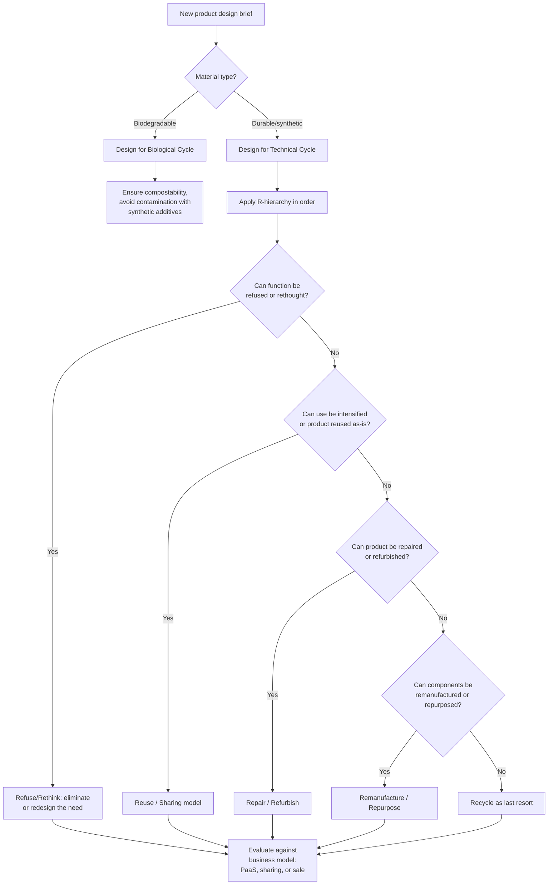

## Circular Economy Models and Design

### Overview

The circular economy is an economic model that decouples economic activity from the consumption of finite resources by designing waste and pollution out of production systems, keeping products and materials in use at their highest value for as long as possible, and regenerating natural systems. It stands in direct contrast to the dominant **linear economy** model ("take-make-dispose"), which extracts raw materials, manufactures products, and discards them as waste at end-of-life. The circular economy operationalizes the strong sustainability and planetary boundaries principles discussed earlier in this chapter at the level of product design, industrial systems, and business models.

### The Linear vs. Circular Paradigm

**Linear economy characteristics**

- **Take**: extraction of virgin raw materials and energy resources
- **Make**: manufacturing into products, typically designed for a single use-life
- **Dispose**: end-of-life disposal via landfill or incineration, with materials permanently lost from productive use

This model treats natural resources as effectively unlimited inputs and environmental sinks (landfills, atmosphere, oceans) as effectively unlimited waste-absorption capacity — an assumption directly challenged by the planetary boundaries framework covered earlier in this chapter.

**Circular economy characteristics**

The circular economy reframes the system around continuous resource circulation, commonly organized (per the Ellen MacArthur Foundation, the most influential institutional proponent of the framework) around two distinct material cycles:

- **Biological cycle**: biodegradable materials (food waste, natural fibers, compostable packaging) are returned to the biosphere through composting, anaerobic digestion, or other biological processes, regenerating natural capital
- **Technical cycle**: durable materials (metals, plastics, synthetic materials) are kept in circulation through maintenance, reuse, refurbishment, remanufacturing, and recycling, minimizing the need for virgin material extraction

### The R-Strategy Hierarchy

Circular economy design strategies are commonly organized into a hierarchy (variously formulated with 3, 6, 9, or 10 R's across different frameworks; a widely cited 9-R version, following Potting et al., 2017, is presented here), ordered from highest to lowest circularity — strategies higher in the hierarchy generally preserve more of a product's original value and require less energy/material input than strategies lower in the hierarchy:

**Smarter product use and manufacture**

1. **Refuse**: eliminating a product's function or replacing it with a radically different, less resource-intensive product/service
2. **Rethink**: making product use more intensive (e.g., through sharing models or multi-functional products)
3. **Reduce**: increasing efficiency in manufacturing or use, using fewer raw materials and resources

**Extending product/component lifespan**

4. **Reuse**: a product, still in good condition and fulfilling its original function, is used again by another consumer

5. **Repair**: maintenance and repair of a defective product so it can be used with its original function

6. **Refurbish**: restoring an old product and bringing it up to date

7. **Remanufacture**: using parts of a discarded product in a new product with the same function

8. **Repurpose**: using a discarded product or its parts in a new product with a different function

**Useful application of materials**

9. **Recycle**: processing materials to obtain the same (or lower) quality, generally the last-resort strategy before disposal, since recycling typically involves energy input and some quality/value loss ("downcycling") relative to the original material

[Inference] Because strategies higher in this hierarchy generally require less energy and preserve more embedded value than recycling, circular economy design guidance typically recommends prioritizing refuse/rethink/reduce and reuse/repair strategies over recycling wherever feasible, though the specific optimal strategy for any given product depends on material properties, use context, and lifecycle analysis rather than the hierarchy alone.

### Core Design Principles

**Design for longevity and durability**

Products designed to withstand extended use through robust materials, modular construction, and resistance to both physical wear and technological obsolescence.

**Design for disassembly**

Products engineered so components can be readily separated at end-of-life or for repair — using standardized fasteners rather than permanent adhesives, minimizing material mixing (e.g., avoiding bonding dissimilar plastics that cannot be separated for recycling), and clearly labeling material composition to facilitate sorting.

**Design for modularity**

Products built from interchangeable, independently replaceable modules/components, allowing individual parts to be upgraded, repaired, or replaced without discarding the entire product — extending functional lifespan and reducing the resource footprint of technological upgrades.

**Material selection and purity**

Prioritizing materials that are readily recyclable, biodegradable (for the biological cycle), or already recycled/renewable in origin, while minimizing the use of composite materials, hazardous substances, or material combinations that complicate end-of-life processing.

**Design for maintenance and repairability**

Related to the **Right to Repair** movement, this principle emphasizes accessible repair manuals, availability of spare parts, standardized tools, and modular design that collectively enable consumers or independent repair services (not only manufacturer-authorized channels) to extend product life.

### Circular Business Models

Beyond product design, the circular economy encompasses distinct business model innovations that shift value capture away from one-time sales of ownership toward models that incentivize durability and material recovery:

**Product-as-a-Service (PaaS) / servitization**

The manufacturer retains ownership of a product and sells its function or performance as a service (e.g., leasing rather than selling equipment, "light as a service" lighting contracts, tire performance contracts). This model realigns manufacturer incentives toward durability and recyclability, since the manufacturer bears the cost of the product's eventual end-of-life and benefits from extending its useful life.

**Sharing platforms and collaborative consumption**

Business models that increase utilization intensity of existing products/assets by enabling multiple users to access a single product (car-sharing, tool libraries, peer-to-peer rental platforms), reducing the total number of products required to meet aggregate demand.

**Product life-extension services**

Business models centered on repair, refurbishment, and resale (e.g., certified refurbished electronics markets, resale/recommerce platforms for apparel), capturing value from products that would otherwise exit the use phase prematurely.

**Resource recovery and industrial symbiosis**

Business models and industrial arrangements where the waste or byproduct of one process becomes an input to another — either within a single organization (closed-loop recycling within a manufacturing process) or across organizations in an industrial ecosystem (industrial symbiosis, discussed below).

### Industrial Symbiosis and Industrial Ecology

**Industrial symbiosis**

A practice where geographically proximate, traditionally separate industries exchange byproducts, waste heat, water, and materials, such that one facility's waste stream becomes another's input stream, reducing aggregate virgin material and energy demand across the industrial cluster.

**Kalundborg Symbiosis (Denmark)**

The most widely cited real-world example, an industrial park where a power station, oil refinery, pharmaceutical manufacturer, plasterboard producer, and the municipality exchange steam, water, gypsum (a byproduct of flue gas desulfurization used in plasterboard manufacturing), and other resources — developed incrementally since the 1970s and frequently used as the foundational case study in industrial ecology education and policy.

### Comparative Table: Linear vs. Circular Economy

| Dimension | Linear Economy | Circular Economy |
| --- | --- | --- |
| Material flow | Take-make-dispose (one-directional) | Continuous circulation (biological + technical cycles) |
| Value capture | One-time sale of ownership | Repeated value capture via service, reuse, recovery |
| Design priority | Cost-minimization, often single-use | Durability, disassembly, modularity |
| End-of-life | Landfill/incineration | Reuse, repair, remanufacture, recycle (in priority order) |
| Resource dependency | High virgin material extraction | Reduced virgin extraction; material stock as resource |
| Business incentive alignment | Sales volume (potentially incentivizing shorter lifespan) | Product durability and service life (via PaaS, sharing models) |

### Conceptual Diagram (svg_diagram)

<svg xmlns="http://www.w3.org/2000/svg" viewBox="0 0 900 460">
<text x="450" y="30" font-size="17" font-weight="bold" text-anchor="middle" fill="#1a1a1a">Circular Economy: Biological and Technical Cycles (svg_diagram)</text>
<rect x="370" y="60" width="160" height="60" rx="8" fill="#fff3e6" stroke="#c97a1a" stroke-width="2" />
<text x="450" y="95" font-size="12" font-weight="bold" text-anchor="middle" fill="#5e3c1a">Manufacture</text>
<rect x="80" y="180" width="280" height="220" rx="8" fill="#eafaf0" stroke="#1f9d55" stroke-width="2" />
<text x="220" y="210" font-size="13" font-weight="bold" text-anchor="middle" fill="#14532d">Biological Cycle</text>
<text x="100" y="245" font-size="10" fill="#333">Biodegradable materials</text>
<text x="100" y="270" font-size="10" fill="#333">↓ Composting /</text>
<text x="100" y="288" font-size="10" fill="#333"> Anaerobic digestion</text>
<text x="100" y="315" font-size="10" fill="#333">↓ Return nutrients</text>
<text x="100" y="333" font-size="10" fill="#333"> to biosphere</text>
<text x="100" y="365" font-size="10" fill="#333">↓ Regenerated natural capital</text>
<rect x="540" y="180" width="280" height="220" rx="8" fill="#eef5ff" stroke="#2c6fbb" stroke-width="2" />
<text x="680" y="210" font-size="13" font-weight="bold" text-anchor="middle" fill="#1a3c5e">Technical Cycle</text>
<text x="560" y="240" font-size="10" fill="#333">Durable materials</text>
<text x="560" y="265" font-size="10" fill="#333">↓ Reuse → Repair →</text>
<text x="560" y="283" font-size="10" fill="#333"> Refurbish → Remanufacture</text>
<text x="560" y="310" font-size="10" fill="#333">↓ (last resort) Recycle</text>
<text x="560" y="335" font-size="10" fill="#333">↓ Materials kept in</text>
<text x="560" y="353" font-size="10" fill="#333"> productive circulation</text>
<line x1="410" y1="120" x2="270" y2="180" stroke="#c97a1a" stroke-width="2" />
<line x1="490" y1="120" x2="650" y2="180" stroke="#c97a1a" stroke-width="2" />
<text x="450" y="430" font-size="11" text-anchor="middle" fill="#666">Design determines which cycle a material can safely enter</text>
</svg>

### Circular Design Decision Flow

### Metrics and Assessment Tools

- **Material Circularity Indicator (MCI)**: developed by the Ellen MacArthur Foundation, assessing the proportion of a product's material inputs and outputs that are circular (recycled/reused input, and recovered/recycled output) versus linear (virgin input, disposed output)
- **Life Cycle Assessment (LCA)**: a standardized methodology (ISO 14040/14044) quantifying environmental impacts across a product's full life cycle (raw material extraction, manufacturing, distribution, use, end-of-life), used to compare circular design alternatives against linear baselines on specific impact categories (carbon footprint, water use, toxicity)
- **Circularity gap reporting**: national and global assessments (e.g., the annual Circularity Gap Report) estimating the proportion of materials cycling back into the economy versus the proportion sourced from virgin extraction, tracking progress toward circular economy targets at national and global scales

### Applications and Policy Context

- **Extended Producer Responsibility (EPR)**: regulatory frameworks requiring manufacturers to bear financial or physical responsibility for the end-of-life management of their products, creating direct economic incentive for circular design (widely implemented for electronics, packaging, and batteries in various jurisdictions)
- **EU Circular Economy Action Plan**: a major policy framework including ecodesign requirements, a "right to repair" regulatory push, and circularity targets across priority sectors (electronics, batteries, textiles, packaging, construction)
- **Right to Repair legislation**: an increasing number of jurisdictions have introduced legal requirements mandating manufacturer support for repair (spare parts availability, repair manuals, standardized fasteners) across product categories including electronics and appliances
- **Corporate circular economy strategies**: increasingly integrated into corporate sustainability reporting (see The Triple Bottom Line Framework and Sustainable Finance and Green Investment) as a distinct disclosure and strategy category alongside climate and broader ESG metrics

### Limitations and Critiques

- **Rebound effects**: increased material efficiency or circularity can, in some cases, reduce costs sufficiently to stimulate increased consumption, partially or fully offsetting the intended resource savings — a well-documented general phenomenon in efficiency economics (related to the Jevons paradox) that circular economy strategies are not automatically immune to
- **Downcycling and quality loss**: many recycling processes, particularly for plastics, result in materials of lower quality than the original ("downcycling"), limiting the number of times a material can realistically be recycled before it must exit the technical cycle as waste — a limitation the R-hierarchy's emphasis on higher-order strategies (reuse, repair) is specifically designed to reduce reliance on
- **Energy and infrastructure requirements**: recycling, remanufacturing, and reverse logistics (collection, sorting, transport) all require energy and infrastructure investment; a genuinely favorable environmental outcome depends on lifecycle assessment showing net benefit relative to virgin material production, which varies significantly by material type and existing infrastructure maturity
- **Scale and systemic transformation questions**: critics (including some ecological economists) argue that circular economy strategies, while reducing resource intensity per unit of output, do not on their own address the question of whether continued aggregate economic growth is compatible with planetary boundaries — a critique paralleling the weak/strong sustainability and degrowth debates discussed under Principles of Sustainable Development
- **Global circularity remains low**: circularity gap assessments have generally found the global economy remains predominantly linear, with only a modest and, per some assessments, declining share of material inputs sourced from recycled/circular sources; readers should consult current-year circularity gap reporting for the latest figures given this is an actively tracked and updated metric

[Inference] Because circular economy strategies primarily address resource throughput efficiency rather than aggregate consumption levels or growth trajectories, their relationship to the broader weak/strong sustainability and degrowth debates remains a genuinely contested question in the sustainability economics literature, with some scholars viewing circularity as a necessary but insufficient condition for remaining within planetary boundaries absent complementary consumption-level or growth-oriented policy.

**Related Topics**

- Principles of Sustainable Development
- The Planetary Boundaries Framework
- The Triple Bottom Line Framework
- Extended Producer Responsibility and Recycling Policy
- Life Cycle Assessment Methodology
- Industrial Ecology and Industrial Symbiosis
- Degrowth and Post-Growth Economics
- Right to Repair Legislation