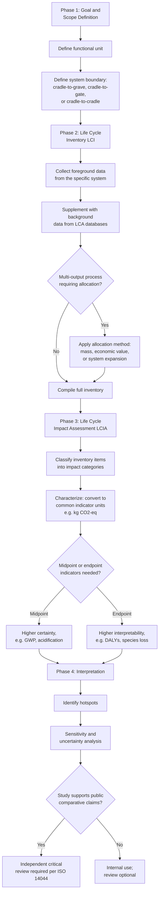

## Life Cycle Assessment Methodology

### Overview

Life Cycle Assessment (LCA) is a standardized methodology for quantifying the environmental impacts of a product, process, or service across its entire life cycle — from raw material extraction through manufacturing, distribution, use, and end-of-life disposal or recovery ("cradle-to-grave") or, in circular applications, back into productive use ("cradle-to-cradle"). LCA provides the quantitative evidentiary basis referenced throughout this chapter, including for evaluating circular design alternatives (see Circular Economy Models and Design), comparing green finance instrument impact claims (see Sustainable Finance and Green Investment), and grounding corporate environmental disclosure (see The Triple Bottom Line Framework).

### Standardization Framework

**ISO 14040 and ISO 14044**

LCA methodology is formally standardized under two International Organization for Standardization standards:

- **ISO 14040**: establishes the general principles and framework for LCA
- **ISO 14044**: specifies detailed requirements and guidelines for conducting an LCA study, including methodological requirements for each phase

Adherence to these standards is what distinguishes a rigorous LCA from informal environmental impact claims, and is generally required for LCA studies used in regulatory contexts, comparative product claims, or third-party-verified environmental product declarations.

### The Four Phases of LCA

**Phase 1: Goal and scope definition**

Establishes the purpose of the study, the intended audience, and critically, the **system boundaries** — which processes, life cycle stages, and geographic/temporal scope are included or excluded. Key scoping decisions made in this phase include:

- **Functional unit**: a precisely defined, quantified description of the product/service function being assessed, enabling fair comparison between alternatives (e.g., "the functional unit is transporting one passenger one kilometer," not simply "a car," allowing comparison across vehicle types with different capacities and lifespans)
- **System boundary type**:
  - **Cradle-to-grave**: full life cycle from raw material extraction through disposal
  - **Cradle-to-gate**: from raw material extraction through the factory gate, excluding use and end-of-life phases (common for business-to-business material/component assessments where use phase is highly variable or unknown)
  - **Cradle-to-cradle**: extends beyond grave to include recycling/recovery back into new production, relevant for circular economy assessment
  - **Gate-to-gate**: a single value-added process within the larger chain

**Phase 2: Life Cycle Inventory (LCI)**

The data-collection phase, compiling a comprehensive inventory of all material and energy inputs and outputs (emissions, waste, resource extraction) associated with each process within the defined system boundary. This typically involves:

- **Foreground data**: primary data collected directly from the specific product system being studied (e.g., a manufacturer's own energy consumption records)
- **Background data**: secondary data drawn from established LCA databases for generic processes (e.g., average electricity grid emissions factors, standard material production processes) not directly measured by the study
- **Allocation**: a critical and often contested methodological step for processes producing multiple outputs (co-products), determining how shared environmental burdens are apportioned between them — common approaches include mass-based allocation, economic value-based allocation, or system expansion (crediting the system for displacing an alternative product)

**Common LCI databases**: Ecoinvent, GaBi, and the U.S. LCA Commons/USLCI are widely used background data sources, though selection of database and its underlying regional/temporal assumptions can materially affect results — a frequently cited source of variation between LCA studies of ostensibly similar products.

**Phase 3: Life Cycle Impact Assessment (LCIA)**

Translates the raw inventory of inputs/outputs (Phase 2) into a smaller number of interpretable environmental impact category indicators, via characterization models that convert diverse substances into common impact metrics.

**Common impact categories**

- **Climate change / Global Warming Potential (GWP)**: aggregates greenhouse gas emissions into $CO_2$-equivalent using established global warming potential factors (e.g., methane's GWP is substantially higher than $CO_2$ over a 100-year horizon, reflecting its greater per-molecule warming effect despite shorter atmospheric lifetime)
- **Acidification potential**: emissions contributing to acid rain (e.g., $SO_2$, $NO_x$), expressed in $SO_2$-equivalent
- **Eutrophication potential**: nutrient loading (nitrogen, phosphorus) contributing to aquatic dead zones, connecting directly to the biogeochemical flows planetary boundary discussed earlier in this chapter
- **Ozone depletion potential**: emissions of ozone-depleting substances, expressed in CFC-11-equivalent
- **Water scarcity footprint**: water consumption weighted by regional water scarcity, reflecting that identical water volumes have different impact depending on local water stress
- **Land use/land occupation**: area and duration of land transformed or occupied, relevant to biodiversity impact
- **Human toxicity and ecotoxicity potential**: potential harm from chemical releases to human health and ecosystems respectively
- **Resource depletion**: depletion of abiotic (mineral, fossil fuel) resources, sometimes expressed relative to reserve scarcity

**Midpoint vs. endpoint indicators**

- **Midpoint indicators**: impact category indicators positioned relatively early in the cause-effect chain (e.g., kg $CO_2$-eq for climate change), offering higher scientific certainty but less immediately interpretable real-world significance
- **Endpoint indicators**: indicators aggregated further along the cause-effect chain toward ultimate damage categories — typically human health (measured in disability-adjusted life years, DALYs), ecosystem quality (species loss), and resource availability — offering more intuitive interpretability but with substantially greater modeling uncertainty accumulated through the additional characterization steps

**Common LCIA methods**: ReCiPe, CML, TRACI, and IMPACT World+ are widely used characterization methodologies, each with somewhat different modeling assumptions and regional calibrations, contributing to potential variation in results between studies using different methods on the same inventory data.

**Phase 4: Interpretation**

The final phase, involving:

- Identification of the most significant contributing processes/life cycle stages to overall impact ("hotspot" identification)
- **Sensitivity analysis**: testing how results change under different methodological assumptions (allocation method, characterization model, data source)
- **Uncertainty analysis**: quantifying the confidence range around results given data quality and model limitations
- Drawing conclusions and, where the LCA is intended for external comparative claims, ensuring conclusions are appropriately qualified given the study's scope and limitations

ISO 14044 specifically requires **critical review** by independent experts for any LCA study intended to support comparative assertions disclosed to the public, given the potential for methodological choices to be selected (consciously or not) in ways that favor a particular conclusion.

### LCA Process Flow

### Worked Example: Comparing Packaging Materials

A simplified illustration of LCA logic comparing two packaging options for a functional unit of "packaging sufficient to deliver 1,000 units of product":

| Impact category | Option A: Single-use plastic | Option B: Reusable glass (10 reuse cycles) |
| --- | --- | --- |
| GWP (kg $CO_2$-eq) | Lower per unit manufactured, but no reuse | Higher per unit manufactured (glass is more energy-intensive to produce), but divided across 10 reuse cycles |
| Water use | Lower manufacturing water use | Higher manufacturing water use, plus washing water between reuse cycles |
| End-of-life | Depends on recycling infrastructure availability and actual recycling rate, not just recyclability | Depends on reuse logistics infrastructure and actual return/reuse rate achieved in practice |

[Inference] This kind of comparison illustrates why LCA conclusions are highly context-dependent: whether reusable packaging outperforms single-use packaging depends critically on assumptions about actual reuse rate achieved, transport distances for washing/return logistics, and regional electricity grid carbon intensity — meaning a genuinely reliable comparative conclusion requires a specific, transparent LCA study rather than an intuitive assumption that reusable options are automatically lower-impact, since real-world underperformance against assumed reuse/recycling rates is a commonly cited factor that can reverse expected outcomes.

### Related and Complementary Methodologies

**Environmental Product Declarations (EPDs)**

Standardized, third-party-verified documents (following ISO 14025 and, for specific sectors, Product Category Rules) that communicate LCA results for a specific product in a consistent, comparable format, commonly used in construction materials and industrial products to support procurement decisions and green building certification (e.g., LEED).

**Carbon footprinting**

A narrower assessment focused specifically on greenhouse gas emissions (a single impact category from full LCA), standardized separately under frameworks including the GHG Protocol (organizational and product-level) and ISO 14067 (product carbon footprint specifically) — commonly used as a faster, more limited-scope alternative to full multi-category LCA when climate impact alone is the assessment priority.

**Social Life Cycle Assessment (S-LCA)**

An emerging complementary methodology (guided by UNEP/SETAC guidelines) extending life-cycle thinking to social impact categories (labor conditions, human rights, community impact) across the value chain, paralleling the "People" dimension of the Triple Bottom Line framework but applying life-cycle system-boundary rigor to social impact assessment specifically.

**Material Flow Analysis (MFA) and Material Circularity Indicator**

Related but distinct approaches: MFA tracks the physical flow of materials through an economic system without the full multi-category environmental impact characterization of LCA, while the Material Circularity Indicator (introduced under Circular Economy Models and Design) uses simplified circularity-specific metrics rather than full LCIA.

### Applications

- **Product ecodesign**: identifying life-cycle hotspots to prioritize design interventions with the greatest environmental benefit (directly informing circular design decisions discussed in the prior item)
- **Green claims substantiation and greenwashing prevention**: regulatory frameworks increasingly require LCA-based substantiation for environmental marketing claims (e.g., the EU's Green Claims Directive proposals), directly addressing the greenwashing concerns discussed under Sustainable Finance and Green Investment
- **Policy and regulatory impact assessment**: LCA underlies many regulatory environmental footprint requirements, including product carbon footprint labeling schemes and building material environmental performance requirements
- **Corporate Scope 3 emissions accounting**: LCA methodology and data underpin much of the value-chain (Scope 3) emissions estimation required under corporate climate disclosure frameworks (see Sustainable Finance and Green Investment)
- **Comparative technology assessment**: widely used to compare environmental performance of competing technologies (e.g., electric vs. internal combustion vehicles, different renewable energy technologies), though such comparisons require careful attention to functional unit definition and system boundary consistency to be meaningful

### Limitations and Critiques

- **Data quality and availability constraints**: comprehensive, high-quality, geographically and temporally specific inventory data is not available for all processes and regions, often requiring use of proxy or averaged background data that may not accurately reflect the specific system being studied
- **Methodological choice sensitivity**: allocation method, system boundary definition, and characterization model selection can each materially affect results, and studies using different methodological choices on ostensibly comparable products can yield different or even contradictory conclusions — a significant driver of the ISO 14044 critical review requirement for comparative public claims
- **Temporal and geographic specificity challenges**: LCA results reflect the specific time period and location of underlying data (e.g., a specific year's electricity grid mix); results can become outdated as, for example, grid decarbonization proceeds, or may not transfer accurately to different regions with different energy and industrial infrastructure
- **Difficulty capturing certain impact categories**: some environmental concerns (biodiversity impact beyond simple land occupation, cumulative or synergistic toxicity effects, some aspects of freshwater ecosystem impact) remain less mature in LCIA characterization methods than well-established categories like climate change, potentially understating certain impacts in aggregate comparisons
- **Single-issue focus risk**: because climate/GWP results are often the most prominently reported LCA output, there is a documented risk of "carbon tunnel vision" — optimizing for climate impact while inadvertently worsening other impact categories (water use, toxicity, land use) not given comparable attention in decision-making, underscoring the importance of considering the full multi-category LCIA result rather than a single headline figure

[Inference] Given the substantial methodological choices embedded at each LCA phase, the practical reliability and comparability of any specific LCA-based claim depends heavily on transparent documentation of scope, boundary, allocation, and characterization method choices — meaning consumers of LCA results (policymakers, procurement decision-makers, consumers) should generally treat headline comparative claims with appropriate caution absent access to the underlying methodological detail and, ideally, independent critical review.

**Related Topics**

- Circular Economy Models and Design
- The Triple Bottom Line Framework
- Carbon Pricing and Emissions Trading
- Environmental Product Declarations and Green Building Certification
- GHG Protocol and Scope 1/2/3 Emissions Accounting
- Sustainable Finance and Green Investment
- Extended Producer Responsibility and Recycling Policy
- The Planetary Boundaries Framework