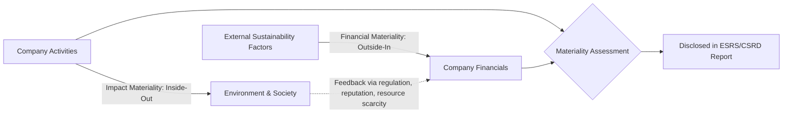

## Corporate Sustainability and ESG Reporting

### Definition and Scope

Corporate Sustainability refers to the management approach through which companies integrate environmental, social, and economic considerations into their operations and decision-making, aiming to create long-term value while minimizing negative externalities. ESG Reporting (Environmental, Social, and Governance reporting) is the structured disclosure mechanism through which organizations communicate their sustainability performance, risks, and management practices to stakeholders including investors, regulators, customers, and civil society.

The field sits at the intersection of environmental science, corporate finance, accounting, and public policy. It has evolved from voluntary corporate social responsibility (CSR) initiatives in the 1990s–2000s into a quasi-mandatory disclosure regime in many jurisdictions by the mid-2020s, driven by investor demand for decision-useful non-financial data and regulatory mandates such as the EU's Corporate Sustainability Reporting Directive (CSRD).

### The Three Pillars

**Environmental (E)**

Covers a company's interactions with the natural world:

- Greenhouse gas (GHG) emissions across Scope 1 (direct), Scope 2 (purchased energy), and Scope 3 (value chain)
- Energy consumption and mix (renewable vs. non-renewable)
- Water withdrawal, consumption, and discharge
- Waste generation, diversion, and circularity metrics
- Biodiversity and land-use impacts
- Pollution (air, water, soil) and hazardous substance management

**Social (S)**

Covers relationships with people:

- Labor practices, occupational health and safety
- Diversity, equity, and inclusion (DEI) metrics
- Human rights due diligence across supply chains
- Community relations and social license to operate
- Product safety, data privacy, and customer welfare

**Governance (G)**

Covers oversight and accountability structures:

- Board composition, independence, and diversity
- Executive compensation linkage to ESG targets
- Anti-corruption and business ethics policies
- Risk management systems
- Shareholder rights and stakeholder engagement mechanisms

### Why ESG Reporting Matters (Environmental Science Perspective)

From an environmental science standpoint, ESG reporting functions as a **quantification and accountability layer** for corporate environmental impact. It translates physical phenomena (tonnes of $CO_2$-equivalent, cubic meters of water, hectares of land disturbed) into standardized, auditable metrics that can be aggregated across firms, sectors, and economies. This enables:

- **Externality pricing**: Making previously unpriced environmental costs (e.g., carbon emissions) visible to capital markets, which can then be internalized through carbon pricing, green finance premiums, or regulatory penalties.
- **Benchmarking and target-setting**: Allowing comparison against science-based targets, such as those aligned with limiting global warming to $1.5°C$ above pre-industrial levels.
- **Supply chain transparency**: Extending accountability beyond direct operations into Scope 3 emissions, which for many companies (especially in retail, apparel, and consumer goods) represent over 70% of total carbon footprint.

### Major Reporting Frameworks and Standards

The ESG reporting landscape has historically been fragmented, with multiple overlapping voluntary frameworks. Below is a comparative overview of the most significant ones as of the 2025–2026 reporting cycle.

| Framework | Full Name | Focus | Mandatory/Voluntary | Governing Body |
| --- | --- | --- | --- | --- |
| GRI | Global Reporting Initiative | Broad stakeholder impact (double materiality) | Voluntary (widely adopted globally) | Global Sustainability Standards Board (GSSB) |
| SASB | Sustainability Accounting Standards Board | Industry-specific financial materiality | Voluntary | Value Reporting Foundation (now under IFRS Foundation) |
| TCFD | Task Force on Climate-related Financial Disclosures | Climate risk (physical & transition) | Voluntary, increasingly mandated | Financial Stability Board (FSB) |
| ISSB / IFRS S1 & S2 | International Sustainability Standards Board | Global baseline, investor-focused | Adopted into law in some jurisdictions | IFRS Foundation |
| CSRD / ESRS | Corporate Sustainability Reporting Directive / European Sustainability Reporting Standards | Comprehensive double materiality | Mandatory (EU) | European Commission / EFRAG |
| CDP | Carbon Disclosure Project | Climate, water, forests | Voluntary (investor-driven) | CDP (non-profit) |
| TNFD | Taskforce on Nature-related Financial Disclosures | Biodiversity and nature risk | Voluntary (emerging) | TNFD Secretariat |

**Note on convergence [Inference]:** As of early 2026, there is an observable trend toward consolidation, with the ISSB standards (IFRS S1/S2) intended to serve as a global baseline that jurisdictions can build upon (e.g., CSRD in the EU adds additional double-materiality requirements on top of ISSB-aligned disclosures). The pace and extent of this convergence across all jurisdictions remains subject to ongoing regulatory developments, and specific timelines should be verified against current regulatory publications.

### Double Materiality: A Core Conceptual Framework

Double materiality is a foundational concept distinguishing European (CSRD/ESRS) reporting from traditional investor-focused frameworks (like SASB). It requires companies to assess and report on two distinct but related dimensions:

1. **Financial materiality (outside-in)**: How do sustainability issues affect the company's financial performance, position, and cash flows? (e.g., How will carbon pricing regulation affect operating costs?)
2. **Impact materiality (inside-out)**: How does the company's activity affect the environment and society, regardless of financial consequences? (e.g., How much biodiversity loss does the company's land use cause?)

A topic is considered "material" under double materiality if it is significant under *either* dimension, not necessarily both.

### GHG Protocol and Emissions Scopes

The GHG Protocol Corporate Standard is the most widely used accounting framework for corporate emissions, underpinning nearly all ESG climate disclosures.

**Scope 1 — Direct Emissions**

Emissions from sources owned or controlled by the company: on-site fuel combustion, company vehicle fleets, and fugitive emissions (e.g., refrigerant leaks).

**Scope 2 — Indirect Energy Emissions**

Emissions from the generation of purchased electricity, steam, heating, or cooling consumed by the company. Reported using two methods:

- **Location-based**: Uses average emission factors for the regional electricity grid.
- **Market-based**: Reflects emissions from contractual instruments such as Renewable Energy Certificates (RECs) or Power Purchase Agreements (PPAs).

**Scope 3 — Value Chain Emissions**

All other indirect emissions occurring in the company's upstream and downstream value chain, divided into 15 categories per the GHG Protocol, including purchased goods and services, business travel, employee commuting, use of sold products, and end-of-life treatment of sold products.

The total corporate carbon footprint is calculated as:

$$E_{total} = E_{Scope1} + E_{Scope2} + \sum_{i=1}^{15} E_{Scope3,i}$$

where each $E$ term is expressed in tonnes of $CO_2$-equivalent ($tCO_2e$), calculated by multiplying activity data by an appropriate emission factor:

$$E = A \times EF$$

where $A$ is activity data (e.g., liters of fuel combusted, kWh consumed) and $EF$ is the emission factor (e.g., $kgCO_2e/kWh$) sourced from recognized databases such as the IPCC, EPA, or DEFRA.

### Assurance and Verification

As ESG disclosures move from voluntary to mandatory, third-party assurance has become increasingly important to ensure data integrity, analogous to financial audit.

- **Limited assurance**: The assurance provider states that nothing has come to their attention indicating the information is materially misstated (a lower level of scrutiny, negative-form conclusion).
- **Reasonable assurance**: The assurance provider expresses a positive opinion that the information is free from material misstatement (comparable rigor to a financial statement audit).

CSRD mandates a phased transition from limited to reasonable assurance for in-scope EU companies, though the exact timeline for this transition should be confirmed against the current EU implementing legislation, as phase-in dates have been subject to regulatory adjustment. [Unverified — subject to ongoing regulatory revision]

### Common Metrics and KPIs

| Category | Example Metric | Typical Unit |
| --- | --- | --- |
| Climate | Total GHG emissions | $tCO_2e$ |
| Climate | Carbon intensity | $tCO_2e$ / $M revenue |
| Energy | Renewable energy share | % of total energy consumption |
| Water | Water withdrawal in water-stressed areas | m³ |
| Waste | Waste diverted from landfill | % |
| Social | Gender pay gap | % differential |
| Social | Lost-time injury frequency rate | incidents per 200,000 hours worked |
| Governance | Board gender diversity | % of seats |

### Practical Example: Calculating and Reporting Scope 2 Emissions

**Scenario**: A mid-sized manufacturing firm consumes 5,000,000 kWh of grid electricity annually at a facility in a region with a grid emission factor of 0.45 kgCO₂e/kWh (location-based). The firm also purchases RECs covering 2,000,000 kWh, with the residual grid mix (post-REC) having a market-based emission factor of 0.60 kgCO₂e/kWh for unbundled electricity.

**Location-based calculation:**

$$E_{loc} = 5{,}000{,}000 \text{ kWh} \times 0.45 \text{ kgCO}_2e/\text{kWh} = 2{,}250{,}000 \text{ kgCO}_2e = 2{,}250 \text{ tCO}_2e$$

**Market-based calculation:**

- REC-covered electricity (2,000,000 kWh) is typically reported at 0 kgCO₂e/kWh (assuming the REC meets quality criteria for bundling with generation attributes).
- Remaining 3,000,000 kWh at residual mix factor:

$$E_{mkt} = 3{,}000{,}000 \text{ kWh} \times 0.60 \text{ kgCO}_2e/\text{kWh} = 1{,}800{,}000 \text{ kgCO}_2e = 1{,}800 \text{ tCO}_2e$$

Under the GHG Protocol's dual reporting requirement, the company must disclose **both** figures (2,250 $tCO_2e$ location-based; 1,800 $tCO_2e$ market-based) rather than selecting only the more favorable one. This dual disclosure prevents companies from obscuring actual grid dependency solely through REC purchases without genuine additionality (new renewable capacity brought online as a result of the purchase).

### Greenwashing and Data Integrity Risks

A significant challenge in this domain is **greenwashing**: the practice of overstating or misrepresenting environmental credentials. Environmental science and regulatory bodies have identified recurring patterns:

- **Selective disclosure**: Highlighting favorable metrics (e.g., renewable energy investments) while omitting unfavorable ones (e.g., rising absolute emissions).
- **Vague claims**: Using undefined terms like "eco-friendly" or "sustainable" without quantifiable backing.
- **Offset substitution**: Relying heavily on carbon offsets/credits rather than absolute emissions reduction, particularly where offset quality (additionality, permanence, leakage) is questionable.
- **Scope 3 exclusion**: Reporting only Scope 1 and 2 emissions while ignoring Scope 3, which often represents the majority of total footprint for many sectors.

Regulatory responses include the EU's Green Claims Directive and Empowering Consumers Directive, which impose substantiation requirements on environmental marketing claims. [Inference: enforcement mechanisms and penalties vary by member state and are subject to ongoing transposition into national law.]

### Diagram: ESG Reporting Value Chain (svg_diagram)

<svg xmlns="http://www.w3.org/2000/svg" viewBox="0 0 900 320" font-family="Arial, sans-serif">
<text x="450" y="25" text-anchor="middle" font-size="16" font-weight="bold">ESG Reporting Value Chain (svg_diagram)</text>
<rect x="20" y="60" width="140" height="70" rx="8" fill="#e8f4ea" stroke="#2e7d32" stroke-width="2" />
<text x="90" y="90" text-anchor="middle" font-size="12" font-weight="bold">Data Collection</text>
<text x="90" y="108" text-anchor="middle" font-size="10">Facilities, HR, Finance</text>
<rect x="200" y="60" width="140" height="70" rx="8" fill="#e3f2fd" stroke="#1565c0" stroke-width="2" />
<text x="270" y="90" text-anchor="middle" font-size="12" font-weight="bold">Consolidation</text>
<text x="270" y="108" text-anchor="middle" font-size="10">ESG Data Platform</text>
<rect x="380" y="60" width="140" height="70" rx="8" fill="#fff3e0" stroke="#e65100" stroke-width="2" />
<text x="450" y="90" text-anchor="middle" font-size="12" font-weight="bold">Materiality</text>
<text x="450" y="108" text-anchor="middle" font-size="10">Assessment</text>
<rect x="560" y="60" width="140" height="70" rx="8" fill="#f3e5f5" stroke="#6a1b9a" stroke-width="2" />
<text x="630" y="90" text-anchor="middle" font-size="12" font-weight="bold">Report Drafting</text>
<text x="630" y="108" text-anchor="middle" font-size="10">GRI/ESRS/ISSB aligned</text>
<rect x="740" y="60" width="140" height="70" rx="8" fill="#fce4ec" stroke="#ad1457" stroke-width="2" />
<text x="810" y="90" text-anchor="middle" font-size="12" font-weight="bold">Assurance</text>
<text x="810" y="108" text-anchor="middle" font-size="10">Limited/Reasonable</text>
<line x1="160" y1="95" x2="200" y2="95" stroke="#555" stroke-width="2" marker-end="url(#arrow)" />
<line x1="340" y1="95" x2="380" y2="95" stroke="#555" stroke-width="2" marker-end="url(#arrow)" />
<line x1="520" y1="95" x2="560" y2="95" stroke="#555" stroke-width="2" marker-end="url(#arrow)" />
<line x1="700" y1="95" x2="740" y2="95" stroke="#555" stroke-width="2" marker-end="url(#arrow)" />
<rect x="200" y="200" width="500" height="80" rx="8" fill="#f5f5f5" stroke="#424242" stroke-width="2" />
<text x="450" y="225" text-anchor="middle" font-size="12" font-weight="bold">Stakeholder Consumption</text>
<text x="450" y="245" text-anchor="middle" font-size="10">Investors, Regulators, Customers, NGOs</text>
<text x="450" y="262" text-anchor="middle" font-size="10">Used for capital allocation, compliance, risk screening</text>
<line x1="810" y1="130" x2="810" y2="175" stroke="#555" stroke-width="2" />
<line x1="810" y1="175" x2="450" y2="175" stroke="#555" stroke-width="2" />
<line x1="450" y1="175" x2="450" y2="200" stroke="#555" stroke-width="2" marker-end="url(#arrow)" />
</svg>

### Investor and Financial Market Integration

ESG data has become embedded in mainstream financial analysis through several mechanisms:

- **ESG ratings agencies** (e.g., MSCI ESG, Sustainalytics, S&P Global) aggregate disclosed data into composite scores used for portfolio screening.
- **Green and sustainability-linked bonds**: Debt instruments where interest rates may be tied to achievement of predefined sustainability performance targets (SPTs).
- **Article 6, 8, and 9 fund classifications** under the EU Sustainable Finance Disclosure Regulation (SFDR), categorizing investment funds by their sustainability ambition level.
- **Climate risk stress testing**: Increasingly required by financial regulators/central banks to assess systemic exposure to transition and physical climate risks.

[Inference]: The correlation between high ESG ratings and financial outperformance remains an actively debated empirical question in financial economics literature, with results varying significantly by methodology, time period, and sector; this should not be treated as an established causal relationship.

### Challenges and Limitations

- **Data comparability**: Differing methodologies across frameworks and rating agencies can produce divergent scores for the same company.
- **Boundary-setting complexity**: Determining organizational boundaries (equity share vs. operational control approach) affects what emissions are attributed to a reporting entity.
- **Scope 3 estimation uncertainty**: Value chain emissions often rely on industry-average secondary data rather than primary supplier data, introducing significant estimation error.
- **Reporting burden**: Compliance costs, particularly for small and medium enterprises (SMEs) drawn into reporting requirements via supply chain pressure from larger reporting entities.
- **Regulatory fragmentation**: Divergent requirements across US (SEC climate rules, subject to litigation and revision), EU (CSRD), and other jurisdictions create compliance complexity for multinational firms. [Unverified: specific regulatory status subject to change; verify current requirements against the relevant regulator's latest publications.]

### Related Topics

- Life Cycle Assessment (LCA) and Product Carbon Footprinting
- Circular Economy Business Models and Material Flow Analysis
- Science Based Targets initiative (SBTi) and Net-Zero Target Setting
- Carbon Markets, Offsets, and Carbon Credit Quality Assessment
- Supply Chain Due Diligence and Scope 3 Emissions Accounting
- Biodiversity Net Gain and Natural Capital Accounting
- Sustainable Finance Taxonomies (EU Taxonomy Regulation)
- Environmental, Social, and Governance (ESG) Ratings Methodologies
- Climate Risk: Physical vs. Transition Risk Assessment
- Extended Producer Responsibility (EPR) Schemes