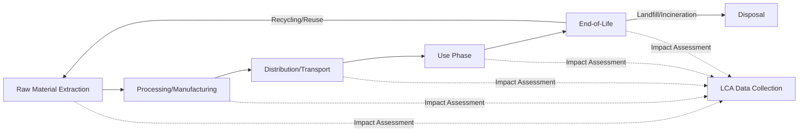

## Sustainable Consumption and Production Patterns

### Definition and Scope

Sustainable Consumption and Production (SCP) refers to the use of goods and services in ways that minimize environmental impact, resource depletion, and waste generation across the entire lifecycle—from raw material extraction through production, distribution, use, and disposal—while meeting human needs and improving quality of life. SCP is formally codified as **Sustainable Development Goal 12 (SDG 12)** within the UN 2030 Agenda for Sustainable Development.

The core conceptual challenge SCP addresses is **decoupling**: separating economic growth and human wellbeing from proportional increases in resource use and environmental degradation. This distinguishes:

- **Relative decoupling**: Resource intensity per unit of GDP declines, but absolute resource use may still rise.
- **Absolute decoupling**: Total resource use declines or stabilizes even as GDP grows.

### The 10-Year Framework of Programmes (10YFP) and Policy Architecture

SCP as a global policy area originated from the 2002 Johannesburg Plan of Implementation and was operationalized through the **10-Year Framework of Programmes on Sustainable Consumption and Production Patterns (10YFP)**, adopted at Rio+20 in 2012. This framework structured international cooperation around specific programme areas, including:

- Consumer information for SCP
- Sustainable lifestyles and education
- Sustainable public procurement (SPP)
- Sustainable buildings and construction
- Sustainable tourism
- Sustainable food systems

SDG 12 subsequently absorbed and expanded this agenda, with specific targets (12.1 through 12.8 plus implementation means 12.a–12.c) addressing resource efficiency, food waste, chemical and waste management, corporate sustainability reporting, public procurement, and consumer awareness.

### Life Cycle Thinking as the Analytical Foundation

SCP relies fundamentally on **life cycle thinking**—evaluating environmental impacts across all stages of a product or service's existence rather than at a single point (e.g., only manufacturing or only disposal). This prevents **burden shifting**, where an intervention reduces impact at one stage while increasing it at another.

The quantitative tool underpinning this is **Life Cycle Assessment (LCA)**, standardized under ISO 14040/14044, which follows four phases: goal and scope definition, life cycle inventory (LCI) analysis, life cycle impact assessment (LCIA), and interpretation.

### Production-Side Strategies

**Resource Efficiency and Eco-Design**

Designing products to minimize material and energy inputs per unit of function delivered. Eco-design directives (such as the EU Ecodesign for Sustainable Products Regulation, ESPR) mandate minimum performance standards for durability, reparability, recyclability, and energy efficiency at the design stage—before a product reaches manufacturing.

**Industrial Symbiosis**

A practice where waste or byproducts from one industrial process become input materials for another, often organized in eco-industrial parks. The classic example is the Kalundborg Symbiosis in Denmark, where a power plant, refinery, pharmaceutical facility, and municipality exchange steam, water, gypsum, and biomass residues.

**Cleaner Production**

A preventive strategy applying continuous environmental strategies to processes, products, and services to increase efficiency and reduce risks to humans and the environment, as opposed to end-of-pipe treatment (treating pollution after it is generated).

**Extended Producer Responsibility (EPR)**

A policy approach that extends a producer's financial and/or physical responsibility for a product to the post-consumer stage of its lifecycle, incentivizing design for recyclability and take-back systems. Common in electronics (WEEE Directive in the EU), packaging, and batteries.

### Consumption-Side Strategies

**Sustainable Public Procurement (SPP)**

Governments leveraging their purchasing power (often 12–20% of GDP in OECD economies) to prioritize environmentally and socially preferable goods and services, creating market demand signals for sustainable products at scale.

**Consumer Information Tools**

- Eco-labels (e.g., EU Ecolabel, Energy Star, Forest Stewardship Council certification)
- Carbon footprint labeling on products
- Environmental Product Declarations (EPDs)

**Sharing Economy and Product-as-a-Service Models**

Shifting from ownership to access-based consumption models (e.g., car-sharing, tool libraries, clothing rental, "chemical leasing" where a chemical producer sells the *function* of a chemical rather than the substance itself, retaining incentive to minimize quantity used).

**Behavioral Interventions**

Nudge-based approaches (default settings, social norm messaging, choice architecture) to shift consumer behavior toward lower-impact options without restricting choice.

### Key Metrics and Indicators

| Indicator | Description | Typical Unit |
| --- | --- | --- |
| Material Footprint | Total raw material extraction attributed to final demand | tonnes / capita |
| Domestic Material Consumption (DMC) | Material inputs used within an economy minus exports | tonnes / capita |
| Resource Productivity | GDP generated per unit of material consumed | $ / tonne |
| Food Loss and Waste Index | Food lost/wasted across supply chain stages | % of production |
| Municipal Solid Waste Generation | Waste generated per capita | kg / capita / year |
| Material Footprint per GDP unit | Decoupling indicator | tonnes / $1000 GDP |

Resource productivity is calculated as:

$$RP = \frac{GDP}{DMC}$$

where $GDP$ is gross domestic product and $DMC$ is domestic material consumption, both measured over the same period and typically expressed in constant currency units per tonne.

### Worked Example: Decoupling Analysis

**Scenario**: A country's GDP and material footprint are tracked over a 10-year period.

| Year | GDP (Index, Year 1 = 100) | Material Footprint (Index, Year 1 = 100) |
| --- | --- | --- |
| Year 1 | 100 | 100 |
| Year 10 | 145 | 120 |

**Relative decoupling check**: Resource intensity (material footprint per unit GDP) in Year 10:

$$\text{Intensity}_{Y10} = \frac{120}{145} \times 100 = 82.8$$

Since intensity fell from 100 to 82.8, **relative decoupling has occurred**—the economy uses fewer resources per unit of output than before.

**Absolute decoupling check**: Compare absolute material footprint levels: Year 1 = 100, Year 10 = 120. Since the material footprint *increased* in absolute terms (despite falling intensity), **absolute decoupling has not occurred**. This is a common real-world pattern: efficiency gains (relative decoupling) are frequently outpaced by the scale effect of overall economic growth, resulting in continued net increases in absolute resource consumption. [Inference: whether this pattern holds for any specific country or sector requires empirical verification against current national statistical data.]

### The Rebound Effect

A critical phenomenon complicating SCP interventions is the **rebound effect** (or Jevons Paradox in its strong form): efficiency improvements that reduce the cost of consuming a resource can paradoxically lead to increased overall consumption, partially or fully offsetting the expected environmental benefit.

$$\text{Rebound Rate} = 1 - \frac{\text{Actual Savings}}{\text{Engineering-Predicted Savings}} \times 100\%$$

**Example**: A household upgrades to a more fuel-efficient vehicle, reducing cost-per-kilometer driven. If the household responds by driving more kilometers (because travel is now cheaper), some or all of the anticipated fuel savings are "rebounded" away. Direct rebound effects are typically estimated in the range of 10–30% for household energy services, though magnitudes vary substantially by sector, income level, and price elasticity of demand. [Inference: specific rebound magnitudes are context-dependent and subject to ongoing empirical research; cited ranges should be treated as illustrative rather than universal constants.]

### Sustainable Food Systems as an SCP Priority Area

Food systems merit particular attention within SCP due to their disproportionate environmental footprint:

- Food production is a major driver of land-use change, freshwater withdrawal, and biodiversity loss globally.
- Approximately one-third of food produced globally for human consumption is lost or wasted across the supply chain, according to widely cited FAO estimates. [Unverified: exact percentages vary by study methodology and year; consult current FAO/UNEP Food Waste Index reports for precise figures.]
- SDG Target 12.3 specifically calls for halving per capita global food waste at retail and consumer levels and reducing food losses along production and supply chains by 2030.

Interventions include improved cold-chain infrastructure in developing economies (reducing post-harvest loss), date-labeling reform (distinguishing "best before" from "use by" to reduce premature discarding), and food redistribution networks.

### Diagram: SCP Policy Intervention Points Across the Value Chain (svg_diagram)

<svg xmlns="http://www.w3.org/2000/svg" viewBox="0 0 900 300" font-family="Arial, sans-serif">
<text x="450" y="22" text-anchor="middle" font-size="15" font-weight="bold">SCP Policy Intervention Points (svg_diagram)</text>
<line x1="60" y1="150" x2="840" y2="150" stroke="#999" stroke-width="3" />
<circle cx="120" cy="150" r="10" fill="#2e7d32" />
<text x="120" y="130" text-anchor="middle" font-size="11" font-weight="bold">Extraction</text>
<text x="120" y="180" text-anchor="middle" font-size="10" width="100">Resource efficiency standards</text>
<circle cx="280" cy="150" r="10" fill="#1565c0" />
<text x="280" y="130" text-anchor="middle" font-size="11" font-weight="bold">Production</text>
<text x="280" y="180" text-anchor="middle" font-size="10">Eco-design, cleaner production</text>
<circle cx="440" cy="150" r="10" fill="#e65100" />
<text x="440" y="130" text-anchor="middle" font-size="11" font-weight="bold">Distribution</text>
<text x="440" y="180" text-anchor="middle" font-size="10">Sustainable logistics, labeling</text>
<circle cx="600" cy="150" r="10" fill="#6a1b9a" />
<text x="600" y="130" text-anchor="middle" font-size="11" font-weight="bold">Consumption</text>
<text x="600" y="180" text-anchor="middle" font-size="10">SPP, eco-labels, sharing models</text>
<circle cx="760" cy="150" r="10" fill="#ad1457" />
<text x="760" y="130" text-anchor="middle" font-size="11" font-weight="bold">End-of-Life</text>
<text x="760" y="180" text-anchor="middle" font-size="10">EPR, recycling infrastructure</text>
<path d="M 760 160 C 760 240, 120 240, 120 160" stroke="#2e7d32" stroke-width="2" fill="none" stroke-dasharray="6,4" marker-end="url(#arrow2)" />
<text x="440" y="255" text-anchor="middle" font-size="10" fill="#2e7d32">Circular feedback loop (material recovery)</text>
</svg>

### Relationship to Circular Economy

SCP and the circular economy are closely related but distinct concepts:

- **SCP** is the broader policy and behavioral framework concerned with the overall scale and pattern of resource use and waste across society.
- **Circular economy** is a specific economic model and set of design/business strategies (the "R-strategies": Refuse, Rethink, Reduce, Reuse, Repair, Refurbish, Remanufacture, Repurpose, Recycle, Recover) aimed at keeping materials in use for as long as possible.

Circular economy strategies are a primary *mechanism* through which SCP goals (particularly SDG 12.5, substantially reducing waste generation) can be achieved, but SCP also encompasses demand-side and behavioral dimensions (e.g., sufficiency, reduced overall consumption volumes) that extend beyond circularity alone.

### Measurement Challenges

- **Attribution across global supply chains**: Consumption in one country drives production (and associated environmental impact) in another, requiring consumption-based accounting (e.g., material footprint) rather than territorial production-based accounting to capture the full picture.
- **Double counting risk**: When tracking material flows through multiple processing and trade stages, care must be taken to avoid counting the same material multiple times across an input-output accounting framework.
- **Data availability gaps**: Many indicators, particularly for informal economy activity and small-scale production in developing economies, rely on estimation and modeling rather than direct measurement. [Unverified: data quality varies significantly by country and indicator; consult national statistical offices or UN Environment Programme data portals for current data coverage.]
- **Behavioral rebound effects**: As noted above, engineering-based efficiency projections often overstate real-world environmental benefit due to behavioral responses.

### Related Topics

- Circular Economy: Principles and the R-Strategies Hierarchy
- Life Cycle Assessment (LCA) Methodology (ISO 14040/14044)
- Extended Producer Responsibility (EPR) Policy Design
- Sustainable Public Procurement (SPP) Frameworks
- Food Loss and Waste Reduction Strategies
- Material Flow Analysis (MFA) and Economy-Wide Material Accounting
- Eco-Design and Ecodesign for Sustainable Products Regulation (ESPR)
- The Sharing Economy and Product-Service Systems
- Rebound Effects and Jevons Paradox in Environmental Economics
- Consumer Behavior Change and Nudge Theory in Sustainability