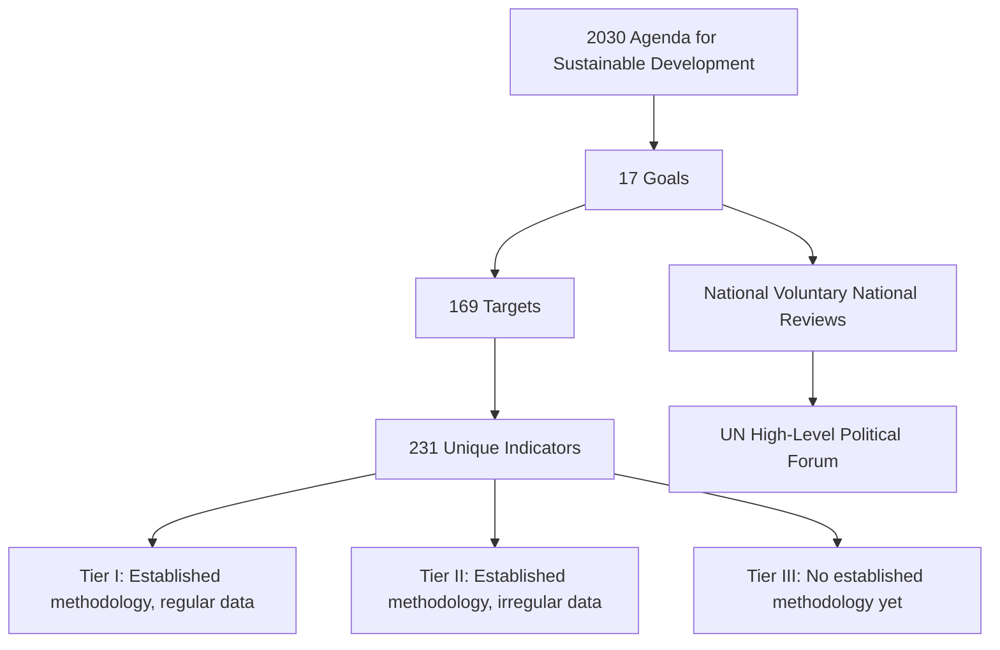

## United Nations Sustainable Development Goals

### Definition and Scope

The United Nations Sustainable Development Goals (SDGs) are a set of 17 interlinked global objectives, comprising 169 targets and over 230 unique indicators, adopted by all UN Member States in 2015 as part of the **2030 Agenda for Sustainable Development**. The SDGs succeeded the Millennium Development Goals (MDGs, 2000–2015) and represent a universal call to action to end poverty, protect the planet, and ensure that all people enjoy peace and prosperity by the year 2030.

Unlike the MDGs, which applied primarily to developing countries, the SDGs are explicitly **universal**, applying to all nations—developed and developing alike—reflecting the recognition that sustainable development challenges (climate change, inequality, unsustainable consumption) are shared across the global economy.

### The 17 Goals

| # | Goal | Core Focus |
| --- | --- | --- |
| 1 | No Poverty | Eradicate extreme poverty in all forms |
| 2 | Zero Hunger | End hunger, achieve food security and improved nutrition |
| 3 | Good Health and Well-being | Ensure healthy lives and promote well-being for all ages |
| 4 | Quality Education | Inclusive, equitable quality education and lifelong learning |
| 5 | Gender Equality | Achieve gender equality and empower women and girls |
| 6 | Clean Water and Sanitation | Availability and sustainable management of water and sanitation |
| 7 | Affordable and Clean Energy | Access to affordable, reliable, sustainable, modern energy |
| 8 | Decent Work and Economic Growth | Sustained, inclusive economic growth and decent work |
| 9 | Industry, Innovation and Infrastructure | Resilient infrastructure, inclusive industrialization |
| 10 | Reduced Inequalities | Reduce inequality within and among countries |
| 11 | Sustainable Cities and Communities | Inclusive, safe, resilient, sustainable human settlements |
| 12 | Responsible Consumption and Production | Ensure sustainable consumption and production patterns |
| 13 | Climate Action | Urgent action to combat climate change and its impacts |
| 14 | Life Below Water | Conserve and sustainably use oceans, seas, marine resources |
| 15 | Life on Land | Protect, restore, promote sustainable use of terrestrial ecosystems |
| 16 | Peace, Justice and Strong Institutions | Peaceful, inclusive societies, access to justice, effective institutions |
| 17 | Partnerships for the Goals | Strengthen means of implementation and global partnership |

### Structural Anatomy: Goals, Targets, and Indicators

The SDG framework operates as a three-tier hierarchy:

1. **Goals (17 total)**: High-level aspirational statements (the table above).
2. **Targets (169 total)**: Specific, often quantified sub-objectives under each goal, numbered using the goal number followed by a decimal (e.g., Target 13.2: "Integrate climate change measures into national policies, strategies and planning"). Targets ending in a letter (e.g., 17.a, 17.b) denote "means of implementation" targets, typically covering finance, technology transfer, capacity building, and trade.
3. **Indicators (231 unique indicators, some used across multiple targets)**: Statistical metrics used to measure progress toward each target, maintained by the **Inter-Agency and Expert Group on SDG Indicators (IAEG-SDGs)** and classified into three tiers based on methodological maturity and data availability:
   - **Tier I**: Indicator is conceptually clear, has an internationally established methodology, and data are regularly produced.
   - **Tier II**: Indicator is conceptually clear with an established methodology, but data are not regularly produced.
   - **Tier III**: No internationally established methodology or standards exist yet.

### Environmental Science-Relevant Goals: Deep Dive

While all 17 goals interconnect, several are of particular direct relevance to environmental science and are frequently grouped as the **"Planet" cluster**:

**SDG 6 — Clean Water and Sanitation**

Key targets include achieving universal access to safe drinking water (6.1), adequate sanitation and hygiene (6.2), improving water quality by reducing pollution (6.3), substantially increasing water-use efficiency (6.4), and implementing integrated water resources management (6.5). Indicator 6.4.2 (level of water stress) is calculated as:

$$\text{Water Stress} = \frac{\text{Freshwater Withdrawal}}{\text{Total Renewable Freshwater Resources}} \times 100\%$$

**SDG 7 — Affordable and Clean Energy**

Targets universal access to modern energy services (7.1), substantially increasing the share of renewable energy in the global energy mix (7.2), and doubling the global rate of improvement in energy efficiency (7.3).

**SDG 12 — Responsible Consumption and Production**

Addresses resource efficiency, food waste reduction (halving per capita food waste by 2030 under Target 12.3), sound chemical and waste management, and corporate sustainability reporting adoption (Target 12.6)—directly connecting to the ESG reporting practices covered elsewhere in this chapter.

**SDG 13 — Climate Action**

Calls for strengthening resilience to climate hazards (13.1), integrating climate measures into national policy (13.2), and improving education and institutional capacity on climate change (13.3). Note that SDG 13 explicitly defers to the UNFCCC as the primary international forum for negotiating the global response to climate change, rather than establishing independent climate targets.

**SDG 14 — Life Below Water**

Covers marine pollution reduction (14.1), sustainable management of marine ecosystems (14.2), minimizing ocean acidification impacts (14.3), ending overfishing and destructive fishing practices (14.4), and conserving coastal and marine areas (14.5, with a widely referenced target of conserving at least 10% of coastal and marine areas, since expanded upon by the 2022 Kunming-Montreal Global Biodiversity Framework's 30x30 target).

**SDG 15 — Life on Land**

Addresses conservation and restoration of terrestrial and freshwater ecosystems (15.1), halting deforestation and restoring degraded forests (15.2), combating desertification and land degradation (15.3, with the associated concept of **Land Degradation Neutrality**), and halting biodiversity loss (15.5).

### Interconnectedness and Trade-offs Among Goals

A defining analytical feature of the SDG framework is that goals are **explicitly interlinked**, meaning progress (or regression) on one goal frequently affects others—sometimes synergistically, sometimes as a trade-off.

**Synergies (example)**: Investment in clean energy access (SDG 7) can simultaneously reduce indoor air pollution and associated respiratory illness (contributing to SDG 3), reduce GHG emissions (SDG 13), and free household time otherwise spent on fuel gathering, which disproportionately affects women and girls (SDG 5).

**Trade-offs (example)**: Agricultural intensification to increase food production and reduce hunger (SDG 2) can, without careful management, increase water stress (SDG 6), biodiversity loss (SDG 15), and GHG emissions from land-use change (SDG 13). This exemplifies why environmental scientists and policymakers increasingly apply **systems thinking** and **nexus approaches** (e.g., the water-energy-food nexus) rather than pursuing goals in isolation.

[Inference]: The precise magnitude and directionality of specific goal interactions are context-dependent (varying by country, sector, and implementation approach) and are an active area of sustainability science research using tools such as cross-impact analysis and integrated assessment modeling; specific quantified interaction scores should be treated as illustrative rather than universally fixed.

### Governance and Monitoring Architecture

**High-Level Political Forum on Sustainable Development (HLPF)**

The central UN platform for follow-up and review of the 2030 Agenda, meeting annually under the auspices of the UN Economic and Social Council (ECOSOC), with a more comprehensive review every four years under the UN General Assembly.

**Voluntary National Reviews (VNRs)**

Country-led, country-driven assessments of progress on SDG implementation, presented at the HLPF. VNRs are voluntary in the sense that submission is not compelled, but many countries have submitted multiple rounds since 2016.

**UN Statistics Division and Global SDG Indicators Database**

Maintains the official repository of country-reported data against the 231 global indicators, serving as the authoritative dataset for tracking worldwide progress.

**Means of Implementation**

SDG 17 (Partnerships for the Goals) functions as an enabling/cross-cutting goal, covering finance (mobilizing resources, including Official Development Assistance and private capital), technology transfer, capacity-building, trade, and policy/institutional coherence—recognizing that achieving Goals 1–16 depends on adequate implementation mechanisms.

### Worked Example: Interpreting an SDG Indicator

**Scenario**: Indicator 12.3.1 (Global Food Loss Index and Food Waste Index) is used to track progress on Target 12.3 (halving food waste by 2030, using a baseline year, commonly 2015 or as otherwise specified by national reporting).

Suppose a country reports the following per capita food waste at the retail and consumer level:

| Year | Per Capita Food Waste (kg/year) |
| --- | --- |
| Baseline Year | 90 |
| Current Reporting Year | 78 |

**Progress calculation toward the 50% reduction target:**

$$\text{Required Year Value (2030 target)} = 90 \times (1 - 0.50) = 45 \text{ kg/year}$$

$$\text{Progress Achieved} = \frac{90 - 78}{90 - 45} \times 100\% = \frac{12}{45} \times 100\% \approx 26.7\%$$

This indicates the country has achieved approximately 26.7% of the total reduction needed to meet the 2030 target, based on linear interpretation of the trajectory between baseline and target values. [Inference: actual progress assessment methodologies used by UN agencies may apply non-linear trajectory models or additional normalization; this worked example uses simplified linear interpolation for illustrative purposes.]

### Diagram: SDG Goal Clustering by Dimension (svg_diagram)

<svg xmlns="http://www.w3.org/2000/svg" viewBox="0 0 900 340" font-family="Arial, sans-serif">
<text x="450" y="22" text-anchor="middle" font-size="15" font-weight="bold">SDG Dimensional Clustering (svg_diagram)</text>
<circle cx="220" cy="170" r="110" fill="#e8f4ea" stroke="#2e7d32" stroke-width="2" opacity="0.7" />
<text x="220" y="90" text-anchor="middle" font-size="13" font-weight="bold" fill="#2e7d32">PLANET</text>
<text x="220" y="150" text-anchor="middle" font-size="10">SDG 6, 7</text>
<text x="220" y="170" text-anchor="middle" font-size="10">SDG 12, 13</text>
<text x="220" y="190" text-anchor="middle" font-size="10">SDG 14, 15</text>
<circle cx="450" cy="170" r="110" fill="#e3f2fd" stroke="#1565c0" stroke-width="2" opacity="0.7" />
<text x="450" y="90" text-anchor="middle" font-size="13" font-weight="bold" fill="#1565c0">PEOPLE</text>
<text x="450" y="150" text-anchor="middle" font-size="10">SDG 1, 2, 3</text>
<text x="450" y="170" text-anchor="middle" font-size="10">SDG 4, 5</text>
<text x="450" y="190" text-anchor="middle" font-size="10">SDG 10</text>
<circle cx="680" cy="170" r="110" fill="#fff3e0" stroke="#e65100" stroke-width="2" opacity="0.7" />
<text x="680" y="90" text-anchor="middle" font-size="13" font-weight="bold" fill="#e65100">PROSPERITY</text>
<text x="680" y="150" text-anchor="middle" font-size="10">SDG 8, 9</text>
<text x="680" y="170" text-anchor="middle" font-size="10">SDG 11</text>

<text x="450" y="300" text-anchor="middle" font-size="12" font-weight="bold">PEACE (SDG 16) and PARTNERSHIP (SDG 17)</text>

<text x="450" y="318" text-anchor="middle" font-size="10">— cross-cutting enablers underlying all clusters —</text>

</svg>

### Financing the SDGs

The **SDG financing gap**—the estimated shortfall between current investment levels and the funding required to achieve the goals by 2030, particularly in developing economies—has been widely cited in UN and multilateral development bank reports as amounting to several trillion dollars annually. [Unverified: exact figures vary substantially across studies (UNCTAD, OECD, World Bank estimates differ in methodology and scope) and have been revised over time; consult the most recent UNCTAD World Investment Report or equivalent source for current figures.]

Financing mechanisms discussed in this context include:

- Blended finance (combining public/philanthropic capital with private investment to de-risk projects)
- SDG-linked and sustainability bonds
- Debt-for-nature and debt-for-climate swaps
- Reform of multilateral development bank lending capacity
- Domestic resource mobilization (tax base broadening in developing economies)

### Critiques and Limitations

- **Goal proliferation and prioritization difficulty**: Critics note that having 17 goals and 169 targets, compared to the MDGs' more limited scope, can dilute political focus and complicate resource prioritization at the national level.
- **Data gaps**: Many Tier II and Tier III indicators lack sufficient country-level data for robust global monitoring, particularly in low-income and conflict-affected states.
- **Non-binding nature**: The SDGs are a framework of aspirational, non-legally-binding targets rather than treaty obligations, relying on voluntary national commitment and peer accountability rather than enforcement mechanisms.
- **Off-track status**: Multiple UN progress reports (e.g., the annual UN Sustainable Development Goals Report) have indicated that, as of the mid-2020s reporting cycles, a substantial share of targets are off-track or regressing relative to the 2030 timeline, with the COVID-19 pandemic and subsequent economic disruptions cited as significant contributing factors. [Inference: precise proportions of on-track versus off-track targets vary by report edition and should be verified against the most current UN SDG Progress Report.]

### Related Topics

- SDG 12 Deep Dive: Sustainable Consumption and Production Indicators
- The Water-Energy-Food Nexus and Cross-Sectoral Trade-offs
- Kunming-Montreal Global Biodiversity Framework and 30x30 Targets
- UNFCCC and the Paris Agreement's Relationship to SDG 13
- Land Degradation Neutrality and SDG 15.3 Methodology
- Voluntary National Reviews: Structure and Comparative Analysis
- SDG Financing Mechanisms and the Global Financing Gap
- Integrated Assessment Modeling for Goal Interaction Analysis
- Planetary Boundaries Framework and Its Relationship to the SDGs
- Post-2030 Development Agenda: Emerging Discussions