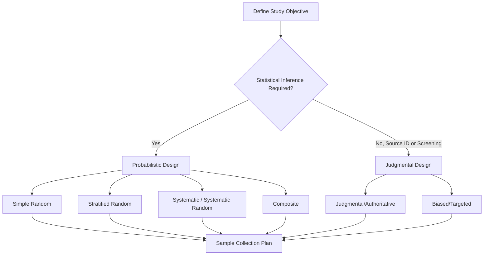

## Environmental Field Sampling Methods

### Definition and Scope

Environmental field sampling refers to the systematic collection of physical, chemical, and biological specimens or measurements from the natural environment (air, water, soil, sediment, biota) to characterize environmental conditions, detect contamination, monitor ecological health, or support regulatory compliance. Sampling design and execution are foundational to environmental science because the quality of downstream laboratory analysis, statistical inference, and regulatory decision-making is fundamentally constrained by the representativeness and integrity of the samples collected—a principle often summarized as "the analytical result is only as good as the sample."

Field sampling sits at the intersection of statistics (sampling design theory), analytical chemistry (preservation and contamination avoidance), and field logistics (site access, safety, chain of custody).

### Sampling Design Frameworks

**Probabilistic (Statistical) Sampling Designs**

- **Simple Random Sampling**: Every location within the study area has an equal probability of selection. Statistically robust but can leave spatial gaps by chance and may be logistically inefficient over large areas.
- **Stratified Random Sampling**: The study area is divided into relatively homogeneous subregions (strata, e.g., by land use, soil type, or known contamination zones) before random sampling within each stratum. Improves precision when strata are genuinely distinct.
- **Systematic Sampling**: Samples are collected at fixed, regular intervals along a grid or transect. Simple to implement and provides good spatial coverage but can produce biased results if the sampling interval coincides with a periodic environmental pattern (aliasing).
- **Systematic Random Sampling**: Combines systematic grid placement with a randomized starting point, mitigating some aliasing risk while retaining spatial coverage benefits.
- **Composite Sampling**: Multiple discrete (grab) samples are physically combined into a single sample for analysis, reducing analytical cost while estimating a spatial or temporal average; individual variability information is lost.

**Judgmental (Non-Probabilistic) Sampling Designs**

- **Judgmental/Authoritative Sampling**: Sample locations selected based on expert knowledge of likely contamination sources, site history, or visual indicators (e.g., stressed vegetation, discoloration, odor). Efficient for source identification but not statistically representative of the broader area and cannot support unbiased population-level inference.
- **Biased/Targeted Sampling**: Deliberately sampling at locations expected to show worst-case or best-case conditions, used in specific investigative contexts (e.g., locating a contamination plume's core) but explicitly non-representative.

### The Quality Assurance Project Plan (QAPP) Framework

Environmental sampling programs conducted for regulatory purposes (particularly under US EPA guidance) are typically governed by a **Quality Assurance Project Plan (QAPP)**, which documents the Data Quality Objectives (DQOs) process—a seven-step planning approach ensuring that the type, quantity, and quality of data collected are appropriate for their intended use:

1. State the problem
2. Identify the goal of the study
3. Identify information inputs
4. Define the boundaries of the study
5. Develop the analytic approach
6. Specify performance or acceptance criteria
7. Develop the plan for obtaining data

### Media-Specific Sampling Methods

**Water Sampling**

- **Grab sampling**: A discrete sample collected at a single point in time and location, representing conditions only at that instant.
- **Composite sampling**: Time-weighted (equal-volume samples collected at fixed time intervals) or flow-weighted (sample volume proportional to flow rate at time of collection) composites, used to characterize average conditions in variable-flow systems such as wastewater discharge.
- **Depth-integrated sampling**: For water bodies with vertical stratification (thermal, chemical), sampling devices (e.g., Van Dorn or Niskin bottles) collect water from specific depths, or integrated samplers collect a continuous vertical profile.
- **Passive sampling**: Devices (e.g., semipermeable membrane devices, polar organic chemical integrative samplers) deployed in situ over extended periods to accumulate contaminants via diffusion, providing time-integrated concentration estimates without active pumping.
- **Groundwater sampling**: Requires well purging (removing stagnant water from the well casing before sample collection) using either standard purge (removing 3–5 well volumes) or low-flow purging (minimizing drawdown and turbidity by pumping at rates matching the aquifer's natural recharge), followed by field parameter stabilization monitoring (pH, dissolved oxygen, turbidity, specific conductance, oxidation-reduction potential) before sample collection.

**Soil and Sediment Sampling**

- **Surface soil sampling**: Typically 0–15 cm depth for ecological risk assessment, or per regulatory guidance depth intervals.
- **Subsurface sampling**: Via hand augers, direct-push (Geoprobe) technology, or drilled boreholes, often collected in discrete depth intervals to characterize vertical contaminant distribution.
- **Incremental Sampling Methodology (ISM)**: A specialized composite approach where many (30–100+) increments are collected across a decision unit and combined, specifically designed to address the high spatial variability (heterogeneity) characteristic of soil contamination, particularly for particulate contaminants.
- **Sediment sampling**: Grab samplers (Ponar, Ekman dredge) for surface sediment; core samplers (gravity corer, piston corer) for depth-profiled sediment, useful in reconstructing historical deposition and contamination trends.

**Air Sampling**

- **Active sampling**: Uses a pump to draw a known volume of air through a collection medium (filter, sorbent tube, impinger) over a defined time period, allowing calculation of time-weighted average concentration.
- **Passive sampling**: Relies on diffusion or permeation without active air movement (e.g., diffusive badges), useful for extended-duration, low-cost monitoring but generally less precise for short-term peak concentrations.
- **Continuous/real-time monitoring**: Instruments (e.g., particulate matter monitors, photoionization detectors) providing near-instantaneous concentration readings, useful for identifying temporal patterns and short-duration exposure events.

**Biological/Ecological Sampling**

- **Quadrat sampling**: Fixed-area plots used to estimate density, cover, or frequency of vegetation or sessile organisms.
- **Transect sampling**: Sampling along a defined line (belt transect, line-intercept transect) to characterize spatial gradients (e.g., elevation, distance from a pollution source).
- **Kick-net/D-frame net sampling**: Standard method for benthic macroinvertebrate sampling in wadeable streams, used in biological indices of water quality (e.g., multi-metric indices, IBI).
- **Mark-recapture sampling**: Used for population abundance estimation of mobile fauna.

### Chain of Custody and Sample Preservation

Maintaining sample integrity from collection to laboratory analysis requires rigorous **chain of custody (COC)** documentation—a legal and procedural record tracking sample possession, transfer, and handling from field collection through final disposal, essential for data admissible in regulatory or legal proceedings.

**Standard preservation requirements** (illustrative; specific requirements vary by analyte and should be verified against the relevant standard method, e.g., EPA Method 40 CFR Part 136 or Standard Methods for the Examination of Water and Wastewater):

| Parameter | Container | Preservation | Typical Holding Time |
| --- | --- | --- | --- |
| Volatile Organic Compounds (VOCs) | Glass vial, zero headspace | Cool to 4°C, HCl to pH<2 | 14 days |
| Metals (dissolved) | Plastic (HDPE) | Filter in field, HNO₃ to pH<2 | 6 months |
| Nutrients (nitrate, phosphate) | Plastic or glass | Cool to 4°C | 24–48 hours |
| Bacteria (e.g., E. coli) | Sterile container | Cool to 4°C | 6–8 hours |
| Semi-volatile organics | Amber glass | Cool to 4°C | 7 days (extraction) |

[Unverified: exact holding times, preservation chemicals, and container specifications are method- and jurisdiction-specific and subject to periodic regulatory revision; always consult the current version of the applicable standard method before designing a sampling program.]

### Quality Control Sample Types

Rigorous field programs incorporate several categories of quality control (QC) samples to quantify and control error introduced during sampling and analysis:

- **Field blanks**: Analyte-free water exposed to field conditions and sampling equipment, assessing contamination introduced during sample collection/handling.
- **Trip blanks**: Analyte-free water that accompanies sample containers from the laboratory to the field and back, without being opened in the field, assessing contamination during transport and storage (particularly for VOCs, which are susceptible to cross-contamination in coolers).
- **Equipment blanks (rinsate blanks)**: Analyte-free water passed over decontaminated sampling equipment, assessing effectiveness of decontamination procedures between sampling locations.
- **Field duplicates**: Two samples collected at the same location and time (or as close as practically achievable), assessing combined sampling and analytical precision.
- **Matrix spikes**: Samples spiked with a known concentration of target analyte prior to laboratory analysis, assessing matrix interference effects on analytical recovery.

### Worked Example: Determining Minimum Sample Size for a Statistical Sampling Design

**Scenario**: An environmental scientist needs to determine how many soil samples to collect across a site to estimate mean contaminant concentration with a specified level of confidence, using the standard formula for sample size estimation for a normally distributed population:

$$n = \left(\frac{z \cdot s}{E}\right)^2$$

where $n$ is the required sample size, $z$ is the z-score corresponding to the desired confidence level (e.g., $z = 1.96$ for 95% confidence), $s$ is the estimated population standard deviation (often from a pilot study or historical data), and $E$ is the desired margin of error (half-width of the confidence interval).

**Given values**: Pilot study standard deviation $s = 12 \text{ mg/kg}$; desired margin of error $E = 5 \text{ mg/kg}$; desired confidence level 95% ($z = 1.96$).

$$n = \left(\frac{1.96 \times 12}{5}\right)^2 = \left(\frac{23.52}{5}\right)^2 = (4.704)^2 \approx 22.1$$

Rounding up (sample size calculations are always rounded up to ensure the margin of error is met), the scientist would need to collect **23 samples** to estimate the mean contaminant concentration within ±5 mg/kg at 95% confidence, assuming the pilot study's standard deviation estimate is representative of the true population variability. [Inference: this formula assumes approximately normally distributed data and simple random sampling; stratified or composite designs, or non-normal contaminant distributions (common in environmental data, which often follow log-normal distributions), require modified sample size formulas.]

### Diagram: Groundwater Low-Flow Sampling Setup (svg_diagram)

<svg xmlns="http://www.w3.org/2000/svg" viewBox="0 0 700 400" font-family="Arial, sans-serif">
<text x="350" y="22" text-anchor="middle" font-size="15" font-weight="bold">Low-Flow Groundwater Sampling Setup (svg_diagram)</text>
<rect x="300" y="60" width="60" height="300" fill="#d7ccc8" stroke="#4e342e" stroke-width="2" />
<text x="330" y="50" text-anchor="middle" font-size="10">Well Casing</text>
<rect x="310" y="70" width="40" height="180" fill="#b0bec5" stroke="#37474f" stroke-width="1" />
<text x="380" y="90" font-size="9">Solid casing (above screen)</text>
<rect x="310" y="250" width="40" height="90" fill="#c5e1a5" stroke="#33691e" stroke-width="1" stroke-dasharray="3,2" />
<text x="380" y="280" font-size="9">Well screen</text>
<text x="380" y="295" font-size="9">(saturated interval)</text>
<circle cx="330" cy="330" r="5" fill="#0277bd" />
<text x="380" y="335" font-size="9">Low-flow pump intake</text>
<text x="380" y="348" font-size="9">(set within screen interval)</text>
<line x1="330" y1="330" x2="330" y2="20" stroke="#0277bd" stroke-width="2" />
<rect x="150" y="0" width="150" height="40" rx="5" fill="#e3f2fd" stroke="#0277bd" stroke-width="2" />
<text x="225" y="24" text-anchor="middle" font-size="10">Peristaltic Pump</text>
<rect x="60" y="60" width="80" height="60" rx="5" fill="#fff3e0" stroke="#e65100" stroke-width="2" />
<text x="100" y="85" text-anchor="middle" font-size="9">Flow-Through</text>
<text x="100" y="98" text-anchor="middle" font-size="9">Cell (field params)</text>
<text x="100" y="111" text-anchor="middle" font-size="8">pH/DO/ORP/Turbidity</text>
<line x1="150" y1="90" x2="180" y2="20" stroke="#0277bd" stroke-width="1.5" stroke-dasharray="2,2" />

<text x="50" y="380" font-size="10">Water table ~~~~~~~~~~~~~~~~~~~~~~~~~~~~~~</text>

<line x1="30" y1="240" x2="650" y2="240" stroke="`#0277bd`" stroke-width="1" stroke-dasharray="4,3" />

</svg>

### Global Positioning and Spatial Documentation

Modern field sampling programs universally incorporate GPS-based spatial referencing (typically WGS84 datum) for each sampling location, enabling:

- Integration with Geographic Information Systems (GIS) for spatial analysis and visualization
- Verification of sampling design compliance (confirming samples were collected at planned coordinates)
- Long-term site monitoring through resampling at documented historical locations
- Geostatistical analysis (e.g., kriging) requiring precise spatial coordinates as model inputs

Sub-meter accuracy GPS or differential correction is often required for sites with fine-scale spatial contamination gradients, whereas standard consumer-grade GPS (3–5 meter accuracy) may suffice for broader regional surveys.

### Common Sources of Error and Bias

- **Cross-contamination**: Introduced via inadequately decontaminated equipment between sampling locations, addressed through equipment blanks and standardized decontamination protocols (e.g., detergent wash, potable water rinse, deionized water rinse, and solvent rinse sequences for organic contaminant sampling).
- **Sample matrix heterogeneity**: Environmental media, particularly soil, are often highly heterogeneous at small spatial scales, meaning a single grab sample may poorly represent the surrounding area—this is the primary rationale behind incremental/composite sampling methodologies.
- **Volatilization loss**: Improper handling (excessive headspace, delayed preservation, warm storage) of volatile analyte samples can cause substantial underestimation of true concentrations.
- **Temporal variability**: Single-point-in-time sampling may not capture diurnal, seasonal, or event-driven (e.g., storm flow) variability relevant to the study objective, necessitating repeated or continuous monitoring approaches where temporal representativeness matters.
- **Field measurement drift**: Calibration drift in field instruments (pH probes, conductivity meters) over the course of a sampling day, mitigated through pre- and post-calibration checks against certified standards.

### Health and Safety Considerations

Field sampling personnel operate under site-specific Health and Safety Plans (HASPs), addressing hazards including exposure to hazardous substances (requiring appropriate personal protective equipment tiers per OSHA HAZWOPER guidance in the US context), physical hazards (uneven terrain, water bodies, heavy equipment), biological hazards (vector-borne disease, venomous wildlife), and site-specific access/security protocols. [Unverified: specific regulatory requirements vary by jurisdiction; consult applicable occupational safety regulations for the relevant country/region.]

### Related Topics

- Geostatistics and Spatial Interpolation (Kriging) for Environmental Data
- Data Quality Objectives (DQO) Process in Environmental Investigations
- Environmental Laboratory Analysis and Quality Control Charting
- GIS Integration of Field Sampling Data
- Remote Sensing as a Complement to Ground-Truth Field Sampling
- Statistical Methods for Non-Normally Distributed Environmental Data
- Biomonitoring and Bioindicator Species Selection
- Continuous Environmental Sensor Networks and IoT Monitoring
- Contaminant Fate and Transport Modeling
- Regulatory Frameworks for Environmental Site Investigation (e.g., CERCLA/RCRA processes)