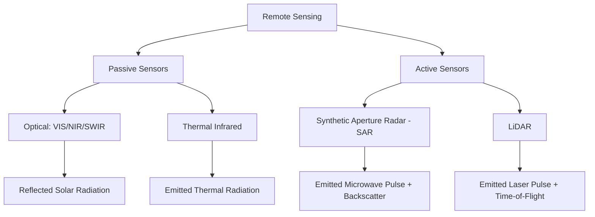

## Remote Sensing Fundamentals

### Definition and Scope

Remote sensing is the science and technology of acquiring information about an object, area, or phenomenon through the analysis of data collected by a sensor that is not in physical contact with the target. In environmental science, remote sensing primarily involves detecting and measuring electromagnetic radiation reflected, emitted, or scattered by the Earth's surface and atmosphere using sensors mounted on satellites, aircraft, or uncrewed aerial vehicles (UAVs/drones). It underpins large-scale environmental monitoring applications including land cover classification, vegetation health assessment, deforestation tracking, water quality estimation, and climate variable monitoring.

### The Electromagnetic Spectrum and Spectral Regions

Remote sensing instruments detect electromagnetic (EM) radiation across a range of wavelengths, each region carrying distinct information about surface and atmospheric properties.

| Spectral Region | Approximate Wavelength | Primary Environmental Applications |
| --- | --- | --- |
| Visible (VIS) | 0.4–0.7 µm | Land cover, vegetation color, water turbidity |
| Near-Infrared (NIR) | 0.7–1.3 µm | Vegetation vigor, biomass, water body delineation |
| Shortwave Infrared (SWIR) | 1.3–3.0 µm | Vegetation moisture content, mineral/soil mapping, burned area |
| Thermal Infrared (TIR) | 3–14 µm | Land surface temperature, urban heat islands, fire detection |
| Microwave (Radar) | 1 mm–1 m | All-weather imaging, soil moisture, surface deformation, sea ice |

The relationship between wavelength and photon energy follows the Planck relation:

$$E = h \cdot \nu = \frac{h \cdot c}{\lambda}$$

where $E$ is photon energy, $h$ is Planck's constant, $\nu$ is frequency, $c$ is the speed of light, and $\lambda$ is wavelength. This inverse relationship explains why longer-wavelength microwave sensors carry lower-energy photons and require active sensing (radar) to achieve adequate signal, whereas shorter-wavelength visible/NIR sensors can passively detect naturally reflected solar radiation.

### Passive vs. Active Remote Sensing

**Passive sensors** detect naturally occurring radiation—either reflected solar radiation (visible, NIR, SWIR) or emitted thermal radiation (TIR)—and require an external energy source (the sun, or the target's own thermal emission). Examples include optical satellite imagers such as Landsat's OLI, Sentinel-2's MSI, and MODIS.

**Active sensors** emit their own energy pulse toward the target and measure the returned signal, enabling operation independent of solar illumination or cloud cover. Examples include:

- **Synthetic Aperture Radar (SAR)**: Emits microwave pulses and measures backscatter, providing all-weather, day/night imaging capability (e.g., Sentinel-1, RADARSAT).
- **LiDAR (Light Detection and Ranging)**: Emits laser pulses and measures time-of-flight to derive precise elevation and canopy structure information.

### Resolution Types

Remote sensing systems are characterized along four distinct resolution dimensions, each independently constraining what information can be extracted from imagery:

**Spatial Resolution**

The ground area represented by a single pixel, typically expressed in meters. Ranges from sub-meter (commercial satellites, UAV imagery) to kilometer-scale (MODIS, geostationary weather satellites).

**Spectral Resolution**

The number and width (bandwidth) of spectral bands a sensor records. Multispectral sensors (e.g., Landsat OLI: 11 bands, Sentinel-2 MSI: 13 bands) capture discrete, relatively broad bands; hyperspectral sensors capture hundreds of narrow, contiguous bands (e.g., 5–10 nm bandwidth), enabling detection of subtle spectral signatures such as specific mineral compositions or plant biochemistry.

**Temporal Resolution**

The revisit frequency of a sensor over the same location, ranging from minutes (geostationary weather satellites) to days-to-weeks (polar-orbiting land imaging satellites, e.g., Landsat's 16-day repeat cycle, Sentinel-2's 5-day repeat cycle with the two-satellite constellation).

**Radiometric Resolution**

The sensitivity of a sensor to differences in signal intensity, expressed in bits (e.g., 8-bit = 256 discrete brightness levels; 12-bit = 4,096 levels). Higher radiometric resolution enables finer discrimination of subtle intensity differences, particularly important in low-contrast scenes such as water bodies or snow.

[Inference]: A fundamental engineering trade-off exists among these resolution types—for a given sensor design and data downlink capacity, improving one resolution type (e.g., spatial) often requires compromising another (e.g., temporal or spectral), though the specific trade-off relationship depends on sensor architecture and is not a fixed universal law.

### Spectral Signatures and Surface Interaction

Every material on Earth's surface reflects, absorbs, and transmits incident radiation differently across wavelengths, producing a characteristic **spectral signature** that enables material identification and classification.

**Vegetation** exhibits low reflectance in visible red and blue (chlorophyll absorption for photosynthesis), moderate reflectance in green (giving vegetation its green appearance), and sharply elevated reflectance in near-infrared (due to internal leaf structure scattering)—a phenomenon known as the **"red edge."**

**Water** exhibits strong absorption across NIR and SWIR wavelengths, appearing dark in these bands, with reflectance in visible wavelengths varying based on turbidity, chlorophyll content, and depth.

**Bare soil and built-up surfaces** typically show relatively flat, gradually increasing reflectance across VIS-NIR-SWIR, distinguishing them from the sharp vegetation red-edge signature.

### Common Spectral Indices

Remote sensing analysis frequently relies on band-ratio indices designed to isolate and quantify specific surface properties while minimizing confounding factors such as illumination and atmospheric effects.

**Normalized Difference Vegetation Index (NDVI)**

The most widely used vegetation index, exploiting the strong contrast between red absorption and NIR reflectance in healthy vegetation:

$$NDVI = \frac{NIR - Red}{NIR + Red}$$

NDVI values range from $-1$ to $+1$; healthy dense vegetation typically produces values of 0.6–0.9, sparse vegetation 0.2–0.5, bare soil near 0, and water typically negative.

**Normalized Difference Water Index (NDWI)**

Used to delineate open water bodies and monitor water content:

$$NDWI = \frac{Green - NIR}{Green + NIR}$$

**Normalized Burn Ratio (NBR)**

Used to detect and assess burn severity following wildfires, exploiting the contrast between NIR (reduced by vegetation/canopy loss) and SWIR (increased by exposed soil and char):

$$NBR = \frac{NIR - SWIR}{NIR + SWIR}$$

Burn severity is often assessed via the **differenced NBR (dNBR)**, comparing pre-fire and post-fire NBR:

$$dNBR = NBR_{prefire} - NBR_{postfire}$$

**Enhanced Vegetation Index (EVI)**

An improvement on NDVI designed to reduce sensitivity to atmospheric conditions and canopy background signal, particularly useful in high-biomass regions where NDVI saturates:

$$EVI = G \times \frac{NIR - Red}{NIR + C_1 \times Red - C_2 \times Blue + L}$$

where $G$, $C_1$, $C_2$, and $L$ are empirically derived coefficients (commonly $G=2.5$, $C_1=6$, $C_2=7.5$, $L=1$ in the standard MODIS EVI formulation).

### Worked Example: NDVI Calculation and Interpretation

**Scenario**: A Landsat 8 OLI image pixel over a forested area records the following surface reflectance values (unitless, scaled 0–1):

- Band 4 (Red): 0.08
- Band 5 (NIR): 0.42

$$NDVI = \frac{0.42 - 0.08}{0.42 + 0.08} = \frac{0.34}{0.50} = 0.68$$

An NDVI of 0.68 is consistent with dense, healthy vegetation cover. If a repeat image of the same pixel six months later (e.g., following a pest outbreak or drought stress) records Red = 0.15 and NIR = 0.28:

$$NDVI_{t2} = \frac{0.28 - 0.15}{0.28 + 0.15} = \frac{0.13}{0.43} \approx 0.30$$

The substantial NDVI decline (0.68 → 0.30) indicates a marked reduction in vegetation vigor or canopy cover, warranting further investigation (e.g., higher-resolution imagery review, field verification) to determine the causal factor. [Inference: NDVI change alone cannot distinguish among possible causes such as disease, drought, harvest, or fire; attribution requires supplementary data or field validation.]

### Major Satellite Platforms and Sensors Relevant to Environmental Science

| Platform | Operator | Sensor Type | Spatial Resolution | Revisit | Key Applications |
| --- | --- | --- | --- | --- | --- |
| Landsat 8/9 | NASA/USGS | Multispectral optical + TIR | 30 m (15 m pan) | 16 days (8 days combined) | Land cover, long-term change detection |
| Sentinel-2 | ESA (Copernicus) | Multispectral optical | 10–60 m | 5 days (2-satellite) | Vegetation, agriculture, land cover |
| Sentinel-1 | ESA (Copernicus) | SAR (C-band) | 5–40 m | 6–12 days | Flood mapping, deformation, sea ice |
| MODIS (Terra/Aqua) | NASA | Multispectral optical + TIR | 250 m–1 km | Daily | Global vegetation, fire, ocean color, snow cover |
| VIIRS | NOAA/NASA | Multispectral optical + TIR | 375 m–750 m | Daily | Fire detection, nighttime lights, land surface temp |
| GEDI | NASA (ISS-mounted) | Spaceborne LiDAR | ~25 m footprint | N/A (sampling, not continuous swath) | Forest canopy height, biomass |

[Unverified: sensor specifications, mission status, and revisit capabilities are subject to change due to satellite decommissioning, orbital adjustments, or mission extensions; verify current operational status against the operating agency's mission status page before relying on these specifications for active project planning.]

### Atmospheric Correction

Raw satellite-measured radiance (top-of-atmosphere, TOA) includes contributions from atmospheric scattering and absorption (by aerosols, water vapor, and gases) in addition to actual surface reflectance. **Atmospheric correction** algorithms convert TOA radiance to surface reflectance by modeling and removing these atmospheric effects, a necessary preprocessing step for quantitative analysis (e.g., accurate NDVI time-series comparison across dates with differing atmospheric conditions). Common approaches include:

- **Dark Object Subtraction (DOS)**: A simple empirical method assuming that at least some pixels in a scene (e.g., deep water, shadow) should have near-zero reflectance in certain bands; any residual signal is attributed to atmospheric scattering and subtracted.
- **Radiative transfer model-based correction** (e.g., 6S, MODTRAN-based approaches): Physically-based models simulating atmospheric radiative transfer using ancillary data (aerosol optical depth, water vapor content) to derive surface reflectance.
- **Land Surface Reflectance products**: Many agencies now distribute pre-corrected "surface reflectance" products (e.g., Landsat Collection 2 Level-2, Sentinel-2 Level-2A) where atmospheric correction has already been applied using standardized algorithms, reducing the burden on individual analysts.

### Image Classification Approaches

Converting raw spectral imagery into thematic maps (e.g., land cover categories) relies on classification algorithms:

- **Supervised classification**: An analyst provides training samples of known land cover classes; the algorithm (e.g., Maximum Likelihood, Support Vector Machine, Random Forest) learns spectral signatures from these samples and applies them to classify the remaining image.
- **Unsupervised classification**: Algorithms (e.g., k-means, ISODATA clustering) group pixels into spectrally similar clusters without predefined training data; an analyst subsequently assigns thematic labels to each cluster based on interpretation.
- **Object-based image analysis (OBIA)**: Groups contiguous pixels into meaningful image objects (segments) based on spectral and spatial homogeneity before classification, often improving results for high-resolution imagery where individual pixels represent sub-object features (e.g., individual tree crown shadows within a forest).
- **Deep learning approaches**: Convolutional neural networks (CNNs) and related architectures increasingly applied to remote sensing classification tasks, capable of learning complex spatial-spectral patterns directly from imagery, though requiring substantial labeled training data and computational resources.

### Classification Accuracy Assessment

Classification results are validated against independent reference data (e.g., field observations, higher-resolution imagery) using a **confusion (error) matrix**, from which standard accuracy metrics are derived:

$$\text{Overall Accuracy} = \frac{\text{Sum of Diagonal (Correctly Classified)}}{\text{Total Reference Samples}}$$

$$\text{Producer's Accuracy} = \frac{\text{Correctly Classified in Category}}{\text{Total Reference Samples in Category}}$$

$$\text{User's Accuracy} = \frac{\text{Correctly Classified in Category}}{\text{Total Classified as Category}}$$

The **Kappa coefficient** is also commonly reported, adjusting overall accuracy for the level of agreement expected by chance alone; interpretation guidelines (e.g., Landis and Koch's categorization of Kappa values) are widely cited but should be applied cautiously as their appropriateness for remote sensing accuracy specifically has been debated in the literature. [Inference: use of Kappa as the primary accuracy metric has declined in more recent remote sensing methodology literature in favor of directly reporting overall, producer's, and user's accuracy alongside confidence intervals.]

### Diagram: Optical Remote Sensing Image Acquisition Geometry (svg_diagram)

<svg xmlns="http://www.w3.org/2000/svg" viewBox="0 0 700 380" font-family="Arial, sans-serif">
<text x="350" y="22" text-anchor="middle" font-size="15" font-weight="bold">Optical Remote Sensing Geometry (svg_diagram)</text>
<circle cx="120" cy="60" r="30" fill="#fdd835" stroke="#f9a825" stroke-width="2" />
<text x="120" y="65" text-anchor="middle" font-size="10" font-weight="bold">Sun</text>
<rect x="480" y="70" width="60" height="30" fill="#607d8b" stroke="#37474f" stroke-width="2" />
<text x="510" y="90" text-anchor="middle" font-size="9" fill="white">Sensor</text>
<line x1="140" y1="80" x2="330" y2="280" stroke="#f9a825" stroke-width="2" marker-end="url(#arrow3)" />
<text x="200" y="170" font-size="9" fill="#f9a825">Incident Solar Radiation</text>
<line x1="330" y1="280" x2="490" y2="95" stroke="#1565c0" stroke-width="2" marker-end="url(#arrow3)" />
<text x="420" y="180" font-size="9" fill="#1565c0">Reflected Radiance</text>
<rect x="50" y="290" width="500" height="60" fill="#c8e6c9" stroke="#2e7d32" stroke-width="2" />
<text x="300" y="325" text-anchor="middle" font-size="11" fill="#1b5e20">Earth Surface (varying spectral reflectance)</text>
<path d="M 250 100 Q 400 30, 550 100" stroke="#90a4ae" stroke-width="8" fill="none" opacity="0.5" />
<text x="400" y="120" text-anchor="middle" font-size="9" fill="#546e7a">Atmosphere (scattering/absorption)</text>
</svg>

### Applications in Environmental Monitoring

- **Land cover and land use change detection**: Multi-temporal classification comparison to quantify deforestation, urbanization, or agricultural expansion.
- **Drought and vegetation stress monitoring**: Time-series NDVI/EVI anomaly analysis relative to historical baselines.
- **Wildfire detection and burn severity mapping**: Thermal anomaly detection (active fire) and post-fire dNBR analysis.
- **Water quality and extent monitoring**: Chlorophyll-a estimation from ocean color sensors, surface water extent mapping via NDWI or SAR.
- **Snow and ice monitoring**: Snow cover extent, glacier mass balance, and sea ice concentration tracking.
- **Air quality**: Satellite-derived aerosol optical depth and trace gas column measurements (e.g., NO₂, SO₂) from instruments such as TROPOMI.
- **Carbon stock and biomass estimation**: LiDAR-derived canopy height combined with allometric models to estimate above-ground biomass and carbon storage.

### Limitations and Common Pitfalls

- **Cloud cover contamination**: Optical sensors cannot see through clouds, creating persistent data gaps in cloud-prone regions (e.g., humid tropics), a key motivation for SAR-based monitoring in those areas.
- **Spectral mixing (mixed pixels)**: A single pixel often contains a mixture of land cover types, particularly at coarser spatial resolutions, complicating pure-class classification (addressed through spectral unmixing techniques).
- **Sensor saturation**: Vegetation indices such as NDVI tend to saturate at high biomass levels, limiting sensitivity to further biomass increases in dense forest canopies (a motivation for EVI and SAR/LiDAR-based biomass approaches).
- **Temporal mismatch**: Comparing imagery across different acquisition dates, times of day, or seasons without accounting for phenological or illumination differences can introduce spurious "change" signals unrelated to actual surface change.
- **Georeferencing and co-registration errors**: Misalignment between multi-temporal or multi-sensor images can produce false change detection artifacts, particularly at land cover boundaries.

### Related Topics

- Synthetic Aperture Radar (SAR) Processing and Interferometry (InSAR)
- LiDAR Data Processing and Canopy Height Modeling
- Geographic Information Systems (GIS) Integration with Remote Sensing
- Time-Series Analysis of Satellite-Derived Vegetation Indices
- Machine Learning and Deep Learning for Land Cover Classification
- Google Earth Engine and Cloud-Based Geospatial Analysis Platforms
- Hyperspectral Remote Sensing and Spectral Unmixing
- UAV/Drone-Based Remote Sensing for High-Resolution Environmental Monitoring
- Radiative Transfer Modeling and Atmospheric Correction Algorithms
- Change Detection Methodologies for Land Cover Monitoring