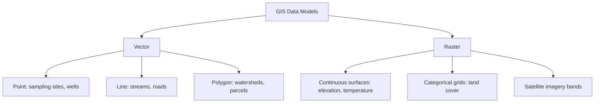
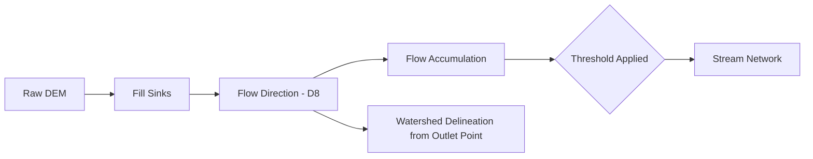

## Geographic Information Systems Applications

### Definition and Scope

A Geographic Information System (GIS) is a computer-based system for capturing, storing, managing, analyzing, and visualizing spatially referenced data—information tied to a specific location on Earth's surface. In environmental science, GIS serves as the primary analytical and integrative platform for combining heterogeneous data sources (field sampling results, remote sensing imagery, demographic data, infrastructure layers) within a common spatial reference framework to support environmental analysis, modeling, and decision-making.

GIS is distinguished from simple digital mapping by its analytical capability: beyond visualizing "where" features are located, GIS enables quantitative spatial analysis answering questions about proximity, overlap, connectivity, suitability, and change over space and time.

### Core Data Models

**Vector Data Model**

Represents geographic features as discrete geometric objects defined by coordinate pairs (x, y, and optionally z):

- **Points**: Zero-dimensional features (e.g., sampling stations, monitoring wells, tree locations)
- **Lines (polylines)**: One-dimensional features representing linear phenomena (e.g., streams, roads, pipelines)
- **Polygons**: Two-dimensional features representing bounded areas (e.g., watersheds, land parcels, habitat zones)

Vector data is well-suited for discrete, well-defined features and supports precise topological relationships (adjacency, connectivity, containment) but is less efficient for representing continuously varying phenomena.

**Raster Data Model**

Represents geographic space as a regular grid of cells (pixels), each holding a value representing the phenomenon being modeled at that location (e.g., elevation, temperature, land cover class, reflectance). Raster data is naturally suited to continuous surfaces and is the native format for satellite imagery and many environmental model outputs, but can be less storage-efficient for representing sparse, discrete features and its spatial precision is bounded by cell (pixel) resolution.

### Coordinate Reference Systems and Projections

Because Earth is a three-dimensional ellipsoid, representing its surface on a two-dimensional map or in a planar coordinate system requires a **map projection**, which inevitably introduces some distortion in at least one of: shape, area, distance, or direction.

**Geographic Coordinate Systems (GCS)** define locations using angular units (latitude/longitude) referenced to a datum (a mathematical model of Earth's shape, e.g., WGS84, NAD83). GCS coordinates are not measured in linear units and are unsuitable for direct distance or area calculation without projection.

**Projected Coordinate Systems (PCS)** transform the curved Earth surface onto a flat plane using a defined projection (e.g., Universal Transverse Mercator/UTM, Albers Equal Area Conic, Lambert Conformal Conic), expressing coordinates in linear units (typically meters), enabling accurate distance, area, and direction measurements within the projection's zone of applicability.

**Common projection trade-offs**:

- **Conformal projections** (e.g., Mercator, Lambert Conformal Conic) preserve local shape and angles but distort area, particularly at high latitudes.
- **Equal-area projections** (e.g., Albers Equal Area, Mollweide) preserve area but distort shape.
- **Equidistant projections** preserve distance along specific lines (e.g., from the center point) but not universally across the map.

Selecting an appropriate projection is a critical, often underappreciated step in environmental GIS analysis: calculating area or distance using unprojected geographic coordinates (decimal degrees) produces systematically incorrect results, since a degree of longitude represents a different ground distance depending on latitude.

$$\text{Ground distance per degree longitude} \approx 111.32 \text{ km} \times \cos(\text{latitude})$$

This formula illustrates why, for example, one degree of longitude represents approximately 111 km at the equator but progressively less distance moving toward the poles, making unprojected area/distance calculations increasingly inaccurate at higher latitudes.

### Core Spatial Analysis Operations

**Buffer Analysis**

Creates a zone of specified distance around a feature (point, line, or polygon), commonly used to delineate areas of influence or regulatory setback zones (e.g., a 100-meter buffer around a wetland boundary, or a 500-meter buffer around a contamination source for exposure assessment).

**Overlay Analysis**

Combines two or more spatial data layers to identify spatial relationships or create new derived layers:

- **Intersect**: Retains only areas common to all input layers.
- **Union**: Retains the combined extent of all input layers, preserving attribute information from each.
- **Erase (difference)**: Removes areas of one layer that overlap with another (e.g., removing protected areas from a development suitability layer).

**Proximity Analysis**

Calculates distance relationships between features, such as nearest-neighbor distance (identifying the closest facility to each sampling point) or Euclidean/cost-distance surfaces (modeling distance while accounting for terrain or barriers).

**Network Analysis**

Models connectivity and flow along linear features (e.g., stream networks, road networks), supporting applications such as watershed delineation, pollutant transport routing along stream reaches, or emergency response routing.

**Terrain Analysis**

Derives secondary surfaces from elevation data (Digital Elevation Models, DEMs), including:

- **Slope**: Rate of elevation change, relevant to erosion risk and runoff modeling.
- **Aspect**: Compass direction of slope face, influencing solar exposure and microclimate.
- **Hillshade**: Simulated illumination for visualization.
- **Flow accumulation and watershed delineation**: Modeling surface water flow direction and accumulation to derive stream networks and watershed (catchment) boundaries.

**Suitability Analysis (Multi-Criteria Overlay)**

Combines multiple weighted input layers (e.g., slope, soil type, distance to water, land use) into a composite suitability score, widely used in siting analyses (e.g., habitat restoration site selection, renewable energy facility siting, conservation prioritization).

$$S = \sum_{i=1}^{n} w_i \times x_i$$

where $S$ is the composite suitability score, $w_i$ is the weight assigned to criterion $i$ (with $\sum w_i = 1$), and $x_i$ is the normalized (typically rescaled 0–1 or 0–100) score of criterion $i$ at each location.

### Worked Example: Multi-Criteria Wetland Restoration Site Suitability

**Scenario**: An environmental agency evaluates candidate parcels for wetland restoration based on three weighted criteria: hydric soil presence (40% weight), proximity to existing wetland (35% weight), and low slope (25% weight). Each parcel is scored 0–100 on each criterion after normalization.

| Parcel | Hydric Soil Score | Proximity Score | Slope Score |
| --- | --- | --- | --- |
| A | 90 | 70 | 85 |
| B | 60 | 95 | 50 |
| C | 75 | 60 | 90 |

**Composite suitability score for Parcel A:**

$$S_A = (0.40 \times 90) + (0.35 \times 70) + (0.25 \times 85) = 36 + 24.5 + 21.25 = 81.75$$

**Composite suitability score for Parcel B:**

$$S_B = (0.40 \times 60) + (0.35 \times 95) + (0.25 \times 50) = 24 + 33.25 + 12.5 = 69.75$$

**Composite suitability score for Parcel C:**

$$S_C = (0.40 \times 75) + (0.35 \times 60) + (0.25 \times 90) = 30 + 21 + 22.5 = 73.5$$

Based on this weighting scheme, **Parcel A (81.75)** ranks highest for restoration suitability, followed by Parcel C (73.5) and Parcel B (69.75). [Inference: the ranking outcome is sensitive to the specific weights assigned to each criterion; a sensitivity analysis varying the weights is standard practice to assess the robustness of the recommended ranking before final site selection.]

### Spatial Interpolation

When environmental variables are measured at discrete sampling points but a continuous surface estimate is needed across the study area (e.g., estimating pollutant concentration or groundwater elevation between monitoring wells), spatial interpolation methods are applied:

- **Inverse Distance Weighting (IDW)**: Estimates unknown values as a weighted average of nearby known values, with weights inversely proportional to distance—closer points exert greater influence.
- **Kriging**: A geostatistical method that models spatial autocorrelation via a variogram (quantifying how similarity between sample values decreases with increasing distance) and produces both an interpolated surface and an associated estimate of prediction uncertainty at each location, a distinguishing advantage over IDW.
- **Spline interpolation**: Fits a mathematically smooth surface through or near sample points, useful for gradually varying phenomena but less suited to variables with abrupt spatial discontinuities.
- **Thiessen (Voronoi) polygons**: Partitions space into regions closest to each sample point, commonly used for simple nearest-station assignment (e.g., rainfall gauge representativeness zones).

### Digital Elevation Models and Hydrological Modeling

DEMs are foundational raster datasets representing terrain elevation, derived from sources including LiDAR, photogrammetry, SAR interferometry (e.g., the SRTM global DEM), or ground survey. Common hydrological GIS workflows built on DEMs include:

1. **Fill sinks**: Removing spurious depressions in the DEM (often artifacts of data resolution or noise) to ensure continuous downhill flow paths.
2. **Flow direction**: Assigning each cell a direction of steepest descent (commonly using the D8 algorithm, which assigns flow to one of eight neighboring cells).
3. **Flow accumulation**: Calculating the number of upstream cells draining through each cell, used to identify likely stream channel locations (cells exceeding a threshold accumulation value).
4. **Watershed delineation**: Identifying the contributing drainage area for a specified outlet point (e.g., a stream gauge or point of interest).

### Environmental Applications of GIS

**Watershed and Water Resources Management**

Delineating drainage basins, modeling nonpoint source pollution loading using land use and slope data, and siting best management practices (BMPs) such as retention ponds or riparian buffers.

**Habitat Modeling and Conservation Planning**

Combining land cover, elevation, and species occurrence data to model species distribution (e.g., via Species Distribution Models/SDMs using tools such as MaxEnt integrated with GIS layers), identify habitat connectivity corridors, and prioritize conservation areas using systematic conservation planning software (e.g., Marxan).

**Environmental Justice and Exposure Assessment**

Overlaying pollution source locations, demographic data (e.g., income, race/ethnicity from census sources), and health outcome data to identify disproportionate environmental burden on specific communities, informing tools such as the US EPA's EJScreen.

**Climate Change Vulnerability Assessment**

Combining sea-level rise projections, elevation data, and infrastructure/population layers to model coastal flooding exposure, or overlaying climate projection data with agricultural land use to assess crop suitability shifts.

**Natural Hazard Risk Mapping**

Modeling wildfire risk (combining fuel load, slope, aspect, and historical ignition data), flood risk (combining hydraulic modeling outputs with land use and population data), and landslide susceptibility (combining slope, soil type, and precipitation data).

**Environmental Impact Assessment (EIA)**

Spatial overlay of proposed project footprints against sensitive receptors (protected areas, wetlands, cultural resources, residential areas) to identify potential impacts and inform mitigation planning.

### GIS Software Ecosystem

| Category | Examples | Notes |
| --- | --- | --- |
| Proprietary desktop GIS | Esri ArcGIS Pro | Industry-standard commercial platform, extensive spatial analyst extensions |
| Open-source desktop GIS | QGIS | Free, widely adopted, extensible via Python plugins |
| Spatial databases | PostGIS (PostgreSQL extension) | Enables spatial queries and storage at database scale |
| Programming libraries (Python) | GeoPandas, Rasterio, Shapely, GDAL/OGR | Scriptable geoprocessing and analysis, widely used in reproducible research workflows |
| Programming libraries (R) | sf, terra, raster | Statistical and spatial analysis integration |
| Cloud-based geospatial platforms | Google Earth Engine, Microsoft Planetary Computer | Large-scale, cloud-hosted satellite imagery analysis without local data storage/processing burden |
| Web mapping frameworks | Leaflet, Mapbox GL JS, ArcGIS API for JavaScript | Interactive web-based map delivery |

[Unverified: specific software capabilities, licensing terms, and platform availability change over time with vendor updates; verify current feature sets and licensing against the vendor's official documentation before selecting a platform for a specific project.]

### Diagram: GIS Environmental Overlay Analysis Workflow (svg_diagram)

<svg xmlns="http://www.w3.org/2000/svg" viewBox="0 0 700 350" font-family="Arial, sans-serif">
<text x="350" y="22" text-anchor="middle" font-size="15" font-weight="bold">GIS Overlay Analysis Workflow (svg_diagram)</text>
<rect x="30" y="60" width="140" height="50" rx="6" fill="#c8e6c9" stroke="#2e7d32" stroke-width="2" />
<text x="100" y="90" text-anchor="middle" font-size="10">Land Use Layer</text>
<rect x="30" y="130" width="140" height="50" rx="6" fill="#bbdefb" stroke="#1565c0" stroke-width="2" />
<text x="100" y="160" text-anchor="middle" font-size="10">Slope Layer (from DEM)</text>
<rect x="30" y="200" width="140" height="50" rx="6" fill="#ffe0b2" stroke="#e65100" stroke-width="2" />
<text x="100" y="230" text-anchor="middle" font-size="10">Soil Type Layer</text>
<rect x="30" y="270" width="140" height="50" rx="6" fill="#f8bbd0" stroke="#ad1457" stroke-width="2" />
<text x="100" y="300" text-anchor="middle" font-size="10">Proximity to Water</text>
<line x1="170" y1="85" x2="330" y2="170" stroke="#555" stroke-width="1.5" marker-end="url(#arrow4)" />
<line x1="170" y1="155" x2="330" y2="175" stroke="#555" stroke-width="1.5" marker-end="url(#arrow4)" />
<line x1="170" y1="225" x2="330" y2="185" stroke="#555" stroke-width="1.5" marker-end="url(#arrow4)" />
<line x1="170" y1="295" x2="330" y2="195" stroke="#555" stroke-width="1.5" marker-end="url(#arrow4)" />
<rect x="340" y="140" width="140" height="60" rx="6" fill="#e1bee7" stroke="#6a1b9a" stroke-width="2" />
<text x="410" y="165" text-anchor="middle" font-size="10" font-weight="bold">Weighted Overlay</text>
<text x="410" y="182" text-anchor="middle" font-size="9">S = Σ(w_i × x_i)</text>
<line x1="480" y1="170" x2="580" y2="170" stroke="#555" stroke-width="1.5" marker-end="url(#arrow4)" />
<rect x="590" y="140" width="90" height="60" rx="6" fill="#d7ccc8" stroke="#4e342e" stroke-width="2" />
<text x="635" y="165" text-anchor="middle" font-size="10" font-weight="bold">Suitability</text>
<text x="635" y="182" text-anchor="middle" font-size="10" font-weight="bold">Map</text>
</svg>

### Data Quality and Common Pitfalls

- **Positional accuracy vs. resolution confusion**: A high-resolution dataset is not necessarily positionally accurate; resolution describes pixel/measurement granularity, while accuracy describes correctness relative to true ground position.
- **Projection mismatches**: Combining layers in different coordinate reference systems without proper reprojection produces silently misaligned analysis results—one of the most common GIS analytical errors.
- **Scale-dependent generalization effects (MAUP)**: The **Modifiable Areal Unit Problem** describes how statistical results (e.g., correlations between variables) can change depending on how spatial units are aggregated or the scale of analysis, a critical consideration when working with administratively-defined boundaries (e.g., census tracts) for environmental exposure analysis.
- **Temporal currency**: Land use, infrastructure, and boundary datasets can become outdated; using stale reference layers in time-sensitive environmental assessments can introduce systematic error.
- **Edge effects in buffer/overlay analysis**: Analysis results near study area boundaries can be artificially truncated if the underlying data extent does not sufficiently exceed the analysis area.

### Related Topics

- Remote Sensing Integration with GIS Analysis Workflows
- Geostatistics: Variogram Modeling and Kriging Theory
- Digital Elevation Models and LiDAR-Derived Terrain Products
- Species Distribution Modeling and Habitat Connectivity Analysis
- Environmental Justice Mapping and EJSCREEN Methodology
- Watershed Delineation and Hydrological Modeling
- Python Geospatial Programming (GeoPandas, Rasterio, GDAL)
- Cloud-Based Geospatial Analysis (Google Earth Engine)
- The Modifiable Areal Unit Problem (MAUP) in Spatial Statistics
- Web-Based GIS and Interactive Environmental Dashboards