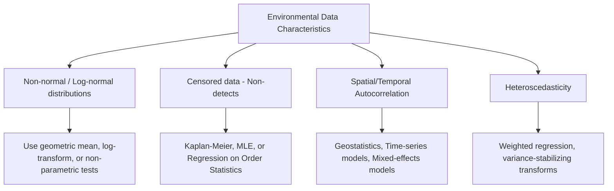

## Environmental Statistics and Data Analysis

### Definition and Scope

Environmental statistics is the branch of applied statistics concerned with the design, collection, analysis, and interpretation of data describing environmental phenomena—pollutant concentrations, species abundance, climate variables, ecological indices—and with quantifying the uncertainty inherent in environmental measurement and modeling. Environmental data present distinctive statistical challenges compared to many other applied domains: frequent non-normality, censored (below-detection-limit) observations, spatial and temporal autocorrelation, and high measurement variability driven by natural heterogeneity in environmental systems. Environmental statistics provides the methodological toolkit for drawing valid, defensible conclusions from such data.

### Characteristics of Environmental Data

**Non-normal distributions**: Concentration data for many contaminants (chemical, biological) commonly follow **log-normal** rather than normal distributions, since concentration processes are often the product of multiple multiplicative random factors rather than additive ones. This has direct implications for choice of statistical test and interpretation of "average" concentration (arithmetic mean vs. geometric mean).

**Censored data (non-detects)**: Analytical instruments have a **method detection limit (MDL)** and **reporting limit (RL)**; concentrations below these thresholds are reported as "non-detect" (ND) rather than as a precise numeric value, producing left-censored data that require specialized statistical handling rather than simple substitution.

**Spatial and temporal autocorrelation**: Measurements taken close together in space or time tend to be more similar than measurements taken far apart, violating the independence assumption underlying many classical statistical tests (e.g., ordinary least squares regression, standard ANOVA) and requiring specialized methods (geostatistics, time-series analysis) that explicitly account for this dependence structure.

**Heteroscedasticity**: Variance in environmental measurements often scales with the mean concentration (e.g., higher-concentration samples show greater absolute variability), violating the constant-variance assumption of many classical parametric tests.

### Handling Non-Detect (Censored) Data

Historically, common but statistically problematic approaches to non-detects included simple substitution (e.g., replacing ND values with 0, the detection limit, or half the detection limit). These substitution methods are now widely discouraged in environmental statistics guidance (e.g., US EPA's ProUCL software documentation) because they can introduce substantial bias, particularly when the proportion of non-detects is large or when there are multiple different detection limits across the dataset.

**Recommended approaches include**:

- **Kaplan-Meier estimation**: Adapted from survival analysis, treats detection limits as censoring thresholds and produces unbiased estimates of the mean, median, and other distributional parameters without requiring an assumed parametric distribution.
- **Maximum Likelihood Estimation (MLE)**: Fits an assumed parametric distribution (e.g., log-normal) to the combined detected and censored data, using the likelihood function appropriately adjusted for censored observations.
- **Regression on Order Statistics (ROS)**: A semi-parametric approach that uses the detected values to establish a probability distribution, which is then used to impute plausible values for the non-detects, robust to moderate departures from the assumed distribution.

The choice among these methods depends on the proportion of non-detects (guidance generally suggests substitution methods are inappropriate above roughly 15–20% non-detects, though the exact appropriate threshold is dataset- and application-dependent) and the number of distinct detection limits present in the dataset. [Unverified: specific threshold recommendations vary across guidance documents and have evolved over successive editions of tools such as EPA ProUCL; consult current agency guidance for the applicable regulatory context.]

### Descriptive Statistics for Environmental Data

**Central tendency**: For log-normally distributed data, the **geometric mean** is typically more representative of "typical" concentration than the arithmetic mean, which can be strongly influenced by a small number of high outlier values:

$$GM = \left( \prod_{i=1}^{n} x_i \right)^{1/n} = \exp\left( \frac{1}{n}\sum_{i=1}^{n} \ln(x_i) \right)$$

**Upper Confidence Limit on the Mean (UCL)**: A key statistic in environmental risk assessment and regulatory decision-making, representing the upper bound of a confidence interval on the true population mean, used (rather than the point estimate of the mean) to provide a conservative, health-protective estimate for exposure assessment. The appropriate UCL calculation method (e.g., Student's t, Chebyshev, Land's H-statistic for log-normal data, bootstrap-based methods) depends on the underlying data distribution and sample size, and is typically selected via goodness-of-fit testing as implemented in tools such as EPA's ProUCL software.

### Hypothesis Testing Considerations

**Parametric vs. non-parametric test selection**: Given the frequent non-normality of environmental data, non-parametric tests (which do not assume a specific underlying distribution) are frequently preferred:

| Objective | Parametric Test | Non-Parametric Alternative |
| --- | --- | --- |
| Compare two independent groups | Student's t-test | Mann-Whitney U (Wilcoxon rank-sum) |
| Compare two paired/related groups | Paired t-test | Wilcoxon signed-rank test |
| Compare 3+ independent groups | One-way ANOVA | Kruskal-Wallis test |
| Test for trend over time | Linear regression | Mann-Kendall trend test |
| Test association between variables | Pearson correlation | Spearman rank correlation |

**Mann-Kendall Trend Test**: Widely used in environmental monitoring (e.g., long-term water quality or air quality trend detection) because it is robust to non-normality, missing values, and the presence of some outliers, and does not require a linear trend assumption—only a monotonic one. The test statistic $S$ is calculated as:

$$S = \sum_{i=1}^{n-1} \sum_{j=i+1}^{n} \text{sgn}(x_j - x_i)$$

where $\text{sgn}$ returns $+1$, $0$, or $-1$ depending on whether $x_j - x_i$ is positive, zero, or negative. A positive $S$ indicates an upward trend, negative indicates downward, and the associated p-value assesses statistical significance against the null hypothesis of no trend. When a significant trend is detected, the **Sen's slope estimator** (the median of all pairwise slopes) is commonly used to quantify trend magnitude in a way that is robust to outliers.

### Worked Example: Comparing Two Groups with Non-Normal Data

**Scenario**: An environmental scientist compares dissolved oxygen concentrations (mg/L) upstream and downstream of a wastewater outfall to assess potential impact, with 8 samples per group. Prior exploratory analysis (e.g., a Shapiro-Wilk normality test and visual inspection of a Q-Q plot) indicates the data are not normally distributed.

Given the non-normality, the scientist selects the **Mann-Whitney U test** rather than a two-sample t-test.

| Upstream (mg/L) | Downstream (mg/L) |
| --- | --- |
| 8.2 | 6.1 |
| 7.9 | 5.8 |
| 8.5 | 6.5 |
| 8.1 | 5.9 |
| 7.7 | 6.2 |
| 8.3 | 6.0 |
| 8.0 | 5.7 |
| 8.4 | 6.3 |

Ranking all 16 values combined and summing ranks per group, suppose the resulting test yields $U = 2$ with an associated $p < 0.001$ (two-tailed). Since $p$ is far below the conventional $\alpha = 0.05$ threshold, the scientist rejects the null hypothesis of no difference between groups, concluding there is strong statistical evidence that dissolved oxygen concentration differs (is lower) downstream of the outfall. [Inference: statistical significance indicates the observed difference is unlikely to be due to chance alone under the stated assumptions; it does not by itself establish the outfall as the causal mechanism, which would require additional lines of evidence such as mechanistic understanding, dose-response relationship, or elimination of confounding factors such as natural downstream gradient effects.]

### Time Series Analysis for Environmental Monitoring

Long-term environmental monitoring data (e.g., air quality, streamflow, groundwater levels) frequently exhibit:

- **Seasonality**: Cyclical patterns repeating at fixed intervals (e.g., annual temperature cycles, seasonal precipitation patterns).
- **Trend**: A long-term directional change, which may be linear or non-linear.
- **Autocorrelation**: Correlation between an observation and its own past values, requiring specialized modeling (e.g., ARIMA models) rather than standard regression, which assumes independent residuals.

**Seasonal-Trend Decomposition** separates a time series into trend, seasonal, and residual (irregular) components:

$$Y_t = T_t + S_t + R_t \quad \text{(additive model)}$$

$$Y_t = T_t \times S_t \times R_t \quad \text{(multiplicative model)}$$

where $Y_t$ is the observed value at time $t$, $T_t$ is the trend component, $S_t$ is the seasonal component, and $R_t$ is the residual. The additive model is appropriate when seasonal fluctuations are roughly constant in magnitude regardless of trend level; the multiplicative model is appropriate when seasonal fluctuation magnitude scales with the trend level.

### Spatial Statistics and Geostatistics

**Spatial autocorrelation** is commonly quantified using **Moran's I**, which tests whether nearby locations exhibit more similar values than would be expected under spatial randomness:

$$I = \frac{n}{\sum_{i}\sum_{j} w_{ij}} \times \frac{\sum_{i}\sum_{j} w_{ij}(x_i - \bar{x})(x_j - \bar{x})}{\sum_{i}(x_i - \bar{x})^2}$$

where $n$ is the number of spatial locations, $w_{ij}$ is a spatial weight between locations $i$ and $j$ (e.g., based on proximity or adjacency), and $x_i$, $x_j$ are the observed values. Moran's I ranges approximately from $-1$ (perfect dispersion) to $+1$ (perfect spatial clustering), with values near 0 indicating spatial randomness.

**Variograms**, central to kriging-based geostatistical interpolation, model how the semivariance (a measure of dissimilarity) between pairs of sample points changes with increasing separation distance (lag):

$$\gamma(h) = \frac{1}{2N(h)} \sum_{i=1}^{N(h)} \left[ z(x_i) - z(x_i + h) \right]^2$$

where $\gamma(h)$ is the semivariance at lag distance $h$, $N(h)$ is the number of point pairs separated by approximately that lag, and $z(x_i)$ is the measured value at location $x_i$. Key variogram parameters include the **nugget** (semivariance at zero lag, representing measurement error and fine-scale spatial variability below the sampling resolution), the **sill** (the semivariance value at which the variogram plateaus, representing the total variance in the data), and the **range** (the lag distance at which the sill is reached, beyond which observations are considered spatially independent).

### Uncertainty Quantification and Error Propagation

Environmental measurements and model outputs are subject to multiple sources of uncertainty: measurement error, sampling error (natural spatial/temporal variability), and model structural uncertainty. When combining multiple measured or estimated quantities (e.g., calculating a mass loading rate as concentration × flow rate), uncertainty propagates through the calculation according to standard error propagation rules.

For a derived quantity $Y = f(X_1, X_2, ..., X_n)$, the propagated variance (for approximately independent inputs, using a first-order Taylor approximation) is:

$$\sigma_Y^2 \approx \sum_{i=1}^{n} \left( \frac{\partial f}{\partial X_i} \right)^2 \sigma_{X_i}^2$$

**Worked example**: Calculating pollutant mass loading rate $L = C \times Q$ (concentration × flow rate), where $C = 5.0 \pm 0.3$ mg/L and $Q = 200 \pm 15$ L/s (uncertainties as standard deviations). Using the multiplicative error propagation formula (relative uncertainties add in quadrature for products):

$$\frac{\sigma_L}{L} = \sqrt{\left(\frac{\sigma_C}{C}\right)^2 + \left(\frac{\sigma_Q}{Q}\right)^2} = \sqrt{\left(\frac{0.3}{5.0}\right)^2 + \left(\frac{15}{200}\right)^2} = \sqrt{0.0036 + 0.005625} \approx 0.0985$$

With $L = 5.0 \times 200 = 1000$ mg/s, the propagated absolute uncertainty is:

$$\sigma_L = 0.0985 \times 1000 \approx 98.5 \text{ mg/s}$$

So the mass loading rate would be reported as approximately $1000 \pm 99$ mg/s, illustrating how measurement uncertainty in both concentration and flow contributes to overall uncertainty in the derived loading estimate.

### Diagram: Statistical Decision Pathway for Environmental Data Analysis (svg_diagram)

<svg xmlns="http://www.w3.org/2000/svg" viewBox="0 0 750 400" font-family="Arial, sans-serif">
<text x="375" y="22" text-anchor="middle" font-size="15" font-weight="bold">Statistical Decision Pathway (svg_diagram)</text>
<rect x="300" y="45" width="150" height="45" rx="6" fill="#e8f4ea" stroke="#2e7d32" stroke-width="2" />
<text x="375" y="72" text-anchor="middle" font-size="10">Assess Data: Normality, Censoring, Autocorrelation</text>
<line x1="375" y1="90" x2="200" y2="140" stroke="#555" stroke-width="1.5" marker-end="url(#arrow5)" />
<line x1="375" y1="90" x2="375" y2="140" stroke="#555" stroke-width="1.5" marker-end="url(#arrow5)" />
<line x1="375" y1="90" x2="550" y2="140" stroke="#555" stroke-width="1.5" marker-end="url(#arrow5)" />
<rect x="110" y="140" width="180" height="55" rx="6" fill="#e3f2fd" stroke="#1565c0" stroke-width="2" />
<text x="200" y="163" text-anchor="middle" font-size="9" font-weight="bold">Non-Detects Present</text>
<text x="200" y="178" text-anchor="middle" font-size="9">Kaplan-Meier / ROS / MLE</text>
<rect x="285" y="140" width="180" height="55" rx="6" fill="#fff3e0" stroke="#e65100" stroke-width="2" />
<text x="375" y="163" text-anchor="middle" font-size="9" font-weight="bold">Non-Normal Distribution</text>
<text x="375" y="178" text-anchor="middle" font-size="9">Non-parametric tests / transform</text>
<rect x="460" y="140" width="180" height="55" rx="6" fill="#f3e5f5" stroke="#6a1b9a" stroke-width="2" />
<text x="550" y="163" text-anchor="middle" font-size="9" font-weight="bold">Spatial/Temporal Correlation</text>
<text x="550" y="178" text-anchor="middle" font-size="9">Geostatistics / Time-series models</text>
<line x1="200" y1="195" x2="375" y2="250" stroke="#555" stroke-width="1.5" marker-end="url(#arrow5)" />
<line x1="375" y1="195" x2="375" y2="250" stroke="#555" stroke-width="1.5" marker-end="url(#arrow5)" />
<line x1="550" y1="195" x2="375" y2="250" stroke="#555" stroke-width="1.5" marker-end="url(#arrow5)" />
<rect x="270" y="250" width="210" height="55" rx="6" fill="#fce4ec" stroke="#ad1457" stroke-width="2" />
<text x="375" y="273" text-anchor="middle" font-size="9" font-weight="bold">Select Appropriate Method</text>
<text x="375" y="288" text-anchor="middle" font-size="9">Report with uncertainty/confidence bounds</text>
<line x1="375" y1="305" x2="375" y2="340" stroke="#555" stroke-width="1.5" marker-end="url(#arrow5)" />
<rect x="290" y="340" width="170" height="45" rx="6" fill="#d7ccc8" stroke="#4e342e" stroke-width="2" />
<text x="375" y="367" text-anchor="middle" font-size="10" font-weight="bold">Defensible Conclusion</text>
</svg>

### Multivariate Statistical Methods

**Principal Component Analysis (PCA)**: Reduces dimensionality of multivariate environmental datasets (e.g., multiple co-measured water quality parameters) by identifying orthogonal linear combinations (principal components) that capture maximum variance, useful for identifying dominant patterns and reducing redundancy among correlated variables.

**Cluster Analysis**: Groups sampling sites or time periods into similar clusters based on multivariate similarity, useful for identifying spatial or temporal regimes (e.g., grouping monitoring stations into similarity classes based on water chemistry profiles).

**Redundancy Analysis (RDA) and Canonical Correspondence Analysis (CCA)**: Constrained ordination techniques widely used in ecological statistics to relate community composition (e.g., species assemblage data) to environmental gradient variables, identifying which environmental factors best explain observed biological patterns.

### Common Statistical Pitfalls in Environmental Data Analysis

- **Pseudoreplication**: Treating spatially or temporally correlated (non-independent) subsamples as independent replicates, artificially inflating statistical power and increasing the risk of false-positive conclusions—a widely recognized issue in ecological and environmental study design.
- **Inappropriate non-detect substitution**: As discussed above, naive substitution methods (0, DL, DL/2) can bias summary statistics, particularly with high non-detect proportions.
- **Multiple comparisons without correction**: Conducting numerous statistical tests (e.g., testing many contaminants or many sites) without adjusting significance thresholds (e.g., via Bonferroni or false discovery rate correction) inflates the overall probability of at least one false-positive result.
- **Correlation-causation conflation**: Statistical association between an environmental exposure and an outcome does not by itself establish causation; environmental epidemiology and ecological studies generally require additional criteria (e.g., Bradford Hill considerations, mechanistic plausibility, temporal precedence, dose-response relationships) to support causal inference.
- **Ignoring detection limit changes over time**: Long-term monitoring datasets may span periods with different analytical methods and detection limits, which can create spurious apparent trends if not explicitly accounted for in trend analysis.

### Related Topics

- Geostatistics and Kriging-Based Spatial Interpolation
- Environmental Risk Assessment and Exposure Statistics (UCL Calculation)
- Time Series Analysis and ARIMA Modeling for Monitoring Data
- Ecological Statistics: Ordination and Multivariate Community Analysis
- Environmental Sampling Design and Data Quality Objectives
- Bayesian Methods in Environmental Data Analysis
- R and Python Statistical Programming for Environmental Data
- Water Quality Trend Analysis (Mann-Kendall and Seasonal Kendall Tests)
- Environmental Epidemiology and Causal Inference Frameworks
- Big Data and Machine Learning Applications in Environmental Monitoring