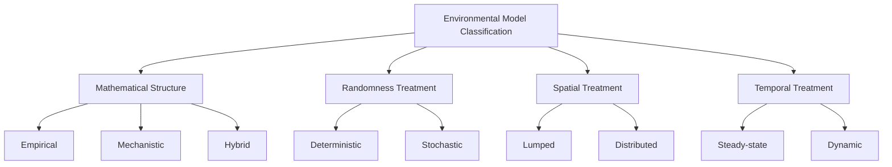

## Environmental Modeling and Simulation

### Definition and Scope

Environmental modeling is the practice of representing environmental systems—atmospheric, hydrological, ecological, or coupled human-environment systems—as mathematical or computational structures that simulate the system's behavior under specified conditions. Models serve to synthesize scientific understanding, predict future states or scenario outcomes, test hypotheses that cannot be experimentally manipulated at real-world scale, and support environmental management and policy decisions where direct observation of all relevant conditions is impractical or impossible (e.g., predicting pollutant dispersion under hypothetical future emission scenarios, or projecting climate conditions decades into the future).

Environmental models range from simple analytical equations solvable by hand to complex, computationally intensive numerical simulations requiring high-performance computing resources.

### Classification of Environmental Models

**By Mathematical Structure**

- **Empirical (statistical) models**: Derived from observed data relationships without necessarily representing underlying physical mechanisms (e.g., a regression relating stream temperature to air temperature). Computationally efficient and often accurate within the range of observed conditions, but may not extrapolate reliably outside that range.
- **Mechanistic (process-based) models**: Built from fundamental physical, chemical, or biological process equations (e.g., mass balance, energy balance, reaction kinetics), enabling more defensible extrapolation beyond observed conditions but typically requiring more extensive input data and computational resources.
- **Hybrid models**: Combine empirical relationships for some processes with mechanistic representation of others, balancing computational tractability against process fidelity.

**By Treatment of Randomness**

- **Deterministic models**: Produce a single, fixed output for a given set of inputs, with no representation of random variability.
- **Stochastic models**: Explicitly incorporate randomness (e.g., via probability distributions for uncertain parameters), producing a distribution of possible outcomes rather than a single value, often evaluated using Monte Carlo simulation techniques.

**By Spatial Treatment**

- **Lumped models**: Treat the study area (e.g., a watershed) as a single homogeneous unit, using spatially averaged inputs and parameters.
- **Distributed (spatially explicit) models**: Divide the study area into discrete spatial units (grid cells or sub-basins), each with its own parameters and state variables, capturing spatial heterogeneity at the cost of increased data requirements and computational demand.

**By Temporal Treatment**

- **Steady-state models**: Represent system conditions at equilibrium, without explicit representation of time-varying dynamics.
- **Dynamic (time-variant) models**: Explicitly simulate how system states evolve over time, typically through iterative time-stepping.

### General Modeling Workflow

1. **Problem definition and conceptual model development**: Identifying the management question, relevant processes, system boundaries, and required model outputs.
2. **Model selection or development**: Choosing an existing model appropriate to the problem and available data, or developing a new model structure.
3. **Data acquisition and input preparation**: Compiling required input datasets (meteorological data, topography, land use, emission rates, boundary conditions).
4. **Calibration**: Adjusting model parameters so that model outputs match observed historical data as closely as possible, typically through an objective function minimizing the difference between simulated and observed values.
5. **Validation (verification)**: Testing calibrated model performance against an independent dataset not used in calibration, to assess predictive reliability.
6. **Sensitivity analysis**: Systematically varying model inputs/parameters to identify which most strongly influence model outputs, informing both scientific understanding and priorities for further data collection.
7. **Uncertainty analysis**: Quantifying the range of plausible model outputs given uncertainty in inputs, parameters, and model structure itself.
8. **Application/scenario analysis**: Using the validated model to simulate management alternatives, future scenarios, or "what-if" conditions to inform decision-making.

### Model Calibration and Performance Evaluation

Calibration typically involves minimizing an objective function, commonly a form of sum of squared errors between observed and simulated values:

$$SSE = \sum_{i=1}^{n} (O_i - S_i)^2$$

where $O_i$ is the observed value and $S_i$ is the simulated (modeled) value at time/location $i$.

**Common goodness-of-fit statistics** used to evaluate calibration and validation performance:

**Nash-Sutcliffe Efficiency (NSE)**: Widely used in hydrological modeling, comparing model performance to simply using the observed mean as a predictor:

$$NSE = 1 - \frac{\sum_{i=1}^{n}(O_i - S_i)^2}{\sum_{i=1}^{n}(O_i - \bar{O})^2}$$

NSE ranges from $-\infty$ to $1$; $NSE = 1$ indicates perfect fit, $NSE = 0$ indicates the model performs no better than the observed mean, and negative values indicate the model performs worse than simply using the observed mean as a predictor. Commonly cited (though not universally standardized) qualitative benchmarks classify $NSE > 0.75$ as "very good," $0.65$–$0.75$ as "good," $0.50$–$0.65$ as "satisfactory," and $NSE < 0.50$ as "unsatisfactory" for many hydrological applications. [Unverified: these thresholds originate from specific published guidance (e.g., Moriasi et al.) intended for particular model types and time steps; applicability to other model types or contexts should be evaluated critically rather than applied as a universal standard.]

**Root Mean Square Error (RMSE)**: Expressed in the same units as the modeled variable, providing an intuitive measure of average prediction error magnitude:

$$RMSE = \sqrt{\frac{1}{n}\sum_{i=1}^{n}(O_i - S_i)^2}$$

**Percent Bias (PBIAS)**: Measures the average tendency of simulated values to be larger or smaller than observed values:

$$PBIAS = \frac{\sum_{i=1}^{n}(O_i - S_i)}{\sum_{i=1}^{n}O_i} \times 100\%$$

Positive PBIAS indicates model underestimation bias; negative PBIAS indicates overestimation bias.

### Worked Example: Evaluating Model Performance

**Scenario**: A hydrologist calibrates a watershed streamflow model and compares simulated daily flow against observed gauge data over a 5-day validation period.

| Day | Observed (m³/s) | Simulated (m³/s) |
| --- | --- | --- |
| 1 | 12.0 | 11.2 |
| 2 | 15.5 | 14.8 |
| 3 | 22.0 | 24.1 |
| 4 | 18.3 | 17.5 |
| 5 | 14.1 | 13.9 |

Mean observed flow: $\bar{O} = (12.0+15.5+22.0+18.3+14.1)/5 = 16.38 \text{ m}^3/\text{s}$

$$\sum(O_i - S_i)^2 = (0.8)^2+(0.7)^2+(-2.1)^2+(0.8)^2+(0.2)^2 = 0.64+0.49+4.41+0.64+0.04 = 6.22$$

$$\sum(O_i - \bar{O})^2 = (-4.38)^2+(-0.88)^2+(5.62)^2+(1.92)^2+(-2.28)^2 = 19.18+0.77+31.58+3.69+5.20 = 60.42$$

$$NSE = 1 - \frac{6.22}{60.42} = 1 - 0.103 = 0.897$$

$$RMSE = \sqrt{6.22/5} = \sqrt{1.244} \approx 1.12 \text{ m}^3/\text{s}$$

An NSE of 0.897 indicates a very good model fit by common hydrological benchmarks, with an average prediction error (RMSE) of approximately 1.12 m³/s, suggesting the model captures the observed flow dynamics well over this validation period. [Inference: performance over a 5-day period is illustrative only; robust model validation requires evaluation across a longer period spanning multiple hydrological conditions, such as both high-flow and low-flow events.]

### Major Model Classes by Environmental Domain

**Hydrological Models**

Simulate the movement and storage of water through a watershed, including precipitation-runoff transformation, infiltration, evapotranspiration, and streamflow routing. Examples include SWAT (Soil and Water Assessment Tool, widely used for watershed-scale nonpoint source pollution and water yield modeling) and HEC-HMS/HEC-RAS (US Army Corps of Engineers models for hydrologic and hydraulic analysis, respectively).

**Atmospheric Dispersion Models**

Simulate the transport and dilution of air pollutants from emission sources, used in regulatory air quality permitting and impact assessment. Gaussian plume models represent the classical analytical approach for steady-state, relatively simple terrain conditions, with concentration at a downwind point calculated as:

$$C(x,y,z) = \frac{Q}{2\pi u \sigma_y \sigma_z} \exp\left(-\frac{y^2}{2\sigma_y^2}\right) \left[\exp\left(-\frac{(z-H)^2}{2\sigma_z^2}\right) + \exp\left(-\frac{(z+H)^2}{2\sigma_z^2}\right)\right]$$

where $Q$ is emission rate, $u$ is wind speed, $\sigma_y$ and $\sigma_z$ are horizontal and vertical dispersion coefficients (functions of atmospheric stability and downwind distance), $H$ is effective stack height, and $x, y, z$ are downwind, crosswind, and vertical coordinates respectively. More sophisticated regulatory models (e.g., AERMOD, the current EPA-preferred near-field dispersion model) incorporate more detailed treatment of atmospheric boundary layer processes and complex terrain.

**Water Quality Models**

Simulate the fate and transport of pollutants within water bodies, incorporating advection, dispersion, and reaction/decay processes. The QUAL2K/QUAL2E family and WASP (Water Quality Analysis Simulation Program) are widely used examples for riverine and lake systems, respectively, simulating processes such as dissolved oxygen dynamics, nutrient cycling, and eutrophication.

**Climate Models**

Global Climate Models (GCMs, also termed General Circulation Models) and their higher-resolution regional counterparts (Regional Climate Models, RCMs) numerically solve the fundamental equations governing atmospheric and oceanic circulation, radiation, and energy balance to simulate current and projected future climate states under specified emission/concentration scenarios (e.g., the Shared Socioeconomic Pathways, SSPs, used in the IPCC's most recent assessment reports).

**Ecological and Population Models**

Range from simple analytical population growth models to complex, spatially explicit ecosystem simulation models. The classic exponential growth model:

$$\frac{dN}{dt} = rN$$

and logistic growth model incorporating carrying capacity $K$:

$$\frac{dN}{dt} = rN\left(1 - \frac{N}{K}\right)$$

where $N$ is population size, $r$ is intrinsic growth rate, and $t$ is time, form foundational building blocks for more complex ecological simulation models, including predator-prey (Lotka-Volterra) systems and individual-based/agent-based ecological models.

**Land Use and Land Cover Change Models**

Simulate future spatial patterns of land use change based on drivers such as population growth, economic development, transportation infrastructure, and policy scenarios, often using cellular automata or agent-based modeling approaches (e.g., the CLUE and Dyna-CLUE model families).

### Diagram: Generalized Environmental Modeling Workflow (svg_diagram)

<svg xmlns="http://www.w3.org/2000/svg" viewBox="0 0 750 420" font-family="Arial, sans-serif">
<text x="375" y="22" text-anchor="middle" font-size="15" font-weight="bold">Environmental Modeling Workflow (svg_diagram)</text>
<rect x="290" y="45" width="170" height="45" rx="6" fill="#e8f4ea" stroke="#2e7d32" stroke-width="2" />
<text x="375" y="72" text-anchor="middle" font-size="10">Conceptual Model Development</text>
<line x1="375" y1="90" x2="375" y2="120" stroke="#555" stroke-width="1.5" marker-end="url(#arrow6)" />
<rect x="290" y="120" width="170" height="45" rx="6" fill="#e3f2fd" stroke="#1565c0" stroke-width="2" />
<text x="375" y="147" text-anchor="middle" font-size="10">Input Data Preparation</text>
<line x1="375" y1="165" x2="375" y2="195" stroke="#555" stroke-width="1.5" marker-end="url(#arrow6)" />
<rect x="290" y="195" width="170" height="45" rx="6" fill="#fff3e0" stroke="#e65100" stroke-width="2" />
<text x="375" y="222" text-anchor="middle" font-size="10">Calibration</text>
<line x1="375" y1="240" x2="375" y2="270" stroke="#555" stroke-width="1.5" marker-end="url(#arrow6)" />
<rect x="290" y="270" width="170" height="45" rx="6" fill="#f3e5f5" stroke="#6a1b9a" stroke-width="2" />
<text x="375" y="297" text-anchor="middle" font-size="10">Validation</text>
<line x1="290" y1="292" x2="150" y2="220" stroke="#999" stroke-width="1.5" stroke-dasharray="4,3" />
<text x="130" y="210" font-size="9" fill="#666">Recalibrate if</text>
<text x="130" y="222" font-size="9" fill="#666">performance poor</text>
<line x1="150" y1="215" x2="290" y2="217" stroke="#999" stroke-width="1.5" stroke-dasharray="4,3" marker-end="url(#arrow6)" />
<line x1="375" y1="315" x2="375" y2="345" stroke="#555" stroke-width="1.5" marker-end="url(#arrow6)" />
<rect x="290" y="345" width="170" height="45" rx="6" fill="#fce4ec" stroke="#ad1457" stroke-width="2" />
<text x="375" y="372" text-anchor="middle" font-size="10">Scenario Application</text>
<rect x="530" y="120" width="170" height="45" rx="6" fill="#d7ccc8" stroke="#4e342e" stroke-width="2" />
<text x="615" y="140" text-anchor="middle" font-size="9">Sensitivity Analysis</text>
<text x="615" y="153" text-anchor="middle" font-size="9">(parallel to calibration)</text>
</svg>

### Sensitivity and Uncertainty Analysis

**Local sensitivity analysis** varies one parameter at a time while holding others constant, quantifying the resulting change in model output—computationally efficient but does not capture interaction effects between parameters.

**Global sensitivity analysis** (e.g., Sobol indices, Morris method) varies multiple parameters simultaneously across their plausible ranges, capturing both individual parameter effects and interaction effects, at greater computational cost.

**Monte Carlo simulation** is widely used for uncertainty propagation: model inputs are represented as probability distributions (rather than single point values) reflecting their known or estimated uncertainty, the model is run many times (often thousands of iterations) with randomly sampled input combinations, and the resulting distribution of model outputs quantifies overall predictive uncertainty. **Latin Hypercube Sampling (LHS)** is a commonly used variant that ensures more efficient, stratified coverage of the input parameter space compared to simple random sampling, reducing the number of model runs needed to characterize output uncertainty adequately.

### Model Structural Uncertainty and Ensemble Approaches

Beyond parameter uncertainty, models are also subject to **structural uncertainty**—the possibility that the chosen model formulation itself imperfectly represents the true underlying system processes. This is commonly addressed through **multi-model ensemble** approaches, running several independently developed models (e.g., multiple GCMs under the same climate scenario) and treating the spread among model outputs as an indicator of structural uncertainty, in addition to reporting the ensemble mean or median as a central estimate. [Inference: ensemble spread is a useful but imperfect proxy for true structural uncertainty, since models within a given ensemble may share common structural assumptions or biases not captured by inter-model spread alone.]

### Software and Computational Platforms

| Domain | Representative Tools |
| --- | --- |
| Watershed/hydrology | SWAT, HEC-HMS, HEC-RAS, MIKE SHE |
| Air dispersion | AERMOD, CALPUFF, CMAQ |
| Water quality | WASP, QUAL2K, EFDC |
| Climate | CESM, GFDL models, CMIP6 model archive |
| Ecological/agent-based | NetLogo, Repast, custom R/Python implementations |
| General scientific computing | Python (NumPy, SciPy, pandas), R, MATLAB |

[Unverified: specific model versions, capabilities, and regulatory acceptance status change over time as agencies update preferred model lists and software is updated; verify current regulatory-accepted model status against the relevant governing agency's current guidance before use in a compliance context.]

### Limitations and Common Pitfalls

- **Overfitting during calibration**: Adjusting too many parameters to fit historical data can produce a model that performs well on the calibration period but poorly on independent validation data or under future conditions outside the calibration range (equifinality—multiple different parameter sets producing similarly good calibration fits, without a principled basis for selecting among them).
- **Extrapolation beyond validated conditions**: Applying a model to conditions (e.g., extreme events, land use states, or emission levels) substantially outside the range represented in the calibration/validation dataset increases predictive uncertainty, often without a clear quantitative bound on how much.
- **Garbage in, garbage out**: Model output quality is fundamentally constrained by input data quality; sophisticated model structure cannot compensate for poor-quality or unrepresentative input data.
- **Conflating model precision with accuracy**: A model producing outputs to many decimal places is not necessarily more accurate; apparent precision can create false confidence in model reliability.
- **Insufficient communication of uncertainty**: Presenting a single deterministic model output without accompanying uncertainty bounds can mislead decision-makers about the actual confidence level supporting a projection.

### Related Topics

- Hydrological Modeling with SWAT and HEC Software Suites
- Atmospheric Dispersion Modeling and Regulatory Air Permitting (AERMOD)
- Climate Model Ensembles and CMIP6 Scenario Analysis
- Monte Carlo Simulation and Latin Hypercube Sampling Methods
- Agent-Based and Cellular Automata Models for Land Use Change
- Model Calibration, Equifinality, and Parameter Identifiability
- Environmental Statistics: Uncertainty and Error Propagation
- Ecosystem and Population Dynamics Modeling (Lotka-Volterra Systems)
- Digital Twins for Environmental Systems Management
- Machine Learning as a Complement to Process-Based Environmental Models