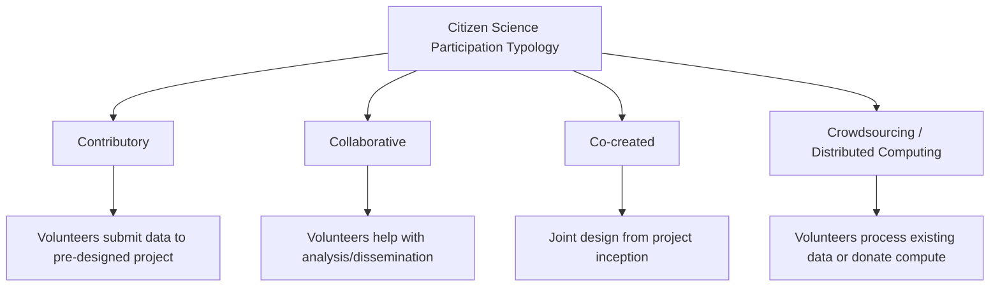

## Citizen Science and Community Monitoring Networks

### Definition and Scope

Citizen science refers to the practice of engaging members of the public—typically non-professional volunteers—in the collection, processing, or analysis of scientific data, often in partnership with professional researchers or institutions. Community monitoring networks are the organizational and technical infrastructures that coordinate this participation for environmental data collection, encompassing water quality testing programs, air quality sensor networks, biodiversity observation platforms, and hazard reporting systems. Within environmental science, citizen science has become an increasingly significant data source, extending spatial and temporal monitoring coverage well beyond what professional monitoring programs alone could achieve given budgetary and logistical constraints.

### Typology of Citizen Science Participation

Citizen science initiatives are commonly classified by the degree and nature of public involvement:

- **Contributory projects**: Volunteers primarily contribute data (observations, measurements) to a project designed and led by professional scientists (e.g., submitting bird sightings to an established monitoring platform).
- **Collaborative projects**: Volunteers contribute data and also participate in aspects of project design, data analysis, or dissemination of results, working alongside professional scientists.
- **Co-created projects**: Volunteers and professional scientists jointly design the research question, methodology, and interpretation of results from project inception, representing the deepest level of public participation in the scientific process.
- **Crowdsourcing/distributed computing**: Volunteers contribute computational resources or process existing data (e.g., classifying images or transcribing records) rather than collecting new field data directly.

### Major Environmental Citizen Science Platforms and Programs

**Biodiversity Observation**

- **iNaturalist**: A global platform where users submit photographic observations of organisms, which are identified collaboratively by the community and, upon reaching "research grade" status (sufficient community agreement on identification), can be exported to biodiversity databases such as the Global Biodiversity Information Facility (GBIF).
- **eBird**: A bird observation database (Cornell Lab of Ornithology) widely used in ornithological research, generating large-scale datasets used for species distribution modeling, migration tracking, and population trend analysis.

**Water Quality Monitoring**

- Volunteer stream and lake monitoring programs (often coordinated at state, watershed, or NGO level) typically train volunteers in standardized field protocols for parameters such as dissolved oxygen, pH, temperature, turbidity, and macroinvertebrate-based biotic indices, feeding results into regional or national water quality databases.

**Air Quality Monitoring**

- Low-cost sensor networks (e.g., PurpleAir) allow individuals to deploy particulate matter sensors, contributing to dense spatial air quality datasets that complement sparser regulatory-grade monitoring networks, particularly valuable during acute events such as wildfire smoke episodes.

**Weather and Climate**

- Programs such as CoCoRaHS (Community Collaborative Rain, Hail and Snow Network) coordinate volunteer precipitation measurement across dense networks of household-level rain gauges, providing spatial resolution unattainable through official meteorological station networks alone.

**Litter and Marine Debris**

- Coastal cleanup and litter audit programs (e.g., those coordinated by ocean conservation organizations) generate standardized debris count data used to track pollution trends and inform policy (e.g., single-use plastic regulations).

[Unverified: specific platform names, features, and data-sharing partnerships are subject to change as organizations evolve; verify current program status and data access policies against the platform's own documentation before relying on it for a specific project.]

### Data Quality Considerations

A central methodological concern in citizen science is data quality, given variable volunteer training, equipment calibration, and observation effort compared to professional monitoring. Common quality assurance strategies include:

**Structured Training and Protocols**

Standardized data collection protocols (often supported by training materials, certification programs, or in-person workshops) reduce measurement variability across volunteers, particularly important for field techniques requiring judgment (e.g., visual turbidity assessment, macroinvertebrate identification).

**Redundancy and Consensus Mechanisms**

Platforms such as iNaturalist rely on multiple independent volunteer identifications converging on consensus before an observation is considered sufficiently reliable ("research grade"), functioning analogously to inter-rater reliability assessment in professional research contexts.

**Automated Validation Filters**

Algorithmic screening for implausible values (e.g., temperature or concentration readings outside physically plausible ranges, duplicate submissions, GPS coordinates falling in implausible locations) to flag likely erroneous data for review before inclusion in analysis datasets.

**Statistical Correction and Calibration**

Comparing citizen science measurements against co-located reference-grade instruments to develop calibration correction factors, particularly important for low-cost sensor networks (e.g., correcting raw PurpleAir particulate matter readings against co-located regulatory reference monitors, since low-cost optical sensors can exhibit systematic bias under certain humidity and particle composition conditions).

**Volunteer Skill and Experience Weighting**

Some analytical frameworks incorporate volunteer experience level or historical accuracy record as a weighting factor in data aggregation, giving greater analytical weight to observations from more experienced or historically more accurate contributors.

### Worked Example: Calibration Correction for Low-Cost Sensor Data

**Scenario**: A citizen science air quality network deploys low-cost particulate matter (PM2.5) sensors alongside a single regulatory-grade reference monitor for a calibration period. Paired hourly readings are used to develop a linear correction equation:

$$PM_{2.5,corrected} = a + b \times PM_{2.5,raw}$$

Suppose regression analysis of the paired dataset yields $a = 1.2$ and $b = 0.78$ (reflecting that the low-cost sensor tends to overestimate concentrations under the specific humidity/aerosol conditions observed during calibration). Given a raw sensor reading of $PM_{2.5,raw} = 45 \, \mu g/m^3$:

$$PM_{2.5,corrected} = 1.2 + (0.78 \times 45) = 1.2 + 35.1 = 36.3 \, \mu g/m^3$$

This illustrates why raw low-cost sensor data are generally not used directly for regulatory or health-advisory purposes without such site- and condition-specific correction, and why calibration relationships developed under one set of environmental conditions (e.g., low humidity, wildfire smoke composition) may not transfer reliably to different conditions (e.g., high humidity, different aerosol sources) without re-calibration. [Inference: correction coefficients are specific to the sensor model, calibration period conditions, and reference instrument used; applying a correction equation developed under one set of conditions to substantially different conditions introduces additional uncertainty not captured by the original calibration.]

### Applications in Environmental Science and Policy

**Extending Spatial and Temporal Monitoring Coverage**

Citizen science networks can achieve monitoring density far exceeding what professional networks can support on typical budgets, particularly valuable for capturing fine-scale spatial heterogeneity in phenomena such as urban air quality (which can vary substantially block-to-block due to traffic patterns and local sources) or characterizing rapidly evolving events (e.g., wildfire smoke plumes, harmful algal bloom extent).

**Long-Term Ecological and Phenological Monitoring**

Programs spanning decades (e.g., long-running bird count programs, phenology networks tracking flowering and migration timing) provide datasets of a temporal duration and geographic breadth that would be prohibitively expensive to replicate through professional monitoring alone, supporting climate change impact research on shifting species ranges and phenological timing.

**Rapid Hazard and Pollution Event Reporting**

Crowdsourced reporting platforms enable near-real-time detection and mapping of pollution events (e.g., oil spills, illegal dumping, fish kills) that might otherwise go undetected until formal inspection occurs, supporting faster regulatory or emergency response.

**Environmental Justice and Community-Led Monitoring**

Community-led "bucket brigade" style air and water monitoring programs have historically played a significant role in documenting environmental conditions in underserved or historically under-monitored communities, at times filling data gaps left by regulatory monitoring network siting decisions, and providing communities with independent data to support advocacy or regulatory engagement.

**Supplementing Regulatory Monitoring Networks**

In some jurisdictions, citizen science and low-cost sensor data are increasingly integrated into (though generally not fully substituted for) official air and water quality monitoring frameworks, particularly for supplementary spatial context around sparser regulatory-grade networks. [Unverified: the specific regulatory status and weight given to citizen science data varies substantially by jurisdiction, agency, and data type, and continues to evolve; verify current regulatory acceptance criteria against the relevant governing agency.]

### Diagram: Citizen Science Data Flow and Quality Assurance Pipeline (svg_diagram)

<svg xmlns="http://www.w3.org/2000/svg" viewBox="0 0 750 320" font-family="Arial, sans-serif">
<text x="375" y="22" text-anchor="middle" font-size="15" font-weight="bold">Citizen Science Data Pipeline (svg_diagram)</text>
<circle cx="80" cy="90" r="35" fill="#e8f4ea" stroke="#2e7d32" stroke-width="2" />
<text x="80" y="85" text-anchor="middle" font-size="9">Volunteer</text>
<text x="80" y="98" text-anchor="middle" font-size="9">Observation</text>
<line x1="115" y1="90" x2="200" y2="90" stroke="#555" stroke-width="1.5" marker-end="url(#arrow7)" />
<rect x="200" y="65" width="140" height="50" rx="6" fill="#e3f2fd" stroke="#1565c0" stroke-width="2" />
<text x="270" y="88" text-anchor="middle" font-size="9">Mobile App / Web</text>
<text x="270" y="102" text-anchor="middle" font-size="9">Submission Portal</text>
<line x1="340" y1="90" x2="420" y2="90" stroke="#555" stroke-width="1.5" marker-end="url(#arrow7)" />
<rect x="420" y="65" width="140" height="50" rx="6" fill="#fff3e0" stroke="#e65100" stroke-width="2" />
<text x="490" y="83" text-anchor="middle" font-size="9">Automated QA/QC</text>
<text x="490" y="97" text-anchor="middle" font-size="9">Filters &amp; Flags</text>
<line x1="490" y1="115" x2="490" y2="150" stroke="#555" stroke-width="1.5" marker-end="url(#arrow7)" />
<rect x="420" y="150" width="140" height="50" rx="6" fill="#f3e5f5" stroke="#6a1b9a" stroke-width="2" />
<text x="490" y="168" text-anchor="middle" font-size="9">Expert/Community</text>
<text x="490" y="182" text-anchor="middle" font-size="9">Review &amp; Consensus</text>
<line x1="420" y1="175" x2="340" y2="175" stroke="#555" stroke-width="1.5" marker-end="url(#arrow7)" />
<rect x="200" y="150" width="140" height="50" rx="6" fill="#fce4ec" stroke="#ad1457" stroke-width="2" />
<text x="270" y="168" text-anchor="middle" font-size="9">Calibration Against</text>
<text x="270" y="182" text-anchor="middle" font-size="9">Reference Instruments</text>
<line x1="270" y1="200" x2="270" y2="235" stroke="#555" stroke-width="1.5" marker-end="url(#arrow7)" />
<line x1="490" y1="200" x2="270" y2="235" stroke="#555" stroke-width="1.5" marker-end="url(#arrow7)" />
<rect x="150" y="235" width="240" height="50" rx="6" fill="#d7ccc8" stroke="#4e342e" stroke-width="2" />
<text x="270" y="258" text-anchor="middle" font-size="10" font-weight="bold">Validated Open Dataset</text>
<text x="270" y="272" text-anchor="middle" font-size="9">(e.g., GBIF, public research database)</text>
</svg>

### Technological Infrastructure Supporting Citizen Science

**Mobile applications**: Smartphone-based data submission with integrated GPS geotagging, photo capture, and (in some platforms) offline data collection capability for areas with limited connectivity, later synchronized upon reconnection.

**Low-cost sensor hardware**: Advances in low-cost environmental sensor technology (particulate matter optical sensors, low-cost gas sensors, DIY water quality probes often built on open hardware platforms such as Arduino or Raspberry Pi) have substantially lowered the barrier to distributed environmental monitoring, though at the cost of generally lower accuracy and greater calibration/drift concerns compared to reference-grade instrumentation.

**Cloud-based data aggregation platforms**: Centralized databases and APIs enabling real-time or near-real-time aggregation of distributed volunteer submissions, often with public-facing dashboards and open data access supporting secondary use by researchers, policymakers, and other community members.

**Machine learning-assisted identification and validation**: Automated image recognition (e.g., for species identification in photographic biodiversity observations) increasingly assists or pre-screens volunteer submissions, reducing the burden on expert reviewers while flagging cases warranting human expert confirmation.

### Statistical and Methodological Considerations

**Spatial and observer bias**: Citizen science data collection effort is rarely spatially or temporally random—it tends to be concentrated near population centers, along accessible trails/roads, and during convenient times (e.g., weekends, daylight hours), which can create systematic sampling bias if not explicitly accounted for in subsequent analysis (e.g., via occupancy modeling approaches that explicitly model detection probability separately from true occurrence, or by incorporating effort as a covariate).

**Taxonomic and observer skill bias**: Some species or phenomena are more readily observed or correctly identified by volunteers than others (e.g., large, colorful, easily identified organisms tend to be overrepresented relative to cryptic or difficult-to-identify taxa), requiring caution when using raw citizen science observation counts as a direct proxy for true relative abundance.

**Integration with professional monitoring data**: Statistical frameworks increasingly aim to formally integrate citizen science data with professional monitoring data (e.g., through hierarchical or joint likelihood modeling approaches) to leverage the spatial/temporal breadth of citizen science alongside the higher per-observation reliability of professional data, rather than treating the two data sources as fully interchangeable or using citizen science data in isolation without accounting for its distinct error structure.

### Benefits Beyond Data Collection

- **Science education and public engagement**: Direct participation in data collection has been associated with increased environmental literacy and engagement among participants, supporting broader environmental science communication objectives.
- **Cost-effectiveness**: Volunteer-based data collection substantially reduces the marginal cost of expanding monitoring coverage compared to hiring additional professional field staff.
- **Community empowerment and local ownership**: Community-led monitoring programs can build local capacity and provide communities with data supporting their own environmental advocacy, decision-making, or dispute resolution processes.
- **Rapid scalability during emergent events**: Volunteer networks can often mobilize data collection more rapidly than professional monitoring programs can be redeployed, particularly valuable during acute pollution events or natural disasters.

### Limitations and Common Pitfalls

- **Variable and non-random spatial/temporal coverage**: As noted above, without careful statistical treatment, apparent patterns in citizen science data can reflect observer effort and accessibility patterns rather than true underlying environmental patterns.
- **Volunteer retention and long-term program sustainability**: Many citizen science programs experience participant attrition over time, requiring ongoing volunteer recruitment and engagement strategies to maintain data continuity.
- **Equipment calibration drift**: Low-cost sensors, particularly those without institutional maintenance support, can experience calibration drift over time if not periodically checked against reference standards.
- **Data ownership, privacy, and consent considerations**: Programs must address data governance questions including who owns collected data, how personally identifiable information (e.g., precise home location from geotagged observations) is protected, and how data may be used or shared with third parties.
- **Risk of data being dismissed by regulators or scientific gatekeepers**: Despite methodological advances, some regulatory and scientific contexts remain hesitant to fully weight citizen science data equivalently to professional monitoring data, which can limit its practical policy influence even when statistically well-validated. [Inference: the degree of regulatory/scientific acceptance varies considerably by field, jurisdiction, and specific program track record, and has generally been increasing over time as validation methodologies mature.]

### Related Topics

- Environmental Field Sampling Methods and Quality Assurance Protocols
- Low-Cost Sensor Technology and Calibration Methods
- Occupancy Modeling and Detection Probability in Ecological Statistics
- Environmental Justice and Community-Led Monitoring Movements
- Open Data Platforms and Biodiversity Databases (GBIF, eBird)
- Machine Learning for Automated Species Identification
- Environmental Education and Public Science Communication
- Data Governance and Privacy in Crowdsourced Environmental Data
- Integrating Citizen Science with Professional Monitoring Networks (Joint Statistical Models)
- Air Quality Sensor Networks and Regulatory Monitoring Integration