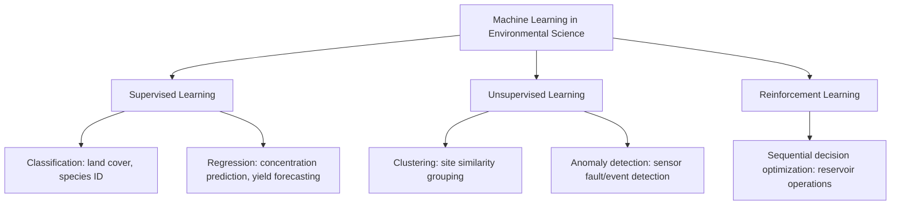

## Artificial Intelligence in Environmental Science

### Definition and Scope

Artificial Intelligence (AI) in environmental science refers to the application of computational methods—particularly machine learning (ML) and deep learning—that enable systems to learn patterns from data and make predictions, classifications, or decisions with reduced reliance on explicitly programmed rules. Within environmental science, AI has become an increasingly significant complement to (and in some cases substitute for) traditional process-based modeling and statistical analysis, driven by the growing availability of large environmental datasets (satellite imagery archives, sensor networks, genomic data) and the increasing computational tractability of complex ML architectures.

AI methods are distinguished from traditional statistical and process-based approaches primarily by their capacity to learn complex, non-linear patterns directly from data with minimal a priori structural assumptions, at the cost of reduced interpretability and, in many cases, weaker theoretical guarantees about behavior outside the range of training data.

### Machine Learning Paradigms Relevant to Environmental Science

**Supervised Learning**

Models are trained on labeled data (input-output pairs) to learn a mapping function, then applied to predict outputs for new, unseen inputs. Dominant paradigm for tasks including land cover classification, species identification from imagery, and pollutant concentration prediction.

**Unsupervised Learning**

Models identify patterns, structure, or groupings within unlabeled data without predefined output categories. Used for tasks such as clustering monitoring sites by similarity, anomaly detection in sensor time-series, and dimensionality reduction of high-dimensional environmental datasets.

**Reinforcement Learning**

An agent learns to take sequential actions within an environment to maximize a cumulative reward signal, through trial-and-error interaction rather than from a fixed labeled dataset. Emerging applications include optimizing water reservoir operation policies and adaptive environmental management strategies, though this remains a less mature application area compared to supervised learning in environmental science. [Inference: reinforcement learning's practical deployment in operational environmental management remains comparatively limited as of the current period, with most published applications still at research/demonstration stage rather than widespread operational use.]

### Core Algorithm Families

**Tree-Based Ensemble Methods**

- **Random Forest**: Constructs many decision trees on bootstrapped data subsets and averages (regression) or votes (classification) across trees, widely favored in environmental applications for its robustness to noisy data, ability to handle mixed data types, and relatively interpretable variable importance metrics.
- **Gradient Boosting Machines** (e.g., XGBoost, LightGBM): Sequentially builds trees that correct errors of previous trees, often achieving higher predictive accuracy than Random Forest on structured/tabular environmental datasets at the cost of greater sensitivity to hyperparameter tuning and higher risk of overfitting without careful regularization.

**Support Vector Machines (SVM)**

Constructs an optimal separating hyperplane (or non-linear boundary via kernel functions) between classes, historically widely used for remote sensing image classification before the rise of deep learning approaches, and still competitive for problems with moderate-sized, well-structured datasets.

**Artificial Neural Networks and Deep Learning**

- **Convolutional Neural Networks (CNNs)**: Specialized for grid-structured data (particularly images), using convolutional filters to detect spatial patterns hierarchically. Dominant approach for remote sensing image classification, object detection (e.g., identifying individual trees, animals, or infrastructure in aerial imagery), and semantic segmentation (pixel-wise classification, e.g., land cover mapping).
- **Recurrent Neural Networks (RNNs) and Long Short-Term Memory (LSTM) networks**: Designed for sequential/time-series data, capturing temporal dependencies. Applied to streamflow forecasting, air quality time-series prediction, and phenological event timing prediction.
- **Transformer architectures**: Originally developed for natural language processing, increasingly adapted for environmental time-series and spatiotemporal forecasting tasks (e.g., some recent weather and climate forecasting systems), leveraging attention mechanisms to capture long-range dependencies more effectively than traditional RNN architectures in some contexts. [Unverified: the relative performance advantage of transformer-based approaches over established numerical weather prediction and other deep learning architectures for specific environmental forecasting tasks is an active area of ongoing research and benchmarking, and conclusions continue to evolve; consult current peer-reviewed literature for the latest comparative performance results.]

**Physics-Informed Machine Learning**

An emerging hybrid approach that incorporates known physical constraints or governing equations directly into the ML model's loss function or architecture, aiming to combine the pattern-recognition strength of ML with the physical consistency and extrapolation reliability of mechanistic models—particularly relevant in environmental domains where purely data-driven models risk producing physically implausible predictions outside the training data range.

### Worked Example: Random Forest Feature Importance in Water Quality Prediction

**Scenario**: An environmental data scientist trains a Random Forest regression model to predict stream nitrate concentration using five candidate predictor variables: upstream agricultural land use percentage, precipitation in the prior 7 days, stream discharge, distance to nearest wastewater outfall, and season (encoded categorically).

After training, the model reports the following (illustrative) permutation-based feature importance scores, representing the increase in prediction error (e.g., mean squared error) when each variable's values are randomly shuffled, breaking its relationship with the target:

| Variable | Importance Score (% increase in MSE) |
| --- | --- |
| Agricultural land use % | 42% |
| Stream discharge | 24% |
| Distance to outfall | 18% |
| Prior 7-day precipitation | 11% |
| Season | 5% |

The dominant importance of agricultural land use percentage (42%) is consistent with established environmental science understanding that agricultural nutrient runoff (particularly fertilizer application) is a major nitrate source in many watersheds, providing a useful sanity check that the model has learned an ecologically plausible relationship rather than an artifact of the training data. [Inference: high feature importance indicates the variable substantially improves the model's predictive accuracy on the specific training data and problem formulation; it does not by itself establish a causal mechanism, and a variable could show high importance due to confounding with an unmeasured true causal driver correlated with it.]

### Applications Across Environmental Domains

**Remote Sensing and Land Cover Classification**

Deep learning (particularly CNN-based semantic segmentation) has substantially improved automated land cover classification accuracy compared to traditional pixel-based classifiers, particularly for complex, heterogeneous landscapes, and enables large-scale automated mapping of deforestation, urban expansion, and crop type identification from satellite imagery archives.

**Species Identification and Biodiversity Monitoring**

Image recognition models increasingly power automated species identification in citizen science platforms (e.g., iNaturalist's AI-assisted suggestion feature) and camera trap image processing, dramatically reducing the manual effort required to process large volumes of biodiversity monitoring imagery. Acoustic monitoring combined with audio classification models similarly enables automated identification of bird, bat, and marine mammal vocalizations from long-duration passive acoustic recordings.

**Weather and Climate Prediction**

Machine learning-based weather forecasting systems have emerged as a complement to traditional numerical weather prediction (NWP), in some published benchmarks achieving comparable or superior short-to-medium range forecast skill at substantially lower computational cost per forecast, though the relative maturity, reliability across extreme event types, and operational readiness compared to established NWP systems continues to be actively evaluated by the meteorological research community. [Unverified: specific comparative performance claims between ML-based and traditional NWP forecasting systems are evolving rapidly as an active research area; consult current peer-reviewed benchmarking studies and operational meteorological agency assessments for the latest evaluation.]

**Water Resource and Hydrological Forecasting**

LSTM and other deep learning architectures have shown strong performance in streamflow forecasting and flood prediction, in some studies outperforming traditional conceptual hydrological models, particularly in data-rich basins, though performance advantages in data-sparse or ungauged basins remain a more actively studied and less settled question.

**Precision Agriculture**

ML models combining remote sensing, soil sensor data, and weather data support optimized irrigation scheduling, fertilizer application timing, and crop yield prediction, contributing to more resource-efficient agricultural production aligned with sustainable consumption and production objectives.

**Pollution Source Identification and Anomaly Detection**

Anomaly detection algorithms applied to continuous sensor network data (air quality, water quality) can identify unusual readings potentially indicative of pollution events, equipment malfunction, or illegal discharge, supporting more rapid response than periodic manual data review.

**Climate Change Impact Projections and Downscaling**

ML-based statistical downscaling methods translate coarse-resolution global climate model outputs into finer-resolution regional or local projections more efficiently than computationally intensive dynamical downscaling, though with their own distinct set of methodological assumptions and limitations regarding how well historical statistical relationships hold under future, potentially non-analog climate conditions.

### Diagram: Machine Learning Model Development Pipeline for Environmental Data (svg_diagram)

<svg xmlns="http://www.w3.org/2000/svg" viewBox="0 0 750 380" font-family="Arial, sans-serif">
<text x="375" y="22" text-anchor="middle" font-size="15" font-weight="bold">ML Model Development Pipeline (svg_diagram)</text>
<rect x="30" y="55" width="140" height="50" rx="6" fill="#e8f4ea" stroke="#2e7d32" stroke-width="2" />
<text x="100" y="75" text-anchor="middle" font-size="9">Raw Environmental</text>
<text x="100" y="88" text-anchor="middle" font-size="9">Data (sensors, imagery)</text>
<line x1="170" y1="80" x2="230" y2="80" stroke="#555" stroke-width="1.5" marker-end="url(#arrow8)" />
<rect x="230" y="55" width="140" height="50" rx="6" fill="#e3f2fd" stroke="#1565c0" stroke-width="2" />
<text x="300" y="75" text-anchor="middle" font-size="9">Preprocessing &amp;</text>
<text x="300" y="88" text-anchor="middle" font-size="9">Feature Engineering</text>
<line x1="370" y1="80" x2="430" y2="80" stroke="#555" stroke-width="1.5" marker-end="url(#arrow8)" />
<rect x="430" y="55" width="140" height="50" rx="6" fill="#fff3e0" stroke="#e65100" stroke-width="2" />
<text x="500" y="75" text-anchor="middle" font-size="9">Train/Validation/</text>
<text x="500" y="88" text-anchor="middle" font-size="9">Test Split</text>
<line x1="500" y1="105" x2="500" y2="145" stroke="#555" stroke-width="1.5" marker-end="url(#arrow8)" />
<rect x="430" y="145" width="140" height="50" rx="6" fill="#f3e5f5" stroke="#6a1b9a" stroke-width="2" />
<text x="500" y="165" text-anchor="middle" font-size="9">Model Training &amp;</text>
<text x="500" y="178" text-anchor="middle" font-size="9">Hyperparameter Tuning</text>
<line x1="430" y1="170" x2="370" y2="170" stroke="#555" stroke-width="1.5" marker-end="url(#arrow8)" />
<rect x="230" y="145" width="140" height="50" rx="6" fill="#fce4ec" stroke="#ad1457" stroke-width="2" />
<text x="300" y="165" text-anchor="middle" font-size="9">Cross-Validation &amp;</text>
<text x="300" y="178" text-anchor="middle" font-size="9">Performance Metrics</text>
<line x1="300" y1="195" x2="300" y2="235" stroke="#555" stroke-width="1.5" marker-end="url(#arrow8)" />
<rect x="230" y="235" width="140" height="50" rx="6" fill="#d7ccc8" stroke="#4e342e" stroke-width="2" />
<text x="300" y="255" text-anchor="middle" font-size="9">Independent Test Set</text>
<text x="300" y="268" text-anchor="middle" font-size="9">Evaluation</text>
<line x1="370" y1="260" x2="430" y2="260" stroke="#555" stroke-width="1.5" marker-end="url(#arrow8)" />
<rect x="430" y="235" width="140" height="50" rx="6" fill="#c8e6c9" stroke="#2e7d32" stroke-width="2" />
<text x="500" y="255" text-anchor="middle" font-size="9" font-weight="bold">Deployment /</text>
<text x="500" y="268" text-anchor="middle" font-size="9" font-weight="bold">Operational Use</text>
<line x1="300" y1="285" x2="180" y2="330" stroke="#999" stroke-width="1.5" stroke-dasharray="4,3" />
<text x="150" y="345" font-size="9" fill="#666">Iterate on features/</text>
<text x="150" y="357" font-size="9" fill="#666">architecture if underperforming</text>
</svg>

### Model Evaluation and Cross-Validation

Rigorous evaluation of ML models in environmental applications requires attention to data structure that can violate standard cross-validation assumptions:

**Standard k-fold cross-validation**: Randomly partitions data into $k$ subsets, training on $k-1$ folds and validating on the held-out fold, repeated $k$ times; appropriate when observations are independent.

**Spatial cross-validation**: When environmental data exhibit spatial autocorrelation (nearby locations tend to be more similar), standard random k-fold splitting can produce overly optimistic performance estimates because training and test sets may contain spatially adjacent (and therefore non-independent) samples. Spatial block cross-validation partitions data into geographically distinct blocks, ensuring test data are spatially separated from training data, providing a more realistic estimate of model performance when predicting to genuinely new locations.

**Temporal cross-validation**: For time-series environmental data, training on past data and validating on subsequent future data (rather than randomly shuffled splits) better reflects the realistic forecasting use case and avoids "look-ahead" information leakage from future data into model training.

[Inference]: Failure to account for spatial or temporal autocorrelation structure during model evaluation is a commonly cited methodological concern in the environmental ML literature, and can lead to substantially overoptimistic reported accuracy compared to genuine predictive performance on new locations or future time periods; the magnitude of this overoptimism is problem- and dataset-specific.

### Interpretability and Explainable AI (XAI)

Given the "black box" nature of many complex ML models (particularly deep neural networks), interpretability methods have become an important complementary tool in environmental applications, both for scientific understanding and for building stakeholder/regulatory trust in model-based decisions:

- **Feature importance methods**: Permutation importance, Gini importance (for tree-based models), quantifying each input variable's overall contribution to model predictions.
- **SHAP (SHapley Additive exPlanations) values**: A game-theoretic approach providing consistent, locally accurate attribution of each feature's contribution to individual predictions, increasingly widely adopted across environmental ML applications for both global and instance-level interpretability.
- **Partial dependence plots**: Visualize the marginal relationship between a given input variable and the model's predicted output, holding other variables at representative values.
- **Saliency maps and Grad-CAM**: For CNN-based image classification models, visualize which regions of an input image most strongly influenced the model's classification decision, useful for verifying that a remote sensing classification model is attending to ecologically meaningful image regions rather than spurious artifacts.

### Data and Computational Infrastructure Considerations

**Training data requirements**: Deep learning approaches in particular typically require substantially larger labeled training datasets than traditional statistical or simpler ML approaches to achieve robust performance, which can be a practical constraint in environmental applications where labeled data (e.g., expert-verified species identifications, ground-truthed land cover) are expensive and time-consuming to generate.

**Transfer learning**: Leveraging models pre-trained on large, general-purpose datasets (e.g., ImageNet for image classification) and fine-tuning them on smaller, domain-specific environmental datasets, substantially reducing the labeled data volume required to achieve good performance on a specific environmental task compared to training a model entirely from scratch.

**Cloud computing and large-scale geospatial platforms**: Platforms combining cloud-based satellite imagery archives with integrated ML frameworks (e.g., Google Earth Engine's integration with TensorFlow) have substantially lowered the computational and data-access barriers to applying ML at continental or global scale, though effective use still requires domain expertise to appropriately frame the problem, select suitable training data, and critically evaluate outputs.

### Limitations and Common Pitfalls

- **Data leakage and overoptimistic validation**: As discussed above, failing to account for spatial/temporal autocorrelation or accidentally including information from the test set during training/feature engineering can produce misleadingly high reported accuracy.
- **Extrapolation risk**: Purely data-driven ML models generally provide limited theoretical guarantees about reliability when applied to conditions substantially outside the range represented in training data (e.g., applying a model trained under historical climate conditions to project outcomes under a substantially different future climate regime)—a key motivation for physics-informed ML approaches that constrain predictions to remain physically plausible.
- **Training data bias**: If training data reflect systematic sampling bias (e.g., citizen science image datasets overrepresenting easily photographed, common, or charismatic species), resulting models will tend to replicate and potentially amplify these biases in their predictions.
- **Reduced interpretability limiting regulatory or scientific acceptance**: Particularly in high-stakes decision contexts (e.g., regulatory compliance determinations, public health advisories), the reduced interpretability of complex models compared to transparent process-based or simple statistical models can be a barrier to acceptance, motivating continued interest in explainable AI methods and hybrid physics-informed approaches.
- **Computational and environmental footprint of AI itself**: Training large deep learning models, particularly large-scale architectures, carries a non-trivial energy consumption and associated carbon footprint, an emerging consideration increasingly discussed in the context of applying AI tools specifically to environmental sustainability problems. [Unverified: quantitative comparisons of AI training energy footprint relative to alternative modeling or monitoring approaches are highly dependent on model scale, hardware, and energy source, and are the subject of ongoing research; specific figures should be verified against current life-cycle assessment literature for the particular model and computing infrastructure in question.]

### Related Topics

- Remote Sensing Fundamentals and CNN-Based Image Classification
- Physics-Informed Machine Learning and Hybrid Modeling Approaches
- Spatial and Temporal Cross-Validation Methodologies
- Explainable AI (XAI) and SHAP Value Interpretation
- Citizen Science Platforms and AI-Assisted Species Identification
- Machine Learning for Streamflow and Flood Forecasting
- Precision Agriculture and Remote Sensing-Based Crop Monitoring
- Climate Model Downscaling: Dynamical vs. Statistical/ML Approaches
- Environmental Statistics: Handling Autocorrelated Data
- Computational Sustainability and the Carbon Footprint of AI Systems