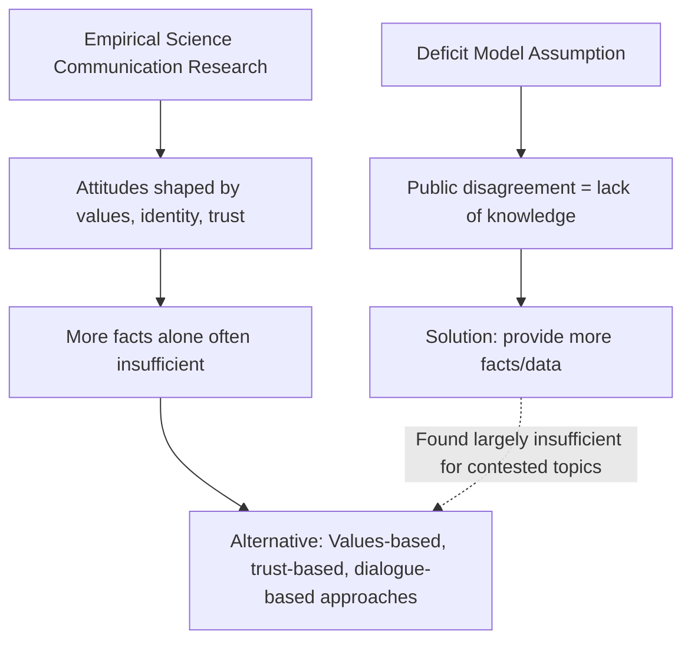
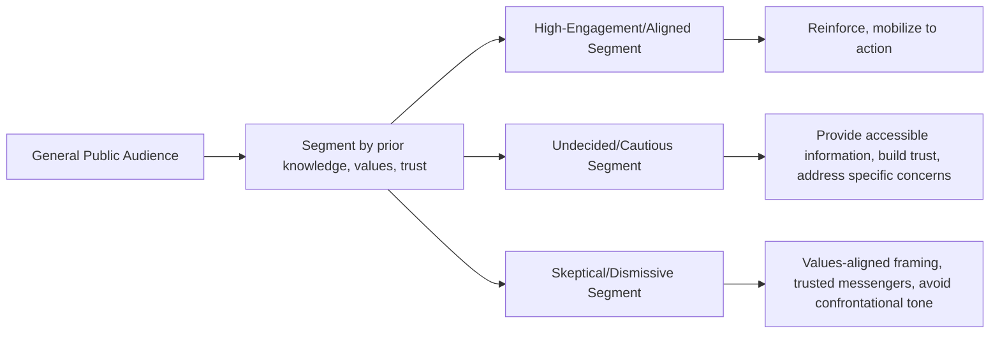

## Principles of Science Communication

### Definition and Scope

Science communication is the practice of conveying scientific information, findings, and processes to audiences beyond the original research context—including the general public, policymakers, journalists, and practitioners in other fields—with the goal of fostering understanding, informed decision-making, and productive public discourse around scientific issues. In environmental science specifically, effective communication is a critical bridge between technical research (climate data, ecological assessments, pollution monitoring) and the public and policy action needed to address environmental challenges, given that many environmental issues involve complex, uncertain, and long-timescale phenomena that are inherently difficult to convey through everyday intuition.

Science communication draws on communication theory, cognitive psychology, sociology of science, and increasingly empirical research on what communication approaches are (and are not) effective for specific goals and audiences.

### The Deficit Model and Its Limitations

The **"deficit model"** (also called the "knowledge deficit model") was an early, influential framework in science communication premised on the assumption that public skepticism or disagreement with scientific consensus stems primarily from a lack of scientific knowledge, and that simply providing more accurate information would resolve such gaps and shift public opinion toward alignment with scientific consensus.

Decades of empirical science communication research have substantially challenged this model, finding that:

- Increased scientific literacy does not reliably predict increased concern or acceptance of positions well-supported by scientific consensus, particularly for politically or culturally contested topics such as climate change.
- Attitudes toward contested scientific issues are more strongly predicted by cultural values, political ideology, social identity, and trust in messengers than by raw factual knowledge alone.
- In some documented cases, providing additional factual information to audiences already skeptical of a scientific claim can trigger **motivated reasoning** or even a "backfire effect" (though the robustness and generality of backfire effects specifically has been debated and qualified in more recent replication research), where recipients scrutinize and reject information that conflicts with pre-existing identity-linked beliefs more strongly than they would neutral information.

[Inference]: While the deficit model has been substantially critiqued as a *sufficient* explanatory framework for public attitudes on contested scientific topics, this does not imply that accurate factual information is unimportant in science communication generally—rather, the research suggests factual accuracy is necessary but often insufficient on its own, particularly for topics that have become politically or culturally polarized.

### Alternative and Complementary Communication Frameworks

**Cultural Cognition and Values-Based Communication**

Recognizes that individuals interpret scientific information through the lens of their existing cultural worldview and social identity group affiliations. Effective communication in this framework involves framing information in ways that are compatible with (rather than threatening to) an audience's existing values, and/or using messengers who share credibility and social identity with the target audience.

**Two-Way (Dialogue) Communication Models**

Position science communication as a bidirectional exchange rather than one-directional transmission from expert to public, incorporating public input, concerns, and local/experiential knowledge into the communication process—and in participatory models, into the research or decision-making process itself. This aligns conceptually with participatory approaches such as co-created citizen science projects.

**Trust and Source Credibility**

Empirical research consistently identifies perceived trustworthiness of the information source as a strong predictor of message acceptance, often more influential than the technical content of the message itself. Key dimensions of perceived trustworthiness typically include perceived expertise, perceived integrity/honesty, and perceived benevolence (that the source has the audience's genuine interests in mind rather than an undisclosed agenda).

**Narrative and Storytelling Approaches**

Framing scientific information within a narrative structure (with characters, stakes, and a discernible arc) has been found in various studies to improve engagement, comprehension, and retention compared to purely statistical or technical presentation, particularly for lay audiences, though narrative framing also carries risks of oversimplification or unintentional bias if not carefully constructed to remain factually accurate.

### Framing Effects

**Framing** refers to how the presentation of otherwise equivalent information can shift audience interpretation and response, a well-established phenomenon in communication and behavioral science research.

**Gain-frame vs. loss-frame messaging**: Presenting the same underlying information in terms of potential gains ("this policy will save X lives/dollars/species") versus potential losses ("failing to act will cost X lives/dollars/species") can produce different audience responses depending on context, topic, and audience risk perception, though the direction and magnitude of this effect is not universal across all contexts and has been found to vary by specific behavior and audience segment. [Inference: general findings on gain/loss framing from behavioral economics and communication research provide useful heuristics, but effect sizes and even direction can be topic- and audience-specific; message framing choices are ideally validated through audience testing for the specific context rather than assumed from general principles alone.]

**Issue framing**: How an environmental issue is characterized (e.g., climate change framed primarily as an economic opportunity/threat, a public health issue, a moral/religious issue, a national security issue, or a scientific/technical issue) can activate different values and concerns among different audience segments, with research suggesting that audiences who are less responsive to one frame (e.g., purely scientific/environmental framing) may respond more strongly to an alternative frame emphasizing values more central to their existing worldview (e.g., public health or economic framing).

### Communicating Scientific Uncertainty

A persistent challenge in environmental science communication is conveying genuine scientific uncertainty (which is a normal, expected feature of the scientific process) without either overstating confidence (misleading the audience about how settled a finding is) or understating confidence in ways that inappropriately suggest the underlying science itself is unreliable or contested when it is not.

**Best practices commonly identified in science communication research include**:

- Distinguishing between uncertainty in the *existence* of a well-established phenomenon (e.g., that anthropogenic climate change is occurring) versus uncertainty in *specific quantitative projections* (e.g., the precise magnitude of sea-level rise by a specific future date)—conflating these two very different types of uncertainty can create a false impression that foundational scientific conclusions are as uncertain as detailed projections.
- Using structured uncertainty language (e.g., the IPCC's calibrated likelihood language, such as "virtually certain," "very likely," "likely," associated with defined probability ranges) rather than vague or ambiguous qualifiers, when communicating to audiences who can be trained in or provided with the relevant calibration key.
- Visualizing uncertainty explicitly (e.g., confidence intervals, ensemble spread, probability distributions) rather than presenting single point estimates without any indication of the associated uncertainty range.
- Explaining *why* uncertainty exists (e.g., natural variability, measurement limitations, inherent complexity of the system, or genuine differences in underlying models) rather than leaving its source unexplained, which can otherwise be misinterpreted as reflecting fundamental disagreement about the underlying science.

### Worked Example: Reframing a Technical Finding for a General Audience

**Technical/original finding** (as might appear in a peer-reviewed journal abstract): "Analysis of the 1991–2020 regional precipitation record indicates a statistically significant ($p < 0.01$) increasing trend in the frequency of daily precipitation events exceeding the 95th percentile threshold, consistent with projected intensification of the hydrological cycle under anthropogenic climate forcing."

**Communication challenge**: This sentence, while technically accurate, relies on statistical terminology (percentile thresholds, p-values, "hydrological cycle intensification") that is unlikely to be readily interpretable by a general public audience, and does not connect the finding to a concrete, tangible experience.

**Reframed for general public audience**: "Over the past three decades, our region has seen a clear increase in the number of days with unusually heavy rainfall — the kind of downpours that can overwhelm storm drains and cause flash flooding. This matches what climate scientists have long predicted: as the atmosphere warms, it holds more moisture, which tends to produce more intense rain events when storms do occur."

This reframing preserves the core, scientifically accurate finding (an increasing trend in heavy precipitation events, linked to a well-understood physical mechanism) while replacing statistical jargon with concrete, experientially relatable language (storm drains, flash flooding) and briefly explaining the underlying physical mechanism (warmer atmosphere holds more moisture) in accessible terms rather than stating the conclusion without explanation. [Inference: the specific relatable examples and framing choices in any reframing should be tailored to the specific target audience's context and concerns; the example given illustrates a general reframing principle rather than a universally optimal specific phrasing.]

### Audience Segmentation

Effective science communication research emphasizes that "the public" is not a monolithic audience; different segments hold different levels of prior knowledge, values, concerns, and trust in various information sources. A widely cited (though not the only) example of a formal audience segmentation framework in climate communication research is the **"Global Warming's Six Americas"** framework (developed by researchers at Yale and George Mason Universities), which segments audiences into groups ranging from "Alarmed" to "Dismissive" based on their climate change beliefs, concern levels, and behavioral engagement, with different communication strategies recommended for engaging each segment effectively. [Unverified: the specific segment names, proportions, and characteristics of this or similar segmentation frameworks are based on survey research conducted at specific points in time and are subject to revision in subsequent survey waves; consult the framework's current published research for up-to-date segment definitions and population proportions.]

### Visual Communication of Environmental Data

Given that much environmental science data is inherently spatial, temporal, or probabilistic, visual communication design principles are particularly important:

- **Choosing appropriate chart types**: Time-series line charts for trends, choropleth maps for spatial patterns, appropriately scaled bar charts for categorical comparisons—selecting a chart type poorly matched to the underlying data structure can mislead or confuse audiences regardless of the accuracy of the underlying data.
- **Avoiding manipulative or misleading visual conventions**: Truncated y-axes (which can exaggerate the visual magnitude of a trend), inconsistent color scales across comparative maps, or "dual-axis" charts implying spurious correlation between unrelated variables are commonly cited as visual practices that can mislead audiences even when the underlying data are accurate.
- **Color palette selection**: Using perceptually appropriate, colorblind-accessible color palettes (e.g., avoiding red-green color schemes without additional differentiation) and using intuitive color associations (e.g., blue for cooler/lower values, red for warmer/higher values in temperature-related visualizations) where such conventions align with audience expectations.
- **Progressive disclosure and layering**: Presenting a clear, simple headline visual or takeaway first, with more detailed or technical information available for audiences who wish to explore further, rather than presenting maximum technical complexity to all audience members regardless of their interest or expertise level.

### Communicating with Policymakers

Science communication directed at policymakers differs in important respects from general public communication:

- **Policy-relevant framing**: Emphasizing implications for specific policy decisions, timelines, and trade-offs relevant to the policymaker's decision context, rather than presenting scientific findings in isolation from their decision-relevance.
- **Concise, actionable synthesis**: Policymakers typically operate under significant time constraints and competing demands on their attention; effective science-policy communication often takes the form of concise briefs or executive summaries highlighting key findings, confidence levels, and policy-relevant implications, with full technical detail available as supporting reference material rather than as the primary communication vehicle.
- **Boundary organizations and science-policy intermediaries**: Institutions and individuals (e.g., scientific advisory bodies, science-policy fellows, agency technical staff) that specialize in translating between the scientific and policy communities play a significant, well-documented role in science-policy communication, given the differing incentive structures, timescales, and communication norms of the two communities.
- **Maintaining a defensible boundary between scientific findings and policy recommendations**: Science communicators addressing policymakers generally aim to clearly distinguish empirical scientific findings (which fall within scientific expertise) from value-laden policy recommendations (which involve additional value judgments beyond the scientific evidence itself), though the appropriate degree of scientist engagement in explicit policy advocacy remains a genuinely debated question within the science communication field itself, with a range of defensible views on the "advocacy" question found in the literature.

### Common Communication Pitfalls in Environmental Science

- **Excessive jargon and technical terminology**: Using discipline-specific terminology (e.g., "anthropogenic," "eutrophication," "biogeochemical cycling") without definition or context, creating a barrier to comprehension for non-specialist audiences.
- **Overloading with data without synthesis**: Presenting extensive raw data or numerous statistics without providing a clear, synthesized takeaway message can leave audiences unable to identify the key point being communicated.
- **Failure to address audience's actual questions/concerns**: Communicating what the scientist considers most scientifically interesting rather than addressing what the specific audience actually wants or needs to know can reduce communication effectiveness even when the content itself is accurate.
- **Presenting false balance on settled scientific questions**: Giving equal rhetorical weight to a strong scientific consensus position and a fringe minority position (a practice sometimes termed "false balance" or "false equivalence" in science journalism) can create a misleading impression of greater scientific uncertainty or controversy than genuinely exists.
- **Overstating certainty to appear authoritative**: Conversely, presenting findings with more confidence or certainty than the underlying evidence supports (sometimes done to appear more authoritative or actionable) risks credibility damage if subsequent findings require revision, and undermines appropriate public understanding of how scientific knowledge develops and is refined over time.
- **Neglecting emotional and psychological dimensions**: Purely rational/factual communication approaches that ignore the emotional dimensions of how audiences process threatening or anxiety-inducing information (e.g., climate change, biodiversity loss) may be less effective than approaches that also address emotional responses such as fear, hope, or a sense of efficacy/agency, though care must be taken to avoid inducing counterproductive fatalism or "doom" fatigue through excessive threat-focused messaging without accompanying efficacy information (guidance on constructive hope and self-efficacy messaging, distinct from unsubstantiated reassurance, is an active area of ongoing communication research).

### Related Topics

- Environmental Journalism and Media Coverage of Climate Change
- Risk Perception and Risk Communication Theory
- The "Global Warming's Six Americas" Audience Segmentation Framework
- Data Visualization Principles and Best Practices
- Science-Policy Interface and Boundary Organizations
- Public Engagement and Deliberative Democracy in Environmental Decision-Making
- Environmental Education Curriculum Design
- Motivated Reasoning and Cultural Cognition in Science Perception
- Crisis and Emergency Risk Communication (CERC) Frameworks
- Social Media and Digital Platforms in Environmental Science Communication