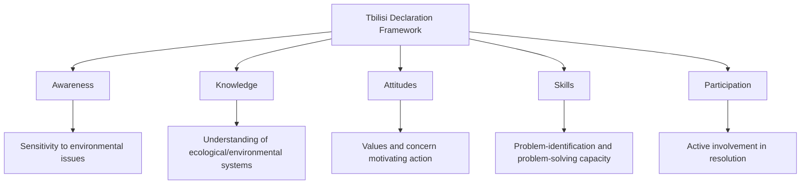

## Environmental Education Pedagogy

### Definition and Scope

Environmental Education (EE) pedagogy is the body of theory and practice concerned with how people learn about environmental systems, issues, and stewardship, and how educators design learning experiences to build environmental literacy, critical thinking, and civic action capacity. Unlike general science education, EE pedagogy places particular emphasis on connecting cognitive learning with affective (emotional/values-based) engagement and behavioral outcomes, reflecting the field's foundational goal of not merely transmitting ecological knowledge but cultivating informed, engaged environmental citizenship.

The most widely cited formal definition originates from the 1977 UNESCO Tbilisi Declaration, which established environmental education's goals as fostering awareness, knowledge, attitudes, skills, and participation regarding the environment and its associated problems—a five-part framework that continues to underpin most contemporary EE curriculum design.

### The Tbilisi Framework: Five Goal Categories

1. **Awareness**: Helping learners gain sensitivity to the total environment and its associated problems.
2. **Knowledge**: Helping learners acquire understanding of the environment and associated problems.
3. **Attitudes**: Helping learners acquire values and feelings of concern for the environment, motivating active participation in its protection.
4. **Skills**: Helping learners acquire skills for identifying and solving environmental problems.
5. **Participation**: Providing learners with opportunities to be actively involved in resolving environmental problems.

A persistent critique within EE pedagogy research is that formal curricula have historically emphasized the Awareness and Knowledge categories most heavily, with comparatively less structured attention to Skills and Participation—a gap linked to the well-documented "knowledge-action gap" in environmental behavior research, wherein increased environmental knowledge does not reliably predict pro-environmental behavior change. [Inference: the degree and persistence of this emphasis imbalance varies across specific curricula, institutions, and national education systems, and has been an active target of curriculum reform efforts; it should not be assumed to characterize all EE programs uniformly.]

### Theoretical Foundations

**Constructivist Learning Theory**

Positions learners as active constructors of knowledge, building new understanding by connecting new information to existing mental frameworks and prior experience, rather than passively receiving transmitted facts. In EE contexts, this favors hands-on, experiential, and inquiry-based approaches over purely lecture-based instruction, since environmental concepts (ecosystem interdependence, cycles, systems thinking) are often more effectively internalized through direct observation and experimentation than abstract description alone.

**Experiential Learning Theory (Kolb's Cycle)**

David Kolb's experiential learning cycle—comprising concrete experience, reflective observation, abstract conceptualization, and active experimentation—provides a widely used structural framework for designing EE learning sequences, particularly for field-based and outdoor education programs, ensuring that direct environmental experiences are paired with structured reflection and conceptual synthesis rather than left unprocessed.

**Place-Based Education**

Emphasizes using the local community, landscape, and environmental context as the primary curriculum content and learning laboratory, grounding abstract environmental concepts in learners' immediate, tangible surroundings. Place-based approaches are associated in the EE literature with increased learner engagement and more durable retention, attributed in part to the personal relevance and emotional connection fostered by studying one's own local environment rather than only distant or abstract environmental phenomena.

**Systems Thinking Pedagogy**

Given that environmental phenomena are inherently characterized by interconnected feedback loops, non-linear relationships, and emergent behavior (e.g., climate systems, food webs, biogeochemical cycles), EE pedagogy increasingly incorporates explicit systems thinking instruction—teaching learners to identify system components, relationships, feedback loops, and leverage points—as a distinct cognitive skill set rather than assuming it develops incidentally from content-focused instruction alone.

**Social-Ecological Resilience and Transformative Learning**

More recent theoretical developments in EE pedagogy (particularly Education for Sustainable Development, ESD, discussed further below) draw on transformative learning theory, emphasizing pedagogical approaches that challenge learners' existing assumptions and worldviews regarding human-environment relationships, rather than solely adding new factual content to an unchanged conceptual framework.

### Pedagogical Approaches and Methods

**Inquiry-Based and Problem-Based Learning**

Learners investigate open-ended, authentic environmental questions or problems (e.g., "why is water quality declining in our local creek?") through structured investigation, hypothesis generation, and evidence-based reasoning, developing scientific process skills alongside content knowledge. Problem-based learning typically centers on a specific, often locally relevant environmental problem requiring learners to research, analyze, and propose solutions.

**Outdoor and Field-Based Education**

Direct engagement with natural environments through field trips, outdoor classrooms, school gardens, and extended outdoor programs (e.g., residential environmental education centers), leveraging direct sensory experience and place-based connection that classroom-only instruction cannot replicate.

**Service-Learning**

Combines structured academic learning with meaningful community service addressing a genuine environmental need (e.g., stream restoration projects, invasive species removal, community garden development), explicitly linking the Tbilisi framework's Knowledge and Skills goals with the Participation goal through action embedded within the learning experience itself.

**Citizen Science Integration**

Incorporating authentic data collection contributing to real scientific research (as covered in citizen science monitoring networks) provides learners with genuine participation in the scientific process, addressing motivation challenges associated with purely simulated or textbook-based "sample" data.

**Role-Play and Simulation**

Structured simulations of environmental decision-making processes (e.g., mock public hearings on a proposed development, stakeholder negotiation simulations over resource allocation) help learners understand the complexity of real-world environmental decision-making, including competing values and interests, beyond what purely factual content delivery can convey.

**Digital and Virtual Learning Tools**

Interactive simulations, virtual field trips, GIS-based mapping exercises, and environmental modeling software increasingly supplement or extend direct field experience, particularly valuable for illustrating processes occurring at timescales or spatial scales not directly observable (e.g., long-term climate trends, global biogeochemical cycles) or for learners with limited access to natural outdoor spaces.

### Education for Sustainable Development (ESD)

**Education for Sustainable Development** represents an evolution and broadening of traditional environmental education, explicitly integrating environmental, social, and economic dimensions of sustainability (reflecting the three-pillar sustainability framework) rather than focusing primarily on ecological/environmental content in isolation. ESD is formally recognized within the UN Sustainable Development Goals framework, specifically under **SDG Target 4.7**, which calls for ensuring learners acquire the knowledge and skills needed to promote sustainable development, including through education for sustainable development and sustainable lifestyles.

ESD pedagogy places particular emphasis on:

- Interdisciplinary integration across environmental, social, and economic content areas rather than siloed environmental-only instruction.
- Future-oriented and anticipatory thinking, helping learners consider long-term consequences and intergenerational equity.
- Critical thinking about competing values and trade-offs inherent in sustainability decisions, rather than presenting sustainability solutions as straightforward or value-neutral.
- Action competence: building learners' confidence and capacity to take meaningful action, addressing the self-efficacy dimension increasingly recognized as necessary (alongside knowledge and attitudes) for translating environmental concern into sustained behavior change.

### Developmental and Age-Appropriate Considerations

EE pedagogy research emphasizes that cognitive and emotional developmental stage substantially affects appropriate content and pedagogical approach:

| Developmental Stage | Pedagogical Emphasis | Illustrative Approach |
| --- | --- | --- |
| Early childhood | Direct sensory experience, wonder, connection to nature | Nature play, simple observation, storytelling |
| Middle childhood | Concrete investigation, local ecosystems, simple cause-effect | School gardens, local field studies, basic data collection |
| Adolescence | Abstract systems thinking, complex causality, identity and values exploration | Systems modeling, debate/deliberation, service-learning, civic engagement projects |
| Adult/lifelong learning | Professional and civic application, policy engagement, community leadership | Professional development, community organizing, participatory action research |

[Inference: these developmental stage associations reflect general patterns identified in developmental psychology and EE pedagogy research; individual learner readiness and appropriate pedagogical pacing vary considerably, and stage boundaries should be treated as general guidance rather than rigid, universally applicable age cutoffs.]

A particular concern raised in EE pedagogy literature regarding young learners is the risk of introducing developmentally inappropriate levels of anxiety or fear regarding large-scale environmental threats (e.g., detailed climate catastrophe scenarios) before children have developed the cognitive and emotional capacity to process such information constructively or the sense of agency to respond to it, potentially producing disengagement, helplessness, or eco-anxiety rather than the intended motivation and empowerment. Age-appropriate sequencing—building foundational connection to and understanding of nature before introducing complex, large-scale environmental threats—is a commonly recommended pedagogical practice to mitigate this risk. This is a factual, professional/pedagogical consideration regarding curriculum design and is distinct from addressing any individual's personal emotional experience.

### Diagram: Kolb's Experiential Learning Cycle Applied to Environmental Education (svg_diagram)

<svg xmlns="http://www.w3.org/2000/svg" viewBox="0 0 500 500" font-family="Arial, sans-serif">
<text x="250" y="22" text-anchor="middle" font-size="15" font-weight="bold">Kolb's Experiential Learning Cycle (svg_diagram)</text>
<circle cx="250" cy="260" r="150" fill="none" stroke="#999" stroke-width="1" stroke-dasharray="3,3" />
<circle cx="250" cy="110" r="55" fill="#e8f4ea" stroke="#2e7d32" stroke-width="2" />
<text x="250" y="105" text-anchor="middle" font-size="10" font-weight="bold">Concrete</text>
<text x="250" y="118" text-anchor="middle" font-size="10" font-weight="bold">Experience</text>
<text x="250" y="133" text-anchor="middle" font-size="8">e.g., stream field study</text>
<circle cx="400" cy="260" r="55" fill="#e3f2fd" stroke="#1565c0" stroke-width="2" />
<text x="400" y="255" text-anchor="middle" font-size="10" font-weight="bold">Reflective</text>
<text x="400" y="268" text-anchor="middle" font-size="10" font-weight="bold">Observation</text>
<text x="400" y="283" text-anchor="middle" font-size="8">journaling, discussion</text>
<circle cx="250" cy="410" r="55" fill="#fff3e0" stroke="#e65100" stroke-width="2" />
<text x="250" y="405" text-anchor="middle" font-size="10" font-weight="bold">Abstract</text>
<text x="250" y="418" text-anchor="middle" font-size="10" font-weight="bold">Conceptualization</text>
<text x="250" y="433" text-anchor="middle" font-size="8">linking to ecological concepts</text>
<circle cx="100" cy="260" r="55" fill="#f3e5f5" stroke="#6a1b9a" stroke-width="2" />
<text x="100" y="255" text-anchor="middle" font-size="10" font-weight="bold">Active</text>
<text x="100" y="268" text-anchor="middle" font-size="10" font-weight="bold">Experimentation</text>
<text x="100" y="283" text-anchor="middle" font-size="8">design a restoration action</text>
<path d="M 295 130 Q 360 170, 385 215" stroke="#555" stroke-width="2" fill="none" marker-end="url(#arrow9)" />
<path d="M 385 305 Q 340 370, 295 390" stroke="#555" stroke-width="2" fill="none" marker-end="url(#arrow9)" />
<path d="M 205 390 Q 150 350, 125 305" stroke="#555" stroke-width="2" fill="none" marker-end="url(#arrow9)" />
<path d="M 125 215 Q 160 160, 205 130" stroke="#555" stroke-width="2" fill="none" marker-end="url(#arrow9)" />
</svg>

### Assessment in Environmental Education

Assessing EE outcomes presents distinct challenges compared to conventional content-knowledge assessment, given the field's multi-dimensional goals spanning cognitive, affective, skill-based, and behavioral domains:

- **Knowledge assessment**: Conventional testing approaches (multiple choice, short answer) can assess factual and conceptual understanding but are poorly suited to capturing systems thinking, attitudes, or behavioral change.
- **Environmental literacy scales and validated survey instruments**: Standardized instruments (developed and validated through educational research) exist to assess components such as ecological knowledge, environmental attitudes, and self-reported pro-environmental behavior, allowing more systematic pre/post program evaluation than ad hoc assessment.
- **Authentic and performance-based assessment**: Evaluating learner-produced outputs from inquiry or service-learning projects (research reports, restoration project outcomes, presentations to community stakeholders) as a more holistic measure of applied skill and knowledge integration than isolated testing.
- **Longitudinal behavioral tracking**: The most rigorous (and most resource-intensive) assessment approach, tracking actual behavioral outcomes over time following an EE intervention, though such long-term follow-up studies are comparatively less common in the EE evaluation literature than immediate post-program assessment, given the practical and methodological challenges of long-term participant tracking. [Unverified: the specific prevalence and methodological rigor of longitudinal EE evaluation studies varies by program type and research context; consult current EE program evaluation literature for the state of evidence on long-term behavioral outcomes for any specific program type.]

### Educator Training and Professional Development

Effective delivery of EE pedagogy requires specific educator competencies beyond general subject-matter and pedagogical training, including comfort and skill with outdoor/field-based instruction (including basic risk management for outdoor settings), facilitation skills for open-ended inquiry and values-based discussion (as distinct from purely fact-transmission instruction), and interdisciplinary content knowledge spanning natural and social science domains given ESD's integrative scope. Formal EE educator certification programs and professional EE organizations (operating at national and international levels) provide structured professional development pathways addressing these distinct competency requirements.

### Common Pedagogical Pitfalls

- **Overemphasis on doom-focused messaging without corresponding agency-building**: Curricula that extensively detail environmental problems without proportionate attention to solutions, individual/collective efficacy, and actionable next steps risk producing disengagement or a sense of helplessness rather than the motivation the content is intended to inspire.
- **Treating environmental education as purely a science education subset**: Given ESD's integrative scope and the Tbilisi framework's explicit attitudes/participation goals, reducing EE to conventional science content delivery (facts about ecosystems, biogeochemical cycles) without corresponding attention to values, skills, and civic participation dimensions falls short of the field's own established goals.
- **Insufficient connection to learners' lived experience and local context**: Abstract, globally-framed environmental content that does not connect to learners' immediate community and environment can reduce perceived relevance and engagement compared to place-based approaches.
- **Assuming knowledge transfer alone produces behavior change**: As discussed above, the well-documented knowledge-action gap in environmental behavior research indicates that factual knowledge, while necessary, is generally insufficient by itself to reliably produce sustained pro-environmental behavior change without also addressing attitudes, skills, self-efficacy, and structural/contextual barriers to action.
- **Neglecting assessment beyond content knowledge**: Focusing evaluation exclusively on factual recall, given the field's own multi-dimensional goal framework, can misrepresent program effectiveness and fail to identify gaps in the attitude, skill, or participation dimensions.

### Related Topics

- Education for Sustainable Development (ESD) and SDG Target 4.7
- Citizen Science Integration into K-12 and Higher Education Curricula
- Place-Based Education Theory and Local Curriculum Design
- Environmental Literacy Assessment Instruments and Program Evaluation
- Systems Thinking Instruction for Complex Environmental Concepts
- The Knowledge-Action Gap in Environmental Behavior Research
- Outdoor and Experiential Education Program Design
- Eco-Anxiety and Developmentally Appropriate Climate Education
- Service-Learning and Community-Engaged Environmental Projects
- Principles of Science Communication (audience and framing considerations)