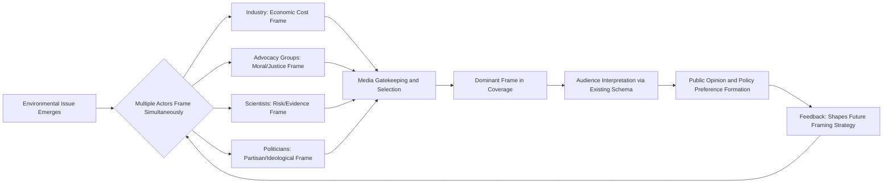

## Media Framing and Public Perception

### Conceptual Foundations

#### Defining Framing

Framing refers to the process by which communicators — journalists, advocacy organizations, policymakers, and institutions — select certain aspects of a perceived reality and make them more salient in a communicating text, thereby promoting a particular problem definition, causal interpretation, moral evaluation, or treatment recommendation. This definition, drawn from Robert Entman's foundational work in framing theory, treats frames as tools that organize complexity into digestible narratives by emphasizing some elements and omitting others.

In environmental communication specifically, framing determines whether an issue like climate change is presented as a scientific consensus, an economic opportunity, a moral obligation, a national security threat, or a politically contested debate. The same underlying facts can be framed in fundamentally different ways, producing divergent public responses.

#### Frame Types Relevant to Environmental Issues

- **Episodic frames**: Present issues through specific, concrete events or individual cases (e.g., a single wildfire, one community's flooding). These tend to reduce perceived societal responsibility because the issue appears isolated.
- **Thematic frames**: Present issues within broader context, trends, or systemic patterns (e.g., long-term temperature records, regional drought cycles). These tend to increase perceived societal or governmental responsibility.
- **Conflict frames**: Emphasize disagreement between parties, scientists, or political factions, often creating a false impression of unsettled science even when expert consensus exists.
- **Economic frames**: Cast environmental issues in terms of costs, jobs, market opportunities, or fiscal impact.
- **Morality/ethics frames**: Position environmental degradation or protection as a matter of justice, responsibility to future generations, or religious/ethical duty.
- **Scientific/technical frames**: Emphasize data, uncertainty ranges, and expert methodology, which can either build credibility or alienate lay audiences depending on execution.
- **Public health frames**: Connect environmental issues to direct human health outcomes (asthma, heat mortality, waterborne disease), which research suggests often produces stronger engagement than abstract ecological framing. [Inference — the relative effectiveness of health framing versus other frames varies by study population, cultural context, and measurement method, so this should be read as a general tendency rather than a fixed rule.]

### Theoretical Mechanisms

#### Agenda-Setting vs. Framing vs. Priming

These three related but distinct media effects are frequently conflated:

- **Agenda-setting** concerns *what* issues the public thinks about (frequency and prominence of coverage).
- **Framing** concerns *how* an issue is thought about (the interpretive lens applied).
- **Priming** concerns *which* considerations are activated when the public evaluates related actors (e.g., politicians) based on the frames previously encountered.

$$P(\text{issue salience}) \propto \text{frequency} \times \text{prominence} \times \text{recency}$$

This is a simplified conceptual heuristic rather than a validated statistical model — actual salience formation involves audience predispositions, source credibility, and repeated exposure effects that resist simple multiplicative representation. [Inference]

#### Schema Theory and Cognitive Processing

Frames work by activating pre-existing mental schemas — organized knowledge structures that help audiences process new information efficiently. When an environmental story is framed using an economic schema, audiences interpret subsequent details (regulations, technologies, costs) through that economic lens rather than, say, an ecological or moral one. This is why initial framing in a story or campaign disproportionately shapes downstream interpretation, a phenomenon sometimes called the "framing anchor effect."

#### Motivated Reasoning and Identity-Protective Cognition

Cultural cognition theory (associated with Dan Kahan and colleagues) holds that individuals process environmental information in ways that protect their group identity and worldview, rather than purely evaluating evidence on its merits. This explains why identical scientific information about climate change can be accepted or rejected depending on the audience's cultural predispositions (e.g., individualist vs. communitarian, hierarchical vs. egalitarian worldviews). Effective framing often requires values-congruent messaging tailored to the target audience's existing worldview rather than a single universal frame.

### The Media Framing Process — Structural Diagram

<svg xmlns="http://www.w3.org/2000/svg" viewBox="0 0 900 420" font-family="Arial, sans-serif">
<text x="450" y="30" text-anchor="middle" font-size="18" font-weight="bold" fill="#1a1a1a">Media Framing Pipeline: From Event to Public Perception (svg_diagram)</text>
<rect x="20" y="60" width="160" height="70" rx="8" fill="#dbeafe" stroke="#2563eb" stroke-width="1.5" />
<text x="100" y="90" text-anchor="middle" font-size="13" fill="#1e3a8a">Environmental</text>
<text x="100" y="108" text-anchor="middle" font-size="13" fill="#1e3a8a">Event/Issue</text>
<rect x="230" y="60" width="160" height="70" rx="8" fill="#fef3c7" stroke="#d97706" stroke-width="1.5" />
<text x="310" y="83" text-anchor="middle" font-size="13" fill="#78350f">Source Selection</text>
<text x="310" y="101" text-anchor="middle" font-size="13" fill="#78350f">&amp; Gatekeeping</text>
<rect x="440" y="60" width="160" height="70" rx="8" fill="#fce7f3" stroke="#db2777" stroke-width="1.5" />
<text x="520" y="83" text-anchor="middle" font-size="13" fill="#831843">Journalistic Frame</text>
<text x="520" y="101" text-anchor="middle" font-size="13" fill="#831843">Construction</text>
<rect x="650" y="60" width="160" height="70" rx="8" fill="#dcfce7" stroke="#16a34a" stroke-width="1.5" />
<text x="730" y="83" text-anchor="middle" font-size="13" fill="#14532d">Published</text>
<text x="730" y="101" text-anchor="middle" font-size="13" fill="#14532d">Story/Content</text>
<path d="M180 95 H225" stroke="#555" stroke-width="2" marker-end="url(#arrow)" />
<path d="M390 95 H435" stroke="#555" stroke-width="2" marker-end="url(#arrow)" />
<path d="M600 95 H645" stroke="#555" stroke-width="2" marker-end="url(#arrow)" />
<path d="M730 130 V180" stroke="#555" stroke-width="2" marker-end="url(#arrow)" />
<rect x="580" y="185" width="300" height="70" rx="8" fill="#ede9fe" stroke="#7c3aed" stroke-width="1.5" />
<text x="730" y="208" text-anchor="middle" font-size="13" fill="#4c1d95">Audience Schema Activation</text>
<text x="730" y="226" text-anchor="middle" font-size="13" fill="#4c1d95">(Motivated Reasoning Filter)</text>
<path d="M580 220 H420" stroke="#555" stroke-width="2" marker-end="url(#arrow)" />
<rect x="140" y="185" width="280" height="70" rx="8" fill="#ffe4e6" stroke="#e11d48" stroke-width="1.5" />
<text x="280" y="208" text-anchor="middle" font-size="13" fill="#881337">Prior Beliefs, Cultural Values,</text>
<text x="280" y="226" text-anchor="middle" font-size="13" fill="#881337">Group Identity</text>
<path d="M280 255 V300" stroke="#555" stroke-width="2" marker-end="url(#arrow)" />
<path d="M730 255 V300" stroke="#555" stroke-width="2" marker-end="url(#arrow)" />
<rect x="130" y="305" width="650" height="70" rx="8" fill="#e0f2fe" stroke="#0284c7" stroke-width="1.5" />
<text x="455" y="333" text-anchor="middle" font-size="14" font-weight="bold" fill="#075985">Public Perception Outcome</text>
<text x="455" y="353" text-anchor="middle" font-size="12" fill="#075985">Issue salience • risk perception • policy support • behavioral intention</text>
</svg>

### Empirical Findings in Environmental Media Studies

#### Climate Change Coverage Patterns

Research on U.S. and international climate coverage has documented several recurring patterns:

- **False balance**: Historically, journalistic norms of presenting "both sides" led outlets to grant disproportionate airtime to climate contrarian viewpoints relative to their representation within the scientific community, creating a public impression of greater scientific disagreement than existed. This practice has diminished substantially at major outlets since roughly the mid-2010s but persists in some media ecosystems. [Unverified — the degree of persistence varies significantly by outlet, country, and time period, and would require current content analysis to state precisely.]
- **Event-driven coverage spikes**: Media attention to climate change and environmental disasters tends to cluster around discrete triggering events (extreme weather, IPCC report releases, international summits like COP conferences) rather than maintaining steady coverage, producing an "attention cycle" pattern.
- **Issue-attention cycle**: Anthony Downs's model describes a five-stage cycle — pre-problem stage, alarmed discovery, realization of costs, gradual decline of intense interest, and post-problem stage — that has been applied to environmental issue coverage to explain why public concern often fades even when the underlying problem persists.

#### Visual Framing

Images significantly shape environmental risk perception independent of accompanying text:

- Polar bears, melting ice, and smokestacks have functioned as visual shorthand for climate change, but critics note these images can create psychological distance (framing climate change as remote, geographically and temporally) rather than an immediate, local concern.
- Local and human-centered imagery (visible local impacts, identifiable individuals affected) tends to reduce this psychological distance and has been associated with increased perceived personal relevance in communication research.

### Public Perception Dynamics

#### Psychological Distance

Construal level theory, applied to environmental communication, suggests that climate change and many environmental issues are often perceived as psychologically distant across four dimensions:

| Dimension | Distant Framing | Proximal Framing |
| --- | --- | --- |
| Temporal | "By 2100..." | "This summer..." |
| Spatial | "In the Arctic..." | "In your county..." |
| Social | "Affects future generations" | "Affects your family" |
| Hypotheticality | "Could potentially cause..." | "Is causing..." |

Reducing psychological distance through proximal framing is generally associated with increased perceived risk and engagement, though some research finds this relationship is moderated by prior beliefs and can occasionally backfire among skeptical audiences. [Inference — effect sizes and even direction of the distance-engagement relationship vary across studies, so this table represents a common but not universal finding.]

#### The Finite Pool of Worry

Individuals have limited cognitive and emotional bandwidth for concern; heightened worry about one risk (e.g., a pandemic, economic crisis) can measurably crowd out concern for others (e.g., environmental degradation), even when objective risk levels are unchanged. This concept helps explain fluctuations in survey-measured environmental concern that track unrelated crises.

#### Third-Person Effect and Perceived Media Influence

People tend to believe media messages influence others more than themselves, which can affect support for regulating environmental messaging or misinformation without necessarily changing personal attitudes.

### Advocacy and Strategic Framing Practice

#### Frame Alignment in Social Movements

Sociologist David Snow's frame alignment theory identifies processes advocacy organizations use to connect their framing with potential supporters' existing beliefs:

- **Frame bridging**: Linking two ideologically compatible but structurally unconnected frames (e.g., connecting existing anti-corporate sentiment to environmental regulation advocacy).
- **Frame amplification**: Clarifying and invigorating an existing value or belief (e.g., strengthening latent conservationist values).
- **Frame extension**: Broadening a movement's frame to incorporate concerns not originally central to it (e.g., linking climate change to labor rights or racial justice).
- **Frame transformation**: Fundamentally reframing an issue to change its core meaning (e.g., shifting from "environmental protection" to "environmental justice" to foreground disproportionate harm to marginalized communities).

#### Common Applied Frames in Environmental Advocacy

- **Stewardship/religious framing**: Appeals to faith-based audiences using dominion or stewardship theology.
- **Security framing**: Positions climate change or resource scarcity as a driver of conflict, migration, or national security risk, often used to engage audiences less responsive to ecological appeals.
- **Innovation/opportunity framing**: Emphasizes green technology, job creation, and economic competitiveness rather than sacrifice or restriction.
- **Health co-benefits framing**: Connects emissions reductions to immediate air quality and health improvements rather than distant climate outcomes.
- **Loss aversion framing**: Frames inaction in terms of what will be lost (species, coastline, snowpack) rather than what might be gained through action, leveraging the well-documented tendency for losses to be weighted more heavily than equivalent gains in decision-making.

**Example**: A campaign promoting a carbon pricing policy might simultaneously run three parallel messages — an economic frame ("returns revenue to households via dividends") for fiscally conservative audiences, a health frame ("reduces childhood asthma near highways") for urban parents, and a stewardship frame ("protects Creation for future generations") for religious communities — rather than relying on a single universal message.

### Misinformation, Disinformation, and Framing Manipulation

#### Manufactured Doubt

Historical research (notably documented in Naomi Oreskes and Erik Conway's work on the tobacco and fossil fuel industries) has traced organized campaigns that adapted public-relations techniques from other contested-science debates to promote uncertainty about climate science, despite scientific consensus, in order to delay regulation.

#### Astroturfing and Source Credibility

Environmental disinformation campaigns sometimes employ astroturfing — creating an appearance of grassroots opposition or support that is actually organized and funded by industry or political interests — which exploits audience heuristics that treat perceived grassroots consensus as more credible than institutional messaging.

#### Inoculation Theory

A communication strategy in which audiences are pre-emptively exposed to a weakened form of a misleading argument alongside its refutation, building cognitive "resistance" to later encountering the fuller misinformation. Research on climate misinformation inoculation (e.g., work by John Cook and colleagues) has found this approach can reduce the persuasive impact of subsequent contrarian messaging in experimental settings. [Unverified — effect durability outside controlled experimental conditions and across diverse populations requires ongoing study, and behavior may vary by context, delivery format, and audience.]

### Frame Effects Measurement Methodology

Researchers typically assess framing effects using:

- **Content analysis**: Systematic coding of media texts to quantify frame prevalence (manual or increasingly computational/NLP-assisted).
- **Experimental framing studies**: Randomized exposure of participants to differently framed stimuli with pre/post attitude measurement.
- **Survey-embedded experiments**: Large-scale surveys with randomized framing manipulations (e.g., via platforms like MTurk, Prolific, or nationally representative panels).
- **Eye-tracking and physiological measures**: Used in visual framing research to assess attention allocation to specific image elements.

$$\Delta A = A_{\text{post}} - A_{\text{pre}}$$

where $\Delta A$ represents attitude change attributable to frame exposure, typically compared across treatment and control conditions using difference-in-differences analysis. This is a standard experimental design convention rather than a claim about any specific study's findings. [Inference — presented as illustrative of common methodology, not a universal formula.]

### Frame Competition Diagram

### Practical Considerations for Communicators

- **Know the audience's values first**: Frame selection should follow audience segmentation (values, political identity, cultural worldview) rather than preceding it — a single frame rarely works universally.
- **Avoid triggering backfire effects**: Frames that directly challenge core identity commitments can produce reactance or belief entrenchment rather than persuasion, particularly on polarized topics.
- **Use concrete, proximal language**: Local, near-term, human-scale framing tends to outperform abstract global or distant-future framing for engagement purposes.
- **Be mindful of frame sponsorship transparency**: Audiences who detect that a frame is strategically sponsored by an interested party (rather than organically arising) may discount its credibility — a dynamic connected to persuasion knowledge theory.
- **Combine, don't rely on a single frame**: Multi-frame or "frame diversity" strategies tend to reach broader audience segments than single-message campaigns, since no one frame resonates with all cultural worldviews.

**Next Steps**

- Cultural Cognition Theory and Risk Perception
- Environmental Justice Framing and Marginalized Communities
- Science Communication and the Deficit Model Critique
- Social Media Algorithms and Environmental Misinformation Spread
- Issue-Attention Cycles and Long-Term Policy Salience
- Content Analysis Methods for Media Research
- Persuasion Knowledge and Audience Skepticism Toward Advocacy Messaging
- Risk Communication in Crisis and Disaster Contexts