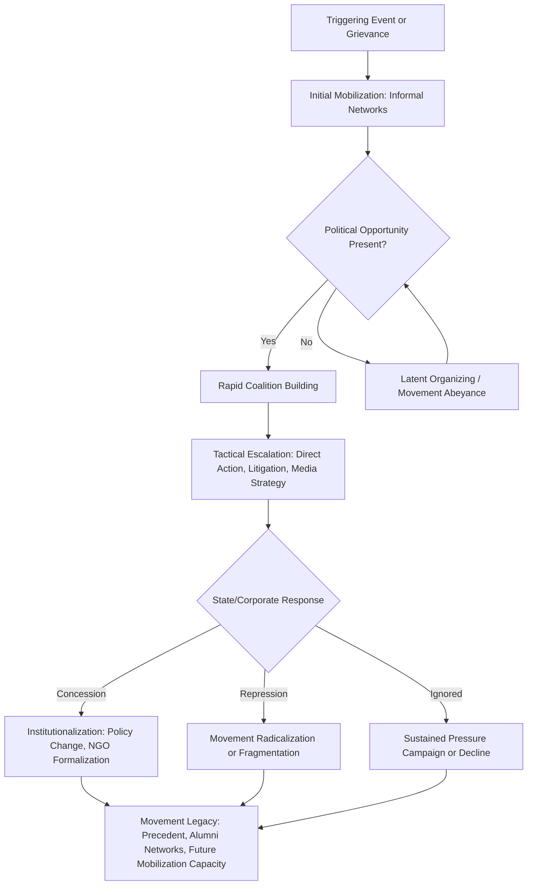

## Environmental Movements and Grassroots Activism

### Conceptual Foundations

#### Defining Grassroots Environmental Activism

Grassroots environmental activism refers to organized collective action initiated and sustained by community members — rather than top-down institutional actors — to address environmental harms, advocate for policy change, or promote ecological values. It is distinguished from institutional environmentalism (large NGOs, government agencies) by its decentralized origin, reliance on volunteer labor and local networks, and often direct connection between activists and the environmental harm being contested.

#### Social Movement Theory Applied to Environmentalism

Several sociological frameworks explain how environmental movements emerge, mobilize, and sustain themselves:

- **Resource mobilization theory**: Movements succeed based on their ability to marshal resources — money, labor, media access, organizational infrastructure — rather than merely on grievance severity. This explains why well-funded environmental NGOs often achieve different outcomes than resource-poor grassroots groups facing comparable environmental harms.
- **Political opportunity structure**: Movement emergence and success are shaped by the openness of the political system, elite alliances, and state capacity for repression or accommodation at a given historical moment.
- **New social movement theory**: Frames environmentalism (alongside feminism, civil rights) as post-materialist — concerned with quality-of-life and identity issues rather than purely economic redistribution, emerging as basic material needs become more widely met in industrialized societies.
- **Collective identity theory**: Emphasizes how shared identity (e.g., "environmentalist," "water protector," "climate striker") sustains participation and solidarity independent of immediate strategic calculation.

### Historical Development

#### Foundational Era (Pre-1960s)

Early conservation movements in the United States and Europe centered on wilderness preservation and were often led by elite naturalists and sportsmen. Key figures included John Muir, whose advocacy contributed to the creation of Yosemite National Park and the founding of the Sierra Club in 1892, and Gifford Pinchot, who promoted a utilitarian conservation ethic ("wise use") through the U.S. Forest Service, in tension with Muir's preservationist philosophy.

#### Modern Environmental Movement (1960s–1980s)

- **Rachel Carson's *Silent Spring* (1962)** is widely credited with catalyzing public concern over pesticide use (particularly DDT) and galvanizing the modern environmental movement by connecting ecological harm to direct human health risk.
- **The first Earth Day (April 22, 1970)** mobilized an estimated 20 million Americans and is credited with accelerating the passage of major U.S. environmental legislation, including the Clean Air Act, Clean Water Act, and the creation of the Environmental Protection Agency.
- **Love Canal (late 1970s)**, where residents of a Niagara Falls, New York neighborhood discovered their community was built atop a toxic waste site, became a landmark case for grassroots organizing led significantly by Lois Gibbs, and directly contributed to the passage of the Comprehensive Environmental Response, Compensation, and Liability Act (CERCLA/Superfund) in 1980.
- **Warren County, North Carolina (1982)**, where residents protested the siting of a PCB landfill in a predominantly Black community, is frequently cited as a founding moment of the environmental justice movement, linking environmental harm explicitly to racial discrimination in siting decisions.

#### Environmental Justice Movement (1980s–present)

The environmental justice movement reframed environmentalism around the disproportionate burden of pollution, hazardous waste, and resource extraction borne by low-income communities and communities of color. The 1991 First National People of Color Environmental Leadership Summit produced the "Principles of Environmental Justice," a foundational document articulating the movement's values, including self-determination and the right to participate in environmental decision-making.

#### Global and Transnational Movements (1990s–present)

- **Chipko movement** (India, 1970s): Villagers, notably women, embraced trees to prevent commercial logging, becoming an internationally cited example of nonviolent grassroots forest protection.
- **Green Belt Movement** (Kenya, founded 1977 by Wangari Maathai): Combined tree-planting with women's empowerment and civic education; Maathai received the Nobel Peace Prize in 2004, partly in recognition of linking environmental restoration to democratic governance and peace.
- **Anti-globalization and climate justice convergence**: Movements increasingly linked environmental degradation to critiques of global trade, extractive capitalism, and corporate accountability, visible at events like the 1999 Seattle WTO protests and subsequent UN climate summits (COP conferences).

#### Contemporary Movements (2000s–present)

- **Idle No More** (Canada, founded 2012): Indigenous-led movement opposing legislative rollbacks of environmental protections and asserting Indigenous sovereignty over land and water.
- **Standing Rock / Dakota Access Pipeline protests** (2016–2017): Mobilized Indigenous nations and allies against pipeline construction near the Standing Rock Sioux Reservation, becoming a widely covered case study in Indigenous-led direct action, water protection framing ("water protectors" rather than "protesters"), and the use of social media for movement coordination and counter-narrative building against mainstream coverage.
- **Fridays for Future / school climate strikes** (launched 2018 by Greta Thunberg): A youth-led, decentralized global movement using recurring school walkouts, notable for rapid international diffusion via social media and minimal centralized organizational structure.
- **Extinction Rebellion** (founded UK, 2018): Employs mass civil disobedience and arrest-courting nonviolent direct action, explicitly modeled on theories of civil resistance (e.g., research suggesting sustained mobilization of a small percentage of a population can produce significant political change).
- **Sunrise Movement** (US, founded 2017): Youth-led organization credited with popularizing the "Green New Deal" framework in U.S. political discourse through sit-ins and direct pressure on legislators.

### Organizational Structures and Strategic Repertoires

#### Structural Typology

| Structure Type | Characteristics | Example Pattern |
| --- | --- | --- |
| Centralized/formal NGO | Paid staff, formal hierarchy, professionalized advocacy | Large conservation organizations |
| Decentralized network | Loose coordination, shared branding, autonomous local chapters | Fridays for Future, Extinction Rebellion |
| Coalition-based | Temporary alliance of distinct organizations around shared goal | Anti-pipeline coalitions combining Indigenous groups, landowners, environmental NGOs |
| Community-based organization (CBO) | Hyper-local, place-specific, often emerges reactively to a specific harm | Anti-toxic-waste-siting groups (Love Canal model) |

#### Tactical Repertoires

Movements draw from a range of tactics, often combined strategically:

- **Institutional/conventional tactics**: Lobbying, litigation, public comment submission, shareholder activism, electoral campaigning.
- **Direct action (nonviolent)**: Sit-ins, blockades, tree-sitting, banner drops, boycotts.
- **Civil disobedience**: Deliberate, often public, law-breaking intended to generate arrests and media attention (e.g., pipeline easement blockades).
- **Symbolic/performative action**: Die-ins, mock funerals, art installations, mass demonstrations timed to coincide with summits or anniversaries.
- **Digital/networked activism**: Hashtag campaigns, coordinated social media pressure, crowdfunded legal defense, decentralized organizing via encrypted messaging platforms.
- **Litigation strategy**: Public interest environmental law (e.g., cases brought under the U.S. Clean Air Act citizen-suit provisions, or youth-led constitutional climate litigation such as *Juliana v. United States* and *Held v. Montana*).

**Example**: The Standing Rock mobilization combined institutional tactics (formal consultation requests, litigation under the National Environmental Policy Act), direct action (physical blockades of pipeline construction), and digital activism (widespread social media check-ins and livestreaming) simultaneously — illustrating how contemporary movements often blend repertoires rather than relying on a single tactical mode.

### Movement Lifecycle Diagram

### Key Organizational and Leadership Concepts

#### Movement Entrepreneurs and Charismatic Leadership

Certain movements rely heavily on identifiable leaders (Rachel Carson, Wangari Maathai, Greta Thunberg) whose personal credibility and media visibility help catalyze mobilization, while others deliberately adopt leaderless or leader-full models (Extinction Rebellion, Fridays for Future) to increase resilience against leadership targeting by opponents and to distribute organizing capacity.

#### Free Rider Problem and Selective Incentives

Mancur Olson's collective action theory notes that rational individuals may benefit from a movement's success (e.g., cleaner air) without contributing to the effort, since environmental goods are typically non-excludable. Movements address this through selective incentives (social belonging, identity affirmation, moral satisfaction) and framing that emphasizes personal efficacy and community solidarity rather than relying solely on the collective good itself as motivation.

#### Movement-Countermovement Dynamics

Environmental movements frequently generate organized opposition (e.g., "Wise Use" movement in the 1980s–90s U.S. opposing federal land regulation; industry-funded groups opposing specific pipeline or mining projects). This dynamic shapes movement strategy, as activists must anticipate and counter competing frames and resource advantages held by opposing, often better-funded, actors.

### Environmental Justice and Intersectionality

Contemporary grassroots environmentalism increasingly foregrounds intersections with:

- **Racial justice**: Disproportionate siting of polluting infrastructure (landfills, refineries, highways) in communities of color, documented in studies following the 1987 United Church of Christ report "Toxic Wastes and Race in the United States."
- **Indigenous sovereignty**: Land and water protection framed through treaty rights and sovereignty claims rather than solely ecological argument, as seen in Standing Rock and numerous pipeline and mining resistance campaigns.
- **Labor**: "Just transition" framing seeks to align environmental goals with protections for workers in extractive or high-carbon industries, addressing tension between environmental and labor movements historically.
- **Gender**: Ecofeminist perspectives and movements like the Green Belt Movement and Chipko highlight women's disproportionate roles in both environmental resource management and grassroots organizing in many contexts.

### Measuring Movement Impact and Effectiveness

Researchers and practitioners assess grassroots environmental movement outcomes through several lenses:

- **Policy outcomes**: Legislation passed, permits denied, regulations strengthened (e.g., Superfund's creation following Love Canal).
- **Discursive/framing impact**: Whether movement framing enters mainstream political and media discourse (e.g., "environmental justice," "water protector," "climate emergency" entering common usage).
- **Biographical impact**: Long-term effects on individual participants' civic engagement, career trajectories, and political identity, independent of the movement's stated goals succeeding.
- **Organizational legacy**: Whether the movement produces durable institutions, alumni networks, or replicable organizing models used in subsequent campaigns.
- **Corporate/behavioral change**: Divestment commitments, changes in corporate sourcing or siting practices, shareholder resolution outcomes.

Quantitative movement studies sometimes use models estimating mobilization thresholds, such as adaptations of threshold models of collective behavior, where an individual's participation probability depends on the observed participation of others:

$$P_i(\text{participate}) = f(N_{\text{observed}}, \theta_i)$$

where $N_{\text{observed}}$ is the number of others already participating and $\theta_i$ is an individual's personal threshold for joining. This is a general theoretical formalization from collective behavior literature (originating with Mark Granovetter) rather than a claim describing any specific movement's measured dynamics. [Inference]

### Digital Organizing Infrastructure

Modern grassroots environmental campaigns typically rely on a recognizable stack of coordination tools, though specific platform choices vary by organization and region:

- **Mobilization/list management**: Tools such as Mobilize, Action Network, or NationBuilder for event sign-ups and volunteer coordination.
- **Encrypted coordination**: Signal or similar platforms for sensitive direct-action planning where legal exposure is a concern.
- **Petition and pressure campaigns**: Change.org, dedicated organizational petition tools, or coordinated email/call campaigns targeting legislators and corporate decision-makers.
- **Social media narrative control**: Livestreaming (used extensively at Standing Rock) and hashtag coordination to bypass mainstream media gatekeeping and construct counter-narratives to institutional coverage. [Unverified — specific platform usage patterns shift rapidly and current tool preferences should be verified for any time-sensitive campaign analysis.]

### Common Challenges Facing Grassroots Movements

- **Resource asymmetry**: Grassroots groups typically face better-funded, more professionalized opposition from industry or government actors.
- **Burnout and volunteer attrition**: Sustained mobilization strains unpaid or under-resourced activist labor, particularly in prolonged campaigns.
- **Co-optation risk**: Successful movements risk having their language or goals adopted symbolically by institutions or corporations without substantive underlying change (sometimes termed "greenwashing" when applied to corporate behavior).
- **Fragmentation**: Coalitions spanning diverse interests (labor, Indigenous groups, urban environmentalists) can fracture over strategic or ideological disagreements.
- **Legal and physical risk**: Activists, particularly Indigenous and environmental defenders in extractive-industry-heavy regions globally, face documented risks of surveillance, arrest, and in some countries, violence — a pattern tracked by organizations such as Global Witness in their annual reporting on killings of land and environmental defenders. [Unverified — exact annual figures change year to year and should be checked against the most current report for precise statistics.]

**Related Topics**

- Environmental Justice and Disproportionate Pollution Burden
- Indigenous Environmental Sovereignty and Traditional Ecological Knowledge
- Corporate Greenwashing and Movement Co-optation
- Climate Litigation as an Activist Strategy
- Nonviolent Civil Resistance Theory (Chenoweth's 3.5% Rule)
- Just Transition Frameworks for Labor and Environment
- NGO Professionalization vs. Grassroots Autonomy
- Digital Organizing Tools and Movement Infrastructure