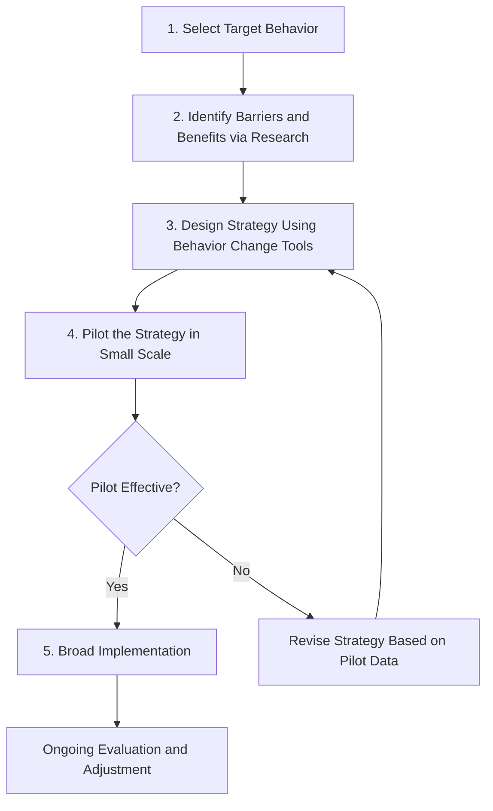

## Behavior Change Strategies for Sustainability

### Conceptual Foundations

#### The Attitude-Behavior Gap

A central problem in sustainability communication is that pro-environmental attitudes frequently fail to predict pro-environmental behavior. Surveys consistently find majorities expressing concern about environmental issues while corresponding behavioral changes (consumption reduction, transportation shifts, dietary changes) lag substantially behind stated values. This gap has driven the development of behavior-focused (rather than purely attitude-focused) intervention frameworks across psychology, behavioral economics, and social marketing.

#### Key Theoretical Models

- **Theory of Planned Behavior (Ajzen)**: Behavioral intention is predicted by attitude toward the behavior, subjective norms (perceived social expectations), and perceived behavioral control (self-efficacy), with intention then predicting actual behavior, moderated by real-world constraints.
- **Value-Belief-Norm Theory (Stern)**: Pro-environmental behavior is driven by a causal chain from personal values (biospheric, altruistic, egoistic) through ecological worldview, awareness of consequences, and ascription of responsibility, to personal moral norms that motivate action.
- **Social Practice Theory**: Shifts focus away from individual psychology toward behavior as embedded in routinized social practices shaped by materials (infrastructure, technology), meanings (cultural norms), and competencies (skills, know-how) — implying that changing behavior often requires changing the systems that make behaviors "normal" rather than only targeting individual attitudes.
- **Community-Based Social Marketing (McKenzie-Mohr)**: An applied framework combining social psychology insights with marketing techniques, emphasizing that behavior change strategies should be selected based on identified barriers to a specific behavior in a specific community, rather than applying generic awareness campaigns.

### Behavioral Economics and Nudge-Based Approaches

#### Choice Architecture

Choice architecture refers to the deliberate design of the context in which people make decisions, altering the presentation or structure of choices without restricting options or significantly changing economic incentives — a concept popularized by Thaler and Sunstein's "nudge" framework.

Common environmental applications include:

- **Default settings**: Setting green energy or double-sided printing as the default option, exploiting well-documented status quo bias where individuals disproportionately retain default selections.
- **Social norm feedback**: Providing comparative information (e.g., "your household uses more energy than 90% of similar neighbors") to leverage descriptive social norms as a motivator, a technique most notably operationalized commercially by OPOWER-style home energy reports.
- **Salience and framing at point of decision**: Placing recycling bins more prominently than trash bins, or labeling energy costs in real-time on appliances (In-Home Displays for electricity use).
- **Simplification of complex choices**: Reducing the cognitive burden of pro-environmental decisions (e.g., pre-sorted recycling categories, single-click opt-in for renewable energy tariffs).

#### Behavioral Barriers Framework

| Barrier Type | Description | Intervention Example |
| --- | --- | --- |
| Structural | Physical/infrastructural obstacles | Lack of recycling access → installing curbside bins |
| Psychological | Cognitive biases, habit inertia | Present bias favoring convenience → commitment devices |
| Social | Norm misperception, peer pressure | Believing few neighbors recycle → normative feedback campaigns |
| Financial | Upfront cost barriers despite long-term savings | High solar panel cost → financing programs, rebates |
| Informational | Lack of knowledge about impact or alternatives | Unclear water usage impact → real-time consumption meters |

**Example**: A municipal water conservation program identifying that residents underestimate outdoor irrigation's share of household water use might combine an informational intervention (itemized water bills breaking down usage by category) with a normative intervention (comparing a household's lawn watering to neighborhood averages), rather than relying solely on a generic "save water" awareness campaign.

### Community-Based Social Marketing (CBSM) Process

CBSM, as formalized by Doug McKenzie-Mohr, follows a structured five-stage process for designing behavior change interventions:

Behavior selection at Stage 1 typically prioritizes behaviors with high environmental impact and reasonable "probability of adoption," since resources are limited and not all sustainable behaviors offer equal leverage — a concept formalized as impact-probability prioritization matrices in applied conservation psychology.

### Commitment and Consistency Strategies

- **Written or public commitments**: Individuals who make explicit commitments (verbal, written, or public pledges) to a sustainable behavior show higher follow-through rates than those given only informational appeals, consistent with commitment-consistency principles from social psychology (Cialdini).
- **Foot-in-the-door technique**: Securing agreement to a small initial request (e.g., a single-day "meatless Monday" pledge) increases the likelihood of subsequent agreement to larger requests (broader dietary change), leveraging self-perception and consistency motivations.
- **Implementation intentions**: Encouraging individuals to specify concrete "if-then" plans (e.g., "if it is Tuesday, I will take public transit to work") has been associated in behavioral research with higher follow-through than general behavioral intentions alone, because it pre-commits a behavioral response to a specific situational cue.

### Social Norms and Diffusion

#### Descriptive vs. Injunctive Norms

- **Descriptive norms** describe what most people actually do (e.g., "most households in your area recycle").
- **Injunctive norms** describe what is socially approved or disapproved of (e.g., "littering is frowned upon in this community").

Communicators must exercise caution with descriptive norm messaging: highlighting a negative behavior's prevalence (e.g., "most people don't recycle") can inadvertently normalize and increase that undesirable behavior — a well-documented pitfall sometimes called the "boomerang effect," which is why effective normative messaging typically pairs a descriptive norm with an injunctive one to avoid legitimizing undesired conduct.

#### Diffusion of Innovations

Everett Rogers's diffusion of innovations theory describes adoption of new behaviors or technologies (e.g., solar panels, electric vehicles, plant-based diets) across a population following an S-curve pattern, segmented into adopter categories:

f(t) = \frac{L}{1 + e^{-k(t - t_0)}}$}

where $f(t)$ represents cumulative adoption at time $t$, $L$ is the market saturation ceiling, $k$ is the growth rate, and $t_0$ is the inflection point — a standard logistic diffusion curve formalization used broadly in innovation adoption modeling. [Inference — actual adoption curves for specific sustainable technologies deviate from idealized logistic shapes due to policy shocks, price changes, and supply constraints, so this represents a stylized theoretical pattern rather than a predictive guarantee for any particular technology.]

- **Innovators** (~2.5%): Highest risk tolerance, early experimenters.
- **Early adopters** (~13.5%): Opinion leaders, socially influential.
- **Early majority** (~34%): Deliberate adopters following early adopter example.
- **Late majority** (~34%): Skeptical, adopt under social/economic pressure.
- **Laggards** (~16%): Last to adopt, often resistant to change.

Adoption percentages are Rogers's original theoretical distribution based on a normal curve approximation and should be treated as a heuristic model rather than an empirically fixed distribution applicable to every innovation. [Inference]

### Structural and Policy-Level Behavior Change Levers

Because individual-focused interventions face inherent ceiling effects, sustainability behavior change increasingly incorporates structural approaches that shift the default behavioral landscape:

- **Pricing mechanisms**: Carbon taxes, congestion pricing, and pay-as-you-throw waste fee structures alter the cost calculus underlying consumption and disposal decisions.
- **Infrastructure change**: Bike lane expansion, public transit investment, and walkable urban design reduce the effort barrier associated with low-carbon transportation choices.
- **Regulatory standards**: Building codes, appliance efficiency standards, and extended producer responsibility laws shift baseline product and building characteristics without requiring individual behavior change at the point of purchase.
- **Mandates versus incentives debate**: A persistent policy question concerns whether mandates (e.g., banning single-use plastics) or incentives (rebates for reusable alternatives) achieve more durable and equitable behavior change; evidence suggests effectiveness depends heavily on context, enforcement capacity, and the presence of viable behavioral alternatives at the time of implementation. [Inference — general framing of an ongoing empirical and policy debate rather than a settled finding]

### Marketing and Communication Tactics for Sustainable Behavior

#### Message Framing Considerations for Behavior (Distinct from Media Framing of Issues)

- **Gain vs. loss framing**: Messages emphasizing potential losses from inaction (e.g., "you're wasting $200/year in energy costs") are sometimes more motivating than equivalent gain-framed messages for loss-averse behaviors, though effectiveness varies by behavior type and audience risk tolerance.
- **Self-efficacy emphasis**: Messaging that pairs threat information (environmental risk) with clear, feasible action steps tends to avoid the paralysis or denial responses associated with fear-based messaging lacking an efficacious response pathway — consistent with Protection Motivation Theory.
- **Avoiding compassion fade and psychic numbing**: Communicators are cautioned against overloading messaging with abstract statistics (e.g., global emissions totals) without connecting them to identifiable, actionable local behaviors, since large-scale statistical framing has been associated with reduced individual motivation to act compared to more personally relevant framing.

#### Gamification and Feedback Loops

Digital tools increasingly apply gamification mechanics — points, leaderboards, badges, streaks — to sustained behaviors like energy conservation, active transportation, or waste reduction, operating on principles similar to habit-formation apps in other domains. Real-time feedback (e.g., smart meters displaying live energy consumption) has been associated in field studies with measurable, though often modest and sometimes decaying over time, reductions in consumption, as the novelty effect of monitoring diminishes without reinforcement. [Unverified — magnitude and persistence of feedback-driven savings vary considerably across study designs, device types, and populations, and should be checked against current field trial data for specific claims.]

### Sustained Behavior Change vs. One-Time Actions

A key distinction in the behavior change literature separates:

- **One-time/curtailment behaviors**: Discrete actions requiring a single decision (installing insulation, purchasing an efficient appliance, signing a green energy plan).
- **Habitual/repeated behaviors**: Actions requiring ongoing repetition (turning off lights, reducing meat consumption, using active transportation), which are more susceptible to habit formation, relapse, and context-dependent cueing.

Researchers generally note that one-time behaviors, once adopted, tend to produce more durable emissions or resource reductions because they do not depend on continued willpower or motivation — a consideration that shapes prioritization in behavior change campaign design toward "one-and-done" structural or purchasing decisions where feasible.

### Common Pitfalls in Behavior Change Campaign Design

- **Information deficit assumption**: Designing campaigns around the belief that providing more facts will straightforwardly produce behavior change, despite extensive evidence that knowledge alone is a weak predictor of behavior.
- **Single-lever reliance**: Using only informational appeals without addressing structural, social, or financial barriers identified through barrier research.
- **Ignoring rebound effects**: Efficiency gains (e.g., a more fuel-efficient vehicle) can sometimes lead to increased usage that partially offsets intended resource savings — a phenomenon known as the rebound effect (or Jevons paradox in its strong macroeconomic form) — which campaign designers should account for in impact projections.
- **Overreliance on guilt or fear appeals**: Excessive fear-based messaging without accompanying efficacy information risks triggering denial, avoidance, or psychological reactance rather than motivated action.
- **Neglecting equity considerations**: Behavior change interventions (e.g., congestion pricing, plastic bans) can carry disproportionate burdens for lower-income populations if designed without complementary support measures, raising both ethical and political-feasibility concerns.

### Evaluation Metrics for Behavior Change Interventions

Typical evaluation approaches include:

- **Randomized controlled trials (RCTs)**: Comparing treatment and control groups exposed to different intervention designs (e.g., OPOWER-style energy report RCTs).
- **Pre-post behavioral measurement**: Direct measurement of the target behavior (utility consumption data, waste audit weights, transit ridership counts) rather than self-reported intention.
- **Cost-effectiveness ratios**: Resource or emissions reduction achieved per dollar of intervention cost, used to compare intervention types for policy prioritization.
- **Persistence/decay analysis**: Longitudinal tracking of whether behavior change persists after the intervention (e.g., a rebate program or media campaign) ends, addressing concerns that many interventions produce only temporary effects.

**Next Steps**

- Community-Based Social Marketing Case Studies
- Behavioral Economics and Nudge Theory in Public Policy
- Rebound Effects and the Jevons Paradox
- Carbon Pricing and Structural Policy Levers
- Social Norms Messaging and the Boomerang Effect
- Diffusion of Innovations for Clean Technology Adoption
- Equity Considerations in Sustainability Policy Design
- Habit Formation and Sustained Pro-Environmental Behavior