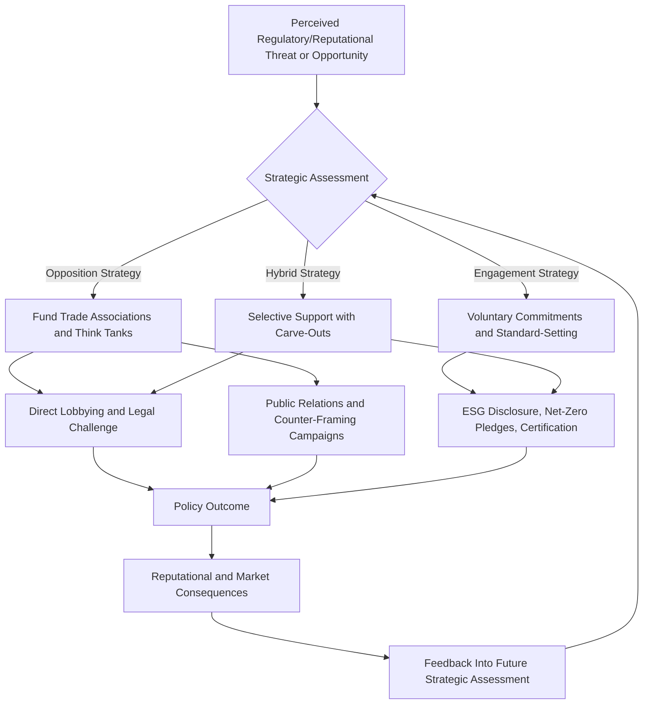

## Corporate and Political Environmental Advocacy

### Conceptual Foundations

#### Defining the Field

Corporate and political environmental advocacy encompasses the strategies, institutions, and actors through which businesses, industry associations, political parties, and government actors shape environmental policy, public discourse, and regulatory outcomes. This spans a spectrum from genuine sustainability leadership and policy innovation to strategic obstruction and reputational management, often coexisting within the same organization across different issues or time periods.

#### Distinguishing Advocacy Types

- **Corporate environmental advocacy**: Businesses actively supporting environmental policy (e.g., lobbying for carbon pricing, voluntary emissions targets, sustainability reporting standards).
- **Corporate environmental opposition/obstruction**: Businesses or trade associations lobbying against environmental regulation, funding countermovements, or contesting scientific findings that threaten core business models.
- **Political environmental advocacy**: Elected officials, parties, and government agencies promoting environmental policy through legislation, executive action, and international agreements.
- **Political environmental obstruction**: Legislative blocking, regulatory rollback, agency budget starvation, or withdrawal from international commitments driven by ideological or constituency-based opposition to environmental regulation.

### Theoretical Frameworks

#### Corporate Political Activity (CPA) Theory

CPA theory, developed in management and political science literature, categorizes the mechanisms firms use to influence public policy:

- **Financial strategies**: Campaign contributions, political action committees (PACs), direct lobbying expenditure.
- **Constituency-building strategies**: Grassroots or "astroturf" mobilization, coalition formation with allied industries or NGOs.
- **Informational strategies**: Commissioning and disseminating research, testifying before legislative bodies, funding think tanks.
- **Legal strategies**: Litigation to delay or overturn regulation, regulatory comment submission during rulemaking processes.

#### Stakeholder Theory vs. Shareholder Primacy

Corporate environmental behavior is frequently analyzed through the tension between:

- **Shareholder primacy (Friedman doctrine)**: The view, associated with economist Milton Friedman, that a corporation's primary social responsibility is maximizing shareholder value within legal bounds, treating environmental action as legitimate only insofar as it serves this goal (e.g., risk mitigation, cost savings, brand value).
- **Stakeholder theory (Freeman)**: The view that corporations hold obligations to a broader set of stakeholders — employees, communities, the environment, future generations — independent of direct shareholder benefit, providing a normative basis for voluntary environmental action beyond regulatory compliance or profit motive.

This tension underlies ongoing debates about whether corporate sustainability commitments represent substantive shifts in corporate governance or reputational strategies compatible with continued shareholder-primacy logic.

#### Regulatory Capture

Regulatory capture theory describes a process by which regulatory agencies, over time, come to act in the interest of the industries they are meant to regulate rather than the public interest, often through mechanisms including revolving-door employment between industry and regulatory agencies, information asymmetry favoring regulated firms, and sustained lobbying pressure exceeding public interest counter-lobbying capacity.

### Historical Development of Corporate Environmental Engagement

#### Early Adversarial Period (1960s–1980s)

Following the passage of major U.S. environmental legislation (Clean Air Act 1970, Clean Water Act 1972), many industries adopted primarily defensive and oppositional postures toward environmental regulation, framing compliance costs as threats to competitiveness and employment.

#### Voluntary Programs and Green Marketing Era (1990s–2000s)

- **ISO 14001** (1996): International standard for environmental management systems, providing a voluntary framework companies could adopt to signal environmental governance commitment.
- **Corporate Social Responsibility (CSR) mainstreaming**: Sustainability reporting, triple-bottom-line accounting (people, planet, profit), and voluntary emissions disclosure became increasingly common corporate practices, though critics noted inconsistent standards and limited third-party verification during this period.
- **Manufactured doubt campaigns**: Concurrent with voluntary program adoption, some industries — most extensively documented in the fossil fuel sector — funded research and advocacy organizations promoting scientific uncertainty about climate change, a strategy historically documented as adapted from earlier tobacco industry public relations approaches (Oreskes and Conway).

#### ESG and Sustainability Standardization Era (2010s–present)

- **ESG (Environmental, Social, Governance) investing** grew substantially as an investment framework, with asset managers increasingly incorporating environmental criteria into capital allocation decisions, driven partly by institutional investor pressure and partly by regulatory disclosure requirements emerging in various jurisdictions.
- **Task Force on Climate-related Financial Disclosures (TCFD)**, established 2015, created a voluntary framework for corporate climate risk disclosure that has influenced subsequent mandatory disclosure regulations in several jurisdictions.
- **Net-zero pledges**: Widespread corporate adoption of net-zero emissions targets, often for 2050, has drawn scrutiny regarding the credibility, verification mechanisms, and interim accountability of such pledges, given their voluntary and often non-binding nature. [Unverified — the current regulatory and disclosure landscape for corporate climate pledges is evolving rapidly across jurisdictions and should be verified against current sources for any specific claims about enforceability.]

### Corporate Advocacy Strategy Diagram

### Greenwashing: Definition and Detection

#### Defining Greenwashing

Greenwashing refers to the practice of conveying a false or exaggerated impression of environmental responsibility through marketing, branding, or disclosure, disproportionate to actual environmental performance. The term was popularized in environmental communication research in the late 1980s and has since become a central concern in advertising regulation and ESG investment due diligence.

#### The "Seven Sins of Greenwashing" (TerraChoice/UL Framework)

A widely cited practitioner framework identifies common greenwashing patterns:

1. **Hidden trade-off**: Promoting one environmental attribute while ignoring more significant negative impacts elsewhere in the product lifecycle.
2. **No proof**: Environmental claims lacking accessible supporting evidence or third-party certification.
3. **Vagueness**: Broad, poorly defined claims (e.g., "eco-friendly," "natural") lacking precise meaning.
4. **Worshiping false labels**: Implying third-party endorsement through labels resembling but not constituting genuine certification.
5. **Irrelevance**: Claims that are technically true but environmentally insignificant or apply to a legally mandated baseline already met by competitors.
6. **Lesser of two evils**: Claims that distract from a fundamentally environmentally harmful product category (e.g., "eco-friendly cigarettes").
7. **Fibbing**: Outright false environmental claims.

#### Regulatory Responses to Greenwashing

Various jurisdictions have developed or strengthened advertising and disclosure regulations targeting greenwashing, including guidance from bodies such as the U.S. Federal Trade Commission's "Green Guides" and, more recently, expanded regulatory scrutiny of corporate sustainability claims in the European Union. [Unverified — specific regulatory requirements and enforcement mechanisms vary by jurisdiction and change frequently; current regulations should be verified for any compliance-relevant application.]

### Political Environmental Advocacy Mechanisms

#### Legislative Advocacy

- **Bill sponsorship and coalition building**: Legislators build cross-party or intra-party coalitions to advance environmental legislation, often requiring negotiation over scope, funding mechanisms, and implementation timelines.
- **Budget and appropriations control**: Environmental policy is frequently shaped indirectly through funding levels for enforcement agencies rather than solely through substantive legislation, since underfunded agencies may be unable to fully implement or enforce existing environmental law.
- **International agreement ratification and withdrawal**: National governments' participation in agreements such as the Paris Agreement is subject to domestic political shifts, as illustrated by changes in U.S. participation status across different administrations. [Inference — specific current international agreement participation status should be verified via search, as this changes with political administrations.]

#### Executive and Administrative Action

- **Regulatory rulemaking**: Environmental agencies (e.g., the U.S. EPA) implement statutory mandates through formal rulemaking processes, which are themselves subject to legal challenge, political pressure, and administration-driven reinterpretation.
- **Executive orders**: Used to direct agency priorities, environmental review processes, and permitting procedures without requiring legislative approval, though subject to reversal by subsequent administrations and judicial review.

#### Judicial and Litigation-Based Advocacy

Both pro-regulatory and anti-regulatory actors increasingly use litigation as a primary advocacy tool, including challenges to agency rulemaking authority, citizen suits under environmental statutes, and constitutional climate litigation asserting government obligations to protect environmental rights (e.g., youth-led cases such as *Held v. Montana*).

### Lobbying and Campaign Finance Landscape

#### Disclosure and Transparency Mechanisms

In jurisdictions such as the United States, lobbying expenditure disclosure is required under statutes such as the Lobbying Disclosure Act, enabling tracking of industry spending on environmental policy issues through public databases, though critics note significant gaps in capturing indirect influence channels (dark money groups, issue advocacy not explicitly naming candidates).

#### Comparative Spending Patterns

Environmental and energy-sector lobbying spending has historically shown substantial asymmetry between fossil fuel industry expenditure and environmental advocacy organization expenditure in many jurisdictions, though exact figures fluctuate significantly by year and legislative cycle and should be verified against current lobbying disclosure data for specific claims. [Unverified — precise current figures require up-to-date search verification]

### Voluntary Corporate Standards and Frameworks

| Framework | Focus | Nature |
| --- | --- | --- |
| GRI (Global Reporting Initiative) | Sustainability reporting standards | Voluntary, widely adopted globally |
| SASB (Sustainability Accounting Standards Board) | Industry-specific financial materiality | Voluntary, investor-oriented |
| CDP (formerly Carbon Disclosure Project) | Corporate environmental impact disclosure | Voluntary, investor-requested |
| Science Based Targets initiative (SBTi) | Emissions reduction target validation | Voluntary, third-party verified |
| B Corp Certification | Holistic social/environmental performance | Voluntary, third-party certified |

These frameworks generally lack binding legal enforcement mechanisms independent of contractual or reputational consequences, meaning compliance and credibility depend substantially on market and stakeholder pressure rather than governmental sanction. [Inference — general characterization of the voluntary standards landscape; specific frameworks vary in verification rigor and consequences for non-compliance]

### Analytical Framework: Assessing Advocacy Authenticity

Researchers and watchdog organizations commonly evaluate corporate/political environmental advocacy credibility using criteria such as:

- **Alignment between public statements and lobbying activity**: Whether a firm's public sustainability messaging is contradicted by trade association memberships or direct lobbying records opposing related regulation.
- **Target-setting specificity and verification**: Whether emissions or sustainability targets include specific interim milestones, third-party verification, and defined scope boundaries, versus vague long-term aspirational language.
- **Capital expenditure alignment**: Whether actual investment patterns (e.g., continued fossil fuel exploration capital expenditure alongside renewable energy pledges) are consistent with stated environmental commitments.
- **Political spending consistency**: Whether campaign contributions and PAC spending support candidates and legislation consistent with stated environmental values.

### Common Critiques and Debates

- **"Greenwashing vs. genuine transition" debate**: Persistent difficulty in empirically distinguishing substantive corporate transformation from sophisticated reputational management, particularly for large, diversified corporations with mixed portfolios.
- **Voluntary vs. mandatory disclosure debate**: Ongoing policy debate over whether voluntary ESG frameworks are sufficient or whether mandatory, standardized, and audited environmental disclosure is necessary to prevent selective and inconsistent reporting.
- **Political polarization of environmental issues**: In some political systems, environmental policy has become increasingly aligned with partisan identity, complicating bipartisan legislative advocacy and shifting corporate strategy toward regulatory and litigation channels less dependent on legislative consensus.
- **Scope of corporate responsibility debate**: Disagreement over whether corporations bear responsibility primarily for direct (Scope 1), indirect energy (Scope 2), or full value-chain (Scope 3) emissions, with Scope 3 accounting for the largest share of most companies' footprints but posing the greatest measurement and accountability challenges.

**Related Topics**

- Greenwashing Detection and Regulatory Enforcement
- ESG Investing and Sustainable Finance Frameworks
- Regulatory Capture in Environmental Policy
- Corporate Political Activity and Lobbying Disclosure
- Climate Litigation Strategy (Pro- and Anti-Regulatory)
- Scope 1, 2, and 3 Emissions Accounting
- Manufactured Doubt Campaigns and Science Denialism
- International Environmental Agreement Ratification Politics