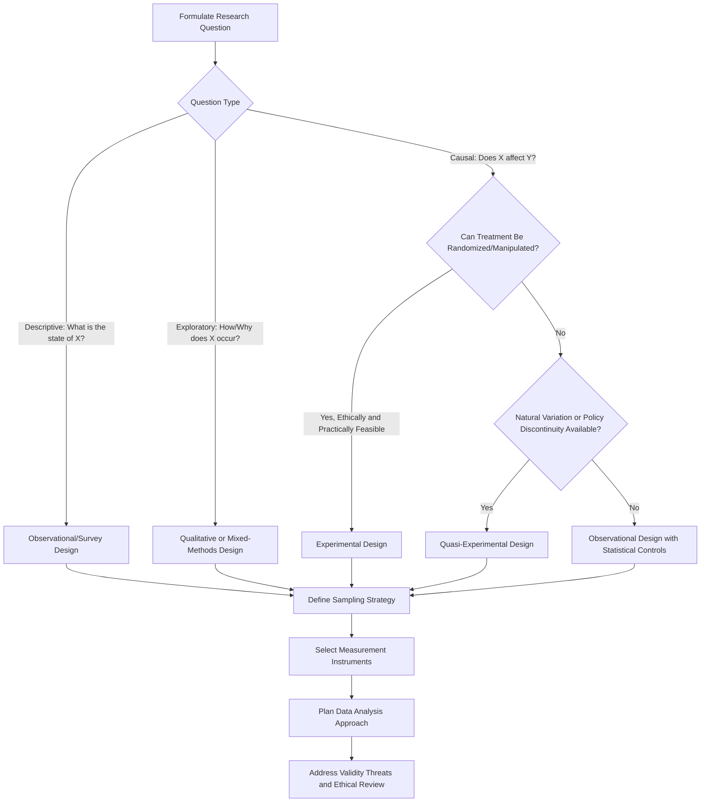

## Environmental Research Design

### Conceptual Foundations

#### Defining Environmental Research Design

Environmental research design refers to the systematic planning framework used to investigate environmental phenomena, encompassing the selection of research questions, methodological approaches, sampling strategies, data collection instruments, and analytical techniques appropriate to environmental systems. Environmental research is distinctive in frequently requiring integration across natural sciences (ecology, chemistry, hydrology), social sciences (policy, economics, behavior), and applied disciplines (engineering, public health), producing inherently interdisciplinary methodological demands.

#### Research Paradigms

- **Positivist/quantitative paradigm**: Assumes an objective, measurable environmental reality; emphasizes hypothesis testing, statistical inference, and generalizability (e.g., measuring pollutant concentrations, modeling species population dynamics).
- **Interpretivist/qualitative paradigm**: Emphasizes understanding meaning, context, and lived experience (e.g., how communities perceive environmental risk, indigenous ecological knowledge systems).
- **Pragmatist/mixed-methods paradigm**: Prioritizes practical research questions over paradigmatic purity, often combining quantitative and qualitative methods to address complex socio-environmental problems (e.g., evaluating a conservation program's ecological outcomes alongside community acceptance).
- **Critical/transformative paradigm**: Explicitly foregrounds power, equity, and justice concerns, common in environmental justice research examining disproportionate pollution burden or resource access.

### Research Design Typology

#### By Temporal Structure

| Design Type | Structure | Environmental Application Example |
| --- | --- | --- |
| Cross-sectional | Single time-point data collection | One-time water quality survey across multiple sites |
| Longitudinal/time-series | Repeated measurement over time | Long-term ecological monitoring (e.g., LTER network sites) |
| Retrospective | Analysis of historical data | Reconstructing historical land-use change from satellite archives |
| Prospective/panel | Following same units forward in time | Tracking household energy consumption after a policy intervention |

#### By Causal Inference Structure

- **Experimental designs**: Involve researcher-controlled manipulation of an independent variable with random assignment to treatment and control conditions, enabling strong causal inference. Environmental applications include controlled mesocosm experiments (e.g., testing pollutant effects on aquatic organisms in enclosed experimental systems) and randomized controlled trials of behavioral interventions.
- **Quasi-experimental designs**: Involve treatment/control comparison without full randomization, often necessary when random assignment is impractical or unethical (e.g., comparing pollution levels before and after a regulation using a difference-in-differences design, since regulations cannot be randomly assigned to some jurisdictions and not others).
- **Observational/correlational designs**: Examine naturally occurring variation without manipulation, common in field ecology and epidemiology (e.g., correlating ambient air pollution levels with respiratory hospitalization rates across cities).
- **Natural experiments**: Exploit naturally occurring events that approximate random assignment (e.g., using a sudden factory closure as a natural experiment on local air quality and health outcomes).

### Research Design Selection Process

### Sampling Strategies for Environmental Research

#### Spatial Sampling Approaches

Environmental phenomena are typically spatially heterogeneous, requiring deliberate sampling design:

- **Random sampling**: Sample locations selected via random coordinate generation within a study area, minimizing selection bias but potentially missing important localized features.
- **Stratified sampling**: Study area divided into strata (e.g., land cover types, elevation bands, watershed units) with sampling allocated within each stratum, improving representativeness across known heterogeneity.
- **Systematic/grid sampling**: Samples collected at regular spatial intervals (e.g., a fixed grid overlay), useful for spatial interpolation and mapping but potentially vulnerable to periodicity bias if underlying environmental patterns align with the grid interval.
- **Adaptive/purposive sampling**: Sampling intensity or location adjusted based on preliminary findings (e.g., increasing sample density near a suspected contamination source).
- **Transect sampling**: Systematic sampling along a defined line, widely used in vegetation and habitat surveys to capture gradients (e.g., elevation, distance from disturbance).

#### Statistical Power and Sample Size Considerations

Environmental data frequently exhibit spatial and temporal autocorrelation — nearby samples in space or time tend to be more similar than distant ones — violating the independence assumptions of standard statistical tests and requiring specialized approaches (e.g., spatial statistics, mixed-effects models with autocorrelation structures, or block bootstrap methods) rather than naive application of methods assuming independent observations.

$$n = \left(\frac{Z_{\alpha/2} \cdot \sigma}{E}\right)^2$$

where $n$ is required sample size, $Z_{\alpha/2}$ is the critical value for the desired confidence level, $\sigma$ is the estimated population standard deviation, and $E$ is the acceptable margin of error. This is a standard sample size formula for simple random sampling of a continuous variable; it requires substantial modification (e.g., design effects, variance inflation factors) when applied to clustered, stratified, or spatially autocorrelated environmental data. [Inference — the formula itself is standard statistical theory, but its direct applicability without adjustment to most real environmental sampling designs is limited]

### Measurement and Data Collection Methods

#### Field-Based Direct Measurement

- **In-situ sensors and monitoring equipment**: Continuous or periodic measurement using deployed instruments (water quality sondes, air quality monitors, weather stations, dissolved oxygen probes).
- **Biological sampling**: Species counts, biomass measurement, tissue sampling for contaminant analysis, biodiversity indices (e.g., Shannon diversity index, Simpson's index).
- **Soil and sediment sampling**: Core sampling, grab sampling, and composite sampling protocols for contaminant or nutrient analysis.

#### Remote Sensing and Geospatial Methods

- **Satellite imagery analysis**: Land cover classification, vegetation indices (e.g., NDVI — Normalized Difference Vegetation Index), deforestation tracking, and thermal anomaly detection using platforms such as Landsat, Sentinel, or MODIS data products.
- **Aerial and drone-based (UAV) surveys**: Increasingly used for high-resolution habitat mapping, wildlife population surveys, and infrastructure monitoring at intermediate spatial scales between ground survey and satellite coverage.
- **GIS-based spatial analysis**: Integration of multiple spatial data layers for overlay analysis, watershed delineation, habitat connectivity modeling, and exposure mapping.

#### Social and Behavioral Data Collection

- **Surveys and questionnaires**: Structured instruments measuring environmental attitudes, knowledge, behavior, and risk perception, requiring attention to validated scale use (e.g., the New Ecological Paradigm scale) and sampling representativeness.
- **Interviews and focus groups**: Semi-structured or unstructured qualitative data collection capturing depth of perspective on environmental experience, decision-making, or community knowledge.
- **Participatory and citizen science methods**: Community members contribute observational data (e.g., eBird species observations, community air quality monitoring networks), expanding spatial and temporal coverage while requiring data quality control protocols to address variable observer expertise and reporting consistency.

### Data Quality and Validity Considerations

#### Internal Validity Threats

- **Confounding variables**: Unmeasured factors correlated with both the presumed cause and observed effect (e.g., regional economic conditions confounding the relationship between a specific regulation and observed pollution reduction).
- **Selection bias**: Non-random assignment or sampling that systematically differs between compared groups (e.g., communities that adopt voluntary conservation programs may differ systematically from non-adopters in ways affecting outcomes).
- **Measurement error and instrument calibration drift**: Environmental sensors require regular calibration; uncorrected drift can introduce systematic bias into long-term monitoring datasets.
- **Temporal confounding**: Seasonal cycles, weather events, or concurrent unrelated trends can confound before-after comparisons absent an appropriate control group or time-series decomposition.

#### External Validity and Generalizability

Environmental research findings from a specific ecosystem, climate zone, or socio-political context may not generalize to different contexts due to site-specific ecological conditions, institutional arrangements, or cultural factors — a consideration particularly relevant when translating pilot program findings into broader policy recommendations.

#### Reliability

Reliability concerns the consistency of measurement across repeated applications, addressed in environmental research through documented standard operating procedures (SOPs), inter-observer reliability testing for field identification tasks (e.g., species identification, land cover classification), and instrument calibration protocols.

### Mixed-Methods Integration Designs

Given the interdisciplinary nature of environmental problems, mixed-methods designs are common:

- **Convergent parallel design**: Quantitative and qualitative data collected simultaneously and independently, then merged during interpretation (e.g., combining water quality measurements with community perception surveys about water safety).
- **Explanatory sequential design**: Quantitative data collected and analyzed first, with qualitative follow-up used to explain unexpected or complex quantitative findings (e.g., survey reveals unexpectedly low adoption of a conservation practice, followed by interviews exploring barriers).
- **Exploratory sequential design**: Qualitative research conducted first to identify relevant constructs or generate hypotheses, followed by quantitative instrument development and testing (e.g., interviews identifying locally relevant risk perception factors, followed by survey validation across a larger sample).

### Research Ethics in Environmental Research

- **Institutional Review Board (IRB) considerations**: Research involving human subjects (surveys, interviews, behavioral observation) typically requires ethical review, informed consent procedures, and data privacy protections, even when the primary research focus is environmental rather than explicitly biomedical or psychological.
- **Community and Indigenous research ethics**: Research involving Indigenous lands, traditional ecological knowledge, or historically marginalized communities increasingly requires frameworks such as free, prior, and informed consent (FPIC), community-based participatory research (CBPR) approaches, and data sovereignty considerations regarding who controls and benefits from research findings.
- **Animal welfare considerations**: Field and laboratory research involving wildlife or animal subjects requires adherence to institutional animal care protocols and, where applicable, permits for handling protected species.
- **Dual-use and sensitive-site considerations**: Research documenting locations of endangered species or sensitive ecological sites requires careful consideration of data publication practices to avoid inadvertently facilitating poaching, looting, or exploitation.

### Data Analysis Approaches by Data Type

| Data Type | Common Analytical Methods |
| --- | --- |
| Continuous environmental measurements | Regression analysis, ANOVA, time-series analysis, mixed-effects models |
| Spatial data | Spatial autocorrelation analysis (Moran's I), kriging/interpolation, spatial regression |
| Categorical/count ecological data | Chi-square tests, Poisson/negative binomial regression, generalized linear models |
| Community/biodiversity data | Multivariate ordination (NMDS, PCA), cluster analysis, diversity indices |
| Qualitative interview/text data | Thematic analysis, grounded theory coding, content analysis |
| Remote sensing imagery | Supervised/unsupervised classification, change detection analysis, machine learning classifiers |

### Reproducibility and Open Science Practices

Contemporary environmental research increasingly emphasizes:

- **Pre-registration**: Publicly documenting hypotheses and analysis plans prior to data collection or analysis, reducing risk of post-hoc hypothesis fitting (HARKing — Hypothesizing After Results are Known).
- **Open data repositories**: Depositing raw data in accessible repositories (e.g., Dryad, EDI Data Portal, GBIF for biodiversity data) to enable replication and meta-analysis.
- **Code and workflow sharing**: Publishing analysis scripts (commonly via version control platforms) alongside publications to enable computational reproducibility.
- **Standardized metadata practices**: Using community-agreed metadata standards (e.g., Ecological Metadata Language, Darwin Core for biodiversity records) to ensure long-term data usability and interoperability across research groups.

### Common Pitfalls in Environmental Research Design

- **Pseudoreplication**: Treating spatially or temporally non-independent samples (e.g., multiple measurements from the same plot) as independent replicates, artificially inflating statistical power and risking false-positive conclusions — a widely cited concern in ecological study design.
- **Baseline/reference condition ambiguity**: Difficulty establishing a valid "natural" or pre-disturbance baseline against which environmental change is measured, particularly in systems with long histories of human modification.
- **Scale mismatch**: Designing studies at a spatial or temporal scale inappropriate to the ecological or social process under investigation (e.g., studying watershed-scale hydrology using data collected only at a single point location).
- **Ignoring stakeholder knowledge**: Excluding local or Indigenous ecological knowledge from research design can both introduce validity gaps and raise ethical concerns regarding extractive research practices.
- **Publication bias**: Statistically significant or novel findings are more likely to be published than null results, potentially skewing the cumulative evidence base in environmental science toward overstated effect sizes.

**Related Topics**

- Statistical Methods for Ecological and Environmental Data
- Remote Sensing and GIS Applications in Environmental Monitoring
- Community-Based Participatory Research and Indigenous Data Sovereignty
- Mixed-Methods Research Design in Socio-Environmental Systems
- Long-Term Ecological Monitoring Networks (e.g., LTER)
- Citizen Science Data Quality and Validation
- Environmental Impact Assessment Methodology
- Capstone Project Design and Proposal Writing