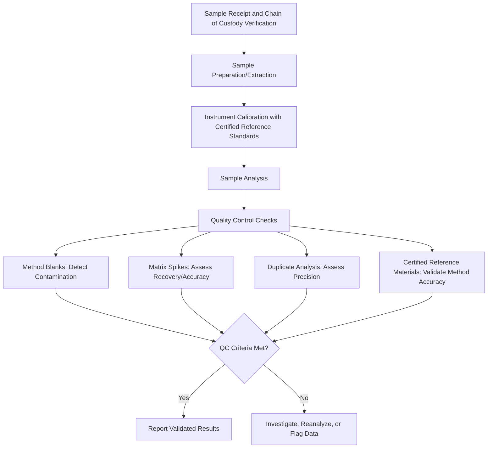

## Field and Laboratory Techniques

### Conceptual Foundations

#### Scope of Field and Laboratory Methodology

Field and laboratory techniques constitute the applied methodological toolkit for collecting, preserving, and analyzing environmental samples and observations. Field techniques address in-situ data collection under uncontrolled natural conditions, while laboratory techniques address controlled analysis of collected samples or experimental systems. Environmental science relies on the integration of both, since many determinations (contaminant concentrations, species identification, isotopic composition) require sample collection in the field followed by precise analytical processing under controlled laboratory conditions.

#### The Sample Chain of Custody Principle

A foundational concept spanning both field and laboratory work is chain of custody: the documented, unbroken record of sample handling from collection through analysis, including collector identity, collection time/location, preservation method, transport conditions, and laboratory receipt. This is critical both for scientific data integrity and, in regulatory or legal contexts (e.g., contamination litigation, compliance monitoring), for the sample's admissibility as evidence.

### Field Sampling Techniques by Environmental Medium

#### Water Sampling

- **Grab sampling**: Single, discrete water sample collected at a specific time and location, appropriate for parameters that don't vary rapidly or when characterizing a specific moment.
- **Composite sampling**: Multiple samples collected over time or space and combined, providing a time- or space-averaged representation, commonly used in wastewater monitoring.
- **Depth-integrated sampling**: Sampling equipment (e.g., Van Dorn or Niskin bottles) deployed to collect water from specific depths in stratified water bodies (lakes, oceans, reservoirs).
- **Passive sampling devices**: Devices left in place over extended periods to accumulate contaminants via diffusion (e.g., semi-permeable membrane devices for organic contaminants), providing time-weighted average concentration estimates rather than point-in-time snapshots.
- **In-situ probes/sondes**: Multi-parameter instruments measuring dissolved oxygen, pH, conductivity, turbidity, and temperature directly in the water body, often with continuous logging capability.

**Example**: A stream health assessment might combine a grab sample for laboratory nutrient analysis (nitrate, phosphate) with an in-situ sonde deployment recording continuous dissolved oxygen and temperature over a 48-hour period to capture diurnal fluctuation patterns that a single grab sample would miss.

#### Soil and Sediment Sampling

- **Grab/surface sampling**: Collection of surface soil using hand tools (trowels, augers) for near-surface characterization.
- **Core sampling**: Vertical soil or sediment cores collected using coring devices to preserve stratigraphic layering, essential for studying historical deposition patterns (e.g., lake sediment cores used for paleoclimate reconstruction).
- **Composite sampling with sub-sampling protocols**: Multiple sub-samples from a defined area combined into a single representative sample, commonly following grid or "X-pattern" sampling designs to characterize field-scale variability while managing analytical cost.
- **Preservation requirements**: Soil samples for microbial or volatile organic compound analysis typically require immediate cooling (4°C) and minimal headspace, while samples for stable long-term chemical analysis (e.g., metals) may tolerate less stringent handling.

#### Air Sampling

- **Active sampling**: Pump-driven collection of air through filters or sorbent tubes over a defined period, used for particulate matter (PM2.5, PM10) and volatile organic compound characterization.
- **Passive sampling**: Diffusion-based samplers (e.g., passive NO₂ diffusion tubes) requiring no power source, useful for extended, low-cost, spatially distributed monitoring networks.
- **Continuous monitoring stations**: Fixed-site instruments providing real-time or near-real-time data on criteria pollutants, often part of regulatory air quality monitoring networks.
- **Canister sampling**: Evacuated stainless-steel canisters used to collect whole-air samples for subsequent laboratory analysis of volatile organic compounds via gas chromatography.

#### Biological and Ecological Sampling

- **Quadrat sampling**: Fixed-area plots used to estimate plant density, cover, or biomass, with quadrat size and shape selected based on target organism size and spatial distribution pattern.
- **Transect sampling**: Line or belt transects used to sample vegetation, benthic organisms, or wildlife along a defined gradient.
- **Mark-recapture methods**: Individuals captured, marked, and released, with subsequent recapture rates used to estimate population size using models such as the Lincoln-Petersen estimator:

$$\hat{N} = \frac{n_1 \times n_2}{m_2}$$

where $\hat{N}$ is the estimated population size, $n_1$ is the number marked in the first capture, $n_2$ is the total captured in the second sample, and $m_2$ is the number of marked individuals recaptured. This is a standard, well-established ecological estimator, though it carries known assumptions (closed population, equal catchability, no marking effect on survival) that, when violated, require modified estimator variants.

- **Camera trapping and acoustic monitoring**: Non-invasive methods increasingly used for wildlife population and behavior studies, generating large datasets that typically require computational tools (e.g., machine learning image classification) for efficient processing.
- **Environmental DNA (eDNA) sampling**: Collection of water, soil, or air samples for extraction and analysis of genetic material shed by organisms, enabling species detection without direct observation or capture — increasingly used for detecting rare, cryptic, or invasive aquatic species.

### Field Equipment Calibration and Quality Assurance

- **Pre-deployment calibration**: Field instruments (pH meters, dissolved oxygen probes, conductivity meters) require calibration against known standard solutions immediately before use, as sensor drift accumulates during storage and transport.
- **Field blanks and duplicates**: Quality control samples — field blanks (clean media exposed to field conditions to detect contamination during handling) and field duplicates (paired samples to assess collection and analytical variability) — are standard practice in rigorous environmental monitoring programs.
- **Global Positioning System (GPS) documentation**: Precise geolocation of sampling points is standard practice, with accuracy requirements varying by application (consumer-grade GPS typically accurate to several meters; differential/RTK GPS achieving centimeter-level accuracy for applications requiring high spatial precision).

### Field Safety Protocols

- **Personal protective equipment (PPE)**: Selection depends on hazard type — chemical-resistant gloves and eyewear for contaminated site sampling, appropriate footwear and clothing for terrain and wildlife hazards, respiratory protection where air quality hazards are present.
- **Site hazard assessment**: Pre-field review of known contamination, terrain hazards, wildlife risk (including species-specific protocols, e.g., bear safety procedures), and weather conditions.
- **Communication and buddy protocols**: Remote fieldwork typically requires check-in procedures, satellite communication devices in areas without cellular coverage, and documented emergency response plans.
- **Biosafety considerations**: Handling of biological samples potentially containing pathogens (e.g., water samples from contaminated sources, wildlife samples) requires appropriate containment and disposal procedures.

### Laboratory Analytical Techniques

#### Water and Wastewater Analysis

- **Titration methods**: Used for parameters such as alkalinity, hardness, and dissolved oxygen (Winkler method), relying on volumetric reaction endpoints.
- **Spectrophotometry**: Measures light absorbance to quantify dissolved constituents (e.g., nitrate, phosphate, chlorophyll-a) based on Beer-Lambert law relationships between concentration and absorbance.
- **Ion chromatography**: Separates and quantifies dissolved ionic species (major anions and cations) based on differential retention through an ion-exchange column.
- **Biochemical Oxygen Demand (BOD) testing**: Standard 5-day incubation test measuring oxygen consumption by microorganisms as an indicator of organic pollution load in water samples.

#### Soil and Sediment Analysis

- **Particle size analysis**: Sieve analysis for coarse fractions and hydrometer or laser diffraction methods for fine fractions, used to classify soil texture (sand/silt/clay proportions).
- **Loss-on-ignition (LOI)**: Sample combustion at controlled temperatures to estimate organic matter content via mass loss.
- **X-ray fluorescence (XRF)**: Non-destructive elemental composition analysis, increasingly available in portable field-deployable formats for rapid metal contamination screening.

#### Atmospheric and Gas Analysis

- **Gas chromatography (GC)**: Separates volatile compounds based on differential column retention, often coupled with mass spectrometry (GC-MS) for compound identification, or flame ionization detection (GC-FID) for hydrocarbon quantification.
- **Gravimetric analysis**: Filter-based particulate matter mass determination through pre- and post-collection weighing under controlled humidity and temperature conditions.

#### Trace Contaminant and Elemental Analysis

- **Inductively Coupled Plasma Mass Spectrometry (ICP-MS)**: Highly sensitive technique for trace metal quantification across environmental matrices (water, soil digests, tissue samples), capable of detecting concentrations at parts-per-trillion levels for many elements.
- **Atomic Absorption Spectroscopy (AAS)**: Alternative metal analysis technique, generally less sensitive than ICP-MS but often more accessible for single-element routine analysis.
- **High-Performance Liquid Chromatography (HPLC)**: Used for analysis of non-volatile organic compounds (pesticides, pharmaceuticals, certain pigments) not amenable to standard gas chromatography.

#### Molecular and Genetic Techniques

- **Polymerase Chain Reaction (PCR) and qPCR**: Amplification and quantification of specific DNA sequences, foundational to eDNA species detection and microbial community analysis.
- **DNA metabarcoding**: High-throughput sequencing of standardized genetic markers from environmental samples to characterize entire community composition (e.g., soil microbial diversity, aquatic invertebrate communities) from a single sample.
- **Stable isotope analysis**: Measurement of isotopic ratios (e.g., $\delta^{13}C$, $\delta^{15}N$) used in food web studies, provenance tracing, and paleoclimate reconstruction, typically performed via isotope ratio mass spectrometry (IRMS).

### Laboratory Quality Assurance/Quality Control (QA/QC)

- **Method detection limit (MDL)**: The minimum concentration that can be reliably distinguished from a blank with statistical confidence, established through replicate analysis of low-concentration standards.
- **Accuracy vs. precision**: Accuracy reflects closeness to a true or certified reference value; precision reflects reproducibility among repeated measurements. Both must be independently assessed, since a method can be precise but inaccurate (consistent bias) or accurate on average but imprecise (high random variability).
- **Certified Reference Materials (CRMs)**: Standardized materials with certified analyte concentrations, used to validate analytical accuracy against an independently verified benchmark.

### Data Management and Documentation

- **Field notebooks and standardized data sheets**: Structured recording of collection metadata (location, time, conditions, equipment used, deviations from protocol) essential for later data interpretation and reproducibility.
- **Laboratory Information Management Systems (LIMS)**: Software systems tracking sample chain of custody, analytical results, and QA/QC data through the laboratory workflow, standard in accredited environmental testing laboratories.
- **Standard Operating Procedures (SOPs)**: Detailed, version-controlled written protocols ensuring consistency across personnel and time, often required for laboratory accreditation (e.g., ISO/IEC 17025).

### Common Pitfalls in Field and Laboratory Work

- **Sample contamination**: Improper equipment cleaning between sites, inadequate blank sample use, or field conditions (dust, exhaust) introducing contamination that confounds true environmental signal.
- **Preservation and holding time violations**: Many analytes degrade or transform if not properly preserved (chemical preservatives, refrigeration, freezing) and analyzed within specified holding times; exceeding holding times can invalidate results for regulatory purposes.
- **Matrix effects**: Sample matrix composition (e.g., high organic content, salinity) can interfere with analytical methods, requiring matrix-matched calibration or matrix spike recovery testing to verify method validity for a specific sample type.
- **Inadequate replication**: Insufficient field or laboratory replicates limit the ability to distinguish true environmental variability from measurement error.
- **Equipment calibration drift**: Failure to verify calibration before and during extended field campaigns can introduce systematic bias that may not be detectable after the fact without contemporaneous calibration records.

### Emerging and Field-Deployable Technologies

- **Portable/field-deployable analytical instruments**: Handheld XRF analyzers, portable spectrophotometers, and field PCR devices increasingly enable real-time or near-real-time analysis without laboratory transport, trading some sensitivity and precision for speed and immediate decision-making capability. [Inference — the precision trade-off relative to laboratory-based instruments is a general characteristic of field-portable technology, though specific performance gaps vary by instrument model and analyte and should be verified against current manufacturer specifications for particular applications.]
- **Low-cost sensor networks**: Distributed networks of lower-cost air and water quality sensors enabling higher spatial resolution monitoring than sparse regulatory-grade networks, though typically requiring calibration against reference-grade instruments to address known accuracy limitations.
- **Unmanned aerial vehicle (UAV)-based sampling**: Drones increasingly equipped with sensors or sampling apparatus for atmospheric sampling, water sampling in hard-to-access locations, and high-resolution imagery collection for habitat or infrastructure assessment.

**Next Steps**

- Analytical Chemistry Instrumentation Deep Dive (GC-MS, ICP-MS, IRMS)
- Environmental DNA (eDNA) Methodology and Applications
- Laboratory Accreditation Standards (ISO/IEC 17025)
- Quality Assurance Project Plans (QAPPs) for Regulatory Monitoring
- Remote Sensing as a Complement to Field Sampling
- Statistical Treatment of Non-Detects and Censored Environmental Data
- Field Safety and Risk Management Protocols
- Capstone Data Collection Planning and Protocol Design